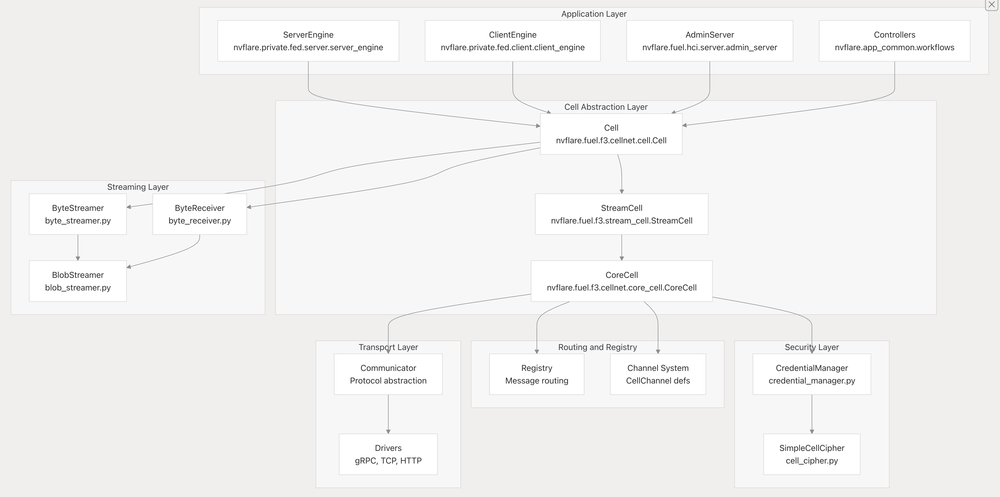

.. _cellnet_architecture:

FLARE CellNet Architecture
--------------------------

Purpose and Scope
#################

CellNet is FLARE's unified communication layer that provides secure, scalable messaging between distributed federated
learning components. It abstracts away network transport details and provides a consistent API for both small messages and
large data transfers.

Position in NVFLARE Architecture: CellNet sits between the application layer (Controllers, Executors, Admin commands) and
the network transport layer (gRPC, TCP, HTTP drivers). All NVFLARE components communicate through CellNet, including:

- **Server-to-client task distribution**
- **Client-to-server result submission**
- **peer-to-peer communication**
- **Admin command execution**
- **Cross-site auxiliary communication**
- **Job deployment and management**

Key Design Goals:
#################

- **Unified API**: Single interface for both small messages and large data streams
- **Transport Agnostic**: Supports multiple network protocols (gRPC, TCP, HTTP)
- **Hierarchical Addressing**: FQCN-based routing for multi-level cell hierarchies
- **Secure Communication**: Built-in encryption and authentication
- **Flow Control**: Automatic chunking and flow control for large transfers

Three-Layer Architecture:
#########################

- **CoreCell**: Basic message routing, connection management, security
- **StreamCell**: Large data streaming with chunking and flow control
- **Cell**: High-level request/reply patterns with automatic channel detection

Layered Cell Architecture
#########################

Three-Layer Design
^^^^^^^^^^^^^^^^^^

The CellNet architecture consists of three layers, each extending the previous:

**Layer 1: CoreCell** - Basic Message Infrastructure
provides fundamental messaging infrastructure:

**Key Responsibilities**:

- **Message Handling** - Routes messages to appropriate handlers based on channel/topic
- **Connection Management** - Manages listeners (incoming) and connectors (outgoing)
- **Callback Registry** - Stores message handlers in req_reg: Registry
- **Agent Tracking** - Maintains agents: Dict[str, CellAgent] for remote cells
- **Request Tracking** - Tracks pending requests in waiters: Dict[str, _Waiter]
- **Security** - Delegates to credential_manager: CredentialManager for encryption

**Core Methods**:

- **send_request** (channel, target, topic, request, timeout, ...) - Send message and wait for reply
- **fire_and_forget** (channel, topic, targets, message, ...) - Send without waiting
- **broadcast_request** (channel, topic, targets, request, ...) - Send to multiple targets
- **register_request_cb** (channel, topic, cb, ...) - Register callback for channel/topic

**Layer 2: StreamCell** - Large Data Transfer

The StreamCell adds large data transfer capabilities on top of CoreCell:

**Key Components**:

- **cell**: CoreCell - Wrapped CoreCell for basic messaging
- **byte_streamer**: ByteStreamer - Sends data as chunked streams
- **byte_receiver**: ByteReceiver - Receives and reassembles chunks
- **blob_streamer**: BlobStreamer - Optimized for in-memory BLOBs

**Streaming Methods**:

- **send_stream** (channel, topic, target, message, ...) - Send byte stream with flow control
- **send_blob** (channel, topic, target, message, ...) - Send BLOB (fits in memory)
- **register_stream_cb** (channel, topic, stream_cb, ...) - Register stream receiver
- **register_blob_cb** (channel, topic, blob_cb, ...) - Register BLOB receiver

**Streaming Protocol**:

- Automatic chunking into configurable chunk sizes (default 1MB)
- Flow control with sliding window and ACKs
- Progress tracking via StreamFuture

**Layer 3: Cell** - Intelligent Request/Reply

The **Cell** class provides unified interface for streaming and non-streaming messages:

**Key Features**:

1. **Dynamic Method Dispatch**:

- Intercept method calls Checks if channel requires streaming via _is_stream_channel()
- Routes to appropriate implementation:
- Stream channels → _broadcast_request(), _send_request(), etc.
- Non-stream channels → core_cell.broadcast_request(), etc.

2. **Channel Classification**:

**Excluded Channels**:

   - CellChannel.CLIENT_MAIN - Admin commands
   - CellChannel.SERVER_MAIN** - Task distribution
   - CellChannel.RETURN_ONLY** - Internal replies
   - CellChannel.CLIENT_COMMAND** - Client commands
   - Other internal channels

3. **Request Tracking**:

- Maintains requests_dict: Dict[str, SimpleWaiter] for pending requests
- SimpleWaiter tracks request state and receiving progress
- Reply handling via _process_reply()

4. **Callback Adaptation**:

- Adapter class wraps application callbacks for streaming
- Handles encoding/decoding of stream payloads
- Sends replies back via RETURN_ONLY channel

5. **FQCN: Fully Qualified Cell Name**:

Every cell is identified by a Fully Qualified Cell Name (FQCN), which is a dot-separated hierarchical name:

<site_name>[.<job_id>[.<rank>]]

6. **End-to-end encryption**

Message Structure and Addressing
################################

Channel and Topic Addressing
^^^^^^^^^^^^^^^^^^^^^^^^^^^^

F3 CellNet routes messages using a two-level addressing scheme: channel and topic.
This is stored in message headers:

.. list-table:: **Predefined Channels**
   :header-rows: 1
   :widths: 35 25 40

   * - Constant
     - Value
     - Purpose
   * - CellChannel.CLIENT_MAIN
     - "admin"
     - Admin commands
   * - CellChannel.SERVER_MAIN
     - "task"
     - Task distribution
   * - CellChannel.AUX_COMMUNICATION
     - "aux_communication"
     - Application-defined
   * - CellChannel.RETURN_ONLY
     - "return_only"
     - Internal reply routing
   * - CellChannel.SERVER_COMMAND
     - "server_command"
     - Server commands

Communication Patterns
^^^^^^^^^^^^^^^^^^^^^^
- **Request-Reply Pattern** -- send request and wait for reply
- **Fire-and-Forget Pattern** -- send message without waiting for reply
- **Broadcast Pattern** -- send to multiple targets

Streaming Components Overview
#############################

The streaming system is organized into sender components, receiver components,and stream abstractions:

Key Streaming Classes:

.. list-table:: **Key Streaming Classes**
   :header-rows: 1
   :widths: 25 40

   * - Class
     - Purpose
   * - ByteStreamer
     - Sends byte streams as chunks
   * - ByteReceiver
     - Receives and reassembles chunks
   * - BlobStreamer
     - Wraps blobs for streaming
   * - TxTask
     - Per-stream sending task
   * - RxTask
     - Per-stream receiving task

Performance and Statistics
##########################
Statistics Collection:
CellNet includes comprehensive statistics collection for monitoring and debugging:
Statistics are collected via StatsPoolManager with categories for different operation types and cell FQCNs.

