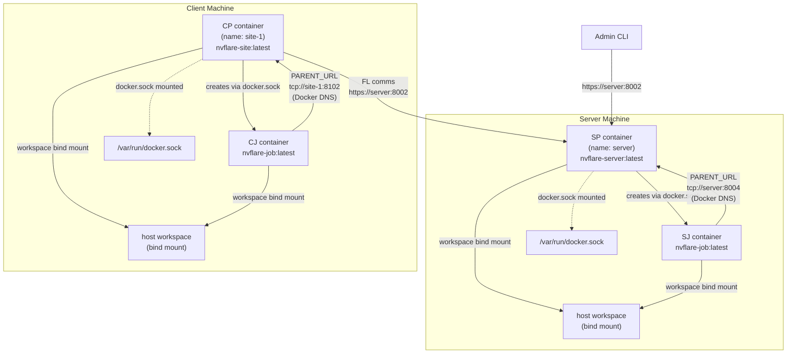
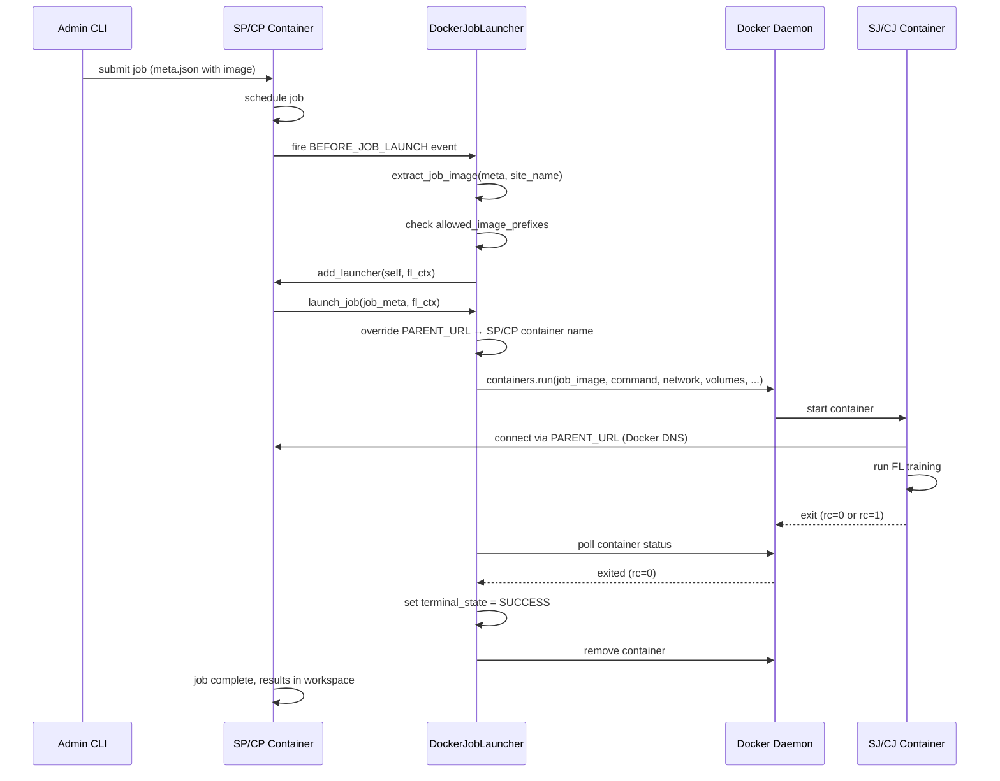

# Docker Job Launcher Design

## Overview

The Docker Job Launcher provides container-based job execution for NVFlare deployments where each site has Docker available.

The federation topology is the same as always: one server site and N client sites, each on their own machine. The difference from process mode is that SP/CP and all their job processes run as Docker containers instead of bare subprocesses. Each site manages its own containers independently — there is no shared orchestrator across sites.

The primary value is **dependency isolation**: each job can specify its own Docker image with a different ML framework version, CUDA version, or set of libraries, without affecting the site's host environment or other jobs.

---

## Target Persona

- Developer or researcher who wants job isolation (different image per job) without cluster overhead
- Site operator running Docker on bare metal or VM where a K8s cluster is not available or not needed
- Small-scale deployment where Docker is available on each site machine

---

## Assumptions

### Topology
- **Server and clients are typically on separate machines**, but they can also run on the same machine (e.g. local testing). Docker mode does not change the federation topology.
- **Each site runs on one Docker host** — SP runs on the server machine, each CP runs on its own client machine. No Docker Swarm, no multi-host networking within a site.
- **SP/CP runs as a container** — this mirrors the K8s model and avoids host/container networking issues for `PARENT_URL` (see Networking section).

### Startup
- Site admin runs `start_docker.sh` on their site to start the SP or CP container. This is generated by provisioning alongside the existing `start.sh`.
- `start.sh` (process mode) and `start_docker.sh` (Docker mode) are both generated per site. The site admin chooses which to run.
- Job containers (SJ/CJ) are **not** started by the site admin. They are started dynamically by the `DockerJobLauncher` when SP/CP receives a runnable job.
- **The site admin is responsible for building the Docker image** before running `start_docker.sh`. NVFlare provisioning only embeds the image name; it does not build or push images.

### Site Consistency Rule
Within a single site, SP/CP and all SJ/CJ containers must use the same launcher mode. If SP/CP starts as a Docker container, all jobs on that site run as Docker containers. Mixed mode within a site is not supported.

| Mode | SP/CP startup | SJ/CJ startup |
|---|---|---|
| Process | `start.sh` → `python ...` | `ProcessJobLauncher` → `subprocess.Popen` |
| Docker | `start_docker.sh` → `docker run` | `DockerJobLauncher` → `docker run` |
| K8s | `kubectl apply` | `K8sJobLauncher` → K8s Pod |

### Networking
- A Docker network (`nvflare-network` by default) is created automatically by `start_docker.sh` if it does not exist.
- SP/CP container and all SJ/CJ containers join this network.
- `PARENT_URL` passed to SJ/CJ is the **SP/CP container name** on the Docker network. Docker's built-in DNS resolves it — no `host.docker.internal` hacks needed.
- Cross-site communication (client → server) uses the same HTTPS/WSS as process mode.



### Docker Socket and Security Posture

SP/CP container mounts `/var/run/docker.sock` to create SJ/CJ containers at job time. SJ/CJ containers do **not** get the Docker socket — they have no reason to create further containers. The launcher enforces this boundary.

#### Why not Docker-in-Docker (DinD)?

DinD runs a separate Docker daemon inside the SP/CP container. It does not improve security — it just moves the problem: socket mounting requires Docker socket access (root-equivalent), DinD requires `--privileged` (also root-equivalent). Neither is better than the other from a security standpoint, and DinD adds operational complexity (storage driver conflicts, no shared image cache, heavier).

Socket mounting is the right pragmatic choice for this use case: simpler, better debuggability, SJ/CJ containers visible in `docker ps` on the host.

#### Security comparison

| Mode | Security posture | Notes |
|---|---|---|
| Process | Least privilege — runs as a normal OS user | No Docker involved; job subprocesses inherit the same OS user |
| Docker (standard) | Elevated — socket access is root-equivalent | Mounting `/var/run/docker.sock` lets SP/CP control the Docker daemon, which runs as root |
| Docker (rootless) | Reduced risk — daemon runs as non-root user | Rootless Docker limits the blast radius of socket access; still more privileged than process mode but not root-equivalent |
| K8s | Strongest — RBAC, least-privilege ServiceAccount | Proper security primitives; cluster operator controls what each pod can do |

**With standard Docker (the default), Docker mode requires more privilege than process mode.** The Docker daemon runs as root, and mounting its socket gives SP/CP root-equivalent access to the host — it can create privileged containers, bind-mount the host filesystem, etc. Process mode has no such requirement: SP/CP runs as a normal OS user with no elevated access.

**With rootless Docker**, the daemon runs as a non-root user, so socket access does not give root-equivalent. This significantly reduces the risk. However, rootless Docker has limitations (restricted networking, no `--privileged` containers) and requires explicit setup — it is not the default.

**The value of Docker mode is dependency isolation** — running different job images with different ML framework or CUDA versions on the same machine — not security. Site operators who need stronger security guarantees should use the K8s launcher.

SJ/CJ containers do not receive the Docker socket, which limits lateral movement if a job container is compromised. But SP/CP itself has elevated host access by design (standard Docker) or reduced-but-still-elevated access (rootless Docker).

### Image Policy

`DockerJobLauncher` supports an `allowed_image_prefixes` configuration. If set, only images whose name starts with one of the configured prefixes are permitted to run. Jobs requesting a disallowed image are **hard-blocked** — the job will not launch.

```json
{
  "id": "docker_launcher",
  "path": "nvflare.app_opt.job_launcher.docker_launcher.ClientDockerJobLauncher",
  "args": {
    "parent_url": "site-1:8102",
    "network": "nvflare-network",
    "mount_path": "/var/nvflare/workspace",
    "allowed_image_prefixes": ["myregistry.corp.com/", "nvflare/nvflare:"]
  }
}
```

This config is injected into `local/resources.json.default` by `DockerLauncherBuilder` during provisioning. `parent_url` and `network` are filled in from the site config; `allowed_image_prefixes` must be added manually or via a custom provisioning step.

If `allowed_image_prefixes` is `null` / not set, all images are permitted (default, no restriction).

This is site-local policy — each site admin controls what images run on their infrastructure independently.

### Workspace / Storage
- Workspace is shared via a **bind mount** of the host workspace directory into all containers (SP/CP and SJ/CJ).
- Each job writes to its own subdirectory (`workspace/runs/job_id/`) — same guarantee as the process launcher today.
- Multiple concurrent job containers writing to the same workspace root is safe because each job has its own subfolder. No special locking needed — same behavior as multiple subprocesses today.

```
workspace/               ← bind-mounted into all containers at /var/nvflare/workspace
  startup/               ← certs, config, sub_start.sh
  runs/
    job_001/             ← written by SJ/CJ for job 1
    job_002/             ← written by SJ/CJ for job 2
```

### Host Workspace Path

`DockerJobLauncher` needs the **host path** of the workspace to pass to the Docker daemon as a volume bind source. This cannot be hardcoded at provision time because it depends on where the site admin places their workspace on the host.

`start_docker.sh` resolves the host path at startup and passes it via the `NVFL_DOCKER_WORKSPACE` environment variable:

```bash
HOST_WORKSPACE="$(cd "$DIR/.." && pwd)"
docker run ... -e NVFL_DOCKER_WORKSPACE="$HOST_WORKSPACE" ...
```

`DockerJobLauncher.__init__` reads `NVFL_DOCKER_WORKSPACE` if `workspace` is not explicitly set in `resources.json`. Docker connectivity and network existence are validated lazily on the first `launch_job` call — not at init time — so that SJ/CJ containers (which have no Docker socket) can load the component without errors.

### Container Permissions

#### SP/CP Container (site admin controls)
The site admin starts SP/CP via `start_docker.sh`:
- Docker socket mounted (`/var/run/docker.sock`) — required to create job containers
- Workspace bind mount at `/var/nvflare/workspace` — required to access startup kit and run artifacts
- `nvflare-network` attached — required for cross-site and intra-site communication

#### SJ/CJ Container (DockerJobLauncher controls)
- **No Docker socket** — job containers cannot create further containers
- **Workspace bind mount** — same host directory as SP/CP, mounted at `mount_path`
- **Docker network** — access to SP/CP via container name DNS only
- **GPU** — `device_requests` added if `num_of_gpus` is set in the job's resource spec
- **Extra docker flags** — `container_kwargs` in the job's resource spec (per-job) merged with site-level `extra_container_kwargs` from `resources.json`; job-level takes precedence on conflict

```
SP/CP container (site admin grants)
  ├── /var/run/docker.sock mounted   ← can create job containers
  ├── workspace bind mount           ← full workspace access
  └── nvflare-network                ← cross-site + intra-site comms

SJ/CJ container (DockerJobLauncher controls)
  ├── NO Docker socket               ← cannot create further containers
  ├── workspace bind mount           ← own job subdirectory only
  └── nvflare-network                ← intra-site to SP/CP only
```

---

## Job Launch Sequence



---

## End-to-End Operation

### Step 1 — Provision

Add `DockerLauncherBuilder` to `project.yml`. Set `run_in_docker: true` on each participant that will run in Docker mode.

```yaml
participants:
  - name: server
    type: server
    org: nvidia
    fed_learn_port: 8002  # admin_port defaults to fed_learn_port if not specified
    run_in_docker: true
    listening_host:
      name: server
      port: 8004  # TCP port for SJ/CJ job containers to connect back to SP/CP (PARENT_URL); must differ from fed_learn_port

  - name: site-1
    type: client
    org: nvidia
    run_in_docker: true
    listening_host:
      name: site-1
      port: 8102  # TCP port for CJ job containers to connect back to CP (PARENT_URL)

builders:
  - path: nvflare.lighter.impl.workspace.WorkspaceBuilder
  - path: nvflare.lighter.impl.static_file.StaticFileBuilder
    args:
      config_folder: config
      overseer_agent:
        path: nvflare.ha.dummy_overseer_agent.DummyOverseerAgent
        overseer_exists: false
        args:
          sp_end_point: server:8002:8003
  - path: nvflare.lighter.impl.cert.CertBuilder
  - path: nvflare.lighter.impl.signature.SignatureBuilder
  - path: nvflare.lighter.impl.docker_launcher.DockerLauncherBuilder
    args:
      docker_image: nvflare-site:latest   # SP/CP image; site admin builds this
```

Run provisioning:

```bash
nvflare provision -p project.yml
```

Each site's startup kit gets:
- `startup/start.sh` — process mode (unchanged)
- `startup/start_docker.sh` — Docker mode (new)
- `local/resources.json.default` — has `DockerJobLauncher` component injected

### Step 2 — Build the site image (site admin responsibility)

Before running `start_docker.sh`, the site admin builds the NVFlare image that SP/CP will run as. This image needs NVFlare and the Docker Python SDK:

```dockerfile
FROM python:3.12
RUN pip install nvflare docker
# add site-specific dependencies if needed
```

```bash
docker build -t nvflare-site:latest .
```

The SP/CP image just needs NVFlare + the Docker SDK (to call Docker API at job time). It does not need ML frameworks — those go in the per-job image.

### Step 3 — Start SP/CP in Docker mode

On the server machine:
```bash
cd workspace/server/startup
./start_docker.sh
# → creates nvflare-network if it doesn't exist
# → resolves HOST_WORKSPACE=$(cd .. && pwd)
# → docker run --name server \
#              --network nvflare-network \
#              -v $HOST_WORKSPACE:/var/nvflare/workspace \
#              -v /var/run/docker.sock:/var/run/docker.sock \
#              -e NVFL_DOCKER_WORKSPACE=$HOST_WORKSPACE \
#              -p 8002:8002 -p 8004:8004 \
#              --rm nvflare-site:latest \
#              /var/nvflare/workspace/startup/sub_start.sh
```

The `--rm` flag means the container is automatically removed when stopped. SP/CP containers are long-lived; when the site admin stops the container (e.g. `docker stop server-parent`), it is cleaned up automatically. To restart, simply run `start_docker.sh` again.

On each client machine:
```bash
cd workspace/site-1/startup
./start_docker.sh
# → docker run --name site-1 --network nvflare-network ...
```

To use a different image without re-provisioning:
```bash
NVFL_P_IMAGE=nvflare-site:2.6.0 ./start_docker.sh
```

`NVFL_P_IMAGE` overrides the image name baked in at provision time. The provisioned default is used if the variable is not set.

### Step 4 — Submit a job

Jobs specify which Docker image to use per-site in `meta.json`:

```json
{
  "name": "my-fl-job",
  "deploy_map": {
    "app": [
      {
        "sites": ["server", "site-1"],
        "image": "nvflare-pt:latest"
      }
    ]
  },
  "resource_spec": {
    "site-1": {
      "num_of_gpus": 1,
      "container_kwargs": {"shm_size": "8g", "ipc_mode": "host"}
    }
  },
  "min_clients": 1
}
```

Submit via admin CLI or API:
```bash
nvflare job submit -j /path/to/job
```

### Step 5 — Job runs as containers

When SP/CP receives a runnable job:

1. `handle_event(BEFORE_JOB_LAUNCH)` fires
2. `DockerJobLauncher` reads `image` from the `deploy_map` entry in `meta.json`
3. If `allowed_image_prefixes` is configured, the image is checked — **hard block if not permitted**
4. `launch_job()` calls `docker run`:
   - Image: `job_image` from `meta.json`
   - Container name: `{site_name}-{job_id}` (sanitized)
   - Network: `nvflare-network`
   - Workspace bind-mounted at `mount_path`
   - `PARENT_URL` overridden to SP/CP container name + port (Docker DNS)
   - `PYTHONPATH` set to container-internal `app_custom_folder` path
   - `device_requests` added if `num_of_gpus` > 0
   - `container_kwargs` from job resource spec merged with site-level defaults; job-level wins on conflict
   - **No Docker socket** passed to job container
5. `DockerJobHandle` tracks the container via `terminal_state` pattern
6. On completion, container is removed; results are in `workspace/runs/{job_id}/`

### Step 6 — Results

Job output is written to `/var/nvflare/workspace/runs/{job_id}/` inside the container, which is bind-mounted from the host. Results are immediately visible on the host at:

```
workspace/server/runs/job_001/      ← server-side artifacts
workspace/site-1/runs/job_001/      ← client-side artifacts
```

---

## Lifecycle

```
Site admin builds Docker image (once, before deployment)

Site admin runs start_docker.sh
  → creates nvflare-network if needed
  → docker run SP/CP container (long-lived, idles waiting for jobs)
  → SP/CP reads NVFL_DOCKER_WORKSPACE from env → DockerJobLauncher.workspace = host path

Job submitted (via admin CLI or API)
  → meta.json specifies image per site (inside deploy_map)
  → SP/CP receives runnable job
  → BEFORE_JOB_LAUNCH event fires
  → DockerJobLauncher checks image against allowed_image_prefixes (hard block if denied)
  → DockerJobLauncher calls docker run with job_image
  → SJ/CJ container starts, mounts shared workspace, connects to SP/CP via PARENT_URL (Docker DNS)
  → Job runs

Job completes or fails
  → SJ/CJ container exits
  → DockerJobHandle.poll() detects terminal state → removes container
  → Results visible on host via bind mount
```

---

## Class Design

Docker launcher follows the same pattern as `K8sJobLauncher` — not `ProcessJobLauncher` — because Docker containers, like K8s pods, are named execution units that persist after launch and require explicit cleanup.

```
JobHandleSpec (ABC)
  ├── ProcessHandle
  ├── K8sJobHandle
  └── DockerJobHandle        ← models terminal_state pattern from K8sJobHandle

JobLauncherSpec (FLComponent, ABC)
  ├── ProcessJobLauncher
  │     ├── ServerProcessJobLauncher
  │     └── ClientProcessJobLauncher
  ├── K8sJobLauncher
  │     ├── ServerK8sJobLauncher
  │     └── ClientK8sJobLauncher
  └── DockerJobLauncher       ← abstract: get_module_args()
        ├── ServerDockerJobLauncher
        └── ClientDockerJobLauncher
```

### DockerJobHandle state mapping

Consistent with process and K8s launchers — `UNKNOWN` means "not terminal yet, keep waiting":

| Docker state | JobReturnCode | Notes |
|---|---|---|
| `created` | `UNKNOWN` | Not running yet |
| `running` | `UNKNOWN` | In progress |
| `paused` | `UNKNOWN` | In progress |
| `restarting` | `UNKNOWN` | In progress |
| `exited` (code 0) | `SUCCESS` | |
| `exited` (code != 0) | `EXECUTION_ERROR` | Read from `container.attrs["State"]["ExitCode"]` |
| `dead` | `ABORTED` | Killed externally |

Note: Docker exposes the actual exit code (same as subprocess), so `EXECUTION_ERROR` is distinguishable from `ABORTED` — unlike K8s which only has pod phase.

### DockerJobHandle `terminal_state` pattern

Mirrors `K8sJobHandle`. Once a container exits or is removed, `terminal_state` is set and all subsequent `poll()` / `wait()` calls return immediately without querying Docker.

### PARENT_URL

In process mode `PARENT_URL = localhost:port`. In Docker mode it must be the SP/CP **container name** on the Docker network (e.g. `server:8004`) so SJ/CJ can connect back via Docker DNS.

`DockerJobLauncher` takes `parent_url` as a constructor parameter and overrides `PARENT_URL` in `JOB_PROCESS_ARGS` when creating job containers. Provisioning generates the correct value from the site config.

---

## Key Implementation Files

| File | Role |
|---|---|
| `nvflare/app_opt/job_launcher/docker_launcher.py` | `DockerJobHandle`, `DockerJobLauncher`, `ClientDockerJobLauncher`, `ServerDockerJobLauncher` |
| `nvflare/lighter/impl/docker_launcher.py` | `DockerLauncherBuilder` — provisioning builder |
| `nvflare/lighter/templates/docker_launcher_template.yml` | Templates for `start_docker.sh` (server and client) |
| `nvflare/lighter/constants.py` | `ProvFileName.DOCKER_LAUNCHER_SH`, `TemplateSectionKey.DOCKER_LAUNCHER_*` |

---

## Other Container Runtimes

`DockerJobLauncher` is Docker-specific (uses the `docker` Python SDK). Other runtimes:

| Runtime | Compatibility | Notes |
|---|---|---|
| **Podman** | Near drop-in | Emulates Docker socket API; `docker.from_env()` works if Podman socket is configured. No code change needed. |
| **Singularity/Apptainer** | Requires new launcher | No daemon, no SDK — CLI only (`singularity exec`). Runs in host network so `PARENT_URL = localhost:port` (no Docker DNS needed). Common in HPC where Docker is banned. |
| **rootless Docker** | Works as-is | Reduced privilege vs. standard Docker; setup is non-default. See security section. |

When a second runtime needs support, the right refactor is to extract a `ContainerJobLauncher` base class with `_run_container()` / `_get_status()` / `_stop_container()` as the runtime-specific interface. Everything above that (image allowlist, PARENT_URL override, PYTHONPATH, GPU, event handling) is runtime-agnostic and stays in the base.

---

## Out of Scope

- Docker Swarm / multi-host Docker — use K8s launcher instead
- Building or pushing job images — site admin's responsibility
- Production-scale deployments — use K8s launcher instead
- Mixed mode within a site (SP/CP as process, SJ/CJ as container) — not supported
- Orphaned container recovery on SP/CP restart — future work
- Singularity/Podman support — future extension point, not blocking Docker mode
