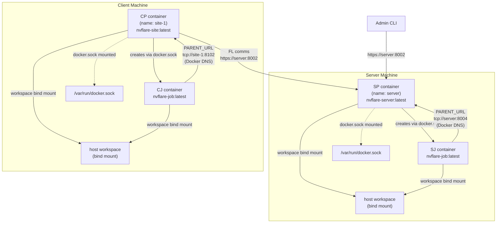
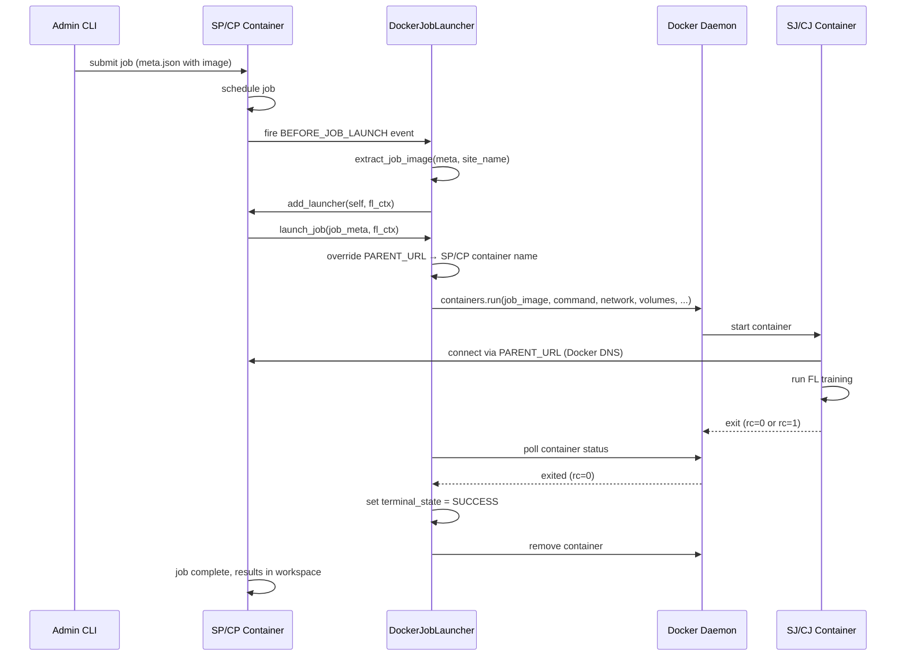

# Docker Job Launcher Design

## Overview

The Docker Job Launcher provides container-based job execution for NVFlare deployments where each site has Docker available.

The federation topology is the same as always: one server site and N client sites, each on their own machine. The difference from process mode is that SP/CP and all their job processes run as Docker containers instead of bare subprocesses. Each site manages its own containers independently — there is no shared orchestrator across sites.

The primary value is **dependency isolation**: each job can specify its own Docker image with a different ML framework version, CUDA version, or set of libraries, without affecting the site's host environment or other jobs.

---

## Target Persona

- Developer or researcher who wants job isolation (different image per job) without cluster overhead
- Site operator running Docker on bare metal or VM where a K8s cluster is not available or not needed
- Small-scale deployment where Docker is available on each site machine

---

## Assumptions

### Topology
- **Server and clients are typically on separate machines**, but they can also run on the same machine (e.g. local testing). Docker mode does not change the federation topology.
- **Each site runs on one Docker host** — SP runs on the server machine, each CP runs on its own client machine. No Docker Swarm, no multi-host networking within a site.
- **SP/CP runs as a container** — this mirrors the K8s model and avoids host/container networking issues for `PARENT_URL` (see Networking section).

### Startup
- Site admin runs `start_docker.sh` on their site to start the SP or CP container. This is generated by provisioning alongside the existing `start.sh`.
- `start.sh` (process mode) and `start_docker.sh` (Docker mode) are both generated per site. The site admin chooses which to run.
- Job containers (SJ/CJ) are **not** started by the site admin. They are started dynamically by the `DockerJobLauncher` when SP/CP receives a runnable job.
- **The site admin is responsible for building the Docker image** before running `start_docker.sh`. NVFlare provisioning only embeds the image name; it does not build or push images.

### Site Consistency Rule
Within a single site, SP/CP and all SJ/CJ containers must use the same launcher mode. If SP/CP starts as a Docker container, all jobs on that site run as Docker containers. Mixed mode within a site is not supported.

| Mode | SP/CP startup | SJ/CJ startup |
|---|---|---|
| Process | `start.sh` → `python ...` | `ProcessJobLauncher` → `subprocess.Popen` |
| Docker | `start_docker.sh` → `docker run` | `DockerJobLauncher` → `docker run` |
| K8s | `kubectl apply` | `K8sJobLauncher` → K8s Pod |

### Networking
- A Docker network (`nvflare-network` by default) is created automatically by `start_docker.sh` if it does not exist.
- SP/CP and all SJ/CJ containers on the same site join this network. It is used **only for intra-site parent↔child communication** (`PARENT_URL`). Docker's built-in DNS resolves container names — no `host.docker.internal` hacks needed.
- **Cross-site communication (CP → SP) does not use the Docker network.** It goes over the host network via the published `fed_learn_port`, using the same HTTPS/gRPC as process mode. From CP's perspective, it connects to the server's hostname/IP just as it would in process mode.
- **`admin_port` must equal `fed_learn_port`** — the server container only publishes one port. If they differ, `DockerLauncherBuilder` raises an error at provision time. The default provisioning already consolidates them to a single port; only an explicit `admin_port` override in `project.yml` can trigger this.



### Docker Socket and Security Posture

SP/CP container mounts `/var/run/docker.sock` to create SJ/CJ containers at job time. SJ/CJ containers do **not** get the Docker socket — they have no reason to create further containers. The launcher enforces this boundary.

#### Why not Docker-in-Docker (DinD)?

DinD runs a separate Docker daemon inside the SP/CP container. It does not improve security — it just moves the problem: socket mounting requires Docker socket access (root-equivalent), DinD requires `--privileged` (also root-equivalent). Neither is better than the other from a security standpoint, and DinD adds operational complexity (storage driver conflicts, no shared image cache, heavier).

Socket mounting is the right pragmatic choice for this use case: simpler, better debuggability, SJ/CJ containers visible in `docker ps` on the host.

#### Security comparison

| Mode | Security posture | Notes |
|---|---|---|
| Process | Least privilege — runs as a normal OS user | No Docker involved; job subprocesses inherit the same OS user |
| Docker (standard) | Elevated — socket access is root-equivalent | Mounting `/var/run/docker.sock` lets SP/CP control the Docker daemon, which runs as root |
| Docker (rootless) | Reduced risk — daemon runs as non-root user | Rootless Docker limits the blast radius of socket access; still more privileged than process mode but not root-equivalent |
| K8s | Strongest — RBAC, least-privilege ServiceAccount | Proper security primitives; cluster operator controls what each pod can do |

**With standard Docker (the default), Docker mode requires more privilege than process mode.** The Docker daemon runs as root, and mounting its socket gives SP/CP root-equivalent access to the host — it can create privileged containers, bind-mount the host filesystem, etc. Process mode has no such requirement: SP/CP runs as a normal OS user with no elevated access.

**With rootless Docker**, the daemon runs as a non-root user, so socket access does not give root-equivalent. This significantly reduces the risk. However, rootless Docker has limitations (restricted networking, no `--privileged` containers) and requires explicit setup — it is not the default.

**The value of Docker mode is dependency isolation** — running different job images with different ML framework or CUDA versions on the same machine — not security. Site operators who need stronger security guarantees should use the K8s launcher.

SJ/CJ containers do not receive the Docker socket, which limits lateral movement if a job container is compromised. But SP/CP itself has elevated host access by design (standard Docker) or reduced-but-still-elevated access (rootless Docker).

### Resource Management

Docker mode should use **`BEResourceManager` (Best-Effort)** — it approves every resource request unconditionally; no pre-scheduling check is done at scheduling time. If a requested resource (e.g. GPU) is unavailable, the job container fails at startup.

`GPUResourceManager` is not suitable for Docker mode: it would require the SP/CP container itself to have GPU passthrough just to count available GPUs, but SP/CP never uses GPUs — it only manages the federation.

The default provisioning injects `GPUResourceManager`. If a site is **exclusively** running Docker-mode jobs, override it in `workspace/local/resources.json` **before starting SP/CP** — the resource manager is loaded once at startup and is not re-read at job submission time:

```json
{
  "components": [
    {
      "id": "resource_manager",
      "path": "nvflare.app_common.resource_managers.be_resource_manager.BEResourceManager",
      "args": {}
    }
  ]
}
```

Remove the `resource_consumer` component (`GPUResourceConsumer`) as well — it is only needed alongside `GPUResourceManager`.

If the site runs a **mix** of Docker and process-mode jobs, leave `GPUResourceManager` in place — process-mode jobs still need it for GPU scheduling. Docker-mode jobs will bypass the GPU check at the launcher level (GPU is passed via `device_requests` to the container).

**Future:** A `DockerResourceManager` that queries the host GPU inventory without needing SP/CP GPU passthrough is a natural follow-up.

### Workspace / Storage
- Workspace is shared via a **bind mount** of the host workspace directory into all containers (SP/CP and SJ/CJ).
- The container-internal mount point is always `/var/tmp/nvflare/workspace` (hardcoded).
- Each job writes to its own subdirectory (`workspace/runs/job_id/`) — same guarantee as the process launcher today.

```
workspace/               ← bind-mounted into all containers at /var/tmp/nvflare/workspace
  startup/               ← certs, config, sub_start.sh
  local/
    study_data.json      ← optional: site admin maps study names to host data paths
  runs/
    job_001/             ← written by SJ/CJ for job 1
    job_002/             ← written by SJ/CJ for job 2
```

### Custom Code (BYOC)

Both custom code modes work in Docker mode with no extra configuration:

- **Job-level** (`app/custom/` in job zip) — extracted to `workspace/<job-id>/app_<site>/custom/` at job time. `DockerJobLauncher` sets this as the first entry on `PYTHONPATH` inside SJ/CJ containers.
- **Site-level** (`workspace/local/custom/`) — shared code across all jobs. `DockerJobLauncher` appends this to `PYTHONPATH` in SJ/CJ containers (after job-level, so job code takes precedence on name collision). Same priority as process mode.

Alternatively, site-level code can be baked into the job image — it will be importable as a regular installed package.

### Host Workspace Path

`DockerJobLauncher` needs the **host path** of the workspace to pass to the Docker daemon as a volume bind source. `start_docker.sh` resolves this at startup and passes it via `NVFL_DOCKER_WORKSPACE`:

```bash
HOST_WORKSPACE="$(cd "$DIR/.." && pwd)"
docker run ... -e NVFL_DOCKER_WORKSPACE="$HOST_WORKSPACE" ...
```

`DockerJobLauncher.__init__` reads `NVFL_DOCKER_WORKSPACE` if `workspace` is not set in `resources.json`. Docker connectivity and network existence are validated lazily on first `launch_job` — not at init time — so SJ/CJ containers can load the component without needing Docker access.

### Container Permissions

```
SP/CP container (site admin grants via start_docker.sh)
  ├── /var/run/docker.sock mounted            ← can create job containers
  ├── --user $(id -u):$(id -g)               ← runs as calling user (workspace files not root-owned)
  ├── --group-add <docker-socket-gid>         ← grants socket access; omitted when GID is 0 or unavailable (macOS Docker Desktop)
  ├── workspace bind mount at /var/tmp/nvflare/workspace
  ├── nvflare-network                         ← intra-site: SP↔SJ / CP↔CJ (PARENT_URL, Docker DNS)
  └── host network (-p fed_learn_port)        ← cross-site: CP→SP over HTTPS, same as process mode

SJ/CJ container (DockerJobLauncher controls)
  ├── NO Docker socket                        ← cannot create further containers
  ├── workspace bind mount at /var/tmp/nvflare/workspace
  ├── data bind mount at /var/tmp/nvflare/data (read-only, if study_data.json configured)
  └── nvflare-network                         ← intra-site to SP/CP only (PARENT_URL)
```

---

## Job Configuration Reference

All Docker-mode job configuration lives in `meta.json`. This is the single reference for job authors.

A complete example:

```json
{
  "name": "my-fl-job",
  "study": "study_A",
  "deploy_map": {
    "app": [
      {
        "sites": ["server", "site-1"],
        "image": "nvflare-pt:latest",
        "container_kwargs": {
          "shm_size": "8g",
          "ipc_mode": "host"
        }
      }
    ]
  },
  "resource_spec": {
    "site-1": {"num_of_gpus": 1}
  },
  "min_clients": 1
}
```

### Job Image

The `image` field in a `deploy_map` entry specifies the Docker image for SJ/CJ containers:

- Per-job, per-app. Different apps in the same job can use different images.
- All sites in a single entry share the same image. For different images per site, use separate entries.
- The site admin must pull or build the image before the job runs. The launcher does not pull images.
- If no `image` is specified, `DockerJobLauncher` does not activate — the job falls through to the default launcher (process mode).

### GPU

Use `resource_spec.num_of_gpus` — the same field as K8s and process launchers:

```json
"resource_spec": {
  "site-1": {"num_of_gpus": 1}
}
```

`DockerJobLauncher` translates this to `device_requests: [{"Count": N, "Capabilities": [["gpu"]]}]` before calling `docker run`. For fine-grained control (specific GPU UUIDs, driver constraints), set `device_requests` directly in `container_kwargs` — it takes precedence.

### Additional Container Flags (`container_kwargs`)

Docker-specific `docker run` flags for SJ/CJ containers, in the `deploy_map` entry. Keys use Docker Python SDK naming (underscores):

```json
"container_kwargs": {
  "shm_size": "8g",
  "ipc_mode": "host"
}
```

Job-level `container_kwargs` are merged with site-level defaults from `extra_container_kwargs` in `local/resources.json`; job-level wins on conflict. Reserved keys controlled by the launcher (`volumes`, `network`, `environment`, `command`, `name`, `detach`) cannot be overridden.

Site-level defaults (set by site admin in `local/resources.json`):

```json
{
  "id": "docker_launcher",
  "path": "nvflare.app_opt.job_launcher.docker_launcher.ClientDockerJobLauncher",
  "args": {
    "extra_container_kwargs": {"ipc_mode": "host"}
  }
}
```

### Dataset / Study Data

Set `"study"` in `meta.json` to the name of the study whose data the job needs:

```json
{ "study": "study_A" }
```

The site admin creates `workspace/local/study_data.json` mapping study names to host data paths:

```json
{
  "study_A": "/host/data/study_A",
  "study_B": "/host/data/study_B"
}
```

At launch time, `DockerJobLauncher` looks up the study name and bind-mounts the host path into the SJ/CJ container at `/var/tmp/nvflare/data` (read-only). If the file doesn't exist or the study has no entry, no data volume is added. Training code reads data from `/var/tmp/nvflare/data` inside the container.

---

## Job Launch Sequence



---

## End-to-End Operation

### Prerequisites — Build Docker images (site admin responsibility)

Building images is not part of the NVFlare deployment workflow. The site admin must build two categories of images independently before deploying:

**SP/CP image** (runs the NVFlare process, needs Docker SDK to launch job containers):
```dockerfile
FROM python:3.12
RUN pip install nvflare docker
# add site-specific dependencies if needed
```

**Job image** (runs the actual FL training, needs ML frameworks but not Docker SDK):
```dockerfile
FROM python:3.12
RUN pip install nvflare torch torchvision
# add job-specific ML dependencies
```

NVFlare provisioning only embeds the SP/CP image name in `start_docker.sh`. It does not build, tag, or push any images.

### Step 1 — Provision

Add `DockerLauncherBuilder` to `project.yml`:

```yaml
participants:
  - name: server
    type: server
    org: nvidia
    fed_learn_port: 8002

  - name: site-1
    type: client
    org: nvidia

builders:
  - path: nvflare.lighter.impl.workspace.WorkspaceBuilder
  - path: nvflare.lighter.impl.static_file.StaticFileBuilder
    args:
      config_folder: config
      overseer_agent:
        path: nvflare.ha.dummy_overseer_agent.DummyOverseerAgent
        overseer_exists: false
        args:
          sp_end_point: server:8002:8002
  - path: nvflare.lighter.impl.cert.CertBuilder
  - path: nvflare.lighter.impl.signature.SignatureBuilder
  - path: nvflare.lighter.impl.docker_launcher.DockerLauncherBuilder
    args:
      docker_image: nvflare-site:latest
```

Run provisioning:

```bash
nvflare provision -p project.yml
```

Each site's startup kit gets:
- `startup/start.sh` — process mode (unchanged)
- `startup/start_docker.sh` — Docker mode (new)
- `local/resources.json.default` — has `DockerJobLauncher` component injected

### Step 2 — Persist job storage (server only)

By default, NVFlare stores job zips, results, and snapshots under `/tmp/nvflare/` inside the container. This directory is ephemeral — it is lost when the SP container stops. To survive container restarts, redirect these paths to the workspace bind mount by creating `workspace/server/local/resources.json`:

```json
{
  "server": {
    "job_manager": {
      "uri_root": "/var/tmp/nvflare/workspace/jobs-storage"
    },
    "snapshot_persistor": {
      "storage": {
        "root_dir": "/var/tmp/nvflare/workspace/snapshot-storage"
      }
    }
  }
}
```

These paths resolve to `workspace/jobs-storage/` and `workspace/snapshot-storage/` on the host — both inside the bind mount and therefore persistent across container restarts.

### Step 3 — Start SP/CP in Docker mode

On the server machine:
```bash
cd workspace/server/startup
nohup ./start_docker.sh > server.log 2>&1 &
# → creates nvflare-network if it doesn't exist
# → docker run --name server \
#              --user "$(id -u):$(id -g)" \
#              --group-add <docker-socket-gid> (if non-zero) \
#              --network nvflare-network \
#              -v $HOST_WORKSPACE:/var/tmp/nvflare/workspace \
#              -v /var/run/docker.sock:/var/run/docker.sock \
#              -e NVFL_DOCKER_WORKSPACE=$HOST_WORKSPACE \
#              -p 8002:8002 \
#              --rm nvflare-site:latest \
#              /var/tmp/nvflare/workspace/startup/sub_start.sh
```

On each client machine:
```bash
cd workspace/site-1/startup
nohup ./start_docker.sh > site-1.log 2>&1 &
```

To use a different image without re-provisioning:
```bash
NVFL_P_IMAGE=nvflare-site:2.7.2 ./start_docker.sh
```

### Step 4 — Configure site data (optional)

If jobs need access to study data, create `workspace/local/study_data.json`. No change to `resources.json` is needed — `DockerJobLauncher` reads this file fresh on every job launch, so entries can be added or updated at any time without restarting SP/CP.

```json
{
  "study_A": "/host/data/study_A",
  "study_B": "/host/data/study_B"
}
```

Keys are study names (from `meta.json`); values are host paths that will be bind-mounted read-only into SJ/CJ containers at `/var/tmp/nvflare/data`. If the file is absent or the job's study has no entry, no data volume is added and the job runs without a data mount.

### Step 5 — Submit a job

See [Job Configuration Reference](#job-configuration-reference) for all available fields. Example:

```bash
nvflare job submit -j /path/to/job
```

### Step 6 — Results

Job output is written to `/var/tmp/nvflare/workspace/runs/{job_id}/` inside the container, bind-mounted from the host:

```
workspace/server/runs/job_001/      ← server-side artifacts
workspace/site-1/runs/job_001/      ← client-side artifacts
```

---

## Class Design

Docker launcher follows the same pattern as `K8sJobLauncher` — not `ProcessJobLauncher` — because Docker containers, like K8s pods, are named execution units that persist after launch and require explicit cleanup.

```
JobHandleSpec (ABC)
  ├── ProcessHandle
  ├── K8sJobHandle
  └── DockerJobHandle        ← models terminal_state pattern from K8sJobHandle

JobLauncherSpec (FLComponent, ABC)
  ├── ProcessJobLauncher
  │     ├── ServerProcessJobLauncher
  │     └── ClientProcessJobLauncher
  ├── K8sJobLauncher
  │     ├── ServerK8sJobLauncher
  │     └── ClientK8sJobLauncher
  └── DockerJobLauncher       ← abstract: get_module_args()
        ├── ServerDockerJobLauncher
        └── ClientDockerJobLauncher
```

### DockerJobHandle state mapping

Consistent with process and K8s launchers — `UNKNOWN` means "not terminal yet, keep waiting":

| Docker state | JobReturnCode | Notes |
|---|---|---|
| `created` | `UNKNOWN` | Not running yet |
| `running` | `UNKNOWN` | In progress |
| `paused` | `UNKNOWN` | In progress |
| `restarting` | `UNKNOWN` | In progress |
| `exited` (code 0) | `SUCCESS` | |
| `exited` (code != 0) | `EXECUTION_ERROR` | Read from `container.attrs["State"]["ExitCode"]` |
| `dead` | `ABORTED` | Killed externally |

Note: Docker exposes the actual exit code (same as subprocess), so `EXECUTION_ERROR` is distinguishable from `ABORTED` — unlike K8s which only has pod phase.

### DockerJobHandle `terminal_state` pattern

Mirrors `K8sJobHandle`. Once a container exits or is removed, `terminal_state` is set and all subsequent `poll()` / `wait()` calls return immediately without querying Docker.

### PARENT_URL

In process mode `PARENT_URL = tcp://localhost:port`. In Docker mode it must be the SP/CP **container name** on the Docker network (e.g. `tcp://server:8004`) so SJ/CJ can connect back via Docker DNS.

`DockerJobLauncher` derives the correct `parent_url` at runtime: it takes the port from `PARENT_URL` in `JOB_PROCESS_ARGS` and combines it with the site name (which equals the container name). No provisioning-time baking needed.

---

## Key Implementation Files

| File | Role |
|---|---|
| `nvflare/app_opt/job_launcher/docker_launcher.py` | `DockerJobHandle`, `DockerJobLauncher`, `ClientDockerJobLauncher`, `ServerDockerJobLauncher` |
| `nvflare/lighter/impl/docker_launcher.py` | `DockerLauncherBuilder` — provisioning builder |
| `nvflare/lighter/templates/docker_launcher_template.yml` | Templates for `start_docker.sh` (server and client) |
| `nvflare/lighter/constants.py` | `ProvFileName.DOCKER_LAUNCHER_SH`, `TemplateSectionKey.DOCKER_LAUNCHER_*` |

### Docker SDK import

`docker` and `docker.errors` are imported at module level inside a `try/except ImportError` block:

```python
try:
    import docker
    import docker.errors
    _DOCKER_AVAILABLE = True
except ImportError:
    _DOCKER_AVAILABLE = False
```

**Why:** `DockerJobLauncher` is injected into `local/resources.json` and loaded by all processes on a site — including SJ/CJ job containers. Job containers have no reason to call Docker APIs and do not need the `docker` SDK installed. The try/except means the module loads cleanly on containers without the SDK; `_DOCKER_AVAILABLE` is only checked in `_get_docker_client()`, which is only called from SP/CP via `launch_job()`.

This is a temporary solution. The root cause is that `resources.json` is shared across SP/CP and job containers — a future refactor could avoid loading SP/CP-only components in job containers entirely.

---

## Other Container Runtimes

`DockerJobLauncher` is Docker-specific (uses the `docker` Python SDK). Other runtimes:

| Runtime | Compatibility | Notes |
|---|---|---|
| **Podman** | Near drop-in | Emulates Docker socket API; `docker.from_env()` works if Podman socket is configured. No code change needed. |
| **Singularity/Apptainer** | Requires new launcher | No daemon, no SDK — CLI only (`singularity exec`). Runs in host network so `PARENT_URL = localhost:port` (no Docker DNS needed). Common in HPC where Docker is banned. |
| **rootless Docker** | Works as-is | Reduced privilege vs. standard Docker; setup is non-default. See security section. |

When a second runtime needs support, the right refactor is to extract a `ContainerJobLauncher` base class with `_run_container()` / `_get_status()` / `_stop_container()` as the runtime-specific interface. Everything above that (PARENT_URL override, PYTHONPATH, GPU, event handling) is runtime-agnostic and stays in the base.

---

## Out of Scope

- Docker Swarm / multi-host Docker — use K8s launcher instead
- Building or pushing job images — site admin's responsibility
- Production-scale deployments — use K8s launcher instead
- Mixed mode within a site (SP/CP as process, SJ/CJ as container) — not supported
- Orphaned container recovery on SP/CP restart — future work
- Singularity/Podman support — future extension point, not blocking Docker mode
