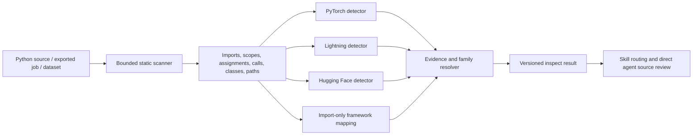

# Agent Inspector Simplification

Status: Implemented
Author: NVFlare Team
Date: 2026-07-27

## Summary

`nvflare agent inspect` should remain a shared, deterministic preflight for
agent skills, but it should not attempt to reproduce Python execution
semantics.

The inspector currently uses Python's `ast` module to parse source. The
complexity concern is not parsing itself: `ast.parse()` already provides that.
The concern is the growing semantic execution model layered on top of the AST,
including deferred callable bodies, decorator-return inference, generator
consumption, class-body execution timing, lazy callable results, and detailed
cross-scope propagation.

This design narrows the inspector to a conservative static evidence engine:

- collect high-confidence framework, training-owner, and FLARE-integration
  evidence;
- resolve straightforward PyTorch-family ownership;
- report unresolved or conflicting ownership rather than guessing;
- preserve direct source locations and machine-readable routing output;
- let the agent read source directly for semantic interpretation;
- preserve one shared routing implementation rather than copying detection
  rules into skills.

The simplification applies to every inspector consumer, not only Hugging Face.
PyTorch, Lightning, and Hugging Face use active detector plugins. TensorFlow,
Keras, XGBoost, sklearn, JAX, Flax, Optax, and NumPy currently use import-only
detection.

## Context

Agent skills use the inspector for different purposes:

- `nvflare-orient` uses it to select a workflow skill.
- PyTorch, Lightning, and Hugging Face conversion skills use it as a pre-edit
  routing and conversion-state check.
- `nvflare-fed-stats` uses it for bounded data and source classification.
- `nvflare-diagnose-job` uses it as optional static project evidence.

The inspector ships with the NVFLARE CLI, and the consuming skills require the
NVFLARE version that provides it. This design therefore treats inspection as a
normal package capability rather than defining a second routing path in skill
prose. Skills must not install or upgrade NVFLARE solely to obtain the
inspector; normal workflow dependency setup owns package availability.

The inspector reports:

- detected and ranked frameworks;
- training-repository, data, or FLARE-job target type;
- conversion state such as unconverted, partial Client API, converted, or
  exported;
- recommended skill or conservative routing result;
- framework evidence with file and line locations;
- safety findings and bounded readiness evidence.

These outcomes are useful. They do not require a complete model of Python
runtime behavior.

## Problem

Python permits dynamic imports, factories, monkeypatching, decorators,
descriptors, metaclasses, runtime rebinding, generated classes, and arbitrary
callable replacement. A static inspector cannot determine all such behavior
without becoming a Python interpreter, and even an interpreter cannot predict
behavior without executing the user's environment.

The current trajectory creates four problems:

1. **Unbounded maintenance surface.** Each newly modeled construct exposes
   another language edge case.
2. **Cross-framework regression risk.** Shared AST behavior changes can alter
   PyTorch and Lightning routing while addressing an HF case.
3. **False confidence.** Complex inference can make a heuristic result appear
   authoritative even when runtime ownership remains unresolved.
4. **PR and review cost.** Framework-skill work becomes dominated by generic
   language-analysis changes.

The correct failure mode for unsupported static semantics is `unresolved`, not
another layer of execution emulation.

## Goals

- Keep one shared inspector implementation for all skills and framework
  detectors.
- Preserve deterministic, bounded, non-executing source inspection.
- Reliably identify common direct PyTorch, Lightning, and Hugging Face training
  patterns.
- Preserve existing conversion-state, exported-job, dataset, and safety
  inspection.
- Make framework ownership and ambiguity explicit in the evidence model.
- Route uncertain and conflicting training ownership to `nvflare-orient`.
- Reduce AST-engine complexity and make the supported syntax boundary
  understandable to maintainers.
- Preserve or deliberately reclassify existing routing behavior through a
  cross-framework regression matrix.

## Non-Goals

- Complete Python name resolution.
- Interprocedural data-flow or control-flow analysis.
- Runtime evaluation of factories, decorators, descriptors, or metaclasses.
- Predicting dynamically imported or generated training owners.
- Replacing direct agent source reading.
- Replacing Pyright, Jedi, Astroid, or another established analyzer if full
  semantic analysis becomes a future product requirement.
- Expanding import-only frameworks into full conversion detectors in this
  effort.
- Changing converter behavior, recipe selection, or generated job semantics.

## Design Principles

### Inspector Is Evidence, Not Authority

The inspector provides repeatable evidence and routing guards. Direct source
reading remains required before editing. Inspector output must not license a
conversion that the source does not support.

### Prefer False Negatives To Wrong Converters

Missing a converter recommendation routes work to orientation or manual source
review. Selecting the wrong converter can produce invasive, incorrect edits.

### Unknown Is A Valid Result

Factories, unresolved attributes, mixed owners, and unsupported dynamic
constructs should produce candidate or unresolved evidence without a converter
recommendation.

### Framework-Neutral Traversal

The AST visitor owns syntax traversal and bounded lexical facts. Framework
plugins own framework names, evidence kinds, and ownership decisions. The
visitor must not contain Hugging Face- or Lightning-specific behavior.

### Simple Implementation

Prefer direct tables, small data structures, and explicit evidence over generic
execution abstractions. Do not add an abstraction unless it removes concrete
duplication or clarifies a stable contract.

## Proposed Architecture

### Layer 1: Bounded Static Scanner

The scanner may collect:

- imports and explicit aliases;
- function, class, lambda, and comprehension scope boundaries;
- local, global, and nonlocal name declarations;
- class names and direct base expressions;
- direct call expressions and receiver names;
- direct assignment targets and RHS call names;
- straightforward rebinding invalidation;
- file and line locations;
- import relationships needed for project entry-context ranking.

The scanner does not evaluate callable bodies based on inferred runtime
invocation.

### Layer 2: Framework Detector Plugins

Each detector receives shared facts and emits framework evidence. Detector
plugins must not require private inspector traversal state.

Active plugins remain:

- `PyTorchDetector`
- `LightningDetector`
- `HuggingFaceDetector`

Import-only framework mapping remains shared registry data until those
frameworks gain their own detectors and conversion skills.

### Layer 3: Evidence And Family Resolver

The resolver compares evidence strength, entry-context reachability, and
training ownership. It returns one of:

- clear owner;
- candidate without resolved owner;
- multiple active owners;
- imports or inference use only;
- no recognized framework.

### Layer 4: Skill Interpretation

Skills consume the structured result and read relevant source files directly.
The inspector narrows the search and prevents unsafe routing; the agent performs
the semantic conversion analysis.

## Supported Static Syntax Contract

### Supported

- `import torch`
- `import transformers as tfm`
- `from transformers import Trainer`
- `class CustomTrainer(Trainer): ...`
- `trainer = Trainer(...)`
- `trainer.train()`
- `trainer = CustomTrainer(...)`
- `lightning_trainer = pl.Trainer(...)`
- `lightning_trainer.fit(model)`
- direct manual PyTorch optimizer and loss calls;
- direct `nvflare.client`, `nvflare.client.lightning`, or
  `nvflare.client.hf` integration calls;
- direct aliases and reassignments within a statically known lexical scope;
- source-order finalization when it resolves a direct binding without
  evaluating code.

### Conservatively Unresolved

- objects returned by arbitrary factories;
- Trainer construction in one file and an unbound receiver call in another;
- attribute-held owners whose assignment and use cannot be tied directly;
- dynamically selected decorators or wrappers;
- callable-return inference;
- metaclass-generated classes;
- monkeypatched methods;
- dynamic imports;
- calls reached only by evaluating class-body or generator execution order.

The supported contract is intentionally smaller than Python.

## Common Evidence Model

The existing public evidence kinds should remain compatible where practical.
Internally, detectors apply three common static evidence strengths plus a
separate integration signal:

| Strength | Meaning | Routing effect |
| --- | --- | --- |
| Import | Framework is present | Rank/report only |
| Candidate | A model, Trainer, config, or training object may exist | Detector decides whether it is sufficient |
| Training owner | Direct evidence that a framework owns the training lifecycle | May select converter |
| Integrated | Direct FLARE Client API or patch evidence | Determines conversion state |

Framework mapping:

| Framework | Candidate evidence | Training-owner evidence | Integrated evidence |
| --- | --- | --- | --- |
| PyTorch | `nn.Module` and data plumbing | recognized optimizer/loss construction as the current manual-loop proxy | plain Client API receive/send |
| Lightning | `LightningModule` | reachable `Trainer(...)` construction as the current lifecycle proxy | Lightning Client API patch/init |
| Hugging Face | Trainer subclass/config/constructor | bound `Trainer.train()` | HF Client API patch/init |
| Import-only frameworks | recognized imports | none | none |

An `nn.Module`, DataLoader, tokenizer, dataset, or configuration object is not
training-owner evidence by itself.

Integrated state remains a separate detector integration signal rather than a
new item in the public framework-evidence list. This preserves the existing
evidence schema while applying the same four-level routing vocabulary.

Refining the existing PyTorch and Lightning owner proxies to optimizer updates
or bound `Trainer.fit()` calls is a separate behavior change. This
simplification makes current meanings explicit without changing them.

## Routing Rules

1. One clear, entry-reachable training owner selects its converter.
2. Multiple independently reachable specialized PyTorch-family owners route
   to `nvflare-orient`; family-base evidence is otherwise resolved through the
   selected member's promotion policy.
3. A framework candidate without a resolved owner may select its converter
   only when that detector defines the candidate as sufficient. Otherwise it
   routes to `nvflare-orient`.
4. Import or inference evidence alone produces no conversion recommendation.
5. Active manual PyTorch ownership wins over incidental Lightning or HF
   candidate/import evidence.
6. Active Lightning ownership wins over embedded Transformers model usage.
7. Active HF Trainer ownership wins over normal PyTorch data/model plumbing.
8. Active HF Trainer ownership wins over a Lightning model candidate when no
   Lightning Trainer owns the lifecycle.
9. Converted or partially converted evidence is reported independently from
   framework ranking.
10. Routing must not depend on evidence-count inflation; explicit evidence
   strength and ownership decide.

## Output Contract

The existing JSON fields should remain stable during simplification:

- `detected_framework`
- ranked framework evidence;
- `conversion_state`
- `target_type`
- `framework_ownership`
- `recommended_skills`
- `safety_findings`
- findings with file and line evidence.

The existing `"schema_version": "1"` remains unchanged because ownership detail
is additive. A future incompatible output change would require a schema-version
bump and separate compatibility design.

The additive `framework_ownership` object contains `state`, `owners`, and
`candidates`. Its state distinguishes:

- no evidence;
- import-only evidence;
- candidate evidence without a resolved owner;
- conflicting owners;
- clear owner.

## Performance And Bounds

Inspection must remain:

- static and non-executing;
- bounded by existing file, size, and evidence limits;
- linear in visited AST nodes for the supported syntax;
- free of iterative callable execution or recursive semantic replay;
- resilient to per-file syntax and recursion failures.

The simplification must reduce state retained per file and remove secondary
walks whose only purpose is inferred runtime execution. On the controlled
advanced-AST benchmark, median wall time and peak memory must each improve by
at least 10 percent from the Step 0 baseline. Representative project scans must
not regress beyond normal benchmark variance.

## Security

Removing semantic execution modeling does not reduce the core security
boundary. The inspector still:

- never imports or executes inspected code;
- treats source text as evidence, not instructions;
- bounds scanned files and evidence;
- redacts recognized secret-like literals;
- degrades per-file parse or recursion failures to findings.

## Compatibility And Migration

This is a behavior-preserving simplification for common code, not a promise to
preserve recommendations for every synthetic Python construct.

Before deleting advanced machinery:

1. Capture a routing matrix for accepted PyTorch, Lightning, HF, mixed-owner,
   inference-only, converted, and import-only cases.
2. Classify existing AST tests as:
   - common supported behavior;
   - safety/rebinding behavior;
   - intentionally unresolved dynamic behavior;
   - language-completeness behavior that should be removed.
3. Preserve the first two categories.
4. Change the third category to assert a conservative unresolved or orientation
   result.
5. Remove the fourth category with the implementation it solely supports.

The Step 0 baseline is 2,543 lines in `inspector.py` and 5,248 lines in
`agent_inspector_test.py`. The approved ceilings are 2,140 and 4,570 lines,
respectively. The implementation must delete
`_DeferredCallableBody`, `_LazyCallableResult`, `_YieldFinder`, and the
associated callable-replay and generator-execution machinery. Retaining any of
these requires revising this design with a real routing fixture and measured
justification.

No Lightning or PyTorch behavior should be changed merely to simplify an HF
case. Every changed routing expectation must be explicit in the migration
review.

## Alternatives Considered

### Keep Expanding The Current Semantic Model

Rejected. It produces an open-ended partial interpreter and continued
cross-framework maintenance cost.

### Remove The Inspector

Rejected. Deterministic routing, conversion-state checks, bounded evidence, and
repeatable evaluation remain valuable.

### Put Detection Rules In Each Skill

Rejected. It duplicates framework routing in prose, increases token use, and
causes drift between skills.

### Adopt A Full Static Analyzer Now

Deferred. A mature analyzer is appropriate only if product requirements demand
cross-file semantic resolution beyond routing. It would add dependencies,
performance cost, and a larger compatibility surface.

## Success Criteria

- Common PyTorch, Lightning, and HF projects keep their current correct
  recommendations.
- Mixed Lightning/HF ownership routes to orientation.
- Manual PyTorch ownership is not stolen by incidental HF or Lightning use.
- HF and Lightning models embedded under another training owner do not steal
  routing.
- HF Trainer ownership is preserved when the trained model is a
  `LightningModule` but no Lightning Trainer owns the lifecycle.
- Dynamic or unresolved ownership fails closed without a wrong converter.
- Import-only frameworks continue to be ranked without unsupported conversion
  recommendations.
- The approved `inspector.py` and advanced-test line-count ceilings are met.
- `_DeferredCallableBody`, `_LazyCallableResult`, `_YieldFinder`, callable
  replay, and inferred generator execution are removed.
- The controlled advanced-AST benchmark improves median wall time and peak
  memory by at least 10 percent.
- Targeted inspector tests, skill checks, and style checks pass.

## Open Questions

1. Which current tests represent real customer code rather than Python
   language-completeness probes?
2. Should the CLI return a distinct degraded status when some files cannot be
   inspected, while still returning usable evidence?
