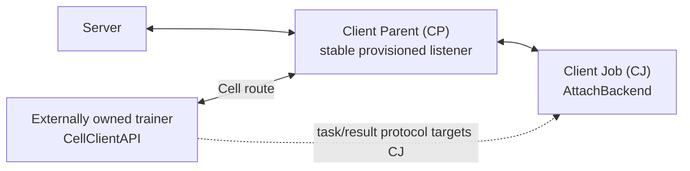
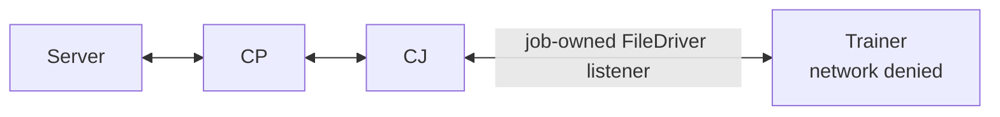

# Client API Attach Mode Implementation Design

## Status

Implemented design for `execution_mode="attach"`, updated 2026-08-05.

Attach lets an independently started, externally owned process use the ordinary
Client API. It uses Cell for the trainer protocol while retaining the trust
boundary of the 2.8 `IPCExchanger`/`IPCAgent` path: the Client Job (CJ)
materializes trainer results and the trainer never receives the site's server
`AUTH_TOKEN` or `AUTH_TOKEN_SIGNATURE`.

## Topology

Network Attach reuses the site's stable Client Parent (CP) listener. The CP is a
physical Cell routing hop; the dynamic CJ remains the task, result, and session
endpoint.



This is the same physical connection shape used by the 2.8 `IPCAgent`. A
dynamic CJ does not create a network listener and therefore needs no
job-specific listener certificate, key, port, or `listening_host` provisioning.

Protected shared-file Attach is the exception for a network-isolated trainer:



Only the CJ-to-trainer connection uses shared-file. CP-to-CJ stays on the
site's normal network route.

## Identity and Security

### Stable trainer identity

The trainer is named below the CP, not below a dynamic job:

```text
<cp_fqcn>.-client_api_<attach_id>
```

For a direct site this is `site-1.-client_api_numpy_trainer`. Behind a relay it
can be `relay-1.site-1.-client_api_numpy_trainer`; a direct profile supplies the
stable `cp_fqcn` in that case.

The `-client_api_` leaf is defined as a site-owned Cell identity. The CP's
identity resolver therefore requires the trainer to authenticate with the
provisioned site certificate, including a configured custom certificate CN.
This is intentionally equivalent to the 2.8 IPCAgent trust model and does not
create a new server identity.

The `attach_id` is a routing/rendezvous name, not a password. `SESSION_OPEN`
binds it to one dynamic CJ/session. Before binding, the trainer accepts only a
`SESSION_OPEN` from a direct job child of its configured CP FQCN. After binding,
its pre-decode interceptor rejects all Client API traffic from any other origin,
including lazy stream data, before FOBS decoding.

### Network Attach

A secure network profile uses the site's existing CA/client certificate for
Cell message authentication. Cell security and transport security are separate:
the CP's internal transport may be `connection_security="clear"` while
`secure_mode=true` authenticates and protects Cell messages end to end, as in
2.8. `client.crt` and `client.key` are discovered beside `rootCA.pem`.

The trainer receives no FL bearer token. It cannot send authenticated
server-facing requests, and Attach does not preserve a trainer-hosted lazy
reference across the CJ boundary.

Delegating the site's client certificate is still broad site-level authority.
For 2.10, replace it with a short-lived scoped trainer identity, explicit
`DownloadService` ACLs, and revocation. That work is required before enabling
direct Attach trainer-to-server pass-through.

### Shared-file Attach

The FileDriver route is accepted only when its concrete root, listener,
connection directory, owner marker, rendezvous files, and cross-node claim lock
meet the protected filesystem contract. World-accessible paths are rejected.
The trainer needs neither network access nor site credentials.

`allow_insecure_attach` remains accepted as a compatibility argument but has no
effect on this topology. Network Attach uses the CP trust model, and unsafe
shared-file routes are always rejected.

## Session Protocol

The CJ repeatedly sends:

```text
SESSION_OPEN(
  session_id,
  attach_id,
  job_id,
  site_name,
  trainer_fqcn,
  protocol_version,
  heartbeat policy,
  task exchange settings
)
```

`SESSION_OPEN` never contains the site `AUTH_TOKEN` or token signature. The
trainer validates the origin, FQCN, attach ID, site/job scope, protocol version,
rank, heartbeat policy, and exchange settings before returning
`SESSION_ACCEPTED`.

An established session uses:

```text
CJ -> trainer : TASK_READY(task_id, task_seq, attempt_id, Shareable)
trainer -> CJ : TASK_ACCEPTED | TASK_FAILED | TASK_STATUS

trainer -> CJ : RESULT_READY(task_id, result_id, attempt_id, Shareable)
CJ -> trainer : RESULT_ACCEPTED | RESULT_REJECTED | RESULT_STATUS
```

Heartbeat, log, abort, and shutdown messages use the same Cell route. The CJ
assigns monotonically increasing task sequences. The trainer keeps a bounded
task ledger so ambiguous delivery can be recovered without executing a task
twice. Result attempt IDs and `RESULT_STATUS` similarly recover a lost result
acknowledgement.

## Payload and Streaming Semantics

Attach adds no payload wrapper or streaming implementation. Task/result
`Shareable` objects are encoded by FOBS. Objects above the configured threshold
use `ViaDownloader` and `DownloadService`.

For secure network Attach, the protected FOBS message context is inherited by
every `DownloadService` chunk request, so tensor streaming and tensor offloading
remain authenticated and encrypted end to end while the CP only routes them.

Attach deliberately does not enable `PASS_THROUGH`:

1. The trainer sends `RESULT_READY` to the CJ and declares the CJ as the lazy
   transaction receiver.
2. The trainer-to-CJ route may physically pass through the CP, but CP forwards
   Cell messages without decoding or substituting the source.
3. The CJ fully materializes the result before its handler accepts it.
4. The CJ returns a concrete result through `ClientRunner`.
5. If that result is large when sent onward, ordinary serialization may create
   a new CJ-owned `DownloadService` transaction.

The second transaction is expected materialization plus re-serialization. The
trainer's reference never crosses the CJ boundary.

For every accepted trainer-to-CJ lazy transaction, the trainer remains available
until the CJ confirms terminal completion. The rule applies to FedAvg, nested
client-controlled workflows such as Swarm, tensor offloading, and every
supported FOBS-decomposed large object.

## Connection Profiles

Typed Attach profiles have `schema_version=1`, `execution_mode="attach"`, an
`attach_id`, a `site_name`, and exactly one connection source.

### Direct CP profile

```json
{
  "schema_version": 1,
  "execution_mode": "attach",
  "attach_id": "numpy_trainer",
  "site_name": "site-1",
  "connect_url": "tcp://site-1.example.com:8004",
  "connection_security": "clear",
  "secure_mode": true,
  "ca_cert": "/absolute/path/to/site/startup/rootCA.pem",
  "job_wait_timeout": null
}
```

`connect_url` is the existing CP internal listener. It is not a CJ listener.
The dynamic CJ is discovered from authenticated `SESSION_OPEN`, so the trainer
may start before the job. An optional `cj_fqcn` may pin a profile to one job.

For a relayed site, add the stable topology and certificate identity when they
differ from defaults:

```json
{
  "cp_fqcn": "relay-1.site-1",
  "auth_identity": "provisioned-site-certificate-cn"
}
```

`connection_security` must match the CP listener. Bare server-auth-only TLS is
not supported. A secure transport requires `secure_mode=true`; a clear CP
transport may still use `secure_mode=true`, which is the normal secure-job
configuration.

### Shared-file profile

```json
{
  "schema_version": 1,
  "execution_mode": "attach",
  "attach_id": "numpy_trainer",
  "site_name": "site-1",
  "rendezvous_dir": "/absolute/shared/nvflare-client-api-attach",
  "job_wait_timeout": null
}
```

The trainer can start first and wait for the CJ to publish its dynamic
FileDriver endpoint. `rendezvous_dir` must be absolute. TLS/CA fields and a
pre-bound `cj_fqcn` are rejected for this route.

The site-local `comm_config.json` needs `client_api_attach` only for shared-file:

```json
{
  "client_api_attach": {
    "scheme": "shared-file",
    "resources": {
      "root_dir": "/absolute/shared/nvflare-client-api-attach",
      "connection_security": "clear"
    }
  }
}
```

A network driver under `client_api_attach` is rejected. Network trainers must
use the CP listener so a dynamic CJ never becomes an independently provisioned
network service.

## Lifecycle and Ownership

NVFlare never launches, signals, kills, or waits on an attached trainer process.

Initialization:

1. derives the stable CP-child trainer FQCN;
2. starts a protected FileDriver listener only when configured;
3. publishes shared-file rendezvous state when needed; and
4. starts the CJ session monitor.

Finalization:

1. stops new task admission;
2. sends protocol `SHUTDOWN` to an established session;
3. keeps the route alive while an accepted trainer result source settles;
4. joins the session monitor; and
5. removes only the shared-file endpoint claim/listener it owns.

The external owner decides when the trainer process exits.

## Verification Requirements

Focused coverage must verify:

- trainer-first and CJ-first network Attach through the CP;
- CP routing over supported internal transports;
- secure Cell credentials over the existing CP route;
- custom/relayed CP identity mapping;
- protected shared-file with trainer network access denied;
- two rounds with tensors above the `ViaDownloader` threshold;
- trainer-to-CJ terminal accounting and CJ materialization;
- a new CJ source only when the concrete result is serialized onward;
- no site bearer token in `SESSION_OPEN` and no trainer auth-header filter;
- task/result retry and stale-session rejection; and
- orderly protocol close with no OS signal or process ownership action.
