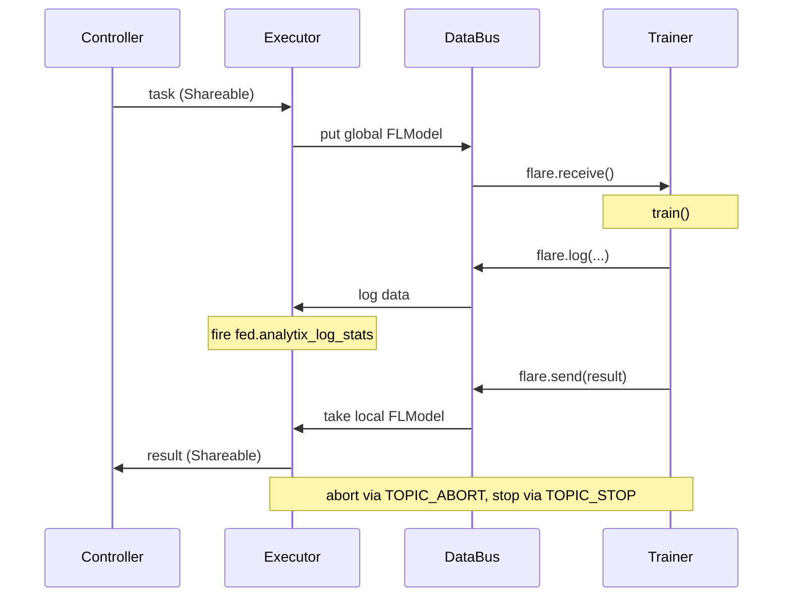
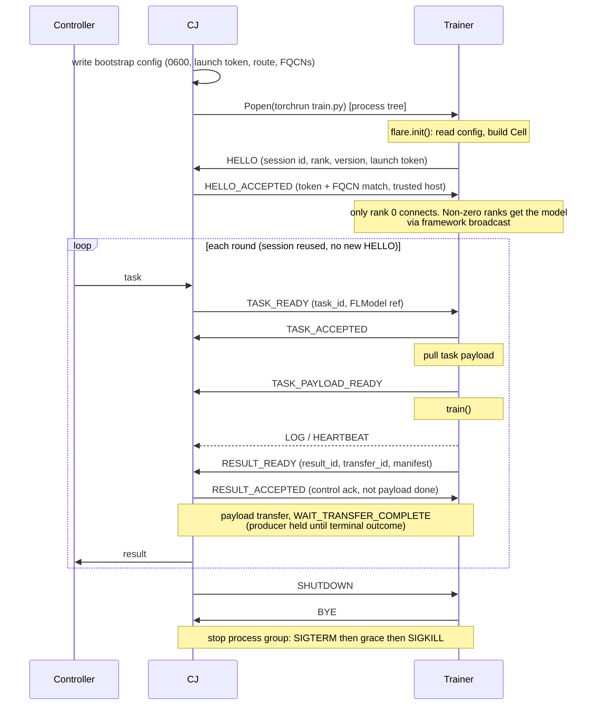
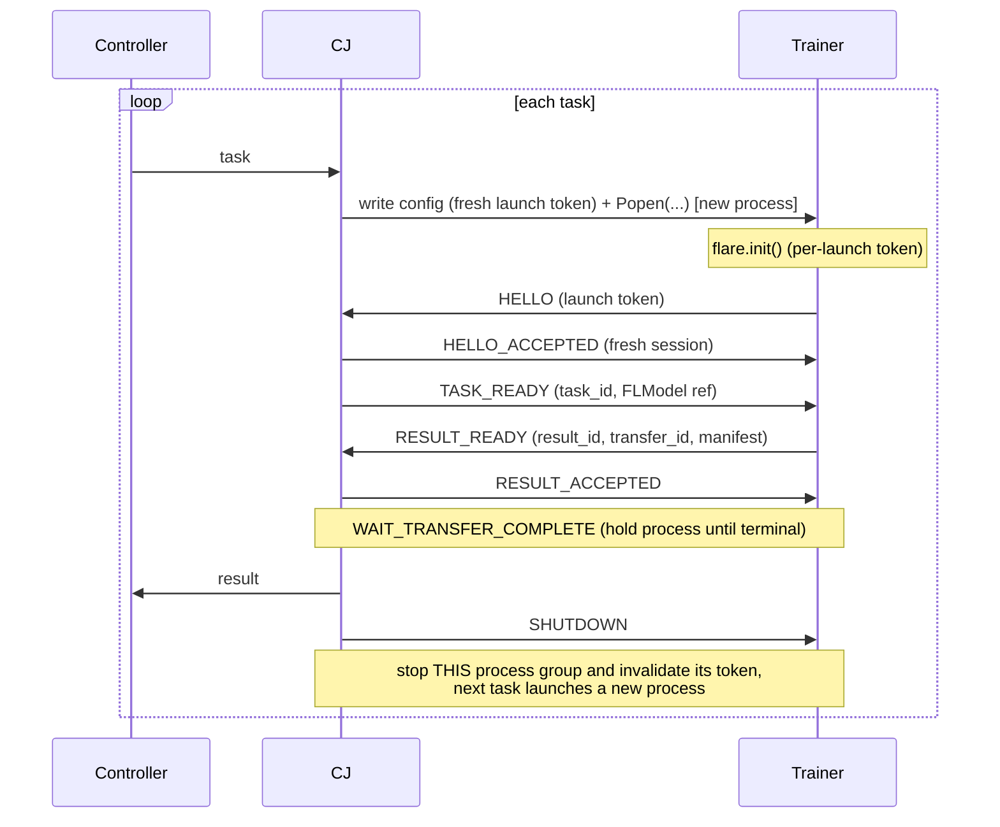
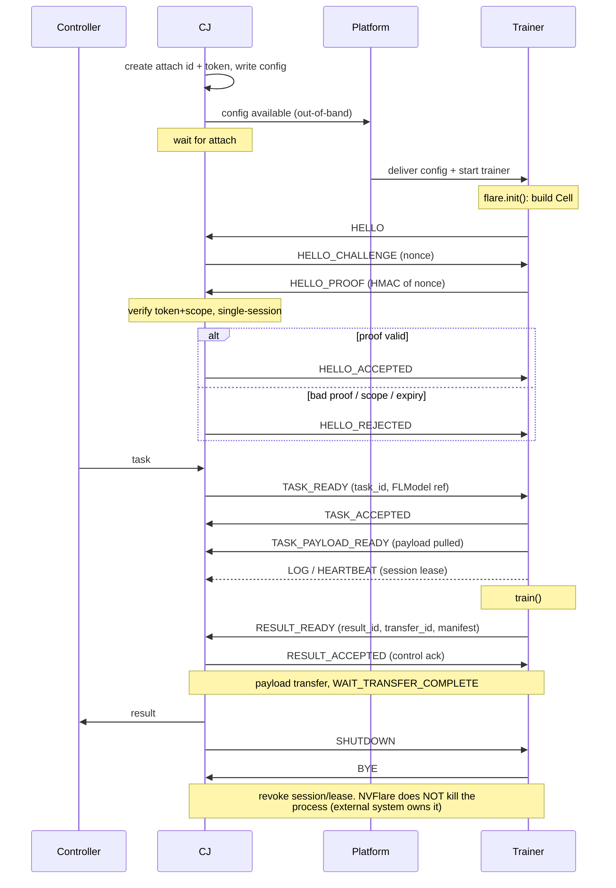

# Client API Execution Modes Design

## Status

**Status: Approved** — implementation in progress for 2.9. Epic: **FLARE-2698** (Client API and 3rd party integration refactoring, fix version 2.9.0).

Revision 2 (2026-07-01): incorporates review feedback — universal session setup, owner-death and receive-side contracts, forward-path payload lifecycle, cleanup policy definition, receiver-confirmed terminal outcome, per-receiver transfer budgets, configuration surface, attach auth hardening, and a re-sequenced migration plan.

Revision 2.1 (2026-07-06): adds the filters-imply-materializing-hop rule to the payload lifecycle (per-(task,direction) granularity), conversion-filter placement details (site-scope filter ordering, DXO-meta round-trip state, mixed-format cost and bf16 limit, and what selects the regime — `server_expected_format` surviving as a recipe knob), the TensorStream disposition, and a CCWF caveat cross-referencing the materializing-hop rule (a wired conversion filter moves the producer role from the subprocess to the CJ). Claims verified against code.

Revision 2.2 (2026-07-07): status set to Approved. Forward-path heartbeat exemption narrowed to the payload-materialization phase via a new TASK_PAYLOAD_READY control message (heartbeats stay authoritative while user code trains); `launch_once=False` moves to launch-scoped tokens (fresh binding material per launch, invalidated at process stop); explicit mapping between the lifecycle transfer states and the F3 `TransferOutcome` vocabulary; `ClientAPIBackendSpec` classified as internal; Open Questions annotated with their deciding PRs.

## Background

NVFlare supports the Client API so training scripts can interact with FLARE through a small surface:

```python
import nvflare.client as flare

flare.init()
model = flare.receive()
result = train(model)
flare.send(result)
flare.shutdown()
```

This works well for simple in-process scripts. It becomes harder to reason about when training runs in another process, under torchrun, under a scheduler, or inside an externally managed AV/third-party system.

Several integration paths have grown up around this — an in-process executor, the subprocess Pipe/LauncherExecutor stack, AV-style IPCAgent, third-party FlareAgent, and an older multi-process executor. They are catalogued in Appendix A: Current Integration Paths.

The new design keeps the Client API as the user-facing contract, but replaces the recommended Pipe/LauncherExecutor integration story with clearer execution modes.

## Definitions (actor vocabulary)

"Trainer" is used throughout for several related-but-distinct things; this section pins the vocabulary. Where a sentence's meaning depends on which one, the specific term below is used.

- **Training script (the trainer code):** the user's Client API code calling `flare.init()/receive()/send()/log()`. Framework-agnostic and unchanged by this design. Say "training script" when you mean the code, not a process.
- **Trainer process / trainer process tree:** the OS process — or, under torchrun/Deepspeed/mpirun, the whole process group — running the training script out-of-process in external_process or attach. In **in_process there is no trainer process**: the script runs as a thread inside the CJ process.
- **Control rank (rank 0):** the single rank inside a trainer process tree that owns the Cell connection and may call the control APIs. Defaults to global RANK 0; overridable via `flare.init(rank=...)`. It is the only rank that is an NVFlare Cell peer, and thus the only rank that is a producer/consumer of payloads.
- **Client Job (CJ) process:** the NVFlare client-side job-runtime process launched by JobLauncherSpec. It hosts the Executor and is the trainer's Cell peer in out-of-process modes.
- **Executor (ClientAPIExecutor):** the FLComponent inside the CJ process that drives the mode backend. Not a synonym for the CJ process.
- **Client CP (client control/parent process):** the long-lived client process that launches and reaps CJ processes; the reaping backstop in the owner-death contract.
- **Producer / consumer:** direction-dependent role labels for one transfer, not fixed actors. On result upload the control rank is the producer and the server (or a peer) is the consumer; on task delivery the CJ/server side is the producer and the control rank is the consumer.
- **External platform vs external trainer (attach only):** the external *platform* (AV, SLURM/K8s, operator) starts the trainer and delivers the bootstrap config; the *external trainer* is the started process that attaches. They are distinct actors.

Unqualified "trainer" below means the trainer process tree in out-of-process modes (and, loosely, the training script in in_process). "Keep the trainer alive" is a claim about the **trainer process** (the producer's live resources exist in the control rank; the stop mechanism acts on the whole process group).

## Problem

The current subprocess and third-party integration paths mix four concerns — how training starts, how task/result/log control messages move, how large payloads move, and how Client API semantics are exposed to user code — into one stack:

```
ClientAPILauncherExecutor
  -> LauncherExecutor
  -> TaskExchanger
  -> PipeHandler
  -> SubprocessLauncher
  -> CellPipe/FilePipe
  -> FlareAgent
```

This produces two distinct problems.

1. **Lifecycle ambiguity.** Control-message acceptance is conflated with payload completion: a Pipe ACK or Cell send_request() reply means "the peer accepted the control message," but the tensor payload may still be downloading from another process. As a result producers get released, subprocesses killed, and retries fired before the bytes are actually out — the root of the races around pass-through, tensor disk offload, CCWF, retries, and subprocess exit, and the dominant failure mode for large (multi-GB) models.

2. **Integration complexity.** The user-facing model is too large. Users may be asked to understand FlareAgent, IPCAgent, CellPipe, FilePipe, TaskExchanger, SubprocessLauncher, and LauncherExecutor, even though the desired training-script interface is only Client API.

## Goals

- Keep `flare.init()`, `flare.receive()`, `flare.send()`, and `flare.log()` as the trainer-facing API.
- Define execution modes by lifecycle ownership.
- Use DataBus for same-process training.
- Use Cell for all out-of-process training.
- Build on existing CellNet/F3 rather than redesigning it in this work.
- Preserve tensor streaming, lazy download, and tensor disk offload.
- Make payload lifecycle explicit enough to remove ACK ambiguity — in both directions: task delivery and result upload.
- Simplify the CCWF (swarm/cyclic/CSE) peer-to-peer transfer path by reusing the same payload-lifecycle contract instead of app-layer pass-through machinery, and make tensor disk offload safe to re-enable there.
- Cover external_process execution, torchrun, Deepspeed/wrappers, AV attach, SLURM/HPC, Docker/K8s job runtime combinations, and experiment tracking metrics.
- Keep migration compatibility for existing ScriptRunner usage.

## Non-Goals

- Redesigning JobLauncherSpec.
- Rewriting CellNet/CoreCell/F3 transport.
- Building a filesystem-backed CellNet/F3 transport driver in this proposal.
- Removing tensor streaming or tensor disk offload.
- Making FilePipe/NFS a recommended control-plane transport.
- Supporting multiple NVFlare Cell connections from all distributed ranks in V1.
- Exposing IPCAgent, FlareAgent, CellPipe, or FilePipe as the normal Client API integration surface.

## Proposal

### What We Propose

The trainer-facing Client API (flare.init/receive/send/log) stays exactly as it is; everything changing is behind it. Concretely:

1. Replace the Pipe/launcher integration stack with one public **ClientAPIExecutor** configured by execution mode. The executor delegates internally to mode-specific backends for `in_process`, `external_process`, and `attach`. Retire ClientAPILauncherExecutor, LauncherExecutor, the generic Launcher/SubprocessLauncher, and the Pipe/TaskExchanger/FlareAgent chain as the recommended surface. The old path stays available, marked legacy, during migration.

2. Formalize one **Client API control protocol over Cell**. All out-of-process communication (session setup, task/result/log/abort/heartbeat) goes through Cell — never a Pipe. In-process is the only exception and uses DataBus. Users never touch IPCAgent/CellPipe/FilePipe/FlareAgent.

3. Make **payload terminal-state explicit**, consuming existing F3 transfer signals (see Payload Lifecycle and Dependencies) so "control message accepted" is never confused with "payload transferred" — for task delivery as well as result upload.

### Overview

Introduce one public ClientAPIExecutor with three execution modes:

| Mode | Backend | Lifecycle Owner | Primary Uses |
|---|---|---|---|
| in_process | DataBus | CJ process | local dev, simulator, simple scripts, scheduler wrappers |
| external_process | Cell | NVFlare owns external trainer process tree | python, torchrun, deepspeed, local wrappers, local side of multinode launches |
| attach | Cell | external system owns trainer | AV, manual attach, resident trainer, SLURM/K8s live attach |

Where the trainer runs relative to the Client Job (CJ) process in each mode:

```
in_process:       [ CJ process: executor + trainer ]  DataBus
external_process: [ CJ: executor ] --Cell--> [ launched process tree: trainer ]   (rank 0 = control)
attach:           [ CJ: executor ] <--Cell-- [ external trainer started elsewhere ]
```

The architectural split is:

- **Job runtime launch:** JobLauncherSpec
- **Training execution:** Client API execution modes
- **Control plane:** DataBus or Cell
- **Data plane:** inline, streaming, lazy download, disk offload, file/NFS, object reference

For out-of-process modes, the control stack is always:

```
Client API protocol
  -> Cell
  -> F3 transport driver
```

The in-process mode is the exception because it stays inside the CJ process:

```
Client API protocol
  -> DataBus
```

### Execution Modes

#### in_process

Runs user training code inside the Client Job process. This is the clean version of today's in-process ScriptRunner path.

It does not create a Cell connection, launch a child process, or manage an external trainer lifecycle.

What actually changes relative to today's InProcessClientAPIExecutor: nothing user-visible. The executor is consolidated under ClientAPIExecutor as the in_process backend, and LOG-to-analytics conversion (today the executor callback that fires `fed.analytix_log_stats`) moves with it. The payload lifecycle below is trivially satisfied in this mode — there is no cross-process transfer between trainer and CJ. When the CJ itself is the producer toward the server (lazy refs forwarded upstream), the CJ-side transfer is governed by the same shared payload-lifecycle contract; that obligation exists today and is unchanged by this design.

Sequence (one round). No Cell, no HELLO handshake, no heartbeat, no payload
transfer — the trainer runs in the CJ process and exchanges the FLModel through
DataBus directly:



#### external_process

Starts and owns an external trainer process tree.

**Why this mode exists.** The primary driver is multi-GPU / multi-process training —
torchrun, Deepspeed, Horovod, `mpirun`. NVFlare deliberately does not reimplement
inter-rank communication or the elastic-launch machinery those tools already provide;
instead it shells out to them (`subprocess.Popen("torchrun train.py ...")`) and talks to
**only rank 0** over Cell, which shares the model with the other ranks through the training
framework's own collectives (see the Rank Contract). Two design consequences follow directly
from this: NVFlare launches and owns the local process tree (so a bare launch-scoped token
over the localhost connection it created is sufficient authentication — full challenge-response
is an attach-mode concern, see Appendix B), and per-task trainer launch stays out of
JobLauncherSpec (see Alternatives Considered) because the launcher NVFlare invokes *is* the
distributed launcher.

Responsibilities:

- prepare Client API bootstrap config (including a launch-scoped session token; see Session Setup)
- start the configured command
- own process group lifecycle
- accept the trainer's HELLO and bind the trainer Cell connection to the current job/task stream
- exchange task/result/log control messages
- keep the trainer process alive until payload transfer completes
- terminate/cancel the process tree on abort/end

This replaces the recommended public story of ClientAPILauncherExecutor + LauncherExecutor + SubprocessLauncher + Pipe. SubprocessLauncher may remain as an internal helper during migration, but it should not be the user-facing abstraction.

external_process mode should be configured through `ClientAPIExecutor(..., command=...)` or the equivalent FedJob/ScriptRunner field. It can still use an internal process runner to spawn, monitor, and terminate the external trainer process tree.

**Process-tree termination.** The process runner starts the trainer in its own process group/session (as SubprocessLauncher does today with `start_new_session=True` on POSIX). Orderly stop is SIGTERM to the group, a bounded grace period, then SIGKILL to the group; on Windows, terminate the process tree via the job-object/taskkill equivalent. The CJ records the trainer process-group id in the job workspace so the client CP can reap an orphaned trainer tree as defense-in-depth (see CJ Failure below).

external_process mode does not mean single-node-only. It means the trainer runs outside the CJ process, while NVFlare still owns the local command it starts. That command may be torchrun, Deepspeed, or another distributed launcher that joins a multinode training job, provided rendezvous configuration and the other nodes are arranged by the user, scheduler, or site platform. NVFlare owns only the process tree it started; remote ranks outside that tree are governed by the distributed launcher/scheduler contract.

Sequence — `launch_once=True` (default). One process and one session for the whole
job. Control messages flow over Cell; NVFlare owns and launches the process tree, so
session setup is a local launch-token handshake done once. Only rank 0 connects.
RESULT_ACCEPTED is a control ack, not payload completion — the producer is held until
the terminal transfer outcome:



Sequence — `launch_once=False`. A fresh process per task; the HELLO handshake repeats
each round with fresh binding material — the CJ regenerates the launch token in the
bootstrap config it already writes per launch, and stopping the previous process
invalidates its token, so a stale process that survived termination cannot
authenticate against a later launch (the token is launch-scoped, not job-scoped). The key difference: the per-task
process stop **waits for the terminal transfer outcome** before killing the process —
this is what replaces the legacy `download_complete_timeout` deferred stop:



#### attach

Passive mode: it waits for an externally started trainer (AV, scheduler, or a user) to attach. Responsibilities:

- create attach id/token/config
- authenticate and authorize the attaching trainer
- map attach session to peer FQCN
- bind trainer to job/site/task stream
- exchange task/result/log control messages
- maintain heartbeat/session lease for the attached trainer
- send abort/shutdown control messages

NVFlare does not start the trainer in this mode; it only enforces the Cell session, heartbeat, token, and payload lifecycle. Because it does not own the process, the external trainer/platform must honor the contract that it does not exit or cleanup producer-owned streaming resources before terminal payload state. (A narrow optional hook for NVFlare to also start/poll/cancel the trainer — e.g. for SLURM/K8s — is a possible later addition; see Future Enhancements.)

Sequence (attach, one round, teardown). Same per-task protocol as external_process,
but an external platform (not NVFlare) starts the trainer and delivers the bootstrap
config out-of-band, so session setup is a challenge-response over a token the platform
delivered. NVFlare owns the session/lease, not the process — on teardown it does not
kill the trainer:



### Client API Backends

The public trainer API remains:

```python
flare.init()
flare.receive()
flare.send()
flare.log(...)
flare.shutdown()
```

(`flare.get_task_name()` is listed in the rank contract below; it exists in `nvflare/client/api.py` today but is not exported from the package `__init__` — exporting it is part of this work.)

Internally, `flare.init()` binds to:

- **In-process backend:** DataBus control/data path
- **Cell backend:** Cell control path for external_process and attach modes

A Client API **session** is the runtime state for one trainer connection: identity, auth, current task, heartbeat, payload policy, and shutdown state. It is not a separate user-visible concept.

**Session invariant (V1).** A session owns at most one active *task* at a time. A trainer (the control rank) only ever produces **single-receiver, live-pull** results — client→server, swarm-learn→aggregator, cyclic→next-client (all `num_receivers=1`). For those, `flare.send()` blocks until the terminal transfer outcome (see Payload Lifecycle), so the previous task is fully terminal before the next TASK_READY — matching the blocking behavior of today's subprocess send path. This is true in both launch modes: under `launch_once=True` the send blocks on the persistent session; under `launch_once=False` the per-task process is held until the terminal outcome and only then stopped (see the launch_once=False sequence).

**Fan-out is CJ-held, not trainer-held.** Workflow-declared multi-receiver results (CCWF broadcast-best/last, CSE — `num_receivers=N`) are **not produced by the trainer subprocess**. In the actual CCWF paths the model is served from CJ-side state — the controller's in-memory best model for broadcast-best, or the persistor for CSE (whose training subprocess has already exited by eval time). So the resident producer for a fan-out result is the **CJ process**, whose lifetime already spans the whole job; it can serve N receivers in the background across later rounds (their staged pulls) and its release gates on the aggregate outcome. There is no "trainer subprocess draining fan-out in the background," and therefore no interaction with `launch_once` for fan-out — the trainer subprocess never holds a multi-receiver transfer. Without this split, staged fan-out would appear to deadlock (CSE/broadcast receivers pull during their own later tasks); locating the fan-out producer in the CJ is what removes that.

Per-task control state (task id) resets when the task completes; each result's (result_id, transfer_id) state persists until its transfer reaches a terminal state. In `launch_once=True` and attach, session identity/auth/heartbeat persist across rounds; in `launch_once=False` each task is a fresh process and a fresh session (see that sequence), so "persist across rounds" does not apply there.

The trainer side replaces FlareAgent's protocol engine — task queueing, heartbeat, teardown handling, payload waits — inside the trainer process (Migration Plan step 3).

### JobLauncher Boundary

JobLauncherSpec launches the NVFlare job runtime itself, not the user training code inside that runtime.

Examples: ProcessJobLauncher, DockerJobLauncher, K8sJobLauncher.

This proposal does not require changes to JobLauncherSpec.

The axes can combine:

| Job runtime launch | Training execution | Example |
|---|---|---|
| ProcessJobLauncher | in_process | local simple Client API job |
| ProcessJobLauncher | external_process | local torchrun from CJ |
| ProcessJobLauncher | in_process or external_process | wrapper submits SLURM trainer and reads artifacts |
| ProcessJobLauncher | attach | AV or scheduler starts trainer; CJ waits for it to attach over Cell |
| DockerJobLauncher | any Client API mode | CJ container chooses training execution mode |
| K8sJobLauncher | any Client API mode | CJ pod chooses training execution mode |

Avoid hiding placement in the wrong axis. For example, prefer DockerJobLauncher over `external_process(command="docker run ...")` for Docker placement.

### Control Protocol

Two vocabularies appear below and should not be conflated: **control messages** (this section) are wire messages over Cell; **payload-transfer states** (next section, e.g. PAYLOAD_ACQUIRED, TRANSFER_COMPLETE) are logical states observed from the lower transfer layer and need not be separate wire messages. Payload streaming reuses shared Cell/FOBS/F3 transfer behavior rather than a Client-API-specific loop.

The logical control protocol, grouped by when each message is used:

**Session setup (all out-of-process modes).** Every out-of-process trainer performs a HELLO
handshake before the first task — it is what tells the CJ the trainer's Cell is connected,
which FQCN rank 0 bound, and that `flare.init()` completed (the push-style protocol below
cannot send TASK_READY blind). What differs is only the *proof strength*, which scales with
how the trainer was started and where it can be reached:

external_process (V1, trusted host — NVFlare launched the trainer on the local host and
handed it the token in a 0600 bootstrap file, so the token is a rendezvous/binding id, not a
secret to defend against co-tenants):

```
trainer -> CJ : HELLO           (session id, rank, protocol version, launch token)
CJ -> trainer : HELLO_ACCEPTED  (token + scope + FQCN match)   [or HELLO_REJECTED / ERROR]
```

attach (the platform started the trainer and delivered the token out-of-band, possibly over
the network — so the token is a real credential and the proof is challenge-response; see
Appendix B):

```
trainer -> CJ : HELLO           (attach id, rank, protocol version)
CJ -> trainer : HELLO_CHALLENGE (nonce)                                   [or ERROR]
trainer -> CJ : HELLO_PROOF     (HMAC over the nonce, keyed by the token)
CJ -> trainer : HELLO_ACCEPTED  [or HELLO_REJECTED / ERROR]
```

(A multi-tenant external_process host — where another local user could reach the CJ's cell —
should use the attach-style challenge-response instead of the plain token match. That strength
choice is an EP-3 decision; V1 assumes the trusted, single-tenant host that matches today's
subprocess behavior.)

**Per task (every round):**

```
CJ -> trainer : TASK_READY     (task id, task name, FLModel ref, params)
trainer -> CJ : TASK_ACCEPTED
...trainer pulls task payload...
trainer -> CJ : TASK_PAYLOAD_READY (task id — payload materialized or lazily held, training begins)
...trainer trains (heartbeats continue autonomously)...
trainer -> CJ : TASK_FAILED    (task id, reason — e.g. task payload download failed)   [failure path]
trainer -> CJ : RESULT_READY   (result_id, transfer_id, manifest)
CJ -> trainer : RESULT_ACCEPTED (or RESULT_REJECTED)
...payload transfer runs (see Payload Lifecycle)...
```

**Throughout:**

```
trainer -> CJ : LOG            (metrics/log lines)
both          : HEARTBEAT      (liveness/session lease)
```

**Teardown / failure:**

```
CJ -> trainer : ABORT | SHUTDOWN
trainer -> CJ : BYE
either        : ERROR
```

Notes on use:

- **The HELLO handshake is universal; the proof is not.** The reason to handshake at all is the same in both modes and independent of security: owning the launched PID does not tell the CJ when the trainer's Cell is connected, which FQCN rank 0 bound, or that `flare.init()` completed — and the first per-task message is a CJ→trainer push, so the CJ must know the trainer is up before sending TASK_READY. So both modes do HELLO for **readiness + binding + stale-process rejection**. This generalizes what the legacy stack does implicitly today: the CJ waits for the subprocess's first Pipe heartbeat before sending tasks (`peer_is_up_or_dead`), and CellPipe embeds a job-scoped token in the FQCN to reject strange peers. What differs is the *proof*: external_process (V1) matches a plain launch token over its own trusted localhost connection — no nonce, no HMAC — while attach uses challenge-response because it did not start the trainer and the token arrived out-of-band (see Session setup above and Appendix B).
- **Protocol version** is carried in HELLO. It is a cheap forward-compat field, not a driver of the handshake: V1 supports exactly one version, and a mismatch is rejected with a clear error. It matters least in external_process (the launched subprocess normally inherits the CJ's environment, hence the same nvflare install) and more in attach (a separate, NVFlare-unlaunched system); the field exists so a later version can define a compatibility window in either mode.
- TASK_READY/TASK_ACCEPTED and RESULT_READY/RESULT_ACCEPTED are the request/reply core, one cycle per `flare.receive()`/`flare.send()`.
- **TASK_READY idempotency.** TASK_READY carries the task id; the trainer backend treats a duplicate/redelivered TASK_READY for the current task id as idempotent and replies with its current task state instead of double-delivering the task to user code. Because Cell gives request/reply semantics, the CJ does not blind-resend TASK_READY while the session is alive; redelivery arises only around reconnect/retry edges.
- LOG and HEARTBEAT flow on the same Cell connection — no separate metrics pipe. (This is not a new co-mingling: today's "metrics pipe" is a second logical CellPipe channel on the same underlying Cell connection.)
- PAYLOAD_ACQUIRED/TRANSFER_COMPLETE/TRANSFER_FAILED are not sent by the Client API backend as wire messages; they are payload-transfer states it observes from the lower layer (next section).

The payload-transfer states are detailed in the next section. The one thing to note here: RESULT_ACCEPTED only means the control message was accepted — not that the payload finished transferring. A producer-facing blocking facade (`flare.send()` returning only at terminal transfer state — the default for single-receiver results; declared fan-out results return at RESULT_ACCEPTED and drain in the background, see the session invariant) must block only that call, not Cell dispatcher threads, download workers, or the CJ relay path; the lower layer stays asynchronous internally — heartbeats and LOG messages continue autonomously while a send blocks. This does not cost throughput — bytes still stream through Cell/FOBS/F3 — it only fixes lifecycle ownership.

#### Receive-Side Contract

The send side gets a state machine below; the receive side needs an explicit contract too, because the protocol is push-style while the public API is a blocking `receive(timeout=None)`:

- The trainer backend queues TASK_READY messages as they arrive; `flare.receive(timeout)` blocks on that queue. On timeout it returns None with the session still healthy (matching today's `Optional[FLModel]` signature).
- On clean end — SHUTDOWN received, or the job ends and the session is closed in an orderly way — `flare.receive()` returns None and `flare.is_running()` returns False. This is the contract the batch-artifact wrapper loop (`if model is None: break`) relies on.
- On ABORT, the current task is cancelled: a blocked `receive()`/`send()` raises a session exception (the Cell-backend analog of today's `AgentClosed`), and `flare.is_running()` returns False.
- On session loss (heartbeat timeout / Cell disconnect, see Heartbeat and Liveness), blocked calls raise the same session exception; user code is expected to exit its training loop.

TASK_ACCEPTED acknowledges control receipt of the task message only — it does not mean the task payload has been materialized (see Forward Path below).

#### Heartbeat and Liveness

- Both sides send HEARTBEAT on the session's Cell connection. Recommended defaults follow the legacy Pipe values: interval 5 s, miss timeout 30 s, tunable in the bootstrap config.
- In external_process the executor has two liveness signals: process exit (waitpid on the process tree it owns) and heartbeat. Process exit is authoritative for "trainer is gone"; heartbeat covers a live-but-wedged trainer.
- In attach the heartbeat lease is the only liveness signal the executor has.
- **Precedence rule for transfers (result path):** active data-plane transfer progress counts as session liveness. While a session has an in-flight result transfer (WAIT_PAYLOAD_ACQUIRED/WAIT_TRANSFER_COMPLETE), the session lease does not expire on missed control heartbeats alone; the transfer's own idle/progress policy (shared F3 layer) governs, and only transfer failure/timeout or an explicit abort ends the session. This resolves the otherwise-contradictory pair "heartbeat timeout invalidates the session" vs "the executor must not revoke the session before terminal payload state" — and heartbeat false-positives during multi-GB result uploads are one failure class this design removes. (The legacy stack solved this with a dedicated STREAM_PROGRESS topic feeding transfer waits, deliberately separate from peer liveness; the same separation is preserved here, just owned by the shared transfer layer.)
- **Precedence rule for the forward (task-delivery) path:** the same false-positive class exists in the *other* direction and needs its own rule, because the CJ cannot see forward bytes. When TASK_READY carries a lazy ref to a multi-GB global model, the control rank pulls those bytes **directly from the producer** (server job process); the CJ that owns the session/heartbeat lease is only a relay and observes no forward transfer (the producer's progress callback fires at the server, not the CJ). A control rank busy materializing 5 GB inside `flare.receive()` therefore has no in-flight-transfer signal to feed the rule above. Rule: **the CJ must not revoke the session on control-heartbeat timeout during the payload-materialization phase — from TASK_ACCEPTED until the trainer sends TASK_PAYLOAD_READY (or TASK_FAILED)** — because materialization is bounded by the trainer-local pull policy (the shared F3 idle/timeout on the trainer→producer transfer), not by the control heartbeat; the CJ additionally bounds the phase with a materialization deadline derived as an envelope over that pull policy, so a trainer that dies mid-pull without emitting TASK_FAILED still fails the task instead of holding the session open. The exemption ends at TASK_PAYLOAD_READY: **while user code trains, heartbeats stay authoritative** — the trainer engine's heartbeat thread runs autonomously alongside training (the same autonomy the send path guarantees above), so a healthy trainer keeps its lease through arbitrarily long training and a wedged or dead one is detected at the normal heartbeat timeout rather than at the task timeout. This matters most in attach, where the heartbeat lease is the only liveness signal. This is the forward analog of the result-path rule and closes the same 5GB-materialization false-positive that `progress_aware_streaming.md` documents on `task_payload_download` — without disabling liveness for the (much longer) training phase.

#### CJ Failure (Owner Death)

The rules above are written from the executor's viewpoint; the inverse failure — the CJ dying while the trainer is alive — needs its own contract, because lifecycle ownership is this design's defining axis:

- **Trainer side, both out-of-process modes:** the trainer backend treats sustained heartbeat loss or Cell disconnect as CJ death. The same in-flight-transfer precedence rule applies on this side too — a trainer serving an active, progressing transfer does not self-terminate on missed control heartbeats alone. In external_process it then self-terminates the trainer process group after a bounded grace period (configured in the bootstrap config) — the process tree must not outlive its owner. In attach mode it raises the session exception out of blocked Client API calls and stops serving the session; whether the external platform tears the trainer down is that platform's decision.
- **Producer mid-transfer:** a producer whose CJ/session has died aborts its local transfer resources (cancels the DownloadService transaction) rather than continuing to serve pulls for a dead job, unless the manifest already satisfies a persistent cleanup policy (see Cleanup Policy).
- **Site-level reaping (defense-in-depth):** the CJ records the launched trainer's process-group id in the job workspace at launch; the client CP reaps any recorded trainer group whose CJ is gone. This covers SIGKILL/OOM of the CJ, where the trainer-side grace logic may be the only survivor and GPUs would otherwise leak.
- **Attach after CJ restart:** in V1, a CJ restart fails the attach session — the session table and token digest died with the executor, and the single-session token cannot be replayed to the new CJ. The platform re-runs its attach delivery against the restarted job (fresh token) or the task fails and is rescheduled. Automatic token redelivery/renegotiation on restart is a Future Enhancement.

This replaces, and must be at least as strong as, the legacy stack's PEER_GONE topic, which today gives both sides an explicit peer-death signal.

### Payload Lifecycle State Machine

The payload lifecycle is normative for out-of-process Client API modes, but it should be implemented by consuming lower-layer Cell/FOBS/F3 transfer states rather than by reimplementing streaming waits in Client API. It applies in **both directions**; the result direction is specified first because it is where producer cleanup is gated, then the forward (task delivery) direction, which is where the known large-model failures first appear.

Identifiers:

- `session_id`: one attached/local trainer connection.
- `task_id`: task currently owned by the session.
- `result_id`: idempotency key for one `flare.send()` call.
- `transfer_id`: id for payload transfer and cleanup coordination.
- `payload_id`: one manifest entry inside a result.
- `download_tx_id`: F3 DownloadService transaction id, when applicable.
- `download_ref_id`: F3 object ref id inside a download transaction.

For Cell/FOBS-backed streaming, the Client API backend should set:

- `MessageHeaderKey.MSG_ROOT_ID = transfer_id`
- `MessageHeaderKey.MSG_ROOT_TTL = transfer_timeout`
- DownloadService transaction ids are **attempt-scoped and never reused** (duplicate
  registration raises): each attempt gets a fresh `download_tx_id`, and the manifest
  carries the `transfer_id -> download_tx_id/download_ref_id` mapping. `transfer_id`
  is the stable cross-attempt identity and never doubles as an F3 transaction id.

The manifest must carry the mapping from transfer_id to all download_tx_id and download_ref_id values (one or many transactions alike).

**Result send state machine.** The happy path runs down the left; any state can branch to a terminal failure on the right. The producer (trainer) is held alive until a terminal state is reached.

```
flare.send(result)
READY_TO_SEND ───────────── validation fails ──────► RESULT_REJECTED [terminal]
      │ RESULT_READY(result_id, transfer_id, manifest)
WAIT_RESULT_ACCEPTED ─────── rejected ─────────────► RESULT_REJECTED [terminal]
      │ RESULT_ACCEPTED   (control message accepted — NOT payload done)
WAIT_PAYLOAD_ACQUIRED ────── fail / timeout ───────► TRANSFER_FAILED [terminal]
      │ PAYLOAD_ACQUIRED  (consumer registered/began the pull — bytes not done)
WAIT_TRANSFER_COMPLETE ───── fail / timeout ───────► TRANSFER_FAILED [terminal]
      │ TRANSFER_COMPLETE (transfer-layer terminal outcome)
DONE_CLEANUP_ALLOWED [terminal — producer may exit and free payload]

ABORT at any state ────────────────────────────────► ABORTED [terminal]
```

**Terminal states are DONE_CLEANUP_ALLOWED (success), TRANSFER_FAILED, RESULT_REJECTED, and ABORTED.** (TRANSFER_COMPLETE / TRANSFER_FAILED are the transfer-layer outcomes the machine consumes; TRANSFER_COMPLETE moves the machine to DONE_CLEANUP_ALLOWED. Earlier drafts used the two vocabularies interchangeably; they are now distinct.) The transfer layer itself reports a third, F3-native vocabulary: the aggregate `TransferOutcome.status` values COMPLETED / FAILED / ABORTED (`transfer_outcome.py`, reusing the TransferProgressState terminal set). The mapping at that boundary is fixed and total: TRANSFER_COMPLETE ⇔ COMPLETED; TRANSFER_FAILED ⇔ FAILED **or** ABORTED (the raw `done_status` and `reason` ride along for diagnostics, but the lifecycle machine does not branch on them). Receiver truth is applied *before* the mapping: a transaction deleted by routine cleanup after every expected receiver succeeded resolves COMPLETED, not ABORTED. RESULT_ACCEPTED is reached well before cleanup is allowed — that gap is the whole point: an accepted control message is not a completed payload transfer.

Logical ownership:

- RESULT_READY is emitted by the trainer-side Client API backend.
- RESULT_ACCEPTED is emitted by the executor/CJ after validating session, task id, result id, and manifest.
- PAYLOAD_ACQUIRED means the final consumer has registered/pinned the transfer — it issued the download request and the producer's DownloadService transaction is now active, or the consumer otherwise committed to pulling. Bytes are not yet fully transferred. Its value is liveness: if PAYLOAD_ACQUIRED never fires within a bound, no consumer ever showed up, and the result can fail fast instead of waiting the full transfer timeout. For inline payloads it is immediate.
- **Observability note:** F3 already exposes a public producer-side `progress_cb` on `new_transaction`/ObjectDownloader that fires an ACTIVE-state event with receiver identity on each receiver's first download request. PAYLOAD_ACQUIRED in V1 is implemented by consuming that signal per receiver (no new F3 surface needed), with a per-receiver acquire budget for fail-fast (see Per-Receiver Budgets). The load-bearing signal remains TRANSFER_COMPLETE.
- TRANSFER_COMPLETE means all required bytes have been pulled successfully by every expected receiver and the producer may free resources. For DownloadService, this requires transaction termination plus an aggregate all-receivers-success outcome; the current FINISHED status alone means the transaction reached its receiver count and must not be treated as proof of success. For blob streams, successful StreamFuture completion supplies the success outcome. This — not PAYLOAD_ACQUIRED — is what gates `Downloadable.release()` and producer/subprocess exit.

So the two states are not interchangeable: PAYLOAD_ACQUIRED answers "did a consumer commit to pulling?" (liveness / fail-fast), TRANSFER_COMPLETE answers "are the bytes safely out?" (cleanup gate). For a large model these can be seconds-to-minutes apart, which is exactly why both exist.

**Terminal transfer outcome — the first contract to build.** The backend exposes exactly one normalized terminal outcome per transfer: TRANSFER_COMPLETE or TRANSFER_FAILED. It derives that outcome from a DownloadService terminal callback together with aggregate receiver outcomes, or from StreamFuture completion/error for blob streams. The current DownloadService callback statuses (FINISHED/TIMEOUT/DELETED) do not by themselves distinguish all-receivers-success from a transaction that reached its receiver count with a receiver failure, so the shared payload layer must expose that distinction first. Three refinements are part of that shared-layer work, because today's per-receiver SUCCESS is recorded when the producer serves the final chunk (produce() returns EOF) — i.e., it is producer-served, not receiver-confirmed:

1. **Receiver-confirmed terminal status.** The receiver reports its own terminal outcome (consume/finalization success or failure — e.g. a disk-offload write error after the last chunk) back to the producer's transaction as a small completion message, and `downloaded_to_one` reflects receiver truth rather than served-EOF. Without this, a receiver that fails after its last pull is invisible to a producer that has already resolved TRANSFER_COMPLETE.
2. **Bounded post-completion linger.** The producer does not exit at the instant of transaction_done; it lingers for a bounded grace matched to the receiver-side chunk-retry budget and the finished-ref tombstone window, so a receiver whose final EOF reply was lost can retry against a still-live producer instead of failing after the producer resolved success. (Today the tombstone healing only works while the producer process is alive; immediate exit at transaction_done would defeat it.)
3. **Retry-aware per-receiver accounting.** A receiver's terminal status is recorded after its retry budget is exhausted, not at first failure, so data-plane retries do not prematurely mark a receiver failed.

The producer-facing wait is then an awaitable facade over those signals: `flare.send()` awaits it for single-receiver results, while for declared fan-out results the same awaitable gates session close and process release instead (see the session invariant). These are two linked implementation tasks (the normalized aggregate outcome with the three refinements above, and the awaitable facade); without both, the payload lifecycle is not enforceable.

**Retry rules:**

- RESULT_READY is retried with the same result_id and transfer_id.
- The executor must treat duplicate RESULT_READY messages as idempotent.
- If the result was already accepted, reply with the current state rather than creating a second result or second transfer.
- Payload download retries happen inside the data-plane mechanism and must not create a new result_id.
- A re-offered payload transfer (transfer-level retry) is a NEW DownloadService transaction under the same transfer_id; F3 tx_ids are attempt-scoped and are never reused across attempts.
- TASK_READY redelivery is idempotent by task id (see Control Protocol).

**Failure and timeout rules:**

- If validation fails before result acceptance, executor emits RESULT_REJECTED with a reason and the producer may cleanup.
- If payload acquisition fails or times out, observer emits TRANSFER_FAILED with status and reason.
- If the producer exits before terminal state, executor treats the result as failed unless the manifest already satisfies the declared cleanup policy (see Cleanup Policy).
- If abort/shutdown arrives, producer cancels local transfer resources and reports terminal failure if possible.
- If the CJ/session dies before terminal state, the producer aborts its local transfer (see CJ Failure).

**Cleanup rule:**

Producer-owned resources must stay alive until one terminal state is reached.

- external_process executors must not stop the trainer before terminal state.
- Attach executors must not revoke the session before terminal state unless aborting (and see the heartbeat precedence rule — an in-flight transfer keeps the lease alive).

Process ownership determines how strongly NVFlare can enforce this rule:

- external_process owns the producer process tree and must keep it alive until terminal state or explicitly fail/abort the task.
- attach owns the attach session and lease, but not always the producer process. If the attached trainer exits early, the executor marks the transfer failed unless the manifest already satisfies the cleanup policy.

#### Cleanup Policy

`cleanup_policy` appears in the result envelope and is load-bearing in the failure rules above, so it needs concrete semantics. V1 defines two values, per payload manifest entry:

- **LIVE_PULL (default):** the payload is served from producer-owned live resources (DownloadService refs, stream sources). The producer must survive to terminal transfer state; early producer exit fails the result.
- **PERSISTENT_ARTIFACT:** the payload is fully materialized in a durable location named by the manifest (file/NFS path, object-store reference) before RESULT_READY is sent. Producer exit after RESULT_ACCEPTED is safe; consumers pull from the durable location on their own schedule.

"The manifest satisfies the cleanup policy" means: every payload entry in the manifest is PERSISTENT_ARTIFACT (or inline). A result mixing LIVE_PULL and PERSISTENT_ARTIFACT entries is governed by the strictest entry. Scheduler batch-artifact flows are the intended users of PERSISTENT_ARTIFACT; live tensor streaming is always LIVE_PULL.

#### Forward Path: Task Payload Delivery

The forward direction — global model from server/CJ to the trainer — is where the known large-model field failures first appear (the 5 GB × 16-client failure manifests on task_payload_download, with the CJ resending while the subprocess is still materializing). The same lifecycle discipline applies, with the roles reversed: the CJ/server side is the producer, the trainer is the consumer.

- **TASK_READY is control-only.** It carries the task metadata and FLModel lazy refs; TASK_ACCEPTED acknowledges the control message, before any payload materialization — the same "accepted ≠ transferred" caveat as RESULT_ACCEPTED.
- **The trainer's pull is governed by the same shared transfer policy.** `flare.receive()` materializes (or lazily holds) the model by pulling through the shared F3 path; idle/progress/timeout policy is the shared layer's, and the upstream producer (CJ relay or server job process) is held to the same producer-liveness rule — its refs stay alive until the trainer's pull reaches a terminal state.
- **Trainer-side download failure is explicit.** If the task payload pull fails or times out, the trainer backend sends TASK_FAILED with the task id and reason; the executor fails or retries the task at the workflow's discretion. There is no silent hang and no ambiguous half-delivered task.
- **Materialization completion is explicit.** When `flare.receive()` hands the task to user code (payload materialized, or lazily held), the trainer backend sends TASK_PAYLOAD_READY with the task id. TASK_PAYLOAD_READY or TASK_FAILED ends the payload-materialization phase — and with it the forward-path heartbeat exemption (see Heartbeat and Liveness); from that point the session lease is governed by heartbeats as normal while user code trains.
- **No blind resend.** The CJ does not resend TASK_READY on a timer while the session is alive (Cell request/reply plus TASK_READY idempotency replace the Pipe resend loop that caused duplicate-delivery races).

Relationship to `progress_aware_streaming.md`: that design's Phase-1 wait policies are hosted today in TaskExchanger (CJ-side forward waits) and FlareAgent (trainer-side reverse waits) over an internal Pipe topic — exactly the components this design retires. The progress-tracking substrate it defines (per-transfer progress in the shared F3 layer) is the part that survives and is what the waits here consume; the Pipe-topic delivery and TaskExchanger/FlareAgent wait owners die with the legacy stack. The forward-path contract above is the re-homed replacement: readiness comes from HELLO, delivery from Cell request/reply, and materialization waits from the shared transfer layer instead of resend suppression.

#### Per-Receiver Budgets and Timeouts

DownloadService's transaction timeout is inactivity-based, and any receiver's activity resets the whole transaction's timer — so a progressing receiver can mask a stalled one, and (for staged multi-receiver workflows) a legitimately late receiver is indistinguishable from a dead one under a single transaction-wide bound. The shared payload layer therefore tracks budgets per (transfer_id, receiver):

- **Acquire budget:** how long each expected receiver has to issue its first pull. For CCWF, the workflow supplies an expected-pull window per receiver stage (an evaluator that pulls only when its evaluate task is scheduled gets a window derived from the workflow's stage schedule, not a generic streaming timeout).
- **Idle budget:** per-receiver progress timeout once pulling has started — a stalled receiver is failed individually without resetting or being masked by others.
- The transaction-wide TTL (MSG_ROOT_TTL / transfer_timeout) is derived as an envelope over the per-receiver windows, not tuned independently — this is what keeps the design from reintroducing the coupled-timeout tuning it lists as a pain point.

A receiver that exhausts its acquire or idle budget is marked failed for the aggregate outcome (freeing the producer per the fan-out policy) without waiting for the full transaction TTL.

### Data Plane

Payloads should be represented by a manifest rather than implied by the control transport.

Possible payload locations: inline payload, Cell streaming reference, lazy download reference, NFS/shared file reference, object store reference. (Tensor disk offload is **not** a manifest location type — it is a receiver-side FOBS storage policy engaged by a cell-global receiver flag, orthogonal to how the payload is referenced; see Tensor Streaming And Disk Offload.)

Example conceptual result envelope:

```
ResultEnvelope
  task_id
  result_id
  return_code
  metrics
  payload_manifest      # entries: payload_id, location type, refs, size
  cleanup_policy        # LIVE_PULL | PERSISTENT_ARTIFACT (per entry; see Cleanup Policy)
```

File/NFS remains useful, especially for HPC, but only as a data plane.

### Tensor Streaming And Disk Offload

The new design preserves tensor streaming, lazy download, and tensor disk offload. What changes is ownership.

Today, large-payload behavior is coupled to Pipe mechanics:

- forward path: CJ receives lazy refs instead of materializing global model tensors, then re-emits those refs to the subprocess
- reverse path: subprocess-side `CellPipe.pass_through_on_send=True` makes CJ receive lazy refs for result tensors, then the server downloads from the subprocess
- subprocess exit is gated on a download-complete callback, with `download_complete_timeout` as the bound/fallback and a deferred stop polling for natural exit
- tensor disk offload is controlled through receiver-side Cell FOBS context

These mechanisms should remain. The problem is that Pipe ACK, process exit, lazy-reference lifetime, retry, and tensor cleanup are entangled.

In the new model, PASS_THROUGH becomes lower-layer payload-transfer behavior, not a Pipe feature or a new user-facing Client API concept. The transfer metadata must make multi-hop ownership explicit, especially for:

```
external trainer process
  -> Client Job process as relay
  -> Server Job process as final consumer
```

In that path, the CJ may intentionally skip tensor materialization and forward lazy references so the server-side job process streams tensors directly from the producer's DownloadService. The important rule is that the producer's resources remain alive until the final consumer's transfer reaches a terminal state, not merely until the CJ ACKs the control message.

Whether the CJ forwards references or materializes is a per-(task, direction) decision, resolvable at executor initialization from the configured filter chains: **a hop that runs content filters is a materializing hop.** If the job or the site privacy scope configures any task-data or task-result DXO filter — including the framework conversion filter (see Configuration Surface) — the CJ must decode without pass-through, materialize the payload, run the filter chain, and re-publish the result as its own transfer, becoming the producer for the next leg under the same lifecycle contract. Reference forwarding is valid only when the filter chains are empty for the task. Today this constraint is implicit and unenforced — a param-touching filter cannot operate on lazy-reference placeholders; here it becomes an explicit decision instead of a per-channel decode flag.

For external_process and attach modes, the producer must stay alive until the terminal transfer outcome. For scheduler batch artifact mode, use explicit file/NFS or object-store payload manifests (PERSISTENT_ARTIFACT) instead of live pass-through.

### How Client API maps onto existing F3 features

Concretely, each capability reuses what nvflare/fuel/f3 already provides — the Client API backend wires them together rather than adding new transport code:

| Need | Existing F3 feature used | Client API backend responsibility |
|---|---|---|
| send a result blob / large tensor | `stream_cell.send_blob` (returns StreamFuture); DownloadService ref for lazy/large objects | put the ref in the result manifest; wait on the future/transaction for terminal state |
| lazy download (don't materialize) | DownloadService transactions; manifest holds download_tx_id/download_ref_id | carry refs in the manifest; do not pull bytes on the control path |
| pass-through relay (CJ forwards refs without materializing) | PASS_THROUGH already lives in the Cell layer — `MessageHeaderKey.PASS_THROUGH` per message, `cell.decode_pass_through_channels` per channel, carried in the FOBS decode context | set/honor PASS_THROUGH on the relay channel; do not reimplement forwarding in Client API |
| tensor disk offload | receiver-side Cell FOBS decode context | leave as a receiver-side storage policy; unchanged by execution mode |
| consumer-began-pulling liveness | producer-side `progress_cb` ACTIVE events with receiver identity | map to PAYLOAD_ACQUIRED per receiver; enforce acquire budgets |
| keep producer alive until consumer done | DownloadService terminal callback + aggregate receiver outcome + `Downloadable.release()` | resolve the normalized terminal outcome (with receiver confirmation and post-completion linger), then release the producer/session |

So pass-through stays in the Cell layer (it already exists there); the Client API change is to stop treating it as a CellPipe feature and instead set it on the relay channel and consume the terminal-state callback. Tensor disk offload is untouched — it remains a receiver-side FOBS storage policy, independent of whether the producer is a launched trainer process or an attached trainer.

### Payload Transfer Boundary

This proposal should not define a new streaming subsystem. Detailed streaming progress behavior belongs in shared Cell/FOBS/F3 payload-transfer code so Client API, Collab API, and lower-level Executor/Controller paths can use the same behavior. Streaming liveness is an end-to-end property: both the source and the final consumer must stay alive across every relay hop, not just until the next control ACK (a CJ ACK means the relay accepted the result metadata, not that the final consumer finished downloading).

F3 already provides most required primitives: transaction termination, timeout/deletion, per-download status callbacks, per-receiver first-pull progress events, and receiver identity. It does not yet expose one aggregate terminal outcome that distinguishes all-receivers-success from completed-with-receiver-failure, nor receiver-confirmed terminal statuses, nor per-receiver budgets. The shared payload layer must normalize those primitives before Client API consumes them. Given that, the contract is:

> The Client API Cell protocol preserves the transfer ids and waits for the lower-layer terminal state before releasing the producer; it does not reimplement streaming progress or completion.

This execution-mode design only requires the following boundary contract:

- control ACK is not payload completion; the control-ACK timeout is separate from the payload-transfer timeout — in both directions (task delivery and result upload)
- streamed/offloaded payloads have a stable transfer identity, and Client API binds its result lifecycle to that transfer_id
- relay roles are explicit, so a CJ can forward lazy refs without becoming the final payload consumer
- producer cleanup waits for terminal transfer state; the result fails if the producer, relay, or final consumer disappears before then
- retries are idempotent by stable task/result/transfer ids
- receiver identity is available when multiple final consumers may pull the same source ref, and liveness/budgets are tracked per receiver

Who observes completion, and how it reaches `flare.send()`: because consumers pull directly from the producer's DownloadService (the ref carries the producer's fqcn + ref_id; a relay only forwards the ref), the producer observes final-consumer termination locally — its transaction callback fires when the expected pulls have reached terminal outcomes, and (with the receiver-confirmation refinement) those outcomes reflect receiver truth. The producer combines that callback with aggregate receiver results to resolve TRANSFER_COMPLETE or TRANSFER_FAILED. The relay does not forward a completion signal back, and there is no multi-hop signal to thread. The awaitable facade waits on that normalized local outcome — in the producer's `flare.send()` for single-receiver results, or gating session close/process release for declared fan-out results (see the session invariant). This is why relay depth does not add lifecycle complexity: the terminal outcome is still resolved at the producer.

The API surface may differ, but the lower-level transfer contract should remain shared:

```
Client API / Collab API / Executor-Controller APIs
  -> shared payload lifecycle and streaming progress contract
  -> Cell
  -> F3 streaming and transport drivers
```

### CellNet Boundary and Dependencies

Decision: build the Client API Cell backend on top of existing CellNet/F3 — primarily an integration effort, not a transport build-out. Existing F3 supplies the transport and transaction primitives, but the shared payload layer must add an aggregate terminal success/failure outcome (receiver-confirmed, with post-completion linger and per-receiver budgets) before Client API can safely gate cleanup. No broad CellNet rewrite is in scope.

New work belongs above CellNet:

- define Client API Cell protocol topics
- maintain sessions; validate session tokens (attach tokens and launch-scoped tokens) and job/site/task identity
- translate Client API calls into protocol messages
- call the shared payload-transfer APIs with explicit transfer ids and wait semantics, and map terminal transfer states to result success/failure, cleanup, and process/session release

Two linked implementation tasks remain; the other dependencies are settled for V1:

- **Aggregate terminal outcome and awaitable facade.** First, the shared payload layer must combine transaction termination with receiver-confirmed receiver outcomes so it can report TRANSFER_COMPLETE only when every expected receiver succeeded, and TRANSFER_FAILED otherwise — including the post-completion linger and retry-aware accounting described in Payload Lifecycle. Second, a producer-facing wait must be layered over the resulting DownloadService/StreamFuture signals — consumed by `flare.send()` for single-receiver results and by session close/process release for declared fan-out results (see the session invariant). Neither piece exists as the required end-to-end contract today. (The acquisition signal, by contrast, already exists: the public producer-side `progress_cb` fires ACTIVE with receiver identity on first pull.)
- **Receiver count (settled for V1).** downloaded_to_all requires a known num_receivers. Workflow-driven cases supply it directly — CCWF declares it (aggregator = 1, broadcast/CSE = N; see CCWF Transfer Path), and ordinary client→server is always 1. The count reaches the producer through the existing FOBS-context NUM_RECEIVERS mechanism when the result is registered for download. Only a genuinely unknown fan-out (consumer set not known at produce time) would need count discovery; no such case is in V1 scope, and it would fall back to the transaction timeout.

If a future deployment needs control messages over shared storage (no usable network path), model that below Cell as a filesystem-backed CellNet/F3 transport driver or relay in a separate design/PR — the Client API protocol still sees Cell semantics. Likewise, if implementation uncovers a genuinely missing CellNet capability, capture it as a separate transport-focused design/PR (see Non-Goals).

### Configuration Surface

The executor being replaced exposes a large surface (~30 constructor params on ClientAPILauncherExecutor, plus five components ScriptRunner wires: task CellPipe, metric CellPipe, MetricRelay, SubprocessLauncher, ExternalConfigurator). The new surface must be explicit about what an implementer writes and where each legacy knob goes.

**ClientAPIExecutor arguments (V1):**

```python
ClientAPIExecutor(
    execution_mode="in_process" | "external_process" | "attach",
    # external_process only
    command="python train.py ...",          # or "torchrun ...", "deepspeed ..."
    launch_once=True,                        # launch per job (default) vs per task
    launch_timeout=..., shutdown_timeout=..., stop_grace_period=...,
    # in_process only — the trainer script NVFlare runs in the CJ process
    task_script_path=..., task_script_args=...,
    # session / protocol
    heartbeat_interval=5.0, heartbeat_timeout=30.0,   # out-of-process only
    task_wait_timeout=..., result_wait_timeout=...,
    # task-name mapping — powers flare.is_train()/is_evaluate()/is_submit_model()
    train_task_name="train", evaluate_task_name="validate",
    submit_model_task_name="submit_model", train_with_evaluation=False,
    # memory management (carried forward from ScriptRunner)
    memory_gc_rounds=0, cuda_empty_cache=False,
    # attach only
    attach_timeout=..., allow_reconnect=False,
)
```

Mode-scoped arguments are validated at construction: an argument set for a mode
that ignores it (e.g. `command` in in_process, `heartbeat_interval` in in_process,
`attach_timeout` outside attach) is rejected with a clear error rather than
silently dropped. `task_script_path`/`task_script_args` (the in_process trainer
entry point), the task-name mapping, and the memory knobs are carried forward from
today's InProcessClientAPIExecutor/ScriptRunner so existing jobs map without loss.

**`ClientAPIBackendSpec` is internal.** The mode backends behind the executor implement a single `ClientAPIBackendSpec` interface (in `client_api_executor.py`). Its surface is frozen early so the mode backends can be built in parallel, but it is an internal extension interface, not public API in 2.9: users select and configure modes only through the ClientAPIExecutor/ScriptRunner arguments above, and no third-party backend registration point is exposed (see the rejected general Client API Launcher under Alternatives Considered).

**No parameter converters on the executor (per FLARE-2698).** The `params_exchange_format`,
`params_transfer_type`, `server_expected_format`, and `from/to_nvflare_converter_id` arguments
of the legacy executors are intentionally absent. Conversion between the framework-agnostic
aggregation representation (numpy) and the framework-native training representation
(`torch.Tensor`, Keras weights) moves out of the executor into **send/receive filters at the
client edge** — the same DXO-transformation mechanism NVFlare already uses (e.g. the PT
quantizer/dequantizer filters). The intermediate layers (executor, Cell) pass through
untransformed. Recipes/ScriptRunner auto-wire the framework's conversion filter (as the *last*
task-data filter and *first* task-result filter, so privacy/DP/HE filters still operate on
numpy). Because these filters run client-side on task receipt, `flare.receive()` still hands the
training script native tensors — the ergonomic is preserved, the executor surface is not.
Transfer type (FULL/DIFF) is a separate axis handled by the Client API's model_registry, not a
converter; it is decided independently of this removal.

Placement details:

- **Ordering caveat (site filters).** The runner applies site privacy-scope filters *before* job
  filters in both directions, so on the result path site-enforced filters see framework-native
  tensors before the job's conversion filter runs. This is already true for tensor-native jobs
  today; the requirement it implies is that site filters be format-tolerant (the PT
  quantizer/dequantizer already detect numpy vs torch per-param). Job-configured privacy filters
  are unaffected — they run after conversion on results, before it on task data, and see numpy.
- **Round-trip state rides DXO meta.** The conversion filters carry their bookkeeping (tensor
  shapes, excluded non-tensor entries) in DXO meta — the quantizer's `quant_state` pattern —
  rather than FLContext properties. This removes the subprocess-side `_ConverterContext` stub and
  the fl_ctx side-channel coupling between the two legacy converter instances.
- **Cost of the mixed-format regime.** Wiring the conversion filter makes the CJ a materializing
  hop (see the payload-lifecycle rule): the numpy leg (server↔CJ) and the tensor leg (CJ↔trainer)
  become two chained transfers, and the CJ holds one in-memory copy of the model. The conversion
  itself is near zero-copy, but numpy cannot represent bf16, so this regime is limited to
  fp32/fp16 models. Large/modern models should use `server_expected_format=PYTORCH` end-to-end,
  where no conversion filter is wired and the CJ forwards references untouched.
- **What selects the regime.** `server_expected_format` is removed only as an *executor
  argument*; it survives as a **recipe/ScriptRunner-level knob** that decides whether the
  framework conversion filter is auto-wired — `PYTORCH` ⇒ no filter, references forwarded;
  `NUMPY` (today's default) ⇒ the conversion filter is wired and the CJ becomes a materializing
  hop. (Code: recipes gate on `allow_numpy_conversion = server_expected_format != PYTORCH`.)

Example client job config (external_process):

```json
{
  "executor": {
    "id": "client_api_executor",
    "path": "nvflare.app_common.executors.client_api_executor.ClientAPIExecutor",
    "args": {
      "execution_mode": "external_process",
      "command": "torchrun --nproc_per_node=2 custom/train.py"
    }
  }
}
```

One executor component, no pipes, no launcher, no MetricRelay: LOG messages arrive on the session's Cell connection and the executor's Cell backend converts them into `fed.analytix_log_stats` analytics events on the CJ side (the role MetricRelay plays today for ex-process, and the in-process executor's log callback plays for in-process). ExternalConfigurator's job — writing the trainer bootstrap config — moves into the external_process backend's launch step.

**Legacy knob disposition (summary):**

| Legacy knob/component | Disposition |
|---|---|
| launch_external_process, command | `execution_mode` / `command` |
| launch_once, launch_timeout, shutdown_timeout | kept, same meaning |
| external_pre_init_timeout | replaced by HELLO wait (launch_timeout covers it) |
| heartbeat_interval / heartbeat_timeout | kept, session heartbeat |
| peer_read_timeout, max_resends | dropped — Cell request/reply + idempotent TASK_READY replace Pipe resend |
| submit_result_timeout, last_result_transfer_timeout, download_complete_timeout, streaming_idle_timeout | replaced by the shared transfer layer's per-receiver budgets and transfer TTL (result_wait_timeout is the control-side bound) |
| pipe_connect_type, task/metric CellPipe, PipeHandler | dropped — one Cell session |
| MetricRelay, metric pipe | dropped — LOG on the session connection; executor fires analytics events |
| SubprocessLauncher | internal process runner (not public surface) |
| ExternalConfigurator | folded into external_process launch (bootstrap config) |
| params_exchange_format / server_expected_format / from_nvflare_converter_id / to_nvflare_converter_id | removed as **executor arguments** (FLARE-2698) — conversion moves to send/receive filters at the client edge. `server_expected_format` survives as a recipe/ScriptRunner knob that gates whether the conversion filter is auto-wired (PYTORCH ⇒ none; NUMPY ⇒ wired) |
| params_transfer_type (FULL/DIFF) | not a converter — stays a Client API concern (model_registry); decided separately |
| task_script_path / task_script_args | kept (in_process trainer entry point) |
| TensorServerStreamer / TensorClientStreamer (push tensor streaming) | opt-in optional component with **no hard code dependency** — only its own example instantiates it (swarm does not import or require it, so retiring it would not break swarm). But swarm is intentionally engineered to be TensorStreamer-*compatible* (`swarm_client_ctl.py` self-message local-queue + deep-copy defends against a TensorStreamer deadlock/in-place-mutation race, with a dedicated regression test), so retiring it would orphan that accommodation code. The data-plane standard is the shared DownloadService pull path (qwen3-vl/medgemma already run multi-GB rounds on it); fold eager pre-positioning into the shared layer only if a workload demands it |
| train_task_name / evaluate_task_name / submit_model_task_name / train_with_evaluation | kept — power flare.is_train()/is_evaluate()/is_submit_model() |
| memory_gc_rounds / cuda_empty_cache | kept, same meaning |

### Observability

Each session exposes its lifecycle state for operators: session state (waiting HELLO / idle / task materializing / task active / waiting transfer), current task_id/result_id/transfer_id, per-receiver transfer progress (from the shared layer's progress events), and last heartbeat. These surface through the standard job stats/log channels (CJ logs at state transitions with the ids above; stats pollable via the existing cell/job info mechanisms), so "why is this producer still alive" and "which receiver is stalled" are answerable from the site without a debugger.

## Scenario Coverage

These sections show the design holds up across the demanding real-world scenarios, using the contracts defined in the Proposal (execution modes, the rank contract defined below, payload lifecycle, the F3 transport boundary). Two of them (the rank contract and the attach auth contract) are normative additions in their own right and are marked as such.

### Multi-GPU and torchrun (Rank Contract — normative)

V1 supports torchrun, Deepspeed, and similar distributed process tools with a single NVFlare control rank per trainer process group.

Rank policy:

- RANK is the distributed global rank and determines the NVFlare control rank.
- LOCAL_RANK is only for local device binding and must not determine NVFlare control ownership.
- WORLD_SIZE describes the trainer process group size.
- If `flare.init(rank=...)` is called, that value overrides RANK for NVFlare rank policy.
- If neither explicit rank nor RANK is set, rank defaults to 0.
- Default control rank is global rank 0.

Client API contract:

- Only the control rank creates the Cell connection to NVFlare.
- Only the control rank may call NVFlare control APIs directly: `flare.receive()`, `flare.send()`, `flare.log()`, `flare.is_running()`, `flare.get_task_name()`, `flare.is_train()`, `flare.is_evaluate()`, and `flare.is_submit_model()`.
- Non-control ranks may call `flare.init(rank=...)` to establish local rank context, but they do not create a Cell connection.
- Non-control ranks should get FL task state, model parameters, and stop/abort decisions through the training framework's distributed primitives.
- The new backend should fail fast with a clear error if a non-control rank calls a direct NVFlare control API, unless it is using an explicit NVFlare distributed helper that performs rank-0 communication and broadcasts results.

Model sharing contract:

- NVFlare delivers the FLModel to the control rank.
- The training script or framework is responsible for sharing it with other ranks.
- Valid sharing mechanisms include torch.distributed broadcast, framework-managed broadcast, checkpoint plus barrier, or a future NVFlare helper that wraps those mechanisms.
- NVFlare should not assume how the training framework shards, broadcasts, or reloads model state.

Failure contract:

- external_process owns the whole local process tree.
- If any rank exits nonzero, the local process runner should treat the training command as failed and the executor should fail or abort the current task.
- If a non-control rank reports an error through distributed collectives and the control rank sends an error result, that result is handled normally.
- If the process group fails before RESULT_READY, the executor returns a task failure and cleans up process/session resources.
- If the control rank exits before payload terminal state, payload lifecycle rules decide whether the result is failed or already safe (see Cleanup Policy).
- Abort/shutdown must be delivered to the control rank and then propagated to the process group by the process runner, framework, or user script.

Attach mode uses the same rank policy. For V1, only the control rank attaches to NVFlare. Multiple rank Cells attaching for the same attach_id should be rejected unless a future multi-attach protocol is explicitly designed.

Current examples show two patterns:

- `examples/advanced/multi-gpu/pt` launches with torch.distributed.run and uses rank 0 for model load/send. This example should be updated to make rank-0-only `is_running()`/`receive()` behavior explicit and broadcast control decisions to nonzero ranks.
- `examples/advanced/qwen3-vl` uses a clearer pattern: rank 0 calls Client API, then broadcasts running state, round state, and errors to other ranks.
- Lightning integration already wraps this style by receiving on rank 0 and broadcasting through the trainer strategy.

### Attach Topology and Auth (normative)

Attach mode works only if the external trainer can discover and authenticate the Client API endpoint for the current job. attach creates a job/session-scoped bootstrap config when it starts; the AV platform, operator, or scheduler delivers it to the trainer before `flare.init()`. The trainer then creates a Cell from that config and sends HELLO to the target CJ. Trainer code stays just `flare.init()` (config via a new `NVFLARE_CLIENT_API_CONFIG` environment variable or the existing `flare.init(config_file=...)`); users never construct FQCNs or instantiate IPCAgent/Cell/CellPipe.

The full connection topology, bootstrap-config field list, and attach-token auth contract are in Appendix B: Attach Topology and Auth.

### Scheduler and HPC

Scheduler support has two patterns.

**Batch Artifact Pattern**

The Client API wrapper runs in the NVFlare job runtime, usually on a control/login/admin node. The scheduled compute job does not call `flare.init()`. NVFlare proposes nothing new here beyond the existing Client API — the user follows this flow with their own scheduler scripts. `write_input_artifacts`, `submit_sbatch`, `wait_for_slurm_job`, and `read_output_artifacts` below are illustrative user steps, not proposed NVFlare APIs:

```python
import nvflare.client as flare

flare.init()
while flare.is_running():
    model = flare.receive()
    if model is None:
        break
    write_input_artifacts(model, work_dir)   # user code
    job_id = submit_sbatch(work_dir)         # user code
    wait_for_slurm_job(job_id)               # user code
    result = read_output_artifacts(work_dir) # user code
    flare.send(result)
```

Use this when compute nodes cannot open Cell connections back to NVFlare, or when site policy requires compute nodes to communicate only inside the cluster. Results here use PERSISTENT_ARTIFACT manifests.

This can run under in_process or external_process.

**Live Attach Pattern**

The scheduled trainer (submitted by the scheduler or operator) calls `flare.init()` and connects back to the CJ over Cell, under attach. Use this only when the scheduled trainer can reach the required Cell endpoint over a confidential transport (see Appendix B).

### CCWF Transfer Path

Client-controlled workflows (swarm, cyclic, CSE) are the historically fragile case: the final consumer of a trained model is a peer client, not the server, reached multi-hop. Today that path is held together by app-layer machinery — LazyDownloadRef handling, `_resolve_lazy_refs` FOBS round-trips, and per-path branching in swarm_client_ctl, with PASS_THROUGH channel registration performed by ClientAPILauncherExecutor at initialization — plus a subprocess lifetime gated by a download-complete callback with `download_complete_timeout` as the bound and a deferred stop_task. It accreted many fixes and disk offload was disabled as too fragile.

This is not a missing-transport problem. DownloadService already provides what is needed: a transaction with num_receivers, per-receiver completion (downloaded_to_one), an all-done signal (downloaded_to_all / transaction_done), and a timeout backstop. The model is direct pull — the ref carries the producer subprocess's fqcn + ref_id, the peer downloads straight from that subprocess, and the CJ that forwards the ref is a relay, not a receiver. So num_receivers counts the real consumers, and the relay hop does not need to be counted.

**Caveat — this direct-pull, CJ-is-pure-relay model holds only when the CJ can forward references, i.e. when no task-result filter is wired.** Per the materializing-hop rule (see Tensor Streaming And Disk Offload), if the CCWF job runs the framework conversion filter (the default when `server_expected_format=NUMPY`) or any other task-result DXO filter, the CJ must materialize the result, run the filter, and re-publish it — so the **CJ becomes the producer** for the peer's pull, not a pure relay, and its own resources are held under the same lifecycle contract until the peer's transfer is terminal. The subprocess-is-producer / relay-not-counted description above therefore applies to the PYTORCH-end-to-end (no-conversion-filter) case; under a wired conversion filter the producer role simply moves one hop toward the peer (CJ → peer instead of subprocess → peer), which composes cleanly with the producer-liveness contract.

The fix is therefore to use that contract instead of reimplementing it above the transport:

- The workflow declares num_receivers when the result is produced — it always knows the consumer set: aggregator = 1 (swarm), next client = 1 (cyclic), all clients = N (broadcast best / CSE). This is the concrete, tractable form of the "dynamic receiver count" item — it is workflow-declared, not unknown. The count reaches the producer via the existing FOBS-context NUM_RECEIVERS mechanism when the result is registered.
- The executor gates subprocess stop on the normalized terminal transfer outcome for those receivers, replacing download_complete_timeout + deferred stop. This applies to the **single-receiver** producer paths where the trainer subprocess is the producer (swarm-learn→aggregator, cyclic→next-client, `num_receivers=1`): the trainer's `flare.send()` returns at the terminal outcome (`launch_once=True`) or the per-task process is held until it (`launch_once=False`), and only then stopped. **Fan-out (broadcast-best/last, CSE — `num_receivers=N`) is served CJ-side, not by the trainer subprocess** (the controller's in-memory best model, or the persistor for CSE whose subprocess has already exited): the CJ process is the resident producer, serves the N staged pulls in the background, and is released on the aggregate outcome (see the session invariant). So there is no subprocess held resident across rounds to serve fan-out — the subprocess-stop gate only ever concerns a single-receiver transfer.
- This removes the LazyDownloadRef / PASS_THROUGH / `_resolve_lazy_refs` / per-path branching from the workflow controller: it hands the transfer layer a result + receiver count and waits for terminal state.

This is an explicit refactor, not an automatic benefit of the executor change — and it is scheduled as Migration Plan step 6. Today the same "when do the real bytes get pulled" concern is solved three different ways in swarm_client_ctl:

- remote aggregator: the result is sent over the AUX channel and the FOBS encode/decode during the send implicitly triggers the peer to download from the producer's DownloadService;
- local aggregation (aggr == self): no send happens, so the controller does an explicit `_resolve_lazy_refs()` FOBS round-trip to force the download before the gatherer sees the result;
- the gatherer: keeps a defensive `_has_lazy_refs()` re-resolve in case a ref slipped through.

These three are not the same moment — they fire at different workflow stages — so the fix unifies the mechanism, not the timing. Each consumer still pulls whenever its stage arrives; they just all use one transfer contract instead of three bespoke materialization tricks. The producer registers the result in a DownloadService transaction with num_receivers = the workflow-declared consumer set; every consumer (local or remote, early or late) pulls through that same transaction; and the producer is released only when the aggregate outcome resolves, i.e. after all num_receivers have pulled — which is precisely what spans consumers arriving at different stages. The local-vs-remote split also stops mattering: a local consumer is just a receiver whose slot happens to be the same site (and under in_process there is no separate process, so no download). The controller then stops resolving refs at all — no implicit FOBS-triggered download, no `_resolve_lazy_refs` round-trip, no `_has_lazy_refs` guard. Until this step lands, SWARM keeps its current behavior.

Two CCWF-specific policies still need to be set (not new transport):

- **Fan-out (broadcast/CSE).** The producer stays alive until all N receivers pull; a stuck or dead receiver must not pin it forever. This is enforced with the per-receiver budgets above: each receiver stage gets a workflow-supplied expected-pull window, a receiver that exhausts its budget is marked failed for the aggregate outcome, and the workflow decides whether a partial fan-out (N-1 of N) is a usable result or a task failure. The transaction TTL is the envelope over the stage windows, plus a defined abort path.
- **Disk offload.** Two distinct artifacts must not be conflated. The **producer** serves tensors from its in-memory source (a DownloadService ref, no producer-side disk file); that source is released only on the normalized terminal outcome, which is what keeps the subprocess alive long enough. The **receiver's** offloaded copy (e.g. safetensors written by the receiving side's FOBS decode) is the receiver's own storage, on its own GC lifecycle — it is not gated on the producer's outcome. The historical CCWF fragility was the *producer/subprocess* exiting before the peer finished pulling; that is fixed by the terminal-outcome gate on the producer's source. **Hard dependency:** safely re-enabling disk offload in CCWF requires the receiver-confirmed terminal status (Payload Lifecycle refinement #1 — the receiver-confirmed completion wire change) — re-enabling on the current *producer-served EOF* outcome would reintroduce silent truncation (a receiver whose disk write fails after its last pull is invisible to the producer). This is a hard prerequisite, not merely "requires validation."

## Alternatives Considered

**Keep Pipe As The Main Abstraction.** This preserves current behavior, but it keeps control-plane lifecycle coupled to payload transfer and Pipe ACK semantics. It also leaves users exposed to FlareAgent, TaskExchanger, CellPipe, and FilePipe. Decision: reject as the future recommended path. Keep temporarily for compatibility.

**Extend JobLauncher To Launch Training Code.** JobLauncherSpec already launches CJ/SJ job runtime processes. Reusing it to also launch per-task trainer code would blur two lifecycle layers and make Docker/K8s/SLURM placement harder to reason about. It is also the wrong shape for the mode's primary use: external_process exists to shell out to a distributed launcher (torchrun/Deepspeed/Horovod/`mpirun`) so NVFlare does not reimplement inter-rank comm — the command NVFlare runs *is* the trainer launcher, and NVFlare only talks to rank 0. Decision: reject for this design. Keep JobLauncherSpec focused on job runtime launch; external_process owns the trainer command via its internal process runner.

**Authenticate The Trainer With Transport-Layer mTLS Instead Of A Session Token.** Rather than an app-layer HELLO token/proof, the trainer cell could present a site-issued client certificate and let CellNet's existing mTLS + FQCN↔CN binding authenticate it for free — reusing proven crypto with no new auth code. Rejected as the default because it breaks the ergonomic that motivates external_process and attach: external trainers (torchrun subprocesses, AV systems, SLURM jobs) are not provisioned NVFlare participants and today's IPCAgent/CellPipe ad-hoc cells deliberately load only the root CA (no client identity). Requiring per-trainer cert issuance/rotation just to run `flare.init()` pushes PKI management onto every trainer and every ephemeral launch. Decision: use a bootstrap-delivered session token, scoped by mode — a bare launch-scoped token over the localhost connection NVFlare itself created for external_process, and challenge-response with single-session/expiry for attach (Appendix B), where the trainer is started by an untrusted party over a possibly-remote channel. Deployments that *do* provision trainer certs may still run over mTLS; the token contract is layered above whatever transport security exists, not a replacement for it. (A leaked token is only replayable by a party that can also reach the cell — see the transport/threat discussion — which is why the token strength is scaled to how NVFlare obtains and delivers it per mode.)

**Expose A General Client API Launcher.** A general launcher abstraction would recreate the same ambiguity that exists today between LauncherExecutor, SubprocessLauncher, and JobLauncherSpec. The external_process backend only needs an internal process runner. Attach mode only needs an optional start/poll/cancel helper. Decision: reject. Do not expose a general Client API Launcher extension point. If attach mode ever needs to start the trainer, that is a narrow optional start/poll/cancel hook (Future Enhancements), not a general launcher.

**Use File/NFS As Control Plane.** This can be convenient on HPC systems, but file polling makes lifecycle, timeouts, retries, abort, and result ownership difficult. It also complicates large tensor streaming and CCWF behavior. Decision: reject as a Client API control-plane abstraction. Keep file/NFS/object storage as payload data-plane mechanisms. If a site truly needs control messages over a shared filesystem because there is no usable network path, implement that as a filesystem-backed CellNet/F3 transport driver or relay in a separate design/PR. This preserves one Client API control model instead of reintroducing a parallel Pipe protocol.

**Let Every Distributed Rank Attach To NVFlare.** This could make each rank independently visible to NVFlare, but it multiplies sessions, auth, task ownership, retries, and duplicate-result handling. Decision: reject for V1. Use one control rank per trainer process group.

**Redesign CellNet First.** CellNet already provides request/reply, streaming, FOBS context, pass-through, and DownloadService transactions. A transport rewrite would expand scope and delay the Client API cleanup. Decision: reject for this proposal. Any proven CellNet gaps should be handled in separate designs/PRs.

## Discussion

### Pain Point Coverage

The new design addresses the current pain points if the Cell/FOBS/F3 payload transfer boundary is honored.

| Current pain point | Proposed resolution |
|---|---|
| Pipe ACK does not mean payload transfer is complete | Lower-layer payload transfer provides terminal state; Client API waits for that state before cleanup — on both task delivery and result upload |
| PASS_THROUGH lifecycle is split across FlareAgent, CellPipe, FOBS, LauncherExecutor, and timeout config | Treat lazy forwarding as lower-layer payload-transfer behavior, not as a Client API Pipe feature |
| Subprocess can be killed while server/peer is still pulling tensors | external_process releases the process only after the terminal transfer outcome, with a bounded post-completion linger for late retries |
| Attached trainer may exit before downstream payload pull completes | `flare.send()` in attach mode returns only after terminal transfer state or failure (declared fan-out results gate session close instead); external platform must honor that contract |
| Many timeout knobs must be tuned together | Client API exposes lifecycle intent; the shared transfer layer owns per-receiver acquire/idle budgets, with the transaction TTL derived from them rather than tuned independently |
| Retries can create duplicate payload transactions or stale state | Stable result_id and transfer_id make retries idempotent; TASK_READY is idempotent by task id |
| CJ or trainer death leaves the other side undefined | Explicit owner-death contract: trainer self-terminates on CJ loss (external_process), session exceptions on either side, CP-level reaping as backstop |
| LauncherExecutor/SubprocessLauncher overlaps with JobLauncherSpec | Keep JobLauncherSpec for job runtime launch; use Client API execution modes for training execution |
| AV/manual trainers need IPCAgent/FlareAgent knowledge | attach hides attach topology behind `flare.init()` and bootstrap config |
| FilePipe mixes control and data plane | Keep file/NFS/object refs as payload data plane; future filesystem control belongs under CellNet/F3 transport |

These resolutions all rest on the shared Cell/FOBS/F3 transfer boundary; the primitives exist today, and the two remaining implementation tasks (the normalized aggregate outcome and the awaitable facade) are in "CellNet Boundary and Dependencies."

### Use Case Coverage

| Current use case | Current components | Proposed coverage |
|---|---|---|
| Simple Client API script | InProcessClientAPIExecutor, DataBus | in_process |
| Local subprocess Client API | ClientAPILauncherExecutor, LauncherExecutor, SubprocessLauncher, CellPipe | external_process |
| Local PyTorch DDP | ScriptRunner(..., command="torchrun ...") | external_process(command="torchrun client.py") |
| Multinode PyTorch/Deepspeed where CJ starts the local rank group | custom wrapper or scheduler command | external_process(command="torchrun/deepspeed ..."); external scheduler/platform provides rendezvous and remote ranks |
| Deepspeed / wrapper | subprocess Client API path | external_process(command="...") |
| AV-owned trainer | IPCAgent/IPCExchanger or FlareAgent/TaskExchanger | attach |
| Manual/resident trainer | low-level agent or custom scripts | attach |
| SLURM batch artifact training | wrapper calls Client API and submits sbatch | in_process or external_process |
| SLURM live attach training | scheduled trainer calls flare.init() | attach (scheduler starts the trainer) |
| Docker/K8s job runtime | DockerJobLauncher, K8sJobLauncher | unchanged; combine with any Client API mode |
| Large tensor streaming | pass-through in Pipe path | explicit Cell payload lifecycle |
| FilePipe/NFS transfer | FilePipe as control and data channel | file/NFS as payload manifest entry (PERSISTENT_ARTIFACT) |
| Experiment tracking metrics | MetricRelay plus metrics pipe | same Cell control connection carries log/metric messages; executor fires analytics events |

### Compatibility

Trainer code using `flare.init()`, `flare.receive()`, `flare.send()`, and `flare.log()` should continue to work.

Existing ScriptRunner knobs can map forward to execution modes:

- `launch_external_process=False` → `execution_mode="in_process"`
- `launch_external_process=True` → `execution_mode="external_process"`

For ScriptRunner compatibility, the explicit mode spelling should be:

```python
ScriptRunner(..., execution_mode="in_process")
ScriptRunner(..., execution_mode="external_process", command="torchrun ...")
```

ScriptRunner maps only to in_process and external_process — it exists to run a script that NVFlare starts, and attach mode has no script to launch. Attach jobs configure `ClientAPIExecutor(execution_mode="attach", ...)` directly.

Keep the current Pipe-based subprocess path during migration. "Retire as recommended / keep legacy" concretely means: the legacy classes remain in place and importable with deprecation warnings; ScriptRunner defaults flip to the new executor only when the coverage gate below is met; existing job configs referencing the legacy classes keep working for at least one release after the flip; removal is a separate later decision. Mark the legacy path deprecated only after the new Cell backend covers external_process python, torchrun, metrics/logging, tensor streaming, tensor disk offload, abort/shutdown, and attach mode.

Manual multi-rank examples should be updated to follow the rank contract: rank 0 calls NVFlare control APIs; other ranks receive state through distributed framework communication.

### Acceptance Tests

The new executor/backends should include targeted tests for these contracts. Tags mark which Migration Plan step delivers each group.

Core external_process and rank contract (steps 3–4):

- external_process python script can receive, send, log, and shutdown
- external_process `torchrun --nproc_per_node=2` creates one NVFlare session from rank 0
- non-control rank direct receive/send/log/is_running fails with a clear error
- rank 0 can receive an FLModel, broadcast it to rank 1, train, and send one result
- nonzero rank process failure causes task failure/abort instead of hanging
- rank 0 failure before RESULT_READY causes task failure and cleanup
- rank 0 failure after RESULT_READY follows payload lifecycle terminal-state rules
- LOCAL_RANK controls device placement but does not make a process the NVFlare control rank

Session and failure contracts (steps 3–4):

- external_process: a HELLO carrying a wrong/stale launch token is rejected (HELLO_REJECTED) and a stale trainer from a previous run cannot bind (under `launch_once=False`, the previous launch's token is invalidated at process stop, so a surviving per-task process cannot bind to the next launch); attach: a bad token proof fails at HELLO_PROOF (see the attach auth tests)
- HELLO with a mismatched protocol version fails fast with a clear error
- duplicate TASK_READY delivery does not double-deliver the task to user code
- trainer-side task payload download failure produces TASK_FAILED, not a hang
- CJ kill (SIGKILL) leads to trainer process-group self-termination within the grace period; CP reaping covers a disabled trainer-side grace
- heartbeat loss during an active multi-GB transfer does not revoke the session while the transfer is progressing; transfer failure/timeout does
- heartbeat loss during payload materialization (TASK_ACCEPTED outstanding, TASK_PAYLOAD_READY not yet sent) does not revoke the session; sustained heartbeat loss after TASK_PAYLOAD_READY, while user code trains, does
- `flare.receive()` returns None on SHUTDOWN/job end; raises the session exception on ABORT and on session loss

Payload lifecycle (steps 2, 4):

- tensor streaming/offload test covers the terminal transfer outcome before external_process trainer exit
- a receiver whose final EOF reply is lost recovers within the post-completion linger window (producer still alive)
- a receiver-side finalization failure after the last pull yields TRANSFER_FAILED, not silent success
- a receiver that never pulls exhausts its acquire budget and fails fast without waiting the full transaction TTL

Attach (step 5):

- attach mode accepts one control-rank trainer and rejects duplicate trainers for the same attach id
- attach replay: a captured token proof cannot be replayed (challenge-response), and a second attach with the same token is rejected
- ABORT/SHUTDOWN from a sender other than the bound CJ session is rejected by the trainer backend

CCWF (step 6):

- CCWF swarm: a large-model result streams from a producer subprocess to a peer aggregator, and the producer is released only after the aggregate terminal outcome (no download_complete_timeout guess)
- CCWF broadcast/CSE fan-out: producer stays alive until all N receivers pull, and a non-pulling receiver exhausts its per-receiver budget/abort path instead of pinning the producer
- CCWF fan-out send: `flare.send()` for a declared multi-receiver result returns at RESULT_ACCEPTED, the trainer proceeds to its next `flare.receive()` while the transfer drains, and `flare.shutdown()`/process stop block until the aggregate outcome resolves (no deadlock across mutually-consuming peers)
- CCWF with tensor disk offload: the offloaded artifact is deleted only on the terminal outcome, and a peer can download it before producer exit

### Open Questions

Each open question is tracked to the work item that decides it; none blocks the interface freezes already landed.

- Exact public argument names and migration aliases — decided at the `ClientAPIExecutor` interface freeze (the frozen constructor is the decision record) and the ScriptRunner `execution_mode` wiring.
- Scheduler batch helper library vs. standard wrapper component — deferred to Migration Plan step 7 (Future Enhancements); not 2.9-blocking.
- Exact factoring of shared code with IPCAgent/IPCExchanger — decided during the trainer-engine work, where the shared session/receive machinery gets its final home.
- Compatibility flag for selecting the legacy Pipe path during migration — decided with the in_process/external_process backend wiring: whether legacy selection stays purely class-name-based (per the Compatibility section's keep-legacy story) or also gets an explicit flag.
- Whether partial fan-out (N-1 of N receivers succeeded) is surfaceable to CCWF workflows as a usable result or always a task failure — decided by the per-receiver budget work's quorum surface (`min_receivers` / `quorum_met`: `completed` stays the strict all-receivers certificate) and surfaced to workflows in the CCWF refactor.

## Migration Plan

1. Land design alignment.
2. **Shared payload layer (F3):** aggregate terminal outcome (receiver-confirmed statuses, post-completion linger, retry-aware accounting, per-receiver budgets) and the awaitable producer-facing facade. This is the prerequisite for every step below; nothing user-visible ships here.
3. **ClientAPIExecutor skeleton:** the executor, the in_process backend (consolidating InProcessClientAPIExecutor), ScriptRunner `execution_mode` wiring, and the trainer-side Cell protocol engine (session setup, receive/send contracts, heartbeat, owner-death handling) replacing FlareAgent.
4. **Cell backend for external_process:** launch/HELLO/process-group ownership; support python, torchrun, rank-0 NVFlare communication, metrics/logging, tensor streaming, and explicit transfer completion. Validate in simulator and POC as part of this step.
5. **Passive attach mode**, including the auth contract in Appendix B.
6. **CCWF refactor:** move swarm/cyclic/CSE controllers onto the transfer contract (workflow-declared num_receivers, terminal-outcome-gated release, remove `_resolve_lazy_refs`/`_has_lazy_refs`/per-path branching), and validate disk offload re-enable. This delivers the CCWF goals and their acceptance tests.
7. Add scheduler support as batch artifact helpers, and optionally an attach-starter hook (see Future Enhancements).
8. Update docs and deprecate Pipe-based Client API execution once the Compatibility coverage gate is met.

## Future Enhancements

- Add convenience FedJob/ScriptRunner helpers around the execution_mode option if needed.
- Add a small NVFlare distributed helper for common rank-0 receive/broadcast and collect/send patterns.
- An optional, narrow AttachStarter hook so attach mode can also start/poll/cancel the external trainer (e.g. SlurmAttachStarter, K8sAttachStarter, or a custom one), plus scheduler batch-helper APIs. It is never the task/result transport; attach mode stays fully usable without it.
- Automatic attach token redelivery/renegotiation after CJ restart.
- Add optional token refresh for long-lived attach sessions if needed.
- Consider a filesystem-backed CellNet/F3 transport for sites that have shared storage but no usable network path between relevant processes.
- Consider a more general payload-policy header if PASS_THROUGH grows beyond lazy-reference forwarding.
- Move CellNet improvements, if any, into separate transport-focused designs.
- Update multi-GPU examples so manual PyTorch DDP follows the rank contract as clearly as Qwen and Lightning already do.

## Recommendation

Proceed with one public ClientAPIExecutor configured by execution mode:

- **in_process:** same process, DataBus
- **external_process:** external trainer process tree, Cell, owns PID/process lifecycle
- **attach:** external trainer attaches by Cell (NVFlare does not start it)

The most important change is the boundary, not a class hierarchy: remove Pipe as the recommended Client API control-plane abstraction and make payload lifecycle explicit — in both directions, with owner death covered on both sides.

## Appendix A: Current Integration Paths

The integration components that exist today, for reference. (Rendered as the wiring ScriptRunner assembles; the components cooperate rather than forming a strict linear stack.)

**In-process Client API:**

```
ScriptRunner(launch_external_process=False)
  -> InProcessClientAPIExecutor
  -> InProcessClientAPI
  -> DataBus / EventManager
```

**Subprocess Client API** (ScriptRunner assembles: ClientAPILauncherExecutor, a task CellPipe, a metric CellPipe + MetricRelay, SubprocessLauncher, ExternalConfigurator):

```
ScriptRunner(launch_external_process=True)
  CJ side:      ClientAPILauncherExecutor -> LauncherExecutor -> TaskExchanger -> PipeHandler -> task CellPipe
                MetricRelay -> metric CellPipe
                SubprocessLauncher (starts the trainer)
  trainer side: ExProcessClientAPI -> FlareAgentWithFLModel -> PipeHandler -> task CellPipe
```

**Older AV-style integration:**

```
IPCExchanger
  -> IPCAgent
  -> direct F3 Cell communication
```

**Current third-party docs:**

```
TaskExchanger
  -> FlareAgent
  -> CellPipe or FilePipe
```

**Older non-Client-API multi-process path:**

```
PTMultiProcessExecutor
  -> MultiProcessExecutor
  -> torch.distributed.run
  -> sub_worker_process
```

## Appendix B: Attach Topology and Auth

V1 topology should follow the existing IPCAgent connection shape:

```
CJ/site job cell
  -> waits on Client API attach channel

external trainer process
  -> creates a Cell using bootstrap config
  -> connects to the configured parent/relay URL
  -> sends HELLO to the target CJ/job cell FQCN
```

The trainer Cell should use a deterministic child FQCN under the site, scoped by attach id, for example:

```
<site_name>.-client_api_<attach_id>
```

The `-` child-name convention follows the existing IPCAgent-style ad-hoc connection pattern. The exact helper should be internal; user code should not construct FQCNs. The FQCN is a routing name, not an identity: authentication comes from the token contract below, never from the FQCN alone.

Low-level attach details such as parent/root URL, target CJ FQCN, trainer FQCN, token, secure-mode settings, and heartbeat timeouts belong in the bootstrap config. Bootstrap config should include:

- job id, site name, and workspace context
- attach id/session id and expected task stream
- trainer Cell FQCN and target CJ/job Cell FQCN
- Cell endpoint or CP/root/relay route
- secure-mode settings
- attach token or certificate/key references (plus the executor nonce, when the one-round proof variant is used)
- heartbeat interval and attach/read/result timeouts, and the CJ-loss grace period
- rank policy for torchrun or other multi-process launchers
- payload policy and supported payload reference types
- protocol version

**Bootstrap config protection.** The bootstrap config carries the session's primary authenticator, so its handling is part of the contract: it must be delivered over a confidential channel, written owner-only (0600) when it lands on disk, be per-job ephemeral (invalid after job end/attach_timeout), and never be placed world-readable on a shared filesystem or passed through process arguments/environment visible to co-tenants. Where the platform has a secrets mechanism (K8s Secrets, scheduler credential stores), the config should reference secrets rather than embed them. This applies to the external_process bootstrap config as well — today's equivalent (`client_api_config.json`) embeds live auth tokens with no permission handling, which this design corrects.

**Attach auth contract:**

- The executor generates a high-entropy attach token per attach id. The token is held in executor memory for the session lifetime; anything persisted stores only its digest.
- The token is scoped to job id, site name, attach id, target FQCN, trainer FQCN, and allowed rank policy.
- **Token proof is challenge-response, not bearer presentation.** HELLO carries the attach id; the executor replies with HELLO_CHALLENGE (a nonce); the trainer proves possession in HELLO_PROOF with an HMAC over (nonce, attach id, job id, trainer FQCN, protocol version) keyed by the token. The raw token never crosses the wire, so observing attach traffic does not permit replay. (A one-round variant — the proof folded into HELLO, computed over an executor nonce delivered in the bootstrap config plus a trainer nonce — is acceptable where the channel already provides confidentiality, e.g. TLS or a multi-tenant external_process host that opts into a proof, an EP-3 choice. This is distinct from trusted-host external_process V1, which does no proof at all: it presents the plain launch token over its own confidential localhost connection and the CJ matches it. Raw-token presentation is acceptable only over a confidential channel, and never in POC/insecure mode across a network.)
- **Attach requires a confidential transport.** The trainer's Cell connection to the CP/relay endpoint must be TLS-protected in secure mode; attach across a network in insecure/POC mode is for local development only. The ad-hoc trainer cell has no mTLS client identity in the existing stack (it loads only the root CA), so the token contract — not transport identity — is what authenticates the trainer; the transport requirement exists to protect the exchange, and the FQCN it claims is treated as unauthenticated routing data.
- The token is single-session by default.
- HELLO must include attach id, job id, site name, trainer FQCN, rank info, and protocol version; the token proof arrives in HELLO_PROOF over the executor's nonce (or inside HELLO in the one-round variant).
- The executor accepts attach only when token proof, scope, peer FQCN, job id, site name, and rank policy all match.
- A second trainer with the same attach id is rejected while a session is active.
- Reconnect is allowed only if explicitly enabled and the previous session has been marked disconnected by heartbeat timeout. On reconnect the executor issues a fresh token through the same delivery path — the original token is not reusable, preserving the single-session property.
- Tokens expire if the trainer does not attach before attach_timeout.
- V1 does not require mid-session token refresh; after a trainer attaches, the session is governed by heartbeat, job lifetime, and explicit revoke.
- On job end, abort, attach timeout, heartbeat timeout (subject to the in-flight-transfer precedence rule), or explicit revoke, the executor invalidates the token/session and rejects future HELLO.
- **Teardown is authenticated in both directions.** The trainer backend accepts ABORT/SHUTDOWN/BYE only from the bound CJ session (sender FQCN equals the session's CJ FQCN and the message carries the session id); teardown from any other origin is logged and ignored. This closes the gap in today's IPCAgent, which acts on abort/bye from any sender. Symmetrically, the executor accepts trainer messages only from the bound session.
- **Listener hygiene.** The attach channel is an inbound endpoint on the CJ: HELLO handling is rate-limited per source, failed proofs count toward invalidating the attach id (bounded attempts), and the listener accepts only the message shapes of the session-setup exchange before authentication.

This is similar to the bootstrap data that IPCAgent needed, but hidden behind Client API. Implementation may reuse IPCAgent-style topology or helpers, but IPCAgent is not part of the trainer-facing contract. external_process uses the same session-token machinery with local delivery (the executor writes the bootstrap config directly into the trainer's launch environment), which is why session setup is one protocol rather than an attach-only feature — external_process V1 uses the trusted-host plain token match, not the challenge-response above; the proof strength is the only thing that differs.
