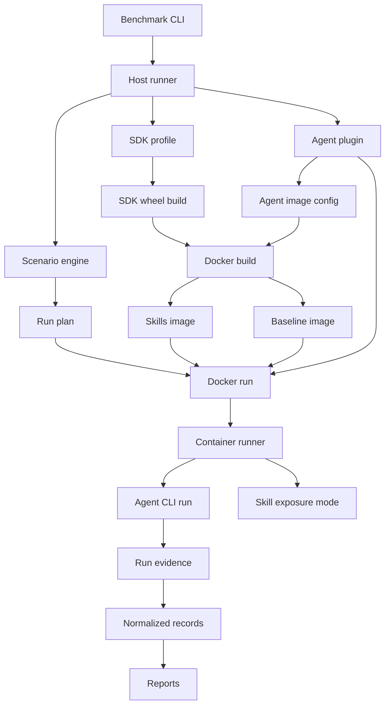
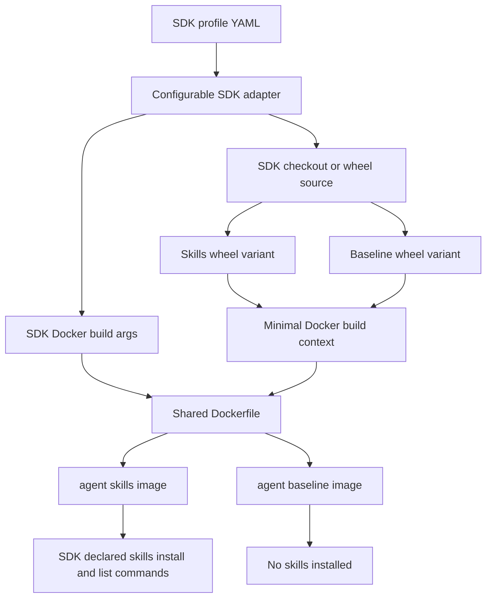
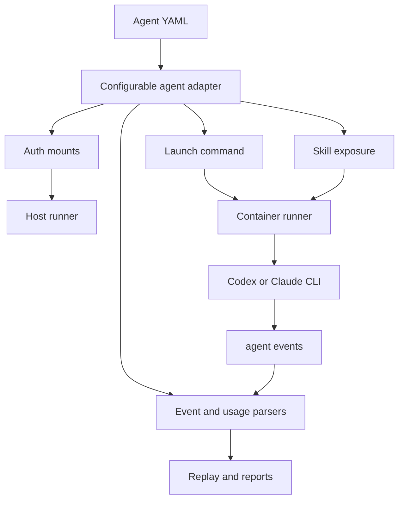
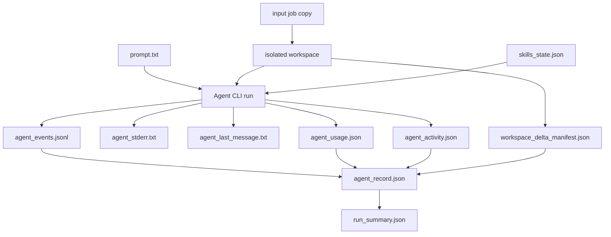
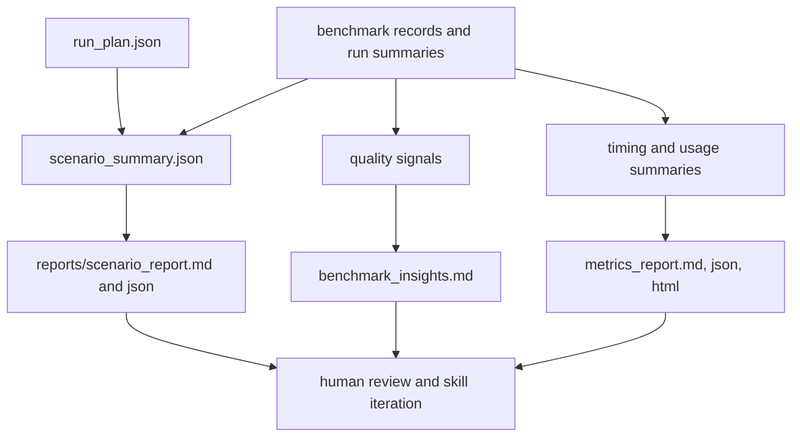
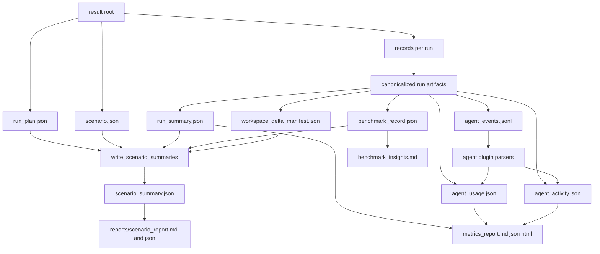
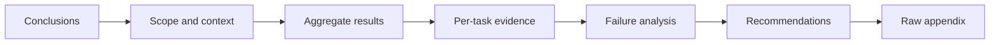

# Skill Benchmark Harness Architecture

This document describes the implemented skill benchmark harness under
`dev_tools/agent/skills/benchmark`. The harness measures how agent-accessible
NVFLARE skills affect applied conversion and diagnosis tasks.

The harness is not an agent runtime and it is not an NVFLARE training workflow.
It is a controlled runner that executes the same prompt and input folder with
and without packaged NVFLARE skills, then normalizes the evidence for review.
The skill packaging and install architecture is documented separately in
[skills_architecture.md](skills_architecture.md).

## Major Components

| Component | Main files | Responsibility |
| --- | --- | --- |
| CLI wrappers | `bin/build.sh`, `bin/run.sh` | Thin shell entry points. They set `PYTHONPATH` and dispatch to Python host modules. |
| SDK profile | `config/sdks/*.yaml`, `sdks/base.py`, `sdks/config.py`, `sdks/registry.py` | Describes the SDK under test: checkout markers, package/import names, wheel variants, build environment, Docker build args, and skill install/list commands. The current default profile is `nvflare-profile`, which describes the NVFLARE SDK. |
| Agent plugin | `config/agents/*.yaml`, `agents/base.py`, `agents/config.py`, `agents/parsers.py`, `agents/classifiers.py`, `agents/registry.py` | Describes an agent CLI: image names, auth mounts, model argument mapping, launch command, skill exposure mechanism, event parser, usage parser, final-message source, and exit classifier. Codex and Claude are implemented; Hermes and OpenClaw are registered as known pending agents. |
| Host runner | `skills/harness/host/build.py`, `skills/harness/host/runner.py`, `scenario_prompt.py`, `scenario_run_plan.py`, `scenario_summaries.py`, `record_identity.py` | Runs on the host. It builds/stages SDK wheels, builds/selects Docker images, expands scenario YAML into `run_plan.json`, materializes rendered prompts under the result root, validates inputs, mounts job/prompt/result directories, and starts one container per run-plan entry. |
| Docker setup | `docker/Dockerfile`, `docker/build_context.dockerignore` | Creates shared runtime images from local SDK wheels. The skills image installs the skills wheel and preinstalls agent skills; the baseline image installs the no-skills wheel and records that skills are intentionally absent. |
| Container runner | `skills/harness/container/agent_run.py`, `container/skills.py`, `container/sdk_skills_setup.py`, `container/progress.py` | Runs inside each benchmark container. It copies the input job to an isolated workspace, prepares SDK-declared skill directories, applies `with_skills` or `without_skills`, launches the selected agent plugin, captures progress, and writes normalized run artifacts. |
| Evidence and records | `artifacts.py`, `events.py`, `records.py`, `timing.py`, `quality_signals.py`, `metric_artifacts.py` | Normalizes raw run evidence into workspace deltas, runtime artifacts, event streams, usage/activity summaries, agent records, benchmark records, timing summaries, quality signals, and validation metrics discovered from captured runtime metric artifacts. |
| Reporting | `skills/harness/reports/` | Rebuilds scenario reports, benchmark insights, and metrics reports from captured records. Reporting can run through `replay` without launching Docker or an agent. |

## Harness Component Flow

## SDK And Docker Setup

The SDK profile owns SDK-specific package details. For NVFLARE, the profile
builds two local wheels from the checkout:

- skills variant: `NVFLARE_PACKAGE_AGENT_SKILLS=1`
- baseline variant: `NVFLARE_PACKAGE_AGENT_SKILLS=0`

The Docker image build consumes only staged wheel artifacts and a copied harness
package. It does not copy the SDK working tree into the runtime image. This
keeps the measured container closer to a user-installed SDK package.

## Agent Plugin Flow

The agent plugin is data-driven. The YAML config tells the harness how to run
the agent; it does not add benchmark instructions to the prompt. The prompt is
copied verbatim into the container and delivered according to the plugin's
launch configuration.

Codex uses a preinstalled-home skill exposure mechanism: the skills image
installs skills into the configured `CODEX_HOME` skill directory, and the
baseline path removes packaged skill visibility.

Claude uses a launch-flag skill exposure mechanism: the plugin passes the
configured skills directory through the agent launch args for the skills run.
The Claude profile also records the measured non-interactive launch flags
(`--print`, `--output-format stream-json`, `--verbose`, permission bypass
metadata, and tool selection) so parser behavior and command evidence remain
reproducible. The shell wrapper mirrors common Claude authentication locations:
it can forward `ANTHROPIC_API_KEY` from the environment, the macOS `"Claude
Code"` Keychain item, or Linux `~/.claude.json`, and it clears stale bearer-token
variables when a valid API key is present.

## Container Run Artifacts

Each run-plan entry owns its own container, result directory, workspace copy,
agent home, prompt copy, event stream, and records. `with_skills` and
`without_skills` receive the same prompt and input folder; the only intended
behavioral difference is skill visibility.

## Reporting Overview

## Reporting Architecture

Benchmark reporting is a separate read-side pipeline over captured run
artifacts. It does not launch an agent, change prompt content, install skills,
or mutate benchmark inputs. The same reporting path runs after live benchmark
execution and during `replay`.

The reporting pipeline has these implemented responsibilities:

| Stage | Main implementation | Output |
| --- | --- | --- |
| Per-run canonicalization | `host/runner.py::canonicalize_entry_artifacts` | Copies mode-specific records into stable names such as `agent_record.json`, `benchmark_record.json`, and `record_summary.json`. |
| Replay parsing | `host/runner.py::replay_result_root` plus the selected agent plugin parsers | Rebuilds `agent_usage.json` and `agent_activity.json` from `agent_events.jsonl` without running Docker or the agent. |
| Scenario summary | `scenario_summaries.py::write_scenario_summaries` | Writes `scenario_summary.json`, run summaries, comparison groups, aggregate results, quality gate status, winner policy, replay metadata, and report generation status. |
| Scenario report | `reports/scenario_report.py` | Writes `reports/scenario_report.json` and `reports/scenario_report.md` from `scenario_summary.json`. |
| Benchmark insights | `reports/benchmark_insights.py` | Writes a review-oriented `benchmark_insights.md` with quality gate interpretation, root-cause hints, command evidence, metric-reporting gaps, runtime metric artifact evidence, code-quality signals, and tabulated with-skills vs baseline slowdown comparisons. |
| Metrics report | `reports/metrics_report.py` | Writes `metrics_report.json`, `metrics_report.md`, and `metrics_report.html` with status, elapsed time, token usage, command counts, and numeric comparisons. |
| Host report status | `host/runner.py::write_host_report_status` | Writes `host_report_status.json` so automation can quickly detect whether the scenario report exists. |

The main reporting inputs are the normalized run artifacts, not raw console
logs. Raw `agent_events.jsonl`, `agent_stderr.txt`, `agent_last_message.txt`,
and `console_output.log` are kept as evidence, while reports consume normalized
records whenever possible.

Runtime metric artifacts are treated as stronger completion evidence than
workspace-copied metric-looking files. `metric_artifacts.py` scans structured
JSON/JSONL artifacts with runtime artifacts preferred over changed, added, or
modified workspace files, and `benchmark_insights.py` only uses metric artifacts
as job-completion evidence when they came from captured runtime/server output
locations. This avoids reporting stale or generated workspace metrics as proof
that the job actually ran.

The slowdown analysis is intentionally evidence-based. It reports total elapsed
time, dependency-install time, runtime-after-install time, and captured
non-install command time in a comparison table. It also lists the longest timed
commands for each mode, preserving the `>=30s` threshold when one side has no
matching row, and compares detected NVFLARE runtime paths when available.
Command spans are operation-level evidence and are not treated as a perfect
wall-clock partition.

`replay` is the reporting-only mode. It expects an existing result root with
`run_plan.json` and captured run directories, regenerates parser outputs and
reports, writes `replay_metadata.json`, and marks the scenario summary with
`agent_invocation: replayed`.

## Final Benchmark Report Structure

The final benchmark report is the human-facing rollup over the generated
scenario report, benchmark insights, metrics report, and raw evidence. It
should start with conclusions and then provide enough per-task evidence for
debugging and skill iteration.

```mermaid
flowchart TD
    FinalReport["Final benchmark report"]

    FinalReport --> ExecutiveSummary["Executive summary"]
    FinalReport --> Scope["Benchmark scope"]
    FinalReport --> Environment["Environment"]
    FinalReport --> AgentSkillConfig["Agent and skill configuration"]
    FinalReport --> TaskSuite["Task suite summary"]
    FinalReport --> OverallResults["Overall results"]
    FinalReport --> PerTaskResults["Per-task results"]
    FinalReport --> SkillComparison["With-skills vs without-skills comparison"]
    FinalReport --> FailureAnalysis["Failure analysis"]
    FinalReport --> EvidenceArtifacts["Evidence and artifacts"]
    FinalReport --> ReportingMetrics["Reporting metrics"]
    FinalReport --> Trends["Regression and trend view"]
    FinalReport --> Recommendations["Recommendations"]
    FinalReport --> Appendix["Appendix"]

    ScenarioReport["scenario_report.md/json"] --> ExecutiveSummary
    ScenarioReport --> TaskSuite
    ScenarioReport --> OverallResults
    ScenarioReport --> PerTaskResults

    BenchmarkInsights["benchmark_insights.md"] --> FailureAnalysis
    BenchmarkInsights --> Recommendations

    MetricsReport["metrics_report.md/json/html"] --> ReportingMetrics
    MetricsReport --> SkillComparison
    MetricsReport --> Trends

    RawEvidence["raw run artifacts"] --> EvidenceArtifacts
    RawEvidence --> Appendix
```

The recommended sections are:

| Section | Purpose | Primary inputs |
| --- | --- | --- |
| Executive summary | State overall pass rate, skill impact, biggest wins, regressions, and blockers. | `scenario_summary.json`, `scenario_report.md`, `benchmark_insights.md` |
| Benchmark scope | Identify benchmark run ID, date, agent, skill profile, task suite version, and SDK or repo version. | `run_plan.json`, `scenario.json`, `replay_metadata.json`, host metadata |
| Environment | Capture host OS, Docker image, SDK commit/version, Python version, important environment variables, and setup deviations. | Host build metadata, Docker labels, run records |
| Agent and skill configuration | Record the agent plugin, enabled skills, skill source/version, launch configuration, timeout, sandbox/bypass metadata, and auth handling. | Agent YAML, SDK profile YAML, `skills_state.json`, run plan entries |
| Task suite summary | Summarize task count, categories, difficulty labels, expected outputs, and scoring mode. | `scenario.json`, `run_plan.json` |
| Overall results | Show pass/fail/skip counts, success rate, average runtime, average command or tool usage, and category-level failure rate. | `scenario_summary.json`, `metrics_report.json` |
| Per-task results | List task status, score, runtime, agent, skill mode, triggered skills, key artifacts, and failure reason. | `run_summary.json`, `benchmark_record.json`, `agent_record.json` |
| With-skills vs without-skills comparison | Compare pass rate, runtime, command count, quality score, tasks helped by skills, and tasks hurt or unchanged. | Run summaries, comparison groups, `metrics_report.json`, `benchmark_insights.md` |
| Failure analysis | Group failures by missing skill coverage, tool/runtime issue, incorrect implementation, incomplete validation, environment issue, or timeout. | `benchmark_insights.md`, quality signals, agent activity |
| Evidence and artifacts | Link to raw logs, event streams, workspace deltas, generated outputs, and container logs. | `agent_events.jsonl`, `agent_stderr.txt`, `workspace_delta_manifest.json`, console logs |
| Reporting metrics | Present pass rate, completion time, tool-call count, file-change count, validation rate, dependency/runtime timing, and token/cost metrics when available. | `metrics_report.json`, `agent_usage.json`, `agent_activity.json`, `benchmark_insights.md` |
| Regression and trend view | Compare against previous benchmark runs, including new failures, fixed failures, and performance changes. | Previous result roots, current `scenario_summary.json`, current metrics report |
| Recommendations | Prioritize skill improvements, harness gaps, task coverage gaps, and product or documentation issues found by the benchmark. | `benchmark_insights.md`, failure analysis, reviewer notes |
| Appendix | Preserve raw schemas, scoring rules, task manifest details, full per-task metadata, and reproduction commands. | `scenario.json`, records, raw artifacts |

The report should be readable in this order:

## Key Implementation Points

- Harness root: `/Users/chesterc/projects/NVFlare/dev_tools/agent/skills/benchmark`
- Harness core: `/Users/chesterc/projects/NVFlare/dev_tools/agent/skills/benchmark/skills/harness`
- Harness SDK profiles: `/Users/chesterc/projects/NVFlare/dev_tools/agent/skills/benchmark/config/sdks`
- Harness agent plugins: `/Users/chesterc/projects/NVFlare/dev_tools/agent/skills/benchmark/config/agents`
- Harness Docker setup: `/Users/chesterc/projects/NVFlare/dev_tools/agent/skills/benchmark/docker/Dockerfile`
- Harness reporting: `/Users/chesterc/projects/NVFlare/dev_tools/agent/skills/benchmark/skills/harness/reports`

The important boundary: the harness starts external agent CLIs inside Docker
and normalizes the resulting evidence. The agent remains the component that
reads the prompt and uses the installed skills.
