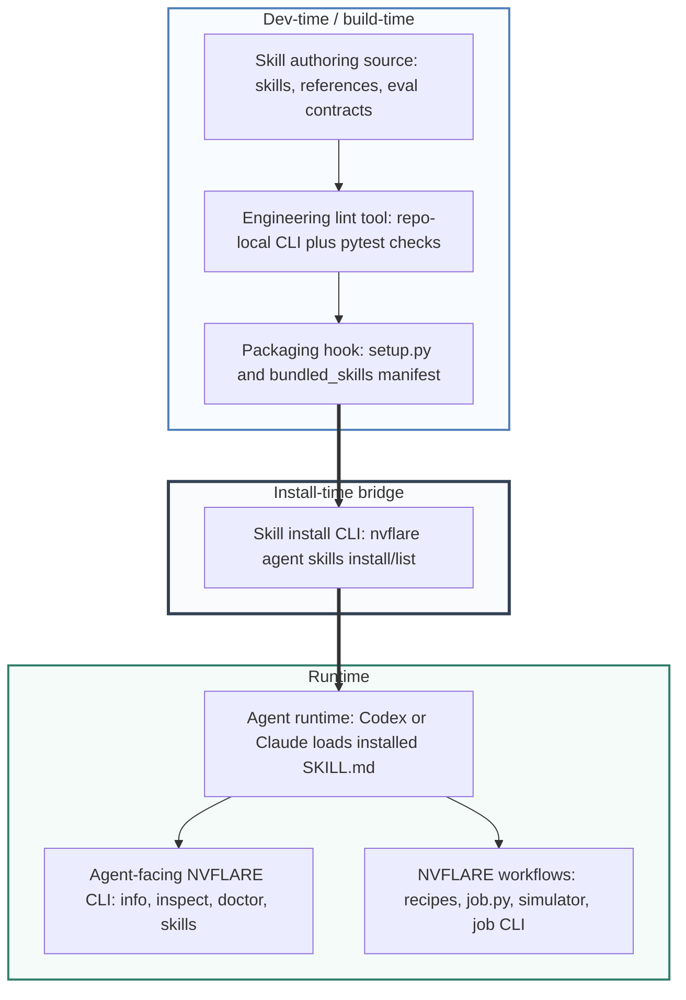
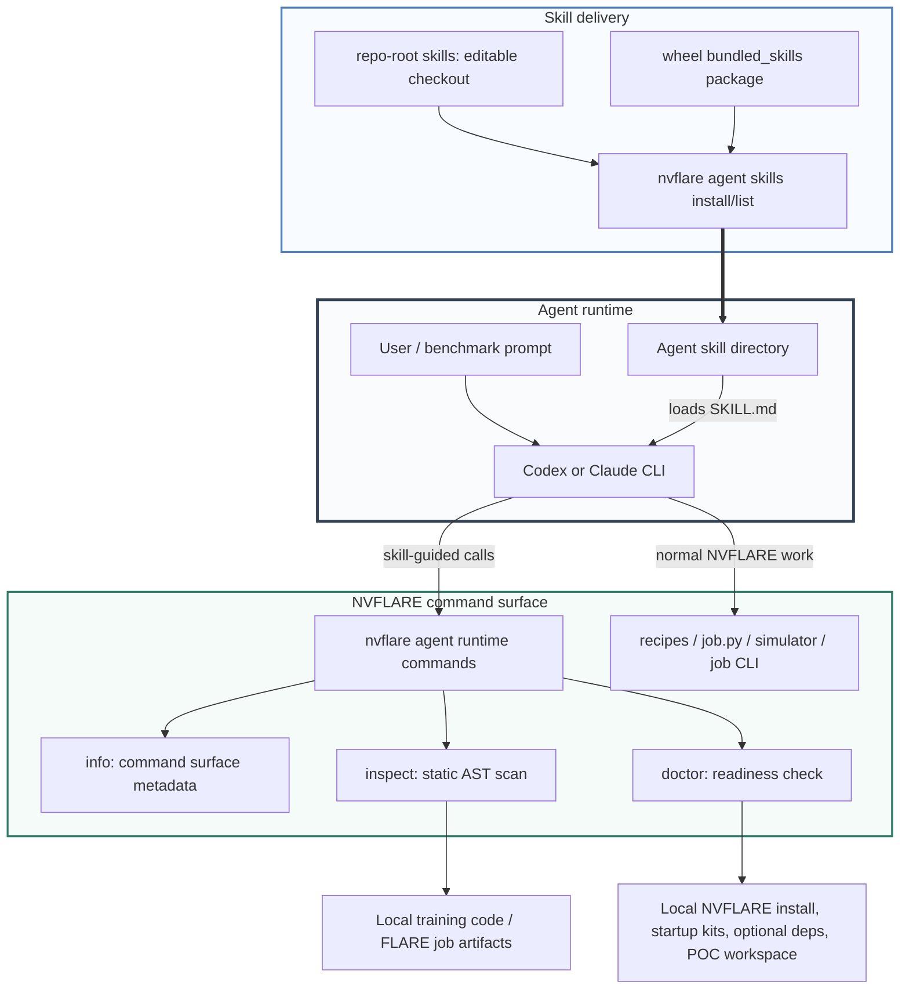
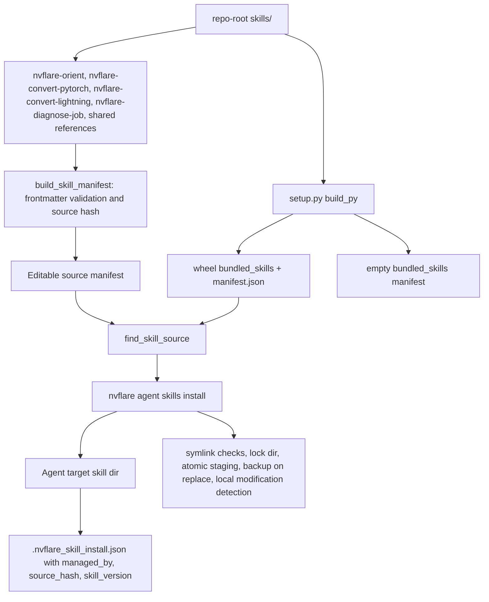
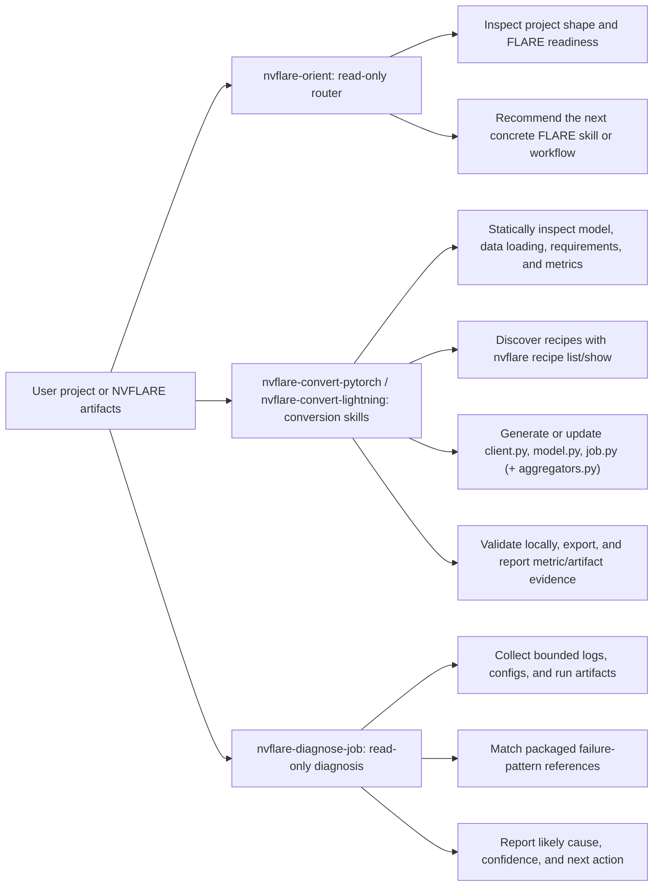

# FLARE Agent Skill Architecture

This document describes the implemented `nvflare agent` skill system: the
agent-facing CLI, packaged skills, and install/list paths.
The benchmark harness architecture is follow-up work outside this PR's source
set.

The implementation has two distinct scopes. **Dev-time and build-time**
components author, validate, and package skills inside the repository. **Runtime**
components are the commands and files an end user's agent uses. The skill install
CLI is the bridge: it takes validated skill content from the repo or wheel bundle
and installs it into an agent-specific skill directory.

## What This Is (Core Model)

An **agent skill** is a procedural playbook — a Markdown `SKILL.md` plus
supporting `references/` — that guides a general coding agent (Codex, Claude,
etc.) through an NVFLARE workflow such as converting training code into a
federated job. Skills are guidance, not a runtime library.

The design rests on one principle: **skills own the procedure; the NVFLARE
product owns the truth.**

- The **skill** tells the agent *how to operate*: what to inspect, which CLI
  commands to run, what to extract, which files to edit, when to stop, and what
  evidence to report.
- The **product API** owns *what is true and executable*: recipe schema and
  defaults, argument validation, job construction, simulation, and export. The
  agent discovers this at runtime through commands like
  `nvflare recipe show --format json` and lets recipe constructors validate.

A skill must never re-encode product behavior in prose — no hand-authored recipe
schemas, no reimplemented validation, no hidden fact-to-parameter tables. That
"shadow API" would drift from the product and mislead the agent. When guidance
would also be needed by a human writing the job by hand, it belongs in the
product, not the skill.

NVFLARE does **not** run its own agent runtime. It authors, lints, packages,
installs, and measures skill files; the agent host (Codex/Claude) loads and
executes them. The packaged skills today are:

- `nvflare-orient` — read-only router that inspects a project and recommends the
  next skill or workflow;
- `nvflare-convert-pytorch` and `nvflare-convert-lightning` — convert existing
  PyTorch / PyTorch Lightning training code into a federated NVFLARE job via the
  Client API, with local validation and export;
- `nvflare-diagnose-job` — read-only diagnosis of a failed job from bounded
  evidence.

The rest of this document details how those skills are authored, validated,
packaged, installed, and consumed.

## High-Level System View

## System Layers

| Layer | When | Implemented pieces | Purpose |
| --- | --- | --- | --- |
| Authoring source | Dev-time | `skills/`, `SKILL.md`, `references/`, `evals/evals.json` | Human-readable skill instructions and supporting evidence. |
| Engineering lint tool | Dev-time / CI | `dev_tools/agent/skills/checks`, `python dev_tools/agent/skills/checks/cli.py`, pytest coverage | Deterministic admission checks for frontmatter, triggers, command drift, policy coverage, fixtures, and process metrics. This is a repo-local tool validated by pytest; it is not shipped in the wheel. |
| Python packaging hook | Build-time | `setup.py`, `nvflare.tool.agent.bundled_skills`, `manifest.json` | Wheel-build hook that copies released skills into the NVFLARE package, or writes an empty bundle for no-skill builds. |
| Skill install CLI | Install-time bridge | `nvflare agent skills install/list`, `skill_manager.py` | Managed installer that copies skills into Codex or Claude target directories with content hashes, locks, backups, local-modification checks, and symlink checks. |
| Runtime agent surface | Runtime | Codex/Claude skill loading, `nvflare agent inspect`, `nvflare agent doctor`, recipe/job CLI | The agent reads skill instructions and uses NVFLARE commands to inspect, convert, validate, or diagnose. |
| Benchmark harness | Separate | Follow-up work outside this PR | Separate architecture for measuring skill impact with Docker, SDK profiles, agent plugins, and reporting. |

## Lint Engine Independence (Design Invariant)

The engineering lint tool (`dev_tools/agent/skills/checks/lints.py`) is
**self-contained over the `skills/` tree**. This is a deliberate invariant, not
an accident of the current code:

- The lint engine MUST NOT read `docs/design/*.md`. Those are human planning
  docs; the admission engine validates shippable skill artifacts only. There is
  no `docs_root` parameter and no `--docs-root` flag.
- `SKILL.md` is a **runtime artifact** loaded by the agent. Frontmatter fields
  must be runtime or public skill metadata. Do not add offline-lint-only fields
  to its frontmatter.
- `skill-trigger-overlap-lint` groups skills by deterministic skill-name
  families, such as `nvflare-convert` or `nvflare-diagnose`
  (`_trigger_overlap_group`), so the overlap guard runs purely over `skills/`
  with no external source of truth.
- Catalog/publication sync (is a skill listed in the human product catalog?) is
  a **docs concern**, not a skill-admission concern. If wanted, it belongs in a
  separate docs check that the skill engine does not import. Do not add
  `skill-catalog-category-lint` or `agent-doc-crosslink-lint` back into this
  engine.

History: an earlier change coupled the engine to `agent_integration.md` for
catalog synchronization and silently skipped checks in CI when the docs were
absent. That coupling was reverted on purpose. `category` is now public
frontmatter metadata for publishable skills, but the lint engine still must not
use design docs or category values as its trigger-overlap source of truth. If
the engine needs a grouping source, derive it from `skills/` deterministic
skill-name families or an analysis-only file stripped from the release bundle.

## Implemented Architecture

## Skill Source And Install Flow

## What The Skills Actually Do

## Key Implementation Points

Dev-time / build-time:

- Public skill source: `skills/`
- Engineering lint tool and CI gate: `dev_tools/agent/skills/checks/`
- Manifest builder: `nvflare/tool/agent/skill_manifest.py`
- Packaging hook: `setup.py` (`AgentSkillsBuildPy`)

Runtime (installed on the user's machine):

- Skill install/list logic: `nvflare/tool/agent/skill_manager.py`
- Agent-facing CLI: `nvflare/tool/agent/agent_cli.py`
- Command surface metadata: `nvflare/tool/agent/command_registry.py`
- Static inspection: `nvflare/tool/agent/inspector.py`
- Readiness checks: `nvflare/tool/agent/doctor.py`
- Implemented skills: `nvflare-orient`, `nvflare-convert-pytorch`, `nvflare-convert-lightning`, and `nvflare-diagnose-job`

Separate:

- Benchmark harness architecture: follow-up work outside this PR

The important boundary is that NVFLARE does not run a custom agent runtime for
these skills. NVFLARE packages, installs, validates, and measures skill files;
Codex and Claude load those files through their own skill mechanisms.
