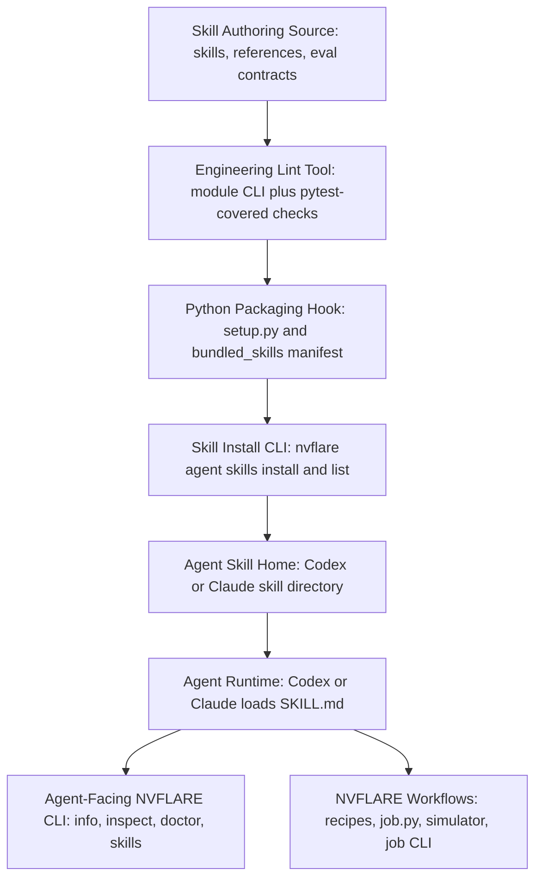
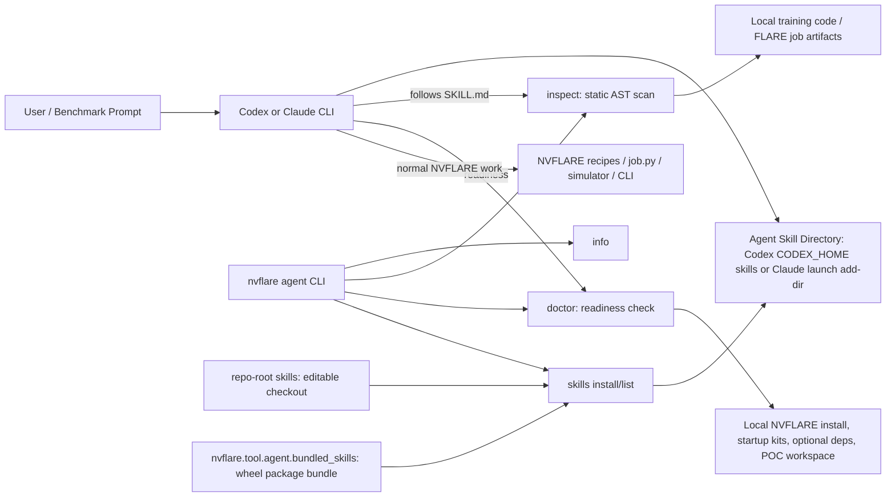
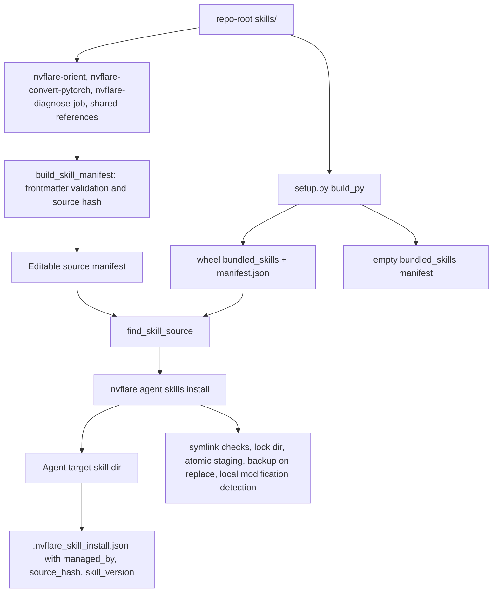
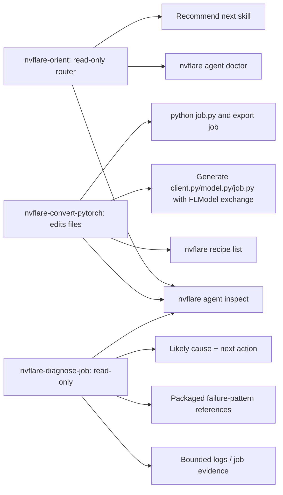

# FLARE Agent Skill Architecture

This is a picture of what is implemented today for the `nvflare agent` skill
system: the agent-facing CLI, the packaged skills, and the install/list paths.
The benchmark harness architecture is follow-up work outside this PR's source
set.

## High-Level System View

## System Layers

| Layer | Implemented pieces | Purpose |
| --- | --- | --- |
| Authoring source | `skills/`, `SKILL.md`, `references/`, `evals/evals.json`, `BENCHMARK.md` | Human-readable skill instructions and supporting evidence. |
| Engineering lint tool | `nvflare.tool.agent_skill_checks`, `python -m nvflare.tool.agent_skill_checks`, pytest coverage | Deterministic admission checks for frontmatter, triggers, command drift, policy coverage, fixtures, process metrics, and doc links. The check itself is a CLI/library tool; pytest validates the tool behavior. |
| Python packaging hook | `setup.py`, `nvflare.tool.agent.bundled_skills`, `manifest.json` | Standard wheel-build hook that copies released skills into the NVFLARE package or writes an empty bundle for no-skill builds. |
| Skill install CLI | `nvflare agent skills install/list`, `skill_manager.py` | CLI copy/install tool that installs managed skills into Codex or Claude target directories with hashes, locks, backups, and symlink checks. |
| Runtime agent surface | Codex/Claude skill loading, `nvflare agent inspect`, `nvflare agent doctor`, recipe/job CLI | The agent reads skill instructions and uses NVFLARE commands to inspect, convert, validate, or diagnose. |
| Benchmark harness | Follow-up work outside this PR | Separate architecture for measuring skill impact with Docker, SDK profiles, agent plugins, and reporting. |

## Implemented Architecture

## Skill Source And Install Flow

## What The Skills Actually Do

## Key Implementation Points

- Public skill source: `skills/`
- Implemented skills:
  - `nvflare-orient`
  - `nvflare-convert-pytorch`
  - `nvflare-diagnose-job`
- Agent-facing CLI: `nvflare/tool/agent/agent_cli.py`
- Skill install/list logic: `nvflare/tool/agent/skill_manager.py`
- Static inspection: `nvflare/tool/agent/inspector.py`
- Readiness checks: `nvflare/tool/agent/doctor.py`
- Packaging hook: `setup.py`
- Benchmark harness architecture: follow-up work outside this PR

The important boundary: NVFLARE does not run a custom agent runtime for these
skills. It packages, installs, validates, and measures skill files that
Codex/Claude then load through their own skill mechanisms.
