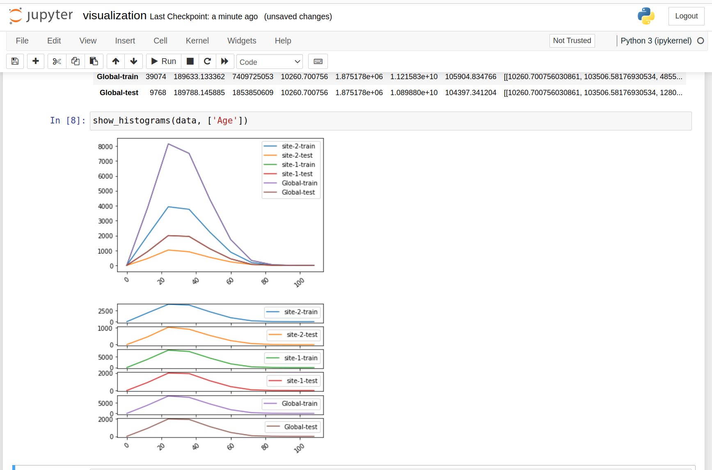

.. _federated_statistics:

Federated Statistics Overview
*****************************

Objective
=========
NVIDIA FLARE will provide built-in federated statistics operators (controller and executors) that can generate global statistics based on local client side statistics.

At each client site, we could have one or more datasets (such as "train" and "test" datasets); each dataset may have many features. For each feature in the dataset, we will calculate the statistics and then combine them to produce global statistics for all the numeric features. The output would be complete statistics for all datasets in clients and global.

The statistics here are commonly used statistics: count, sum, mean, std_dev and histogram for the numerical features. The max, min are not included as it might violate the client's data privacy. Median is not included due to the complexity of the algorithms. If the statistics sum and count are selected, the mean will be calculated with count and sum.

A client will only need to implement the selected methods of the :class:`Statistics<nvflare.app_common.abstract.statistic_spec.Statistics>` class from statistics_spec.

The result will be statistics for all features of all datasets at all sites as well as global aggregates. The result should be visualized via the visualization utility in the notebook.

Assumptions
===========

Assume that clients will provide the following:

* target statistics such as count, histogram only
* local statistics for the target statistics (by implementing the statistic_spec)
* data sets and dataset features (feature name, data type)
  
.. note::

    Count is always required as we use count to enforce data privacy policy. We only support numerical features, not categorical features. The client can return all types of features but the non-numerical features will be removed.

Examples
========

We provide several examples to demonstrate how should the operators be used.

Tabular Examples
----------------

The first example is to calculate the statistics for tabular data. The data can be loaded into Pandas DataFrames, the data can be cached in memory, and we can leverage DataFrame and Numpy to calculate the local statistics.

**Data frame statistics**

The result will be saved to the job workspace in json format, which can be loaded in a Pandas DataFrame. In the jupyter notebook, you can visualize the results with the provided visualization utility. For an example, this table shows the statistics for a particular feature "Age" on each site and each dataset.

.. image:: ../resources/stats_df.png
    :height: 300px

You can compare global features and clients' feature statistics side-by-side for each dataset for all features.

Here is an example for histogram plots:

The main steps are:

    * provide server side configuration to specify target statistics and their configurations and output location
    * implement the local statistics generator (statistics_spec)
    * provide client side configuration to specify data input location
    * The detailed example instructions can be found in :github_nvflare_link:`Data frame statistics <examples/advanced/federated-statistics/df_stats/README.md>`

COVID 19 Radiology Image Examples
---------------------------------
The second example provided is an image histogram example. Different from the tabular data example, the image example show the following:

* The :github_nvflare_link:`image_statistics.py <examples/advanced/federated-statistics/image_stats/image_stats_job/custom/image_statistics.py>` only needs to calculate the count and histogram target statistics, then user only needs to provide the calculation count, failure_count and histogram functions. There is no need to implement other metrics functions (sum, mean,std_dev etc.) ( get_failure_count by default return 0 )
* For each site's dataset, there are several thousands of images, the local histogram is aggregate histogram of all the image histograms.
* The image files are large, we can't load everything in memory, then calculate the statistics. We will need to iterate through files for each calculation. For single feature, such as example. This is ok. If there are multiple features, such as multiple channels, reload image to memory for each channel to do histogram calculation is really wasteful.
* Unlike :github_nvflare_link:`Data frame statistics <examples/advanced/federated-statistics/df_stats/README.md>`, the histogram bin's global range is pre-defined by user [0, 256] where in Data frame statistics, besides "Age", all other features histogram global bin range is dynamically estimated based on local min/max values

Here some of the image histogram ( the underline image files have only 1 channel)

Monai Stats with Spleen CT Image example
----------------------------------------

This example :github_nvflare_link:`Spleen CT Image Statistics <integration/monai/examples/spleen_ct_segmentation>` demonstrated few more details in federated statistics.

* instead of locally calculate the histogram on each image, this example shows how to get the local statistics from monai via the MONAI FLARE integration.
* to avoid the reloading the same image into memory for each feature. This example shows the one can use pre_run() method to load and cache the externally calculated statistics. The server side controller will pass the target metrics to pre_run method so it can be used to load the statistics.

Privacy Policy and Privacy Filters
==================================

NVFLARE provide data privacy protection through privacy filters :ref:`privacy-management <site_policy_management>` Each site can have its own privacy policy.

Local privacy policy
--------------------

privacy.json provides local site specific privacy policy. The policy is likely setup by the company and implemented by organization admin for the project. For different type of scope or categories, there are might be type of policy.

Privacy configuration
---------------------

The NVFLARE privacy configuration is consists of set of task data filters and task result filters

* The task data filter applies before client executor executes;
* The task results filter applies after client executor before it sends to server;
* for both data filter and result filter, they are groups via scope.

Each job will need to have privacy scope. If not specified, the default scope will be used. If default scope is not defined and job doesn't specify the privacy scope, the job deployment will fail, and job will not executed

Privacy Policy Instrumentation
------------------------------

There are different ways to set privacy filter depending the use cases

Set Privacy Policy as researcher
^^^^^^^^^^^^^^^^^^^^^^^^^^^^^^^^
You can specify the "task_result_filters" in config_fed_client.json to specify the privacy control. This is useful when you develop these filters.

Setup site privacy policy as org admin
^^^^^^^^^^^^^^^^^^^^^^^^^^^^^^^^^^^^^^
Once the company decides to instrument certain privacy policy independent of individual job, one can copy the local directory privacy.json content to clients' local privacy.json (merge not overwrite). In this example, since there is only one app, we can simply copy the private.json from local directory to ``site-1/local/privacy.json`` and ``site-2/local/privacy.json``.

We need to remove the same filters from the job definition in config_fed_client.json by simply set the "task_result_filters" to empty list to avoid **double filtering**

.. code-block::

    "task_result_filters": []

Job filter vs. filters in private.json
^^^^^^^^^^^^^^^^^^^^^^^^^^^^^^^^^^^^^^

Privacy filters are defined within a privacy scope. If a job's privacy scope is defined or has default scope, then the scope's filters (if any) are applied before the job-specified filters (if any). This rule is enforced during task execution time.

With such rules, if we have both task result filters and privacy scoped filters, we need to understand that the privacy filters will be applied first, then job filters.

Statistics Privacy Filters
^^^^^^^^^^^^^^^^^^^^^^^^^^

Statistics privacy filters are task result filters. We already build one for Statistics.

The :class:`StatisticsPrivacyFilter<nvflare.app_common.filters.statistics_privacy_filter.StatisticsPrivacyFilter>` consists of several ``StatisticsPrivacyCleansers`` focused on the statistics sent from client to server.

:class:`StatisticsPrivacyCleanser<nvflare.app_common.statistics.statistics_privacy_cleanser.StatisticsPrivacyCleanser>` can be considered as an interceptor before the results delivered to server. Currently, we use three ``StatisticsPrivacyCleansers`` to guard the data privacy. The reason we built ``StatisticsPrivacyCleanser`` instead of separate filters is to avoid repeated data de-serialization.

**MinCountCleanser**

Check against the number of count returned from client for each dataset and each feature.

If the min_count is not satisfied, there is potential risk of reveal client's real data. Then remove that feature's statistics from the result for this client.

**HistogramBinsCleanser**

For histogram calculations, number of bins can't be too large compare to count. if the bins = count, then we also reveal the real data. This check to make sure that the number of bins be less than X percent of the count. X = max_bins_percent in percentage, for 10 is for 10% if the number of bins for the histogram is not satisfy this specified condition, the resulting histogram will be removed from statistics before sending to server.

**AddNoiseToMinMax**

For histogram calculations, if the feature's histogram bin's range is not specified, we will need to use local data's min and max values to calculate the global min/max values, then use the global min, max values as the bin ragen for histogram calculation. But send the server the local min, max values will reveal client's real data. To protect data privacy, we add noise to the local min/max values.

Min/max random is used to generate random noise between (min_noise_level and max_noise_level). for example, the random noise is to be within (0.1 and 0.3),i.e. 10% to 30% level. These noise will make local min values smaller than the true local min values, and max values larger than the true local max values. As result, the estimate global max and min values (i.e. with noise) are still bound the true global min/max values, in such that

.. code-block::

    est. global min value <
        true global min value <
            client's min value <
                client's max value <
                    true global max <
                            est. global max value

How it works
============

Some of the local statistics (such as count, failure count, sum etc.) can be calculated with one round; while others statistics such as stddev, histogram ( if the global bin range is not specified) will need to two round of calculations. We design a workflow to essentially issue three round of trip to client

* pre_run() -- controller send clients the target metrics information
* 1st statistics task -- controller send clients 1st set of target metrics as well as local max/min if the global min/max estimation is needed
* 2nd statistics task -- based on the aggregated global statistics, we do the 2nd round, we calculate the VAR (with global mean) and histogram based on the global rnage (or estimated global range)

Summary
=======
We provided federated statistics operators that can easily aggregate and visualize the local statistics for different data site and features.
We hope this feature will make it easier to perform federated data analysis. For more details, please look at :github_nvflare_link:`Federated Statistics (Github) <examples/advanced/federated-statistics/README.md>`

