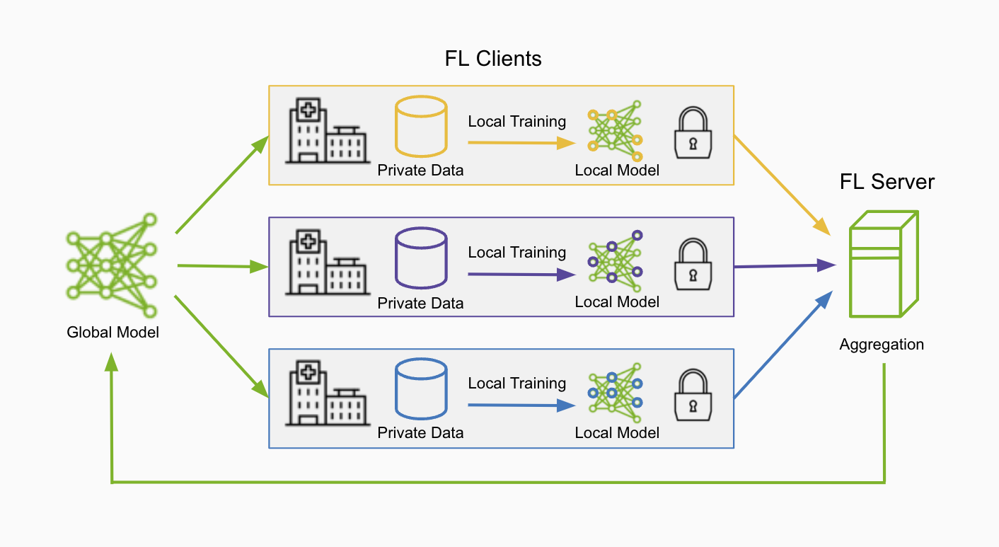

.. _fl_introduction:

###########################
What is Federated Learning?
###########################

Federated Learning is a distributed learning paradigm where training occurs across multiple clients, each with their own local datasets.
This enables the creation of common robust models without sharing sensitive local data, helping solve issues of data privacy and security.

How does Federated Learning Work?
=================================
The federated learning (FL) server orchestrates the collaboration of multiple clients by first sending an initial model to the FL clients.
The clients perform training on their local datasets, then send the model updates back to the FL server for aggregation to form a global model.
This process forms a single round of federated learning and after a number of rounds, a robust global model can be developed.

FL Terms and Definitions
========================

- FL server: manages job lifecycle, orchestrates workflow, assigns tasks to clients, performs aggregation
- FL client: executes tasks, performs local computation/learning with local dataset, submits result back to FL server
- FL algorithms: FedAvg, FedOpt, FedProx etc. implemented as workflows

.. note::

    Here we describe the centralized version of FL, where the FL server has the role of the aggregator node. However in a decentralized version such as 
    swarm learning, FL clients can serve as the aggregator node instead.

- Types of FL

  - horizontal FL: clients hold different data samples over the same features
  - vertical FL: clients hold different features over an overlapping set of data samples
  - swarm learning: a decentralized subset of FL where orchestration and aggregation is performed by the clients

Main Benefits
=============

Enhanced Data Privacy and Security
----------------------------------
Federated learning facilitates data privacy and data locality by ensuring that the data remains at each site.
Additionally, privacy preserving techniques such as homomorphic encryption and differential privacy filters can also be leveraged to further protect the transferred data.

Improved Accuracy and Diversity
-------------------------------
By training with a variety of data sources across different clients, a robust and generalizable global model can be developed to better represent heterogeneous datasets.

Scalability and Network Efficiency
----------------------------------
With the ability to perform training at the edge, federated learning can be highly scalable across the globe.
Additionally only needing to transfer the model weights rather than entire datasets enables efficient use of network resources.

Applications
============
An important application of federated learning is in the healthcare sector, where data privacy regulations and patient record confidentiality make training models challenging.
Federated learning can help break down these healthcare data silos to allow hospitals and medical institutions to collaborate and pool their medical knowledge without the need to share their data.
Some common use cases involve classification and detection tasks, drug discovery with federated protein LLMs, and federated analytics on medical devices.

Furthermore there are many other areas and industries such as financial fraud detection, autonomous vehicles, HPC, mobile applications, etc. 
where the ability to use distributed data silos while maintaining data privacy is essential for the development of better models.

Read on to learn how FLARE is built as a flexible federated computing framework to enable federated learning from research to production.