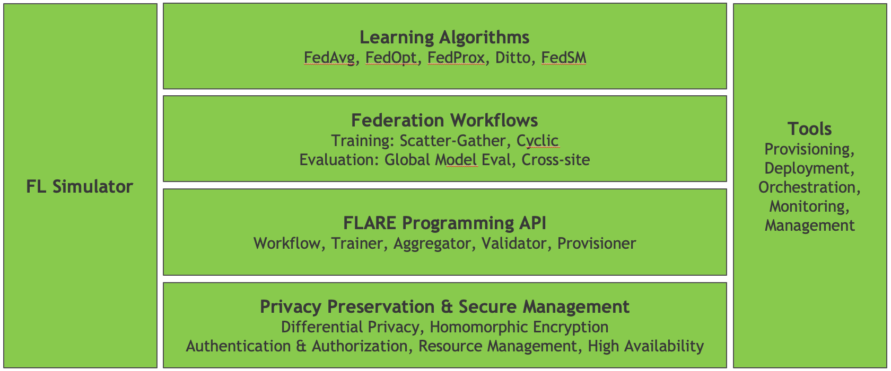

.. _flare_overview:

#####################
NVIDIA FLARE Overview
#####################

**NVIDIA FLARE** (NVIDIA Federated Learning Application Runtime Environment) is a domain-agnostic, open-source,
extensible SDK that allows researchers and data scientists to adapt existing ML/DL workflow to a federated paradigm.

With Nvidia FLARE platform developers can build a secure, privacy preserving offering
for a distributed multi-party collaboration.

NVIDIA FLARE SDK is built for robust, production scale for real-world federated learning deployments.

It includes:

  * A runtime environment enabling data scientists and researchers to easily carry out FL experiments in a
    real-world scenario. Nvidia FLARE supports multiple task execution, maximizing data scientist's productivity.
  
  * System capabilities to start up federated learning with high availability infrastructure.
  
  * Built-in implementations of:

    * Federated training workflows (scatter-and-gather, Cyclic)
    * Federated evaluation workflows (global model evaluation, cross site model validation);
    * Learning algorithms (FedAvg, FedOpt, FedProx)
    * Privacy preserving algorithms (homomorphic encryption, differential privacy)

  * Extensible management tools for:

    * Secure provisioning (SSL certificates)
    * Orchestration (Admin Console) | (Admin APIs) 
    * Monitoring of federated learning experiments (Aux APIs; Tensorboard visualization)
  
  * A rich set of programmable APIs allowing researchers to create new federated workflows,
    learning & privacy preserving algorithms.

High-level System Architecture
==============================
As outlined above, NVIDIA FLARE includes components that allow researchers and developers to build and deploy
end-to-end federated learning applications.

The high-level architecture is shown in the diagram below.

This includes the foundational components of the NVIDIA FLARE API and tools for privacy preservation and
secure management of the platform.

On top of this foundation are the building blocks for federated learning applications,
with a set of federation workflows and learning algorithms.

Alongside this central stack are tools that allow experimentation and proof-of-concept development
with the FL Simulator (POC mode), along with a set of tools used to deploy and manage production workflows.

Design Principles
=================

* Keep it simple - less is more
* Design to specification
* Build for real-world scenarios
* Keep the system general-purpose
* Client system friendly

**Less is more**

We strive to solve unique challenges by doing less while enabling others to do more.
We can't solve whole worlds' problems, but by building an open platform we can enable
others to solve world's problems.

This design principle means we intentionally limit the scope of the implementation,
only building the necessary components. For a given implementation, we follow specifications
in a way that allows others to easily customize and extend.

**Design to Specification**

Every component and API is specification-based, so that alternative implementations can be
constructed by following the spec.  This allows pretty much every component to be customized.

We strive to be open-minded in reference implementations, encouraging developers and end-users
to extend and customize to meet the needs of their specific workflows.

**Build for real-world scenarios**

We build to handle real-world use cases where unexpected events or misbehaving code can be
handled in a way that allows components or the system as a whole to fail gracefully.
The reference implementations of the default components are designed to solve real-world
problems in a straightforward way.

**Keep the system general-purpose**

We design ths system to be general purpose, to enable different "federated" computing use cases.
We carefully package the components into different layers with minimal dependencies between layers.
In this way, implementations for specific use cases should not demand modifications to the
underlying system core.

**Client system friendly**

We design the system so that it can run anywhere with minimal environmental dependencies.
We also strive to build the system in a way that does not interfere with the deployment environment,
allowing FLARE to be easily integrated into your own applications or platforms.
