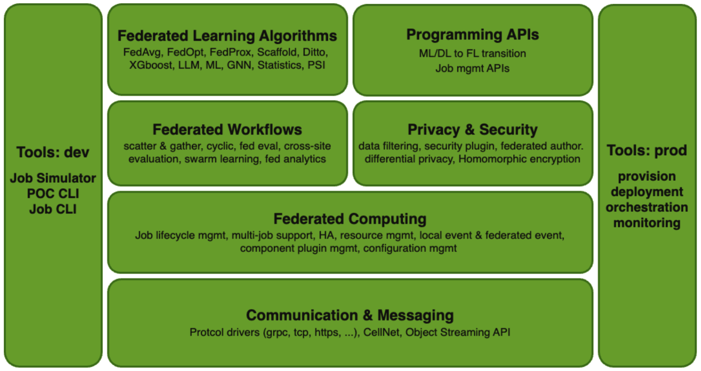

.. _flare_overview:

#####################
NVIDIA FLARE Overview
#####################

**NVIDIA FLARE** (NVIDIA Federated Learning Application Runtime Environment) is a domain-agnostic, open-source,
extensible Python SDK that allows researchers, data scientists and data engineers to adapt existing ML/DL and compute workflows to a federated paradigm.
With the FLARE platform, developers can create a secure and privacy-preserving solution for decentralized data computing, facilitating distributed multi-party collaboration.

Key Features
============

Federated Computing
-------------------

At its core, FLARE serves as a federated computing framework, with applications such as Federated Learning and Federated Analytics built upon this foundation.
Notably, it is agnostic to datasets, workloads, and domains. In contrast to centralized data lake solutions that necessitate copying data to a central location, FLARE brings computing capabilities directly to distributed datasets.
This approach ensures that data remains within the compute node, with only pre-approved, selected results being shared among collaborators.
Moreover, FLARE is system-agnostic, offering easy integration with various data processing frameworks through the implementation of the FLARE client.
This client facilitates deployment in sub-processes, Docker containers, Kubernetes pods, HPC, or specialized systems.

Built for productivity
----------------------

FLARE is designed for maximum productivity, providing a range of tools to enhance user experience and research efficiency at different stages of the development process:

- **FLARE Client API:** Enables users to transition seamlessly from ML/DL to FL with just a few lines of code changes.
- **Simulator CLI:** Allows users to simulate federated learning or computing jobs in multi-process settings within a single computer, offering quick response and debugging. The same job can be deployed directly to production.
- **POC CLI:** Facilitates the simulation of federated learning or computing jobs in multi-process settings within one computer. Different processes represent server, clients, and an admin console, providing users with a realistic sense of the federated network. It also allows users to simulate project deployment on a single host.
- **Job CLI:** Permits users to create and submit jobs directly in POC or production environments.
- **FLARE API:** Enables users to run jobs directly from Python code or notebooks.
- **FLARE Dashboard:** Allows users to set up, approve, and distribute deployment artifacts among collaborators.
- **Preflight Check Tool:** Enables users to verify if the federated system is correctly set up before running any jobs.
- **Cloud Deployment CLI:** Allows users to start and deploy FLARE on cloud service providers (AWS or Azure) with a single CLI command.
- **ML Experiment Tracking Support:** Enables users to log to TensorBoard, MLFlow, and Weights & Biases for comprehensive experiment tracking.

Built for security & privacy
----------------------------

FLARE prioritizes robust security and privacy preservation:

- **Secure Provisioning:** Utilizes TLS certificates to ensure a secure environment.
- **Event-based Security Plugin Mechanism:** Enables local, user-defined authentication and authorization for enhanced security.
- **Authorization Policy Control:** Empowers local entities to control authorization policies within the federated framework.
- **Data and Result Filter Mechanism:** Enhances data protection through a filter mechanism.
- **Audit Logs:** Provides audit logs for increased transparency and accountability.
- **Federated Learning Algorithms:** Incorporates advanced algorithms for privacy preservation, including Differential Privacy, Homomorphic Encryption, and Multi-party Private Set Intersection (PSI).

Built for concurrency & scalability
-----------------------------------

FLARE is designed for optimal concurrency, supporting resource-based multi-job execution when the necessary resources are available. This concurrent run capability enhances the efficiency of job execution within the framework.
Additionally, for setups involving devices across multiple regions, FLARE offers FL HUB (Hierarchical Unified Bridge) features. These features enable the establishment of a tiered federated learning system, enhancing flexibility and scalability in multi-region configurations.

Built for customization
-----------------------

FLARE is structured in layers, with each layer composed of customizable components. This modular design ensures that every layer is easily pluggable, allowing for seamless customization.

Rich examples repository
------------------------

FLARE provides a wealth of built-in implementations for various federated learning workflows, along with numerous examples, showcasing diverse algorithms. Examples include:

- **Federated training workflows**
  
  - Server-side controlled flow: scatter-and-gather, cyclic-weight transfer, federated evaluation, cross-site-model evaluation
  - Client-side controlled flow: cyclic-weight transfer, swarm-learning, cross-site-model evaluation
  - Split Learning

- **Learning algorithms** (FedAvg, FedOpt, FedProx, Scaffold, Ditto, FedSM, Fed AutoRL etc.)
- **Privacy preserving algorithms** (homomorphic encryption, differential privacy)
- **Federated Learning Examples**

  - Large Language Model
  - Medical Image Analysis
  - Federated Statistics
  - Traditional Machine Learning (scikit-learn, linear model, SVM, Kmeans, Random Forest)
  - Federated XGBoost (horizontal and vertical)
  - NLP
  - GNN
  - Federated Multi-Party PSI

- **Feature Tutorials**

  - Simulator, FLARE API, POC mode, Job CLI
  - ML-to-FL FLARE Client API
  - Step-by-step progressive series

Built for integration
---------------------

FLARE offers multiple integration options with third-party systems, with the Flare Agent providing a seamless and straightforward approach.
This allows FLARE to collaborate effortlessly with third-party systems, irrespective of the programming languages and technologies they are built upon.

Built for production
--------------------

The FLARE SDK is designed for robust, production-scale deployment in real-world federated learning and computing scenarios.
It has found applications in various industries, including healthcare, financial services, and self-driving cars.
FLARE has been successfully deployed in both cloud and on-premise environments.
 
High-level System Architecture
==============================

As detailed above, FLARE incorporates components that empower researchers and developers to construct and deploy end-to-end federated learning applications.
The high-level architecture, depicted in the diagram below, encompasses the foundational layer of the FLARE communication, messaging streaming layers, and tools dedicated to privacy preservation and secure platform management. 
Atop this foundation are the building blocks for federated learning applications, featuring a suite of federation workflows and learning algorithms. 
Adjacent to this central stack are tools facilitating experimentation and simulation with the FL Simulator and POC CLI, complemented by a set of tools designed for the deployment and management of production workflows.

Design Principles
=================

- Less is more
- Design to specification
- Build for real-world scenarios
- Keep the system general-purpose
- Client system friendly

**Less is more**
We strive to solve unique challenges by doing less while enabling others to do more. 
We can't solve whole world's problems, but by building an open platform, we can enable others to solve them.
This design principle means we intentionally limit the scope of the implementation, only building the necessary components. 
For a given implementation, we follow specifications in a way that allows others to easily customize and extend.

**Design to Specification**
Every component and API is specification-based, so that alternative implementations can be constructed by following the spec.
This allows pretty much every component to be customized.
We strive to be open-minded in reference implementations, encouraging developers and end-users to extend and customize to meet the needs of their specific workflows.

**Built for real-world scenarios**
We build to handle real-world use cases where unexpected events or misbehaving code can be handled in a way that allows components or the system as a whole to fail gracefully.
The reference implementations of the default components are designed to solve real-world problems in a straightforward way.

**Keep the system general-purpose**
We design the system to be general purpose, to enable different “federated” computing use cases.
We carefully package the components into different layers with minimal dependencies between layers.
In this way, implementations for specific use cases should not demand modifications to the underlying system core.

**Client system friendly**
We design the system so that it can run anywhere with minimal environmental dependencies.
We also strive to build the system in a way that does not interfere with the deployment environment, allowing FLARE to be easily integrated into your own applications or platforms.
