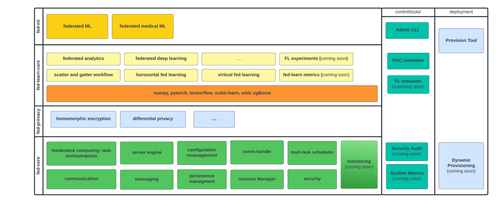

##########################
NVIDIA FLARE Architecture
##########################

**High-level Architecture**
===========================

From high level review, FLARE consists of three layers
   * fed-core
       fed-core is the foundation of federated computing framework. At this layer, there is no nothing of machine learning
       or federated learning. You can take this layers used for other federated computing
   * fed-control
        these are user command line interface that controls the overall compute or machine learning actions.
        It also includes different tools and simulators.
   * fed-learn
        fed-learn layer built on top of fed-core, define type of the workflow for machine learning training.
        these includes pre-defined algorithms FedAvg with scatter-and-gather (SAG) type of workflow. Set of
        predefined federated algorithms and examples can be found in this layer.

        Data Privacy is important for federated learning, user can enable/disable data privacy functions,
        choose different data privacy algorithms (such as Differential Privacy or Homomorphic encryption etc.)

        to help researcher to quickly experiments with different algorithms,
        we leverage simulator to simulate federated deployment, our first simulator is POC (prove of concept) tool.
        under POC mode, you can simulate the real deployment with different processes (server, clients, admin etc.).

        We are working on another lighter weight simulator (see our future releases)
        We are also working on machine learning experimentation monitoring tool integrations
