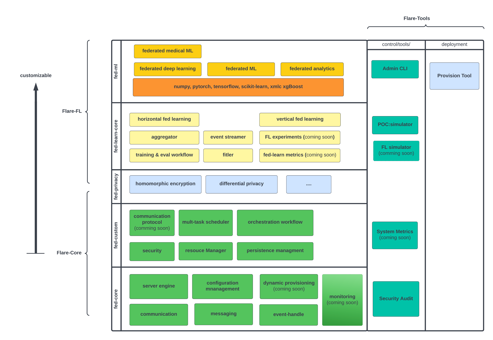

.. _system_architecture:

High Level Design and Architecture
==================================

At a high level, the FLARE architecture consists of two layers, Flare-core and Flare-FL.  Flare-core contains the base FLARE runtime, and Flare-FL builds on the base runtime with algorithms and workflows that can be used to build FLARE applications.

FLARE-core can be further divided into fed-core and fed-custom.

   * fed-core
       fed-core is the foundation of the federated computing framework, low level components that facilitate communication between the entities in the federation. At this layer, there is no notion of machine learning or federated learning. The components in fed-core can be used as building blocks for any collaborative computing workflow.
   * fed-custom
        fed-custom builds on fed-core to provide security, communication protocols, task scheduling, resource management, and workflow orchestration.  These components enable the deployment and orchestration of higher-level algorithms and workflows build with the components of Flare-FL.

FLARE-FL is the set of algorithms and workflows that are used to build a FLARE application, including components for privacy-perserving federated learning, common federated algorithms, and ML and DL workflows.

   * fed-privacy and fed-learn-core
        fed-privacy and fed-learn-core build on FLARE-core to provide algorithms for privacy preservation such as homomorphic encryption and differential privacy, along with pre-defined algorithms and aggregators used in federated learning.  These include pre-defined algorithms FedAvg with a scatter-and-gather (SAG) type workflow. The full set of predefined federated algorithms and examples can be found in this layer.
   * fed-ml
        fed-ml provides example ML, DL, and analytics workflows implemented in common libraries like numpy, PyTorch, or TensorFlow.  These workflows can be adapted for domain-specific applications.

Alongside FLARE-Core and FLARE-FL, tools for deployment and operation are provided in FLARE-Tools.  These components allow end-users and researchers to prototype, deploy, and manage FLARE algorithms and applications.

   * Provisioning Tool 
   * Admin CLI
   * POC mode
   * FLARE Simulator (coming soon)
   * Metrics
   * Security Audit
