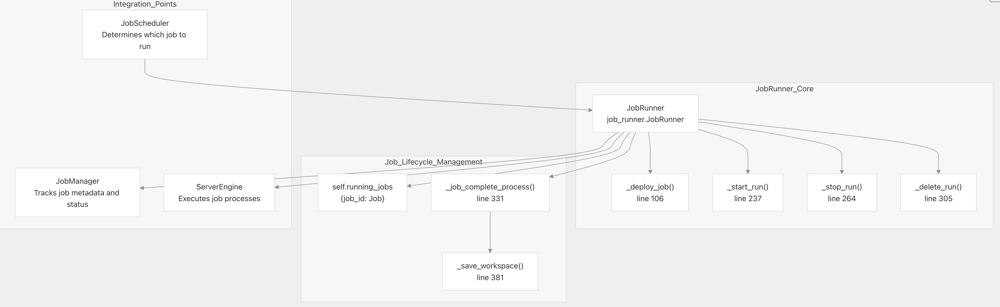

.. _flare_system_architecture:

NVIDIA FLARE System Architecture
=================================

.. |flare_overview| image:: resources/flare_overview.png
   :alt: FLARE Architecture Overview
   :width: 45%

.. |system_arch| image:: resources/system_architecture.png
   :alt: FLARE Job Processing Architecture
   :width: 45%

|flare_overview| |system_arch|

This document describes the overall system architecture of NVIDIA FLARE, including its layered structure, major subsystems,
and how they interact. It covers the runtime components on both server and client sides, the communication framework,
and the process model.

The FLARE architecture (shown above) comprises three main layers:

- **Foundation Layer** - Communication infrastructure, messaging protocols, privacy preservation tools, and secure platform management.
- **Application Layer** - Building blocks for federated learning, including federation workflows and learning algorithms.
- **Tooling** - FL Simulator and POC CLI for experimentation and simulation, plus deployment and management tools for production workflows.

Core Components and Code Structure
----------------------------------

Primary System Modules
######################

.. list-table:: **FLARE Core Components**
   :header-rows: 1
   :widths: 20 35 45

   * - Component
     - Primary Classes/Modules
     - Purpose
   * - FL Runtime
     - ServerEngine, ClientEngine, JobRunner
     - Core federated learning orchestration and execution
   * - Job Management
     - Job definition, storage, scheduling
   * - Communication
     - Cell, CoreCell, StreamCell, Pipe
     - Secure inter-party communication with streaming support
   * - Client Integration
     - ClientAPI (flare.receive(), flare.send()), LauncherExecutor
     - ML framework integration and external process management
   * - Administration
     - Dashboard and Programmatic and GUI-based system management
   * - Deployment
     - ProvisionerSpec, WorkspaceBuilder
     - Certificate generation, configuration, and secure deployment
   * - Workflows
     - ScatterAndGather, FedAvg, ModelController
     - Built-in federated learning algorithms and patterns

Process Responsibilities
#########################

**Server Parent (SP)**

- Runs FederatedServer 
- Manages client registration and heartbeat monitoring
- Houses ServerEngine which orchestrates job scheduling via JobRunner
- Spawns Server Job (SJ) processes or docker/pod for each active job for different job launcher.

**Server Job (SJ)**

- Runs ServerRunner 
- Executes workflow Controllers (e.g., ScatterAndGather)
- Broadcasts tasks to client jobs and aggregates results
- Separate process per job for isolation

**Client Parent (CP)**

- Runs FederatedClient 
- Manages client registration with server
- Houses ClientEngine which coordinates job execution
- Spawns Client Job (CJ) processes or docker/pod for each assigned job for different job launcher.

**Client Job (CJ)**

- Runs ClientRunner 
- Pulls tasks from server via Cell network
- Launches training processes using JobExecutor
- Routes task data to/from training process via Pipe

**Training Process**

- User's ML training script
- Uses Client API: flare.init(), flare.receive(), flare.send()
- Communicates with CJ via FilePipe (file-based) or CellPipe (network-based)

Communication Mechanisms
########################

**Cell Network**: All parent and job processes communicate via F3 Cell objects that provide:

- FQCN (Fully Qualified Cell Name) addressing (e.g., server.job_123)
- Channel-based routing (SERVER_MAIN, CLIENT_MAIN, AUX_COMMUNICATION)
- Secure, encrypted messaging with authentication
- Streaming support for large data transfers
  
**Pipe Abstraction**: CJ-to-training-process communication uses Pipe interface:

- FilePipe: File system-based IPC for same-machine processes
- CellPipe: Network-based IPC allowing training process on different machine

Deployment Modes
################

NVFLARE provides three deployment modes that share the same core runtime but differ in packaging, security, and deployment complexity. This design ensures consistency from development to production.

Deployment Modes Comparison
^^^^^^^^^^^^^^^^^^^^^^^^^^^

.. list-table:: Deployment Modes Comparison
   :header-rows: 1
   :widths: 15 30 15 20 20

   * - Mode
     - Use Case
     - Security
     - Processes
     - Setup Time
   * - Simulator
     - Rapid prototyping, algorithm testing
     - None
     - multiple threads, some cases if may create multiple process
     - Seconds
   * - POC
     - Local multi-client testing, workflow validation
     - Optional
     - Multiple processes on one machine
     - Minutes
   * - Production
     - Real-world deployment
     - Full PKI/TLS
     - Distributed processes across machines
     - Hours (with provisioning)

Core FL Runtime
---------------

The Core FL Runtime is the execution engine that manages federated learning job processes and orchestration.
This page documents the runtime components responsible for process lifecycle management, task coordination, and execution modes.

Scope and Components
####################

The Core FL Runtime consists of:

- **ServerEngine** : Server-side process orchestration and job lifecycle management
- **ClientEngine** : Client-side process management and communication handling
- **JobRunner** : Job scheduling, deployment, and monitoring
- **SimulatorRunner** : Single-machine simulation for development

 
Process Types
#############

.. list-table:: **Process Types**
   :header-rows: 1
   :widths: 20 35 45

   * - Process Type
     - Code Symbol
     - Description
   * - SP
     - ProcessType.SERVER_PARENT
     - Server parent process running ServerEngine
   * - SJ
     - ProcessType.SERVER_JOB
     - Server job process running ServerRunner
   * - CP
     - ProcessType.CLIENT_PARENT
     - Client parent process running ClientEngine
   * - CJ
     - ProcessType.CLIENT_JOB
     - Client job process running ClientRunner
  

Inter-Process Communication
###########################

The runtime uses Cell-based communication between parent and job processes.

Cell Communication Channels
^^^^^^^^^^^^^^^^^^^^^^^^^^^

.. list-table:: **Cell Communication Channels**
   :header-rows: 1
   :widths: 35 35 30

   * - Channel
     - Purpose
     - Used By
   * - CellChannel.SERVER_MAIN
     - Client-to-server FL messages
     - CP to SP
   * - CellChannel.CLIENT_MAIN
     - Server-to-client FL messages
     - SP to CP
   * - CellChannel.SERVER_COMMAND
     - Commands to server job
     - SP to SJ
   * - CellChannel.CLIENT_COMMAND
     - Commands to client job
     - CP to CJ
   * - CellChannel.SERVER_PARENT_LISTENER
     - Parent commands from SJ
     - SJ to SP
   * - CellChannel.AUX_COMMUNICATION
     - Auxiliary messages
     - All processes

JobRunner Architecture
######################

JobRunner Component Structure
^^^^^^^^^^^^^^^^^^^^^^^^^^^^^

Communication Framework
-----------------------

Purpose and Scope
#################

The Communication Framework, also known as F3 (FLARE Foundation Framework) and Cellnet, provides the foundational messaging infrastructure for all
communication in NVIDIA FLARE. It implements a secure, scalable, and feature-rich messaging layer that handles all
interactions between servers, clients, and administrative components.

This section provides an overview of the communication framework architecture, core components, and basic concepts. 

- **CellNet Architecture** - Detailed architecture and design patterns
- **Cell Communication Patterns** - Message sending patterns and channel routing
- **Streaming and Data Transfer** - Large data transfer and streaming protocols
- **Security and Encryption** - Certificate management and message encryption

for mode details please refer to cellnet architecture :ref:`cellnet_architecture`

