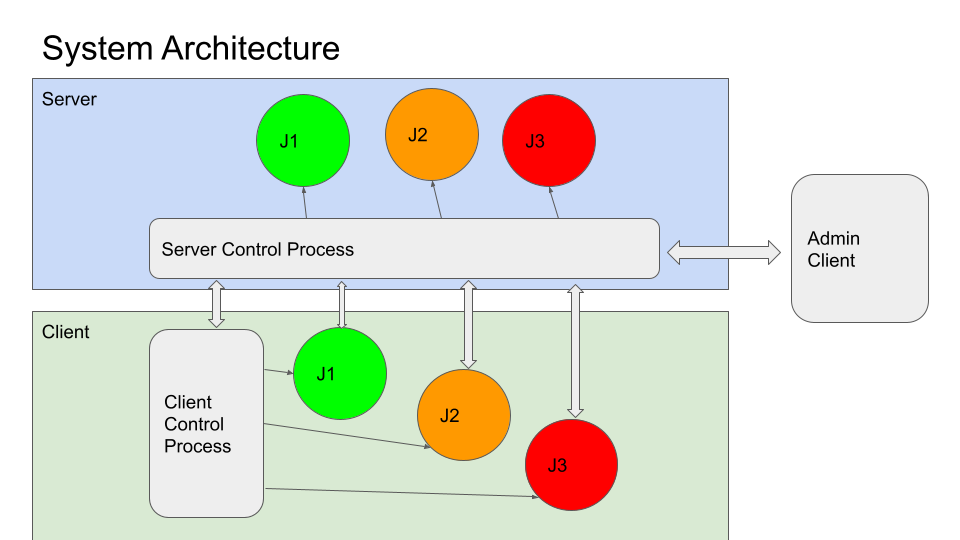

NVIDIA FLARE ARCHITECTURE
=========================

.. image:: resources/flare_overview.png
   :alt: FLARE Architecture Overview
   :align: center
   :height: 300px

The FLARE architecture (shown above) comprises three main layers:

**Foundation Layer**: Communication infrastructure, messaging protocols, privacy preservation tools, and secure platform management.
**Application Layer**: Building blocks for federated learning, including federation workflows and learning algorithms.
**Tooling**: FL Simulator and POC CLI for experimentation and simulation, plus deployment and management tools for production workflows.

Core Components and Code Structure
----------------------------------

Primary System Modules
######################

Here's the simplified table without file paths:

.. list-table:: **FLARE Core Components**
   :header-rows: 1
   :widths: 20 35 45

   * - Component
     - Primary Classes/Modules
     - Purpose
   * - FL Runtime
     - ServerEngine, ClientEngine, JobRunner
     - Core federated learning orchestration and execution
   * - Job Management
     - FedJob, JobDefManagerSpec, SimulatorRunner
     - Job definition, storage, scheduling, and simulation
   * - Communication
     - Cell, CoreCell, StreamCell, Pipe
     - Secure inter-party communication with streaming support
   * - Client Integration
     - ClientAPI (flare.receive(), flare.send()), LauncherExecutor
     - ML framework integration and external process management
   * - Administration
     - FLAdminAPI, AdminCommandModule, Dashboard
     - Programmatic and GUI-based system management
   * - Deployment
     - Lighter, ProvisionerSpec, WorkspaceBuilder
     - Certificate generation, configuration, and secure deployment
   * - Workflows
     - ScatterAndGather, FedAvg, ModelController
     - Built-in federated learning algorithms and patterns

Process Responsibilities
------------------------

**Server Parent (SP)**

- Runs FederatedServer 
- Manages client registration and heartbeat monitoring
Houses ServerEngine which orchestrates job scheduling via JobRunner
- Spawns Server Job (SJ) processes for each active job

**Server Job (SJ)**

- Runs ServerRunner 
- Executes workflow Controllers (e.g., ScatterAndGather)
- Broadcasts tasks to client jobs and aggregates results
- Separate process per job for isolation

**Client Parent (CP)**

- Runs FederatedClient 
- Manages client registration with server
- Houses ClientEngine which coordinates job execution
- Spawns Client Job (CJ) processes for each assigned job

**Client Job (CJ)**

- Runs ClientRunner 
- Pulls tasks from server via Cell network
- Launches training processes using JobExecutor
- Routes task data to/from training process via Pipe

**Training Process**

- User's ML training script
- Uses Client API: flare.init(), flare.receive(), flare.send() 
- nvflare/client/api.py
- Communicates with CJ via FilePipe (file-based) or CellPipe (network-based)

Communication Mechanisms
------------------------

**Cell Network**: All parent and job processes communicate via F3 Cell objects that provide:

- FQCN (Fully Qualified Cell Name) addressing (e.g., server.job_123)
- Channel-based routing (SERVER_MAIN, CLIENT_MAIN, AUX_COMMUNICATION)
- Secure, encrypted messaging with authentication
- Streaming support for large data transfers
  
**Pipe Abstraction**: CJ-to-training-process communication uses Pipe interface:

- FilePipe: File system-based IPC for same-machine processes 
- nvflare/app_opt/pt/file_pipe.py
- CellPipe: Network-based IPC allowing training process on different machine

Deployment Modes
NVFLARE provides three deployment modes that share the same core runtime but differ in packaging, security, and deployment complexity. This design ensures consistency from development to production.

Deployment Modes Comparison

Mode Characteristics
Mode	Use Case	Security	Processes	Setup Time
Simulator	Rapid prototyping, algorithm testing	None	Single process, threads	Seconds
POC	Local multi-client testing, workflow validation	Optional	Multiple processes on one machine	Minutes
Production	Real-world deployment	Full PKI/TLS	Distributed processes across machines	Hours (with provisioning)
Simulator Mode
Entry Point: SimulatorRunner class
nvflare/private/fed/app/simulator/simulator_runner.py
84-159
Usage: Run via Python script or nvflare simulator command
Architecture: Server in main process, clients in threads/subprocesses
Best For: Quick algorithm iteration, debugging workflows
POC Mode
Entry Point: nvflare poc commands
nvflare/tool/poc/poc_commands.py
Usage: nvflare poc prepare, nvflare poc start, nvflare poc stop
Architecture: Separate processes for server, clients, and admin console on single machine
Best For: Testing multi-client scenarios, validating job configurations
Production Mode
Entry Point: Dashboard provisioning or Lighter CLI
nvflare/lighter/provision.py
Usage: Generate startup kits with PKI certificates, deploy to distributed machines
Architecture: Fully distributed with secure TLS communication
Best For: Real-world federated learning deployments, multi-organization collaboration
All three modes execute the same ServerEngine, ClientEngine, and workflow implementations, ensuring behavior consistency across development stages.

Sources:
nvflare/private/fed/app/simulator/simulator_runner.py
84-311

nvflare/tool/poc/poc_commands.py

nvflare/lighter/provision.py

nvflare/dashboard/cli.py

docs/getting_started.rst
16-20

Key Installation and Dependencies
NVFLARE is distributed as a Python package with modular optional dependencies:

Core Installation
python -m pip install nvflare
Optional Component Groups
HE: Homomorphic Encryption (tenseal==0.3.15)
PSI: Private Set Intersection (openmined.psi==2.0.5)
PT: PyTorch support (torch, torchvision)
SKLEARN: Scikit-learn support (scikit-learn, pandas)
TRACKING: MLflow, Weights & Biases, TensorBoard support
MONITORING: Datadog monitoring support
CONFIG: OmegaConf configuration support
The platform requires Python 3.9+ and supports Linux and macOS operating systems.

Sources:
setup.cfg
18-84

docs/installation.rst
73-143

Entry Points and Command Interface
NVFLARE provides a unified command-line interface through the nvflare console script:

nvflare=nvflare.cli:main
This CLI system provides commands for:

POC mode setup and management (nvflare poc)
Job creation and submission (nvflare job)
Simulator execution
Dashboard operations
Provisioning and deployment
The CLI architecture supports extensible subcommands and integrates with all major system components.