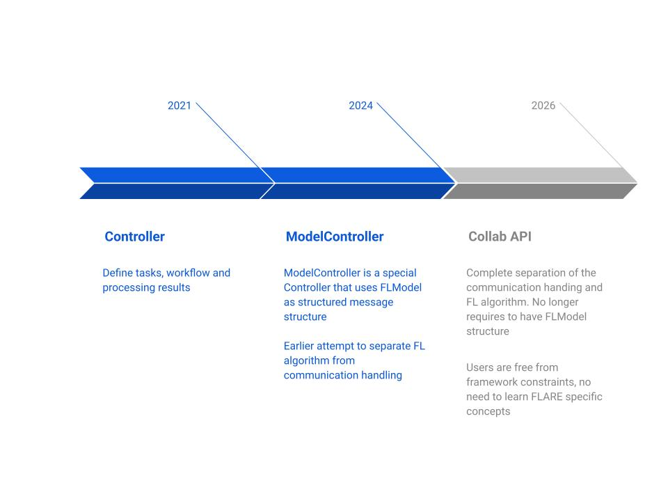
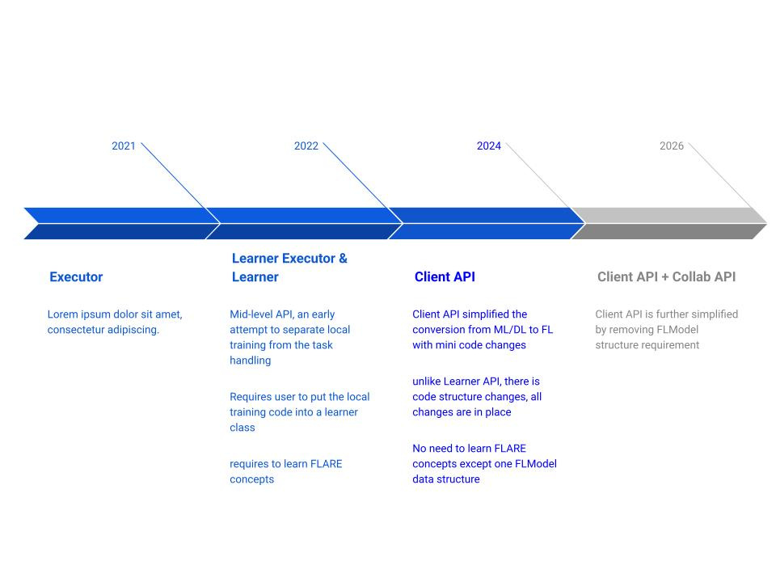
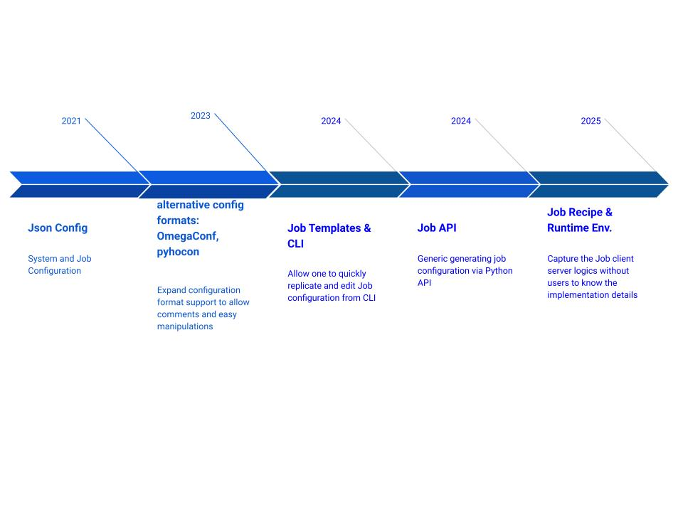

.. _diff_api_guide:

########################
How to Use FLARE APIs
########################

When getting started with NVIDIA FLARE, one of the first decisions new users face is choosing which APIs to use.
FLARE provides multiple API layers that have evolved over time to support different levels of abstraction—from
high-level, ready-to-use workflows for common federated learning and analytics tasks, to lower-level, highly
customizable APIs for advanced control over execution, orchestration, and security. These APIs are reflected
across different FLARE examples, which can sometimes be confusing for new users when deciding where to start.
This guide helps clarify the evolution of FLARE APIs and provides guidance on selecting the most appropriate
API for your use case and development goals.

The newer FLARE APIs—Client API, Job Recipe API, and Collab API (coming soon)—represent the latest stage in the
evolution of the platform. They are designed primarily for data scientists and researchers, providing a simplified
and intuitive interface that is sufficient for most common federated learning and federated analytics use cases.
In contrast, the Controller/Executor APIs operate at a lower level and are intended for system integration,
advanced customization, and platform-level extensions, where fine-grained control over execution flow, policies,
and orchestration is required.

Evolution of FLARE APIs
=======================

Before deciding which API layer to use, it helps to understand the available options.
The diagrams below provide an overview. For a detailed history, see :ref:`api_evolution`.

Server-side APIs
----------------

Client-side APIs
----------------

Client-Server Wiring APIs
-------------------------

Which APIs to Use?
==================

We recommend using the following APIs depending on your role:

Applied Data Scientists
-----------------------

For users focused on applying FL to their ML workflows with minimal complexity:

- **Client**: Client API
- **Server**: Built-in algorithm (FedAvg, FedProx, etc.)
- **Wiring**: Job Recipe with built-in FL algorithms

FL Researchers
--------------

For users developing new FL algorithms or customizing training logic:

- **Client**: Collab API, Client API
- **Server**: Collab API
- **Wiring**: Job Recipe

System Integrators
------------------

For users building custom integrations or extending the platform:

- **Client**: Collab API, Executor API
- **Server**: Collab API, Controller API
- **Wiring**: Job Recipe

Deprecated APIs
===============

The following APIs are deprecated and should be avoided in new projects:

- **LearnerExecutor and Learner**: Use Client API instead
- **ModelController**: Will be superseded by Collab API
- **Job Template & CLI Job Template API**: Use Job Recipe API instead

API References
==============

For detailed documentation on each API:

- :ref:`client_api` - Client-side API for ML code integration
- :ref:`job_recipe` - Programmatic job definition
- :ref:`api_evolution` - Complete API evolution history
- Collab API - Coming soon

