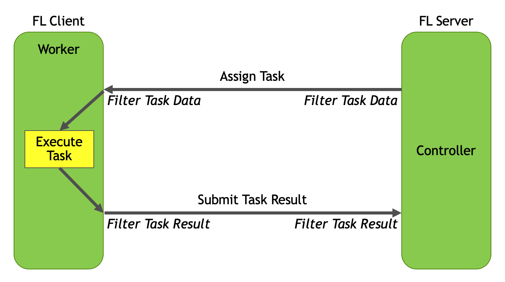

.. _programming_guide:

#################
Programming Guide
#################

The NVIDIA FLARE Controller and Worker APIs are used to implement the task-based interaction defined in an :ref:`user_guide/application:NVIDIA FLARE Application`.
In the application, the server configuration defines the components to be used in the controller workflow.
For example, the server configuration may define the aggregator used to accumulate client task data, a persistor used to
save models, and the shareable object used to exchange data.  The server configuration also defines the Controller
workflow, for example the :ref:`scatter_and_gather_workflow`, that leverages these components with a series of tasks
that are broadcast to the client participants for execution.

The client configuration defines the set of tasks that are available for execution in a client worker, along with the
path to the code that implements the task and any arguments required for executing the task.  There is not necessarily
a one-to-one mapping between the tasks assigned in the server controller workflow and the client configuration.  A
client may be configured to be capable of additional tasks or only a subset of the tasks in the global workflow.

The relationship between these components is shown in the previous diagram, where the server controller workflow defines
task assignments that are broadcast and executed on the client worker.  The results of the client task execution are
then returned to the server for aggregation.  As can be seen in the diagram, both on task assignment and task result
submission, filtering can be applied on both the server and client side.

NVIDIA FLARE is designed with a componentized architecture which allows users to bring customized components into the
framework.

This guide contains details on the key concepts, objects, and information you should know to implement your own components.

If you want to use your components in an FL application, you will need to change the config in the application folder.
Please refer to :ref:`user_guide/application:NVIDIA FLARE Application` for more details.

.. toctree::
   :maxdepth: 1

   programming_guide/controllers
   programming_guide/executor
   programming_guide/shareable
   programming_guide/data_exchange_object
   programming_guide/fl_context
   programming_guide/fl_component
   programming_guide/filters
   programming_guide/event_system
   programming_guide/provisioning_system
   programming_guide/high_availability
   programming_guide/system_architecture

Code Structure
==============

Different components can be built on top of the APIs(:mod:`nvflare.apis`) in NVIDIA FLARE core, and you can now
implement your own custom workflows. The concepts of aggregator, learnable, persistors, and shareable_generator which
were fixed in the workflow have been decoupled from the core of NVIDIA FLARE and moved to :mod:`nvflare.app_common`.
This is also the package containing the reference implementation of the :ref:`scatter_and_gather_workflow`, and all of
this can be used in your own workflow.

    - :mod:`nvflare.apis` - the generic class definitions
    - :mod:`nvflare.app_common` - higher level controllers, workflows, and algorithms
    - :mod:`nvflare.fuel` - supporting components of the provisioning and admin systems
    - :mod:`nvflare.ha` - overseer and overseer agent to support :ref:`high_availability`
    - :mod:`nvflare.lighter` - configuration, scripts, and Builders to support the provisioning tool
    - :mod:`nvflare.poc` - configurations for the poc tool
    - :mod:`nvflare.private` - low-level implementation of the platform and communication
    - :mod:`nvflare.security` - authorization policies
    - :mod:`nvflare.widgets` - widgets that extend base functionality in the aux communication channel
