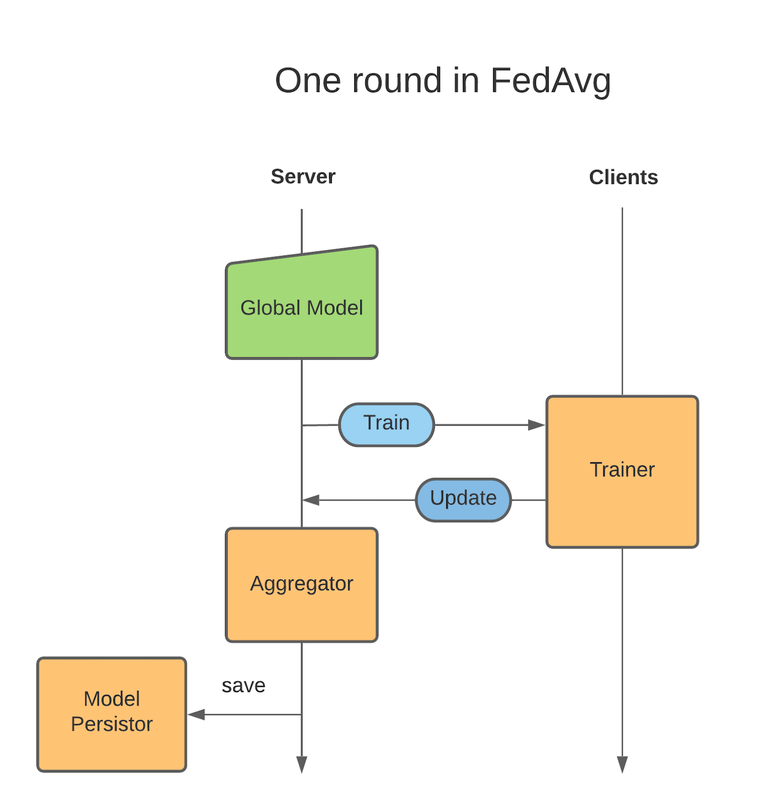

.. _scatter_and_gather_workflow:

Scatter and Gather Workflow
---------------------------
The federated scatter and gather workflow is an included reference implementation of the default workflow in previous versions
of NVIDIA FLARE, with a server aggregating results from clients that have produced shareable results from their trainer.

At the core, the control_flow of :class:`nvflare.app_common.workflows.scatter_and_gather.ScatterAndGather` is a for loop:

Trainer
^^^^^^^
A :class:`Trainer<nvflare.app_common.executors.trainer.Trainer>` is a type of :class:`Executor<nvflare.apis.executor.Executor>` in NVIDIA FLARE.

The ``execute()`` method needs to get the required information from the ``Shareable``,
use that in its training process, then returning the local training result as a ``Shareable``.

You will need to configure your own ``Trainer`` in config_fed_client.json.
Example FL configurations can be found in :ref:`application`.

Learnable
^^^^^^^^^
:class:`Learnable<nvflare.app_common.abstract.learnable.Learnable>` is the result of an FL application.
For example, in the deep learning scenario, it can be the model weights.
In the AutoML case, it can be the network architecture.

A :class:`LearnablePersistor<nvflare.app_common.abstract.learnable_persistor.LearnablePersistor>` defines how to load and save
and save a ``Learnable``. ``Learnable`` is a subset of the model file (which can contain other data like LR schedule)
which is to be learned, like the model weights.

.. _aggregator:

Aggregator
^^^^^^^^^^
:class:`Aggregator<nvflare.app_common.abstract.aggregator.Aggregator>` defines the aggregation algorithm to aggregate the ``Shareable``.
For example, a simple aggregator would be just average all the ``Shareable`` of the same round.

Below is the signature for an aggregator.

.. literalinclude:: ../../../nvflare/app_common/abstract/aggregator.py
    :language: python
    :lines: 22-

Example with Scatter and Gather Workflow
^^^^^^^^^^^^^^^^^^^^^^^^^^^^^^^^^^^^^^^^
See the :github_nvflare_link:`Hello Numpy Scatter and Gather Example <examples/hello-world/hello-numpy-sag>` for an example application with
the scatter and gather workflow.
