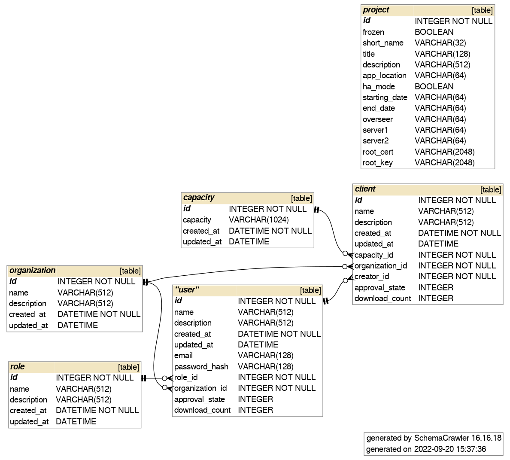

.. _dashboard_api:

#########################
Dashboard in NVIDIA FLARE
#########################

As mentioned in :ref:`provisioning`, the NVIDIA FLARE system requires a set of startup kits
that include private keys and certificates (signed by the root CA) for secure communication between components.
The :ref:`nvflare_dashboard_ui` in NVIDIA FLARE provides a streamlined way to collect information about clients and users from different organizations,
and to generate startup kits for users to download.

For detailed information about provisioning, refer to :ref:`provisioning`. This section focuses on user interaction with the Dashboard and its backend APIs.

.. include:: nvflare_cli/dashboard_command.rst

***********************************
NVIDIA FLARE Dashboard Backend APIs
***********************************

Architecture
============

The Dashboard backend APIs follow RESTful principles and define four main resources: Project, Organizations, Client, and User. There is exactly one Project per deployment,
which includes information about the server. Clients represent NVIDIA FLARE client instances, while Users represent NVIDIA FLARE admin console users.
The Organizations endpoint is a read-only operation that returns a list of currently registered organizations.

Details
=======

APIs
----

The following is the complete definition of the backend APIs, written in OpenAPI 3.0 syntax. Developers can implement these APIs in different programming languages or
create custom UIs while maintaining compatibility with the same API endpoints.

In NVIDIA FLARE 2.6, all API endpoints are prefixed with ``/nvflare-dashboard/api/v1/``. For example,
the login endpoint is ``/nvflare-dashboard/api/v1/login``.

.. literalinclude:: ../../nvflare/dashboard/dashboard.yaml
  :language: yaml

Authentication and Authorization
--------------------------------

Most backend APIs require user authentication to obtain a JWT for authorization. The JWT includes claims about the user's organization and role, and always
contains the user's email address (which serves as the user ID for login).

As shown in the previous section, only the following endpoints can be accessed without login credentials:

   - ``GET /project``
   - ``GET /users``
   - ``GET /organizations``

Users with the project_admin role have full access to all resources.

Project Freezing
----------------

Since the project configuration contains information required by clients and users, modifying project information after clients and users are created
can cause dependency issues. The project_admin must freeze the project after finalizing all project-related information to enable user sign-up.
Once frozen, the project cannot be unfrozen through the Dashboard web interface.

Database Schema
---------------

The following diagram illustrates the schema of the underlying database used by the backend APIs:

