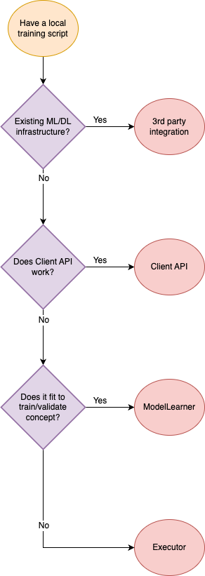

.. _execution_api_type:

#######################
From Local to Federated
#######################

In the FLARE system, a federated learning algorithm is defined in a Job format
(for details, please refer to :ref:`job`).

A Job consists of multiple "workflows" and "executors."

The simplified job execution flow is as follows:

- The workflow schedules a task for the FL clients.
- Each FL client performs the received task and sends the result back.
- The workflow receives the results and determines if it is done.
- If it is not done, it schedules a new task
- If it is done, it proceeds to the next workflow in the Job.

Users need to adapt their local training or computing logic into FLARE's task
execution abstractions to make their training or computing federated.

We offer various levels of abstraction for writing task execution code,
catering to use cases that span from complete customizability to easy user adaptation.

Execution API Type
==================

Below is a general overview of the key ideas and use cases for each type:

Client API
----------

The :ref:`client_api` provides the most straightforward way to write FL code,
and can easily be used to convert centralized code with minimal code changes.
The Client API uses the :class:`FLModel<nvflare.app_common.abstract.fl_model.FLModel>`
object for data transfer and supports common tasks such as train, validate, and submit_model.
Option for using PyTorch Lightning is also available.
For Client API executors, the in-process and external-process executors are provided for different use cases.

We recommend users start with the Client API, and to consider the other types
for more specific cases as required.

ModelLearner
------------

The :ref:`model_learner` is designed to simplify writing learning logic by
minimizing FLARE-specific concepts.
The :class:`ModelLearner<nvflare.app_common.abstract.model_learner.ModelLearner>`
defines familiar learning functions for training and validation,
and uses the :class:`FLModel<nvflare.app_common.abstract.fl_model.FLModel>`
object for transferring learning information.
The ModelLearner also contains several convenient capabilities,
such as lifecycle and logging information.

The ModelLearner is best used when working with standard machine learning code
that can fit well into the train and validate methods and can be easily adapted
to the ModelLearner subclass and method structure.

Executor
--------

:ref:`executor` is the most flexible for defining custom logic and tasks,
as with a custom executor and controller, any form of computation can be performed.
However, Executors must deal directly with FLARE-specific communication concepts
such as :class:`Shareable<nvflare.apis.shareable.Shareable>`, :class:`DXO<nvflare.apis.dxo.DXO>`,
and :class:`FLContext<nvflare.apis.fl_context.FLContext>`.
As a result, many higher-level APIs are built on top of Executors in order to
abstract these concepts away for easier user adaptation.

Overall, writing an Executor is most useful when implementing tasks and logic
that do not fit within the structure of higher-level APIs or other predefined Executors.

3rd-Party System Integration
----------------------------

There are cases where users have a pre-existing ML/DL training system
infrastructure that cannot be easily adapted to the FLARE client.

The :ref:`3rd_party_integration` pattern allows for a seamless integration
between the FLARE system and a third-party external training system.

With the use of the :mod:`FlareAgent <nvflare.client.flare_agent>` and
:mod:`TaskExchanger <nvflare.app_common.executors.task_exchanger>`,
users can easily enable any 3rd-party system to receive tasks and submit results back to the server.

Please use the following chart to decide which abstraction to use:

For more details about each type, refer to each page below.

.. toctree::
   :maxdepth: 1

   execution_api_type/3rd_party_integration
   execution_api_type/client_api
   execution_api_type/model_learner
   execution_api_type/executor
