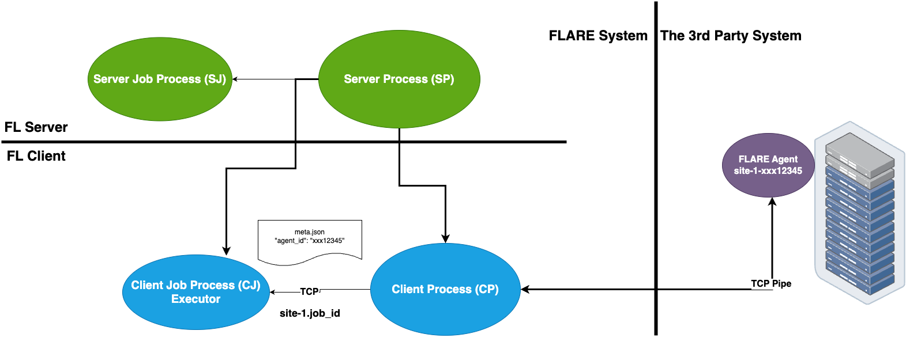

.. _3rd_party_integration:

############################
3rd-Party System Integration
############################

NVFLARE supports a seamless integration between the FLARE system and a
third-party external training system.
This is especially useful with pre-existing ML/DL training system
infrastructure that cannot be easily adapted to the FLARE client.

The FL Client uses the :class:`TaskExchanger<nvflare.app_common.executors.task_exchanger>`
executor to receive tasks, and submit results to the FLARE server.
The 3rd-party system uses the :class:`FlareAgent<nvflare.client.flare_agent>` to
interact with the TaskExchanger to get tasks and submit results.

This integration pattern is illustrated in the diagram below:

Requirements
============

- The key to enabling this integration is the "agent_id" that must be made known to both systems.
  The FL client gets this information from the job's config_fed_client, and the
  3rd-party trainer gets this from its own launch process.
- It is assumed that the customer already has a way to dynamically generate the
  "agent_id" for each job, and start its trainer process with this information.
- Each FL client must be able to open an address (host:port) to allow the trainer to connect to.
  Depending on where the trainer is running, the connection may or may not need to be in secure mode (TLS).
- We will need to modify the "project.yml" for NVFlare provision system
  and generate new package folders for each participating sites
- The trainer must be a Python program that can integrate with the NVFlare library.
- The trainer must be able to connect to the server, as well as the address that
  is dynamically opened by the FL client.

Prepare the Trainer
===================

Let's prepare the trainer code first, we will modify the "project.yml" in the
next section for project setup.

You need to modify your trainer code to integrate with the :class:`FlareAgent<nvflare.client.flare_agent>` API.
This API provides simple ``get_task()`` and ``submit_result()`` methods to interact with the FL client.

We will go through the steps one by one:

1. Create Agent
---------------

The :class:`FlareAgent<nvflare.client.flare_agent.FlareAgent>` is responsible
for interacting with the FL client to exchange task data.

If using FLModel, :class:`FlareAgentWithFLModel<nvflare.client.flare_agent_with_fl_model.FlareAgentWithFLModel>`
subclasses FlareAgent and provides conversion from shareables to task using the FLModel data structure.

If using CellPipe, a convenient class :class:`FlareAgentWithCellPipe<nvflare.client.flare_agent.FlareAgentWithCellPipe>`
can be used.

Please refer to their API page for detailed explanations of each argument:

  - :class:`FlareAgent<nvflare.client.flare_agent.FlareAgent>`
  - :class:`FlareAgentWithFLModel<nvflare.client.flare_agent_with_fl_model.FlareAgentWithFLModel>`
  - :class:`FlareAgentWithCellPipe<nvflare.client.flare_agent.FlareAgentWithCellPipe>`

You can create the FlareAgentWithCellPipe as the following code:

.. code-block:: python

    from nvflare.client.flare_agent import FlareAgentWithCellPipe

    agent = FlareAgentWithCellPipe(
        root_url="grpc://server:8002",
        site_name=args.site_name,
        agent_id=args.agent_id,
        workspace_dir=args.workspace,
        secure_mode=True,
        submit_result_timeout=2.0,
        heartbeat_timeout=120.0,
    )

2. Start Agent
--------------

After we create the agent, we need to start it.
We can call ``agent.start()`` to start the agent.
This call must be made before trying to get tasks.

For example:

.. code-block:: python

    agent.start()

3. Process Tasks
----------------

The training is a continuous process of getting a task, executing the task,
and submitting the task result.

Call ``agent.get_task()`` to get a Task object from the FL client.
This is a blocking call and returns only when a task is available.
If there are no more tasks available (i.e. end of the job), ``AgentClosed``
exception will be raised, and signaling to end the training.

The :class:`Task<nvflare.client.flare_agent.Task>` object contains 3 pieces of
information: task_name, task_id, and data.
The task_name tells you what the task is (e.g. train).
The task_id is a UUID of the task instance.
The data contains model data to be trained on.

Once the task is completed, the result can be submitted to the FL client by calling ``agent.submit_result()``.
A return code (``rc``) must be provided to indicate whether the task was executed successfully.
If the ``rc`` is not RC.OK, then the job will be aborted.

For example:

.. code-block:: python

    while True:
        print("getting task ...")
        try:
            task = agent.get_task()
        except AgentClosed:
            print("agent closed - exit")
            break

        print(f"got task: {task}")
        rc, meta, result = train(task.data) # perform train task
        submitted = agent.submit_result(TaskResult(data=result, meta=meta, return_code=rc))
        print(f"result submitted: {submitted}")

4. Stop Agent
-------------

At the end of the training, ``agent.stop()`` must be called to end the program gracefully.
If this call is missed, the program may not exit properly.

.. code-block:: python

    agent.stop()

5. Putting Together
-------------------

Now we learn all the necessary steps, we can put together into the following
example code of this usage pattern:

.. literalinclude:: ../../resources/3rd_party_trainer.py
    :language: python

Notes:

- This pattern of (``start``, ``get_task``, ``submit_result``, and ``stop``) is strictly enforced.
  If the pattern is not followed (e.g. ``get_task``, then ``get_task`` again without ``submit_result``),
  you will get a ``CallStateError`` exception.
- The only way to know that the job is ended is the ``AgentClosed`` exception from the ``get_task`` call.
  This exception is raised when the FL client tells the agent that the job is done;
  or when the FL client is considered dead (missing heartbeats for the configured period of time).
- If your training algorithm runs into an unrecoverable error and wants to end the job,
  you should use a proper return code (e.g. ``RC.EXECUTION_EXCEPTION``).

Project Setup
=============

After we prepare the trainer code we can follow the steps below to properly
set up the project and jobs.

Step One - Provision
--------------------

The FL client site will behave like both client and server for connecting from the perspective of the trainer.
This requires the client site to have two sets of TLS credentials.
Make sure to specify the "listening_host" for the client in the project.yml when provisioning the project.

.. note::
    We assume you understand NVFlare provision, if not please read :ref:`provisioning`.

An example looks like:

.. code-block:: yaml

  participants:
  # change example.com to the FQDN of the server
  - name: server
    type: server
    org: nvidia
    fed_learn_port: 8002
    admin_port: 8003
  - name: site_1
    type: client
    org: nvidia
    listening_host: localhost
  - name: site_2
    type: client
    org: nvidia
    listening_host: localhost

Once the project is provisioned, check the "startup" kit generated for the clients.
You should see the following files, among others:

client.crt, client.key, server.crt, server.key, rootCA.pem

Note that the specified listening_host of a site must be a hostname that
the external trainer can reach via network.

Step Two - Prepare Job Configuration
------------------------------------

For each job, configure the config_fed_client.json to use
:class:`TaskExchanger<nvflare.app_common.executors.task_exchanger>` as the executor.

.. code-block::

  {
    "format_version": 2,
    "executors": [
        {
          "tasks": [
            "train"
          ],
          "executor": {
            "path": "nvflare.app_common.executors.task_exchanger.TaskExchanger",
            "args": {
              "pipe_id": "pipe"
              "peer_read_timeout": 30,
              "heartbeat_timeout": 60
            }
          }
        }
      ],
    "task_result_filters": [],
    "task_data_filters": [],
    components =  [
      {
        id = "pipe"
        path = "nvflare.fuel.utils.pipe.cell_pipe.CellPipe"
        args {
          mode = "PASSIVE"
          site_name = "{SITE_NAME}"
          token = "{SITE_NAME}"
          root_url = "{ROOT_URL}"
          secure_mode = "{SECURE_MODE}"
          workspace_dir = "{WORKSPACE}"
        }
      }
    ]
  }

Make sure the parameters of the :class:`TaskExchanger<nvflare.app_common.executors.task_exchanger>`
are configured properly, and change the default values as needed.

Please refer to the API page for a detailed explanation of each argument:
:class:`TaskExchanger<nvflare.app_common.executors.task_exchanger>`

Step Three - Trainer Setup
--------------------------

For each client site, you will have an FL client and a trainer process.

To make our integration work, please follow the following steps to
setup the trainer process on each client site:

    - Make sure the trainer process has access to a local file system.
    - Create a "workspace" folder that is going to be used by this trainer process
      This workspace will be used for all jobs.
    - Copy the "startup" folder of the client site to this "workspace" folder
      If needed, any additional config files required by the trainer can also
      be placed in this "workspace" folder.
    - Create the trainer script following the steps in the above section.
      Please set the FlareAgentWithCellPipe's "workspace_dir" to the path of
      this "workspace" folder that you just created.
      Please make sure the "agent_id" value of FlareAgentWithCellPipe is the same
      as the "token" value in the above

Verification
============

The FL client (TaskExchanger) and your trainer process (FlareAgentWithCellPipe)
do not have to be started at exactly the same time.

Whichever is started first will wait for the other for ``heartbeat_timeout`` seconds.
Once they both are started and connected, you can verify they are directly
connected using the Admin console's ``cells`` commands.

The following example shows two clients (site-1, site-2) connected to their
external trainers via the agent_id/token "ext_trainer":

.. code-block:: shell

  > cells
  server
  server.10d1d3b7-fb50-4c83-9575-e510f32c5d21
  site-1
  site-1.10d1d3b7-fb50-4c83-9575-e510f32c5d21
  site-2
  site-2.10d1d3b7-fb50-4c83-9575-e510f32c5d21
  site-1_ext_trainer_active
  site-2_ext_trainer_active
  site-2_ext_trainer_passive
  site-1_ext_trainer_passive
  Total Cells: 10

The ``cells`` command lists all cells.

Notice that the job ``10d1d3b7-fb50-4c83-9575-e510f32c5d21`` is running on both
"site-1" and "site-2" clients.

Also notice that there are two pairs of corresponding cells
(site-1_ext_trainer_active, site-1_ext_trainer_passive)
and ((site-2_ext_trainer_active, site-2_ext_trainer_passive)).

Optional - Setup for Adhoc Direct Connection between FL Client and Trainer
==========================================================================

FL client and the trainer can always talk to each other via the server,
but it could be slow, especially if the server is located far away.
The enable adhoc direct connections between the FL client and the trainer,
configure the comm_config.json on the client site as follows:

.. code-block:: json

  {
    "allow_adhoc_conns": true,
    "use_aio_grpc": true,
    "adhoc": {
      "scheme": "tcp",
      "resources": {
        "host": "localhost",
        "secure": true
      }
    }
  }

This file must be placed into the site's "local" folder within its workspace.

Pay attention to the following:

- For most cases, the "scheme" should be set to "tcp" to get the best performance.
  If "tcp" cannot be used, you can use "grpc".
- In "resources":

  - If FL client and the trainer are within the same trusted network,
    you can set "secure" to false; otherwise set it to true.
  - The value of the "host" must match the "listening_host" value of the site used in provision.
