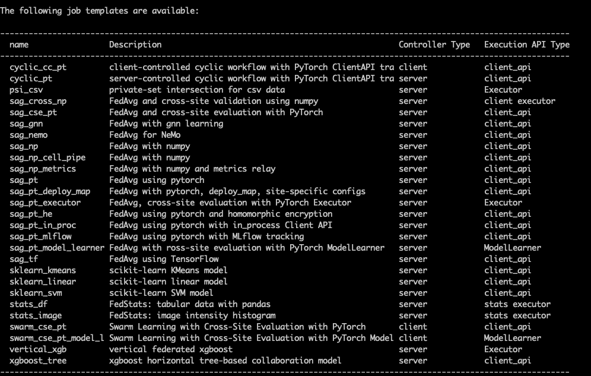

.. _client_api:

##########
Client API
##########

The FLARE Client API provides an easy way for users to convert their centralized,
local training code into federated learning code with the following benefits:

* Only requires a few lines of code changes, without the need to restructure the code or implement a new class
* Reduces the number of new FLARE specific concepts exposed to users
* Easy adaptation from existing local training code using different frameworks
  (PyTorch, PyTorch Lightning, HuggingFace)

Core concept
============

The general structure of the popular federated learning (FL) workflow, "FedAvg" is as follows:

#. FL server initializes an initial model
#. For each round (global iteration):

   #. FL server sends the global model to clients
   #. Each FL client starts with this global model and trains on their own data
   #. Each FL client sends back their trained model
   #. FL server aggregates all the models and produces a new global model

On the client side, the training workflow is as follows:

#. Receive the model from the FL server
#. Perform local training on the received global model and/or evaluate the
   received global model for model selection
#. Send the new model back to the FL server

To convert a centralized training code to federated learning, we need to
adapt the code to do the following steps:

#. Obtain the required information from received :ref:`fl_model`
#. Run local training
#. Put the results in a new :ref:`fl_model` to be sent back

For a general use case, there are three essential methods for the Client API:

* ``init()``: Initializes NVFlare Client API environment.
* ``receive()``: Receives model from NVFlare side.
* ``send()``: Sends the model to NVFlare side.

Users can use the Client API to change their centralized training code to
federated learning, for example:

.. code-block:: python

    import nvflare.client as flare

    flare.init() # 1. Initializes NVFlare Client API environment.
    input_model = flare.receive() # 2. Receives model from NVFlare side.
    params = input_model.params # 3. Obtain the required information from received FLModel

    # original local training code begins
    new_params = local_train(params)
    # original local training code ends

    output_model = flare.FLModel(params=new_params) # 4. Put the results in a new FLModel
    flare.send(output_model) # 5. Sends the model to NVFlare side.

With 5 lines of code changes, we convert the centralized training code to
federated learning setting.

After this, we can utilize the job templates and the :ref:`job_cli`
to generate a job so it can be run using :ref:`fl_simulator`
or submit to a deployed NVFlare system.

Below is a table overview of key Client APIs.

.. list-table:: Client API
   :widths: 25 25 50
   :header-rows: 1

   * - API
     - Description
     - API Doc Link
   * - init
     - Initializes NVFlare Client API environment.
     - :func:`init<nvflare.client.api.init>`
   * - receive
     - Receives model from NVFlare side.
     - :func:`receive<nvflare.client.api.receive>`
   * - send
     - Sends the model to NVFlare side.
     - :func:`send<nvflare.client.api.send>`
   * - system_info
     - Gets NVFlare system information.
     - :func:`system_info<nvflare.client.api.system_info>`
   * - get_job_id
     - Gets job id.
     - :func:`get_job_id<nvflare.client.api.get_job_id>`
   * - get_site_name
     - Gets site name.
     - :func:`get_site_name<nvflare.client.api.get_site_name>`
   * - is_running
     - Returns whether the NVFlare system is up and running.
     - :func:`is_running<nvflare.client.api.is_running>`
   * - is_train
     - Returns whether the current task is a training task.
     - :func:`is_train<nvflare.client.api.is_train>`
   * - is_evaluate
     - Returns whether the current task is an evaluate task.
     - :func:`is_evaluate<nvflare.client.api.is_evaluate>`
   * - is_submit_model
     - Returns whether the current task is a submit_model task.
     - :func:`is_submit_model<nvflare.client.api.is_submit_model>`

.. list-table:: Lightning APIs
   :widths: 25 25 50
   :header-rows: 1

   * - API
     - Description
     - API Doc Link
   * - patch
     - Patches the PyTorch Lightning Trainer for usage with FLARE.
     - :func:`patch<nvflare.app_opt.lightning.api.patch>`

.. list-table:: Metrics Logger
   :widths: 25 25 50
   :header-rows: 1

   * - API
     - Description
     - API Doc Link
   * - SummaryWriter
     - SummaryWriter mimics the usage of Tensorboard's SummaryWriter.
     - :class:`SummaryWriter<nvflare.client.tracking.SummaryWriter>`
   * - WandBWriter
     - WandBWriter mimics the usage of weights and biases.
     - :class:`WandBWriter<nvflare.client.tracking.WandBWriter>`
   * - MLflowWriter
     - MLflowWriter mimics the usage of MLflow.
     - :class:`MLflowWriter<nvflare.client.tracking.MLflowWriter>`

Please check Client API Module :mod:`nvflare.client.api` for more in-depth
information about all of the Client API functionalities.

If you are using PyTorch Lightning in your training code, you can check the
Lightning API Module :mod:`nvflare.app_opt.lightning.api`.

.. note::
  The decorator API has been deprecated since release 2.5.0.
  Please use the Client API instead.

Client API communication patterns
=================================

.. image:: ../../resources/client_api.png
    :height: 300px

We offer various implementations of Client APIs tailored to different scenarios, each linked with distinct communication patterns.

In-process Client API
---------------------

The in-process executor entails both the training script and client executor operating within the same process.
The training script will be launched once at the event of START_RUN and will keep on running till the END_RUN event.
Communication between them occurs through an efficient in-memory databus.

When the training process involves either a single GPU or no GPUs, and the training script doesn't integrate third-party
training systems, the in-process executor is preferable (when available).

Sub-process Client API
----------------------

On the other hand, the LauncherExecutor employs the SubprocessLauncher to use a sub-process to execute the training script. This results in the client executor
and training script residing in separate processes. The "launch_once" option is provided to the SubprocessLauncher to control
whether to launch the external script everytime when getting the task from server, or just launch the script once at the event
of START_RUN and keeps running till the END_RUN event. Communication between them is facilitated by either CellPipe
(default) or FilePipe.

For scenarios involving multi-GPU training or the utilization of external training infrastructure, opting for the Launcher executor might be more suitable.

Choice of different Pipes
=========================
In the 2.5.x release, for most users, we recommend utilizing the default setting with the in-process executor
(defaulting to memory-based data exchanges).
Conversely, in the 2.4.x release, we suggest using the default setting with CellPipe for most users.

CellPipe facilitates TCP-based cell-to-cell connections between the Executor and training script processes on
the local host. The term cell represents logical endpoints. This communication enables the exchange of models, metrics,
and metadata between the two processes.

In contrast, FilePipe offers file-based communication between the Executor and training script processes,
utilizing a job-specific file directory for exchanging models and metadata via files. While FilePipe is easier to set up
than CellPipe, it's not suitable for high-frequency metrics exchange.

Configuration
=============

Different configurations are available for each type of executor.

in-process executor configuration
---------------------------------
This configuration specifically caters to PyTorch applications, providing serialization and deserialization
(aka Decomposers) for commonly used PyTorch objects. For non-PyTorch applications, the generic
:class:`InProcessClientAPIExecutor<nvflare.app_common.executors.in_process_client_api_executor.InProcessClientAPIExecutor>` can be employed.

.. literalinclude:: ../../../job_templates/sag_pt_in_proc/config_fed_client.conf

subprocess launcher Executor configuration
------------------------------------------
In the config_fed_client in the FLARE app, in order to launch the training script we use the
:class:`SubprocessLauncher<nvflare.app_common.launchers.subprocess_launcher.SubprocessLauncher>` component.
The defined ``script`` is invoked, and ``launch_once`` can be set to either
launch once for the whole job (launch_once = True), or launch a process for each task received from the server (launch_once = False)

``launch_once`` dictates how many times the training scripts are invoked during the overall training process.
When set to False, the executor essentially invokes ``python <training scripts>.py`` every round of training.
Typically, launch_once is set to True.

A corresponding :class:`ClientAPILauncherExecutor<nvflare.app_common.executors.client_api_launcher_executor.ClientAPILauncherExecutor>`
is used as the executor to handle the tasks and perform the data exchange using the pipe.
For the Pipe component we provide implementations of :class:`FilePipe<nvflare.fuel.utils.pipe.file_pipe>`
and :class:`CellPipe<nvflare.fuel.utils.pipe.cell_pipe>`.

.. literalinclude:: ../../../job_templates/sag_pt/config_fed_client.conf

For example configurations, take a look at the :github_nvflare_link:`job_templates <job_templates>`
directory for templates using the launcher and Client API.

.. note::
   In that case that the user does not need to launch the process and instead
   has their own existing external training system, this would involve using
   the :ref:`3rd_party_integration`, which is based on the same underlying mechanisms.

Examples
========

For examples of using Client API with different frameworks,
please refer to :github_nvflare_link:`examples/hello-world/ml-to-fl <examples/hello-world/ml-to-fl>`.

For additional examples, also take a look at the
:github_nvflare_link:`step-by-step series <examples/hello-world/step-by-step>`
that use Client API to write the
:github_nvflare_link:`train script <examples/hello-world/step-by-step/cifar10/code/fl/train.py>`.

Selection of Job Templates
==========================
To help users quickly set up job configurations, we have created numerous job templates. You can select a job template that closely matches
your use case and adapt it to your needs by modifying the necessary variables.

Using the command ``nvflare job list_templates``, you can find all the job templates provided by NVFlare.

looking at the ``Execution API Type``, you will find ``client_api``. This indicates that the specified job template will use the Client API
configuration.  You can further nail down the selection by choice of machine learning framework: pytorch or sklearn or xgboost,
in-process or not, type of models ( GNN, NeMo LLM), workflow patterns ( Swarm learning or standard fedavg with scatter and gather (sag)) etc.

Custom Data Class Serialization/Deserialization
===============================================

To pass data in the form of a custom class, you can leverage the serialization tool inside NVFlare.

For example:

.. code-block:: python

    class CustomClass:
    def __init__(self, x, y):
        self.x = 1
        self.y = 2

If your code uses classes derived from ``Enum`` or dataclasses, they will be handled by the default decomposers.
For other custom classes, you will need to write a dedicated custom decomposer and ensure it is registered
using fobs.register on both the server side and client side, as well as in train.py.

Please note that for the custom data class to work, it must be placed in a separate file from train.py.

For more details on serialization, please refer to :ref:`serialization`.
