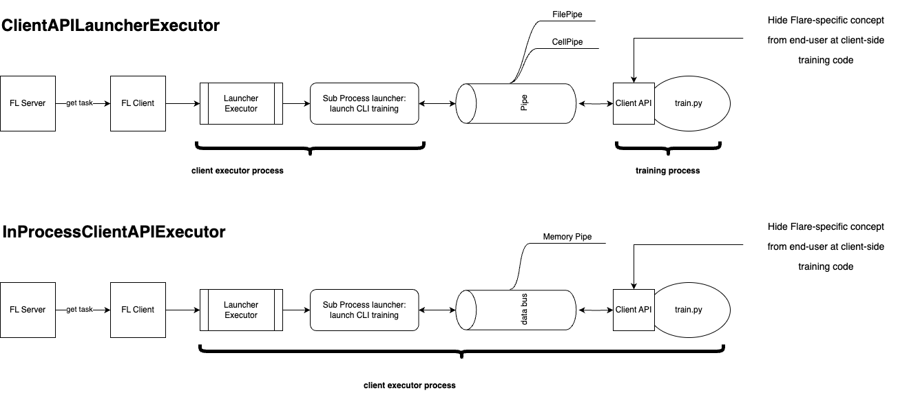

.. _client_api:

##########
Client API
##########

.. note::
   **Quick Start:** If you're new to FLARE and want a quick practical guide, see :ref:`client_api_usage` in the User Guide.
   This page provides in-depth technical details for researchers and developers.

The FLARE Client API provides an easy way for users to convert their centralized,
local training code into federated learning code with the following benefits:

* Only requires a few lines of code changes, without the need to restructure the code or implement a new class
* Reduces the number of new FLARE specific concepts exposed to users
* Easy adaptation from existing local training code using different frameworks
  (PyTorch, PyTorch Lightning, HuggingFace)

Core concept
============

The general structure of the popular federated learning (FL) workflow, "FedAvg" is as follows:

#. FL server initializes an initial model
#. For each round (global iteration):

   #. FL server sends the global model to clients
   #. Each FL client starts with this global model and trains on their own data
   #. Each FL client sends back their trained model
   #. FL server aggregates all the models and produces a new global model

On the client side, the training workflow is as follows:

#. Receive the model from the FL server
#. Perform local training on the received global model and/or evaluate the
   received global model for model selection
#. Send the new model back to the FL server

To convert a centralized training code to federated learning, we need to
adapt the code to do the following steps:

#. Obtain the required information from received :ref:`fl_model`
#. Run local training
#. Put the results in a new :ref:`fl_model` to be sent back

For a general use case, there are three essential methods for the Client API:

* ``init()``: Initializes NVFlare Client API environment.
* ``receive()``: Receives model from NVFlare side.
* ``send()``: Sends the model to NVFlare side.

Users can use the Client API to change their centralized training code to
federated learning, for example:

.. code-block:: python

    import nvflare.client as flare

    flare.init() # 1. Initializes NVFlare Client API environment.
    input_model = flare.receive() # 2. Receives model from NVFlare side.
    params = input_model.params # 3. Obtain the required information from received FLModel

    # original local training code begins
    new_params = local_train(params)
    # original local training code ends

    output_model = flare.FLModel(params=new_params) # 4. Put the results in a new FLModel
    flare.send(output_model) # 5. Sends the model to NVFlare side.

With 5 lines of code changes, we convert the centralized training code to
federated learning setting.

After this, we can utilize the Job Recipe to define and run the federated learning job. See :ref:`job_recipe` for details.

Understanding the Client API and Job Recipe Relationship
=========================================================

The Client API and Job Recipe API serve different purposes in the federated learning workflow:

* **Client API** (``nvflare.client``) - Used in your training script (``client.py``) to:

  * Receive models from the FL server
  * Send updated models back to the server
  * Access FL system information (job ID, site name, etc.)
  * Determine task types (training, evaluation, etc.)

* **Job Recipe API** (``nvflare.recipe``) - Used in your job definition (``job.py``) to:

  * Define the FL workflow (e.g., FedAvg, Cyclic, Swarm Learning)
  * Specify job parameters (number of clients, rounds, model, etc.)
  * Configure execution environment (Simulation, POC, Production)
  * Add features like experiment tracking, cross-site evaluation, etc.

Complete Working Example
=========================

Here's a complete example showing how Client API and Job Recipe work together:

**Project Structure:**

.. code-block:: none

    my-fl-project/
    ├── job.py              # Job definition (Job Recipe API)
    ├── client.py           # Training script (Client API)
    ├── model.py            # Model definition (optional)
    └── requirements.txt    # Dependencies

**Step 1: Define your training script using Client API** (``client.py``):

.. code-block:: python

    import nvflare.client as flare
    import torch
    from model import Net

    def train(net, train_loader, device):
        # Your existing training code
        net.train()
        for data, target in train_loader:
            # ... training logic ...
        return net

    def evaluate(net, test_loader, device):
        # Your existing evaluation code
        net.eval()
        accuracy = 0.0
        # ... evaluation logic ...
        return accuracy

    def load_data():
        # Your data loading logic here
        # This should return training and test data loaders
        from torchvision import datasets, transforms
        from torch.utils.data import DataLoader

        transform = transforms.Compose([
            transforms.ToTensor(),
            transforms.Normalize((0.5,), (0.5,))
        ])
        train_dataset = datasets.MNIST('./data', train=True, download=True, transform=transform)
        test_dataset = datasets.MNIST('./data', train=False, transform=transform)
        train_loader = DataLoader(train_dataset, batch_size=64, shuffle=True)
        test_loader = DataLoader(test_dataset, batch_size=64, shuffle=False)
        return train_loader, test_loader

    def main():
        # Initialize Client API
        flare.init()

        # Setup
        device = torch.device("cuda" if torch.cuda.is_available() else "cpu")
        net = Net().to(device)
        train_loader, test_loader = load_data()

        # Federated Learning Loop
        while flare.is_running():
            # Receive global model from server
            input_model = flare.receive()

            # Load received weights
            net.load_state_dict(input_model.params)

            # Local training
            net = train(net, train_loader, device)

            # Evaluation
            accuracy = evaluate(net, test_loader, device)

            # Send updated model back to server
            output_model = flare.FLModel(
                params=net.state_dict(),
                metrics={"accuracy": accuracy}
            )
            flare.send(output_model)

    if __name__ == "__main__":
        main()

**Step 2: Define your FL job using Job Recipe** (``job.py``):

.. code-block:: python

    import argparse
    from model import Net
    from nvflare.app_opt.pt.recipes.fedavg import FedAvgRecipe
    from nvflare.recipe import SimEnv, add_experiment_tracking

    def main():
        parser = argparse.ArgumentParser()
        parser.add_argument("--n_clients", type=int, default=2)
        parser.add_argument("--num_rounds", type=int, default=5)
        parser.add_argument("--batch_size", type=int, default=32)
        args = parser.parse_args()

        # Create the FL job using Recipe API
        recipe = FedAvgRecipe(
            name="my-pytorch-job",
            min_clients=args.n_clients,
            num_rounds=args.num_rounds,
            initial_model=Net(),
            train_script="client.py",
            train_args=f"--batch_size {args.batch_size}",
        )

        # Optional: Add experiment tracking
        add_experiment_tracking(recipe, tracking_type="tensorboard")

        # Execute in simulation environment
        env = SimEnv(num_clients=args.n_clients)
        run = recipe.execute(env)

        print(f"Job completed with status: {run.get_status()}")
        print(f"Results saved to: {run.get_result()}")

    if __name__ == "__main__":
        main()

**Step 3: Run your FL job:**

.. code-block:: bash

    # Run with default parameters
    python job.py

    # Run with custom parameters
    python job.py --n_clients 5 --num_rounds 10 --batch_size 64

The same job can run in different environments by changing the environment:

.. code-block:: python

    # Simulation (single process, fast for debugging)
    from nvflare.recipe import SimEnv
    env = SimEnv(num_clients=2)

    # POC (multi-process, closer to production)
    from nvflare.recipe import PocEnv
    env = PocEnv(num_clients=2)

    # Production (distributed deployment)
    from nvflare.recipe import ProdEnv
    env = ProdEnv(startup_kit_location="/path/to/admin/startup")

Key Benefits of This Approach
==============================

1. **Separation of Concerns**: Training logic (Client API) is separate from job configuration (Job Recipe)
2. **Minimal Code Changes**: Convert centralized training to FL with just a few lines
3. **Environment Flexibility**: Same code works in simulation, POC, and production
4. **Easy Experimentation**: Change FL parameters without modifying training code
5. **Built-in Features**: Add tracking, cross-site evaluation, etc. with single function calls

Client API Reference
====================

Below is a table overview of key Client APIs.

.. list-table:: Client API
   :widths: 25 25 50
   :header-rows: 1

   * - API
     - Description
     - API Doc Link
   * - init
     - Initializes NVFlare Client API environment.
     - :func:`init<nvflare.client.api.init>`
   * - receive
     - Receives model from NVFlare side.
     - :func:`receive<nvflare.client.api.receive>`
   * - send
     - Sends the model to NVFlare side.
     - :func:`send<nvflare.client.api.send>`
   * - system_info
     - Gets NVFlare system information.
     - :func:`system_info<nvflare.client.api.system_info>`
   * - get_job_id
     - Gets job id.
     - :func:`get_job_id<nvflare.client.api.get_job_id>`
   * - get_site_name
     - Gets site name.
     - :func:`get_site_name<nvflare.client.api.get_site_name>`
   * - is_running
     - Returns whether the NVFlare system is up and running.
     - :func:`is_running<nvflare.client.api.is_running>`
   * - is_train
     - Returns whether the current task is a training task.
     - :func:`is_train<nvflare.client.api.is_train>`
   * - is_evaluate
     - Returns whether the current task is an evaluate task.
     - :func:`is_evaluate<nvflare.client.api.is_evaluate>`
   * - is_submit_model
     - Returns whether the current task is a submit_model task.
     - :func:`is_submit_model<nvflare.client.api.is_submit_model>`

.. list-table:: Lightning APIs
   :widths: 25 25 50
   :header-rows: 1

   * - API
     - Description
     - API Doc Link
   * - patch
     - Patches the PyTorch Lightning Trainer for usage with FLARE.
     - :func:`patch<nvflare.app_opt.lightning.api.patch>`

.. list-table:: Metrics Logger
   :widths: 25 25 50
   :header-rows: 1

   * - API
     - Description
     - API Doc Link
   * - SummaryWriter
     - SummaryWriter mimics the usage of Tensorboard's SummaryWriter.
     - :class:`SummaryWriter<nvflare.client.tracking.SummaryWriter>`
   * - WandBWriter
     - WandBWriter mimics the usage of weights and biases.
     - :class:`WandBWriter<nvflare.client.tracking.WandBWriter>`
   * - MLflowWriter
     - MLflowWriter mimics the usage of MLflow.
     - :class:`MLflowWriter<nvflare.client.tracking.MLflowWriter>`

When to Use Client API
======================

The Client API is the **recommended starting point** for most users, especially when:

* You have existing centralized training code
* You want minimal code changes to enable FL
* You're using common frameworks (PyTorch, TensorFlow, NumPy, etc.)
* You need quick experimentation and prototyping
* You prefer a simple, intuitive API

**When to consider alternatives:**

* **ModelLearner API**: If you need more control over the learning lifecycle
* **Executor API**: If you need full customization of task handling
* **3rd-Party Integration**: If integrating with external training systems

For more information on alternative APIs, see :ref:`execution_api_type`.

Additional Resources
====================

**API Documentation:**

* Client API Module: :mod:`nvflare.client.api` - Complete API reference
* PyTorch Lightning API: :mod:`nvflare.app_opt.lightning.api` - Lightning-specific integration
* Job Recipe Guide: :ref:`job_recipe` - How to define and run FL jobs

**Guides:**

* :ref:`client_api_usage` - User guide with more examples
* :ref:`job_recipe` - Job Recipe tutorial
* :ref:`fl_simulator` - Simulation environment details

Client API communication patterns
=================================

We offer various implementations of Client APIs tailored to different scenarios, each linked with distinct communication patterns.

In-process Client API
---------------------

The in-process executor entails both the training script and client executor operating within the same process.
The training script will be launched once at the event of START_RUN and will keep on running till the END_RUN event.
Communication between them occurs through an efficient in-memory databus.

When the training process involves either a single GPU or no GPUs, and the training script doesn't integrate third-party
training systems, the in-process executor is preferable (when available).

Sub-process Client API
----------------------

On the other hand, the LauncherExecutor employs the SubprocessLauncher to use a sub-process to execute the training script. This results in the client executor
and training script residing in separate processes. The "launch_once" option is provided to the SubprocessLauncher to control
whether to launch the external script everytime when getting the task from server, or just launch the script once at the event
of START_RUN and keeps running till the END_RUN event. Communication between them is facilitated by either CellPipe
(default) or FilePipe.

For scenarios involving multi-GPU training or the utilization of external training infrastructure, opting for the Launcher executor might be more suitable.

Choice of different Pipes
=========================
In the 2.5.x release, for most users, we recommend utilizing the default setting with the in-process executor
(defaulting to memory-based data exchanges).
Conversely, in the 2.4.x release, we suggest using the default setting with CellPipe for most users.

CellPipe facilitates TCP-based cell-to-cell connections between the Executor and training script processes on
the local host. The term cell represents logical endpoints. This communication enables the exchange of models, metrics,
and metadata between the two processes.

In contrast, FilePipe offers file-based communication between the Executor and training script processes,
utilizing a job-specific file directory for exchanging models and metadata via files. While FilePipe is easier to set up
than CellPipe, it's not suitable for high-frequency metrics exchange.

Examples
========

For complete working examples of using Client API with Job Recipes across different frameworks:

**Hello World Examples** (Recommended for beginners):

- PyTorch: :ref:`hello_pt` - CIFAR-10 image classification
- NumPy: :github_nvflare_link:`hello-numpy <examples/hello-world/hello-numpy>` - Basic FL concepts
- PyTorch Lightning: :ref:`hello_lightning` - Lightning integration
- TensorFlow: :ref:`hello_tf` - MNIST classification
- Flower: :github_nvflare_link:`hello-flower <examples/hello-world/hello-flower>` - Flower on FLARE

**Advanced Examples:**

- HuggingFace Transformers: :github_nvflare_link:`llm_hf <examples/llm_hf>` - Large language model training
- XGBoost: :github_nvflare_link:`xgboost examples <examples/advanced/xgboost>` - Tree-based federated learning
- Scikit-learn: :github_nvflare_link:`sklearn examples <examples/advanced/sklearn-*>` - Traditional ML algorithms

**Self-Paced Learning:**
- PyTorch: :ref:`hello_pt`
- PyTorch Lightning: :ref:`hello_lightning`
- TensorFlow: :ref:`hello_tf`
- HuggingFace: :github_nvflare_link:`llm_hf <examples/advanced/llm_hf>`

For progressive learning, explore the :ref:`self_paced_training` materials,
which cover different FL algorithms (FedAvg, Cyclic, Swarm Learning, etc.) with comprehensive tutorials and examples.

Custom Data Class Serialization/Deserialization
===============================================

To pass data in the form of a custom class, you can leverage the serialization tool inside NVFlare.

For example:

.. code-block:: python

    class CustomClass:
        def __init__(self, x, y):
            self.x = 1
            self.y = 2

If your code uses classes derived from ``Enum`` or dataclasses, they will be handled by the default decomposers.
For other custom classes, you will need to write a dedicated custom decomposer and ensure it is registered
using fobs.register on both the server side and client side, as well as in train.py.

Please note that for the custom data class to work, it must be placed in a separate file from train.py.

For more details on serialization, please refer to :ref:`serialization`.
