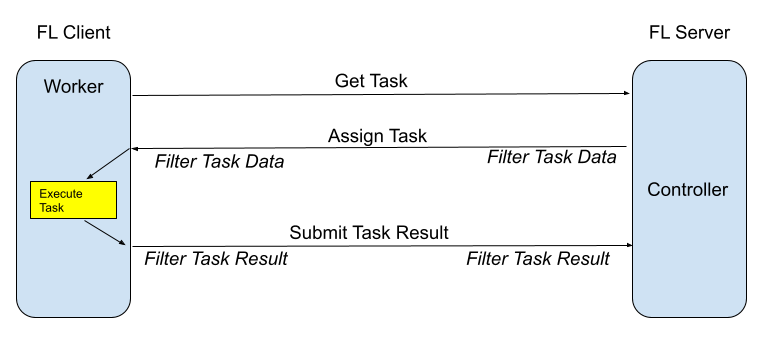

.. _executor:

Executor
========

An :class:`Executor<nvflare.apis.executor.Executor>` is an FLComponent for FL clients used for executing tasks,
wherein the ``execute`` method receives and returns a Shareable object given a task name,
``FLContext``, and ``abort_signal``.

.. note::

   The Executor API is the low-level client task API. Most new ML training
   examples should start with the :ref:`client_api` and :ref:`job_recipe`, and
   use Executor directly only when they need a custom task contract or framework
   integration.

.. literalinclude:: ../../../nvflare/apis/executor.py
    :language: python
    :lines: 24-

Examples for Executors are :class:`Trainer<nvflare.app_common.executors.trainer.Trainer>` and :class:`Validator<nvflare.app_common.executors.validator.Validator>`.
The source code for some example implementations can be found in the example apps. On clients, tasks can be configured
for Executors in config_fed_client.json:

.. code-block:: json

    {
      "format_version": 2,
      "handlers": [],
      "executors": [
        {
          "tasks": [
            "train",
            "submit_model"
          ],
          "executor": {
            "path": "np_trainer.NPTrainer",
            "args": {}
          }
        },
        {
          "tasks": [
            "validate"
          ],
          "executor": {
            "path": "np_validator.NPValidator"
          }
        }
      ],
      "task_result_filters": [],
      "task_data_filters": [],
      "components": []
    }

The above configuration is an example from hello_numpy. Each task can only be assigned to one Executor.

Distributed Client API Training
-------------------------------

For multi-process or multi-GPU training, use the :ref:`client_api` with PyTorch
DistributedDataParallel and launch the script with ``torchrun`` through an
external-process ``ClientAPIExecutor``. The
`multi-GPU PyTorch example <https://github.com/NVIDIA/NVFlare/tree/main/examples/advanced/multi-gpu/pt>`_
shows per-site launch commands and distributed rank handling.

This is separate from task-scoped execution: the initial CPU Process task-worker
profile supports in-process Client API scripts, not external-process distributed
training.
