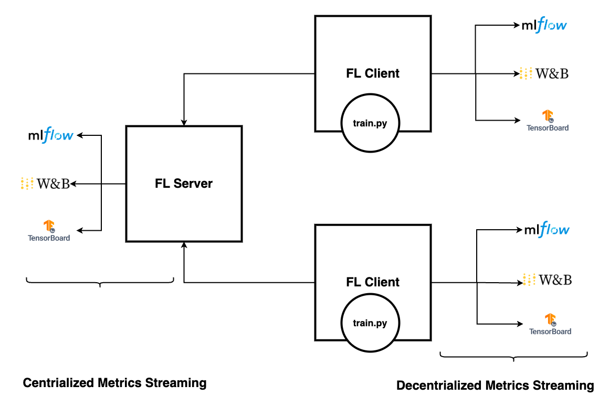

.. _experiment_tracking_apis:

########################
Experiment Tracking APIs
########################

To track training metrics such as accuracy or loss or AUC, we need to log these metrics with one of the experiment tracking systems.
Here we will discuss the following topics:

- Logging metrics with MLflow, TensorBoard, or Weights & Biases
- Streaming metrics to the FL server
- Streaming to FL clients

Logging metrics with MLflow, TensorBoard, or Weights & Biases
=============================================================

Integrate MLflow logging to efficiently stream metrics to the MLflow server with just three lines of code:

.. code-block:: python

  from nvflare.client.tracking import MLflowWriter

  mlflow = MLflowWriter()

  mlflow.log_metric("loss", running_loss / 2000, global_step)

In this setup, we use ``MLflowWriter`` instead of using the MLflow API directly.
This abstraction is important, as it enables users to flexibly redirect your logging metrics to any destination, which we discuss in more detail later.

The use of MLflow, TensorBoard, or Weights & Biases syntax will all work to stream the collected metrics to any supported experiment tracking system.
Choosing to use TBWriter, MLflowWriter, or WandBWriter is user preference based on your existing code and requirements.

- ``MLflowWriter`` uses the Mlflow API operation syntax ``log_metric()``
- ``TBWriter`` uses the TensorBoard SummaryWriter operation ``add_scalar()``
- ``WandBWriter`` uses the Weights & Biases API operation ``log()``

Here are the APIs:

.. code-block:: python

  class TBWriter(LogWriter):
    def add_scalar(self, tag: str, scalar: float, global_step: Optional[int] = None, **kwargs):
    def add_scalars(self, tag: str, scalars: dict, global_step: Optional[int] = None, **kwargs):

  class WandBWriter(LogWriter):
    def log(self, metrics: Dict[str, float], step: Optional[int] = None):

  class MLflowWriter(LogWriter):
      def log_param(self, key: str, value: any) -> None:
      def log_params(self, values: dict) -> None:
      def log_metric(self, key: str, value: float, step: Optional[int] = None) -> None:
      def log_metrics(self, metrics: Dict[str, float], step: Optional[int] = None) -> None:
      def log_text(self, text: str, artifact_file_path: str) -> None:
      def set_tag(self, key: str, tag: any) -> None:
      def set_tags(self, tags: dict) -> None:

After you've modified the training code, you can use the NVFlare's job configuration to configure the system to stream the logs appropriately.

Streaming metrics to FL server
==============================

All metric key values are captured as events, with the flexibility to stream them to the most suitable destinations.
Let's add the ``ConvertToFedEvent`` to convert these metrics events to federated events so they will be sent to the server.

Add this component to config_fed_client.json:

.. code-block:: json

    {
        "id": "event_to_fed",
        "name": "ConvertToFedEvent",
        "args": {"events_to_convert": ["analytix_log_stats"], "fed_event_prefix": "fed."}
    }

If using the subprocess Client API with the ClientAPILauncherExecutor (rather than the in-process Client API with the InProcessClientAPIExecutor),
we need to add the ``MetricRelay`` to fire fed events, a ``CellPipe`` for metrics, and an ``ExternalConfigurator`` for client api initialization.

.. code-block:: yaml

    {
      id = "metric_relay"
      path = "nvflare.app_common.widgets.metric_relay.MetricRelay"
      args {
        pipe_id = "metrics_pipe"
        event_type = "fed.analytix_log_stats"
        read_interval = 0.1
      }
    },
    {
      id = "metrics_pipe"
      path = "nvflare.fuel.utils.pipe.cell_pipe.CellPipe"
      args {
        mode = "PASSIVE"
        site_name = "{SITE_NAME}"
        token = "{JOB_ID}"
        root_url = "{ROOT_URL}"
        secure_mode = "{SECURE_MODE}"
        workspace_dir = "{WORKSPACE}"
      }
    },
    {
      id = "config_preparer"
      path = "nvflare.app_common.widgets.external_configurator.ExternalConfigurator"
      args {
        component_ids = ["metric_relay"]
      }
    }

On the server, configure the experiment tracking system in ``config_fed_server.conf`` using one of the following receivers.
Note that any of the receivers can be used regardless of the which writer is used.

- ``MLflowReceiver`` for MLflow
- ``TBAnalyticsReceiver`` for TensorBoard
- ``WandBReceiver`` for Weights & Biases

For example, here we add the ``MLflowReceiver`` component to the components configuration array:

.. code-block:: yaml

  {
    "id": "mlflow_receiver_with_tracking_uri",
    "path": "nvflare.app_opt.tracking.mlflow.mlflow_receiver.MLflowReceiver",
    "args": {
      tracking_uri = "file:///{WORKSPACE}/{JOB_ID}/mlruns"
      "kwargs": {
        "experiment_name": "hello-pt-experiment",
        "run_name": "hello-pt-with-mlflow",
        "experiment_tags": {
          "mlflow.note.content": "markdown for the experiment"
        },
        "run_tags": {
          "mlflow.note.content": "markdown describes details of experiment"
        }
      },
      "artifact_location": "artifacts"
    }
  }

Notice the args{} are user defined, such as tracking_uri, experiment_name, tags etc., and will be specific to which receiver is configured.

The MLflow tracking URL argument ``tracking_uri`` is None by default, which uses the MLflow default URL, ``http://localhost:5000``.
To make this accessible from another machine, make sure to change it to the correct URL, or point to to the ``mlruns`` directory in the workspace.

::

  tracking_uri = <the Mlflow Server endpoint URL>

::

  tracking_uri = "file:///{WORKSPACE}/{JOB_ID}/mlruns"

You can change other arguments such as experiments, run_name, tags (using Markdown syntax), and artifact location.

Start the MLflow server with one of the following commands:

::

  mlflow server --host 127.0.0.1 --port 5000

::

  mlflow ui -port 5000

For more information with an example walkthrough, see the :github_nvflare_link:`FedAvg with SAG with MLflow tutorial <examples/hello-world/step-by-step/cifar10/sag_mlflow/sag_mlflow.ipynb>`.

Streaming metrics to FL clients
===============================

If streaming metrics to the FL server isn't preferred due to privacy or other concerns, users can alternatively stream metrics to the FL client.
In such cases, there's no need to add the ``ConvertToFedEvent`` component on the client side.
Additionally, since we're not streaming to the server side, there's no requirement to configure receivers in the server configuration.

Instead to receive records on the client side, configure the metrics receiver in the client configuration instead of the server configuration.

For example, in the TensorBoard configuration, add this component to ``config_fed_client.conf``:

.. code-block:: yaml

  {
    "id": "tb_analytics_receiver",
    "name": "TBAnalyticsReceiver",
    "args": {"events": ["analytix_log_stats"]}
  }

Note that the ``events`` argument is ``analytix_log_stats``, not ``fed.analytix_log_stats``, indicating that this is a local event.

If using the ``MetricRelay`` component, we can similarly component event_type value from ``fed.analytix_log_stats`` to ``analytix_log_stats`` for convention.
We then must set the ``MetricRelay`` argument ``fed_event`` to ``false`` to fire local events rather than the default fed events.

.. code-block:: yaml

  {
    id = "metric_relay"
    path = "nvflare.app_common.widgets.metric_relay.MetricRelay"
    args {
      pipe_id = "metrics_pipe"
      event_type = "analytix_log_stats"
      # how fast should it read from the peer
      read_interval = 0.1
      fed_event = false
    }
  }

Then, the metrics will stream to the client.
