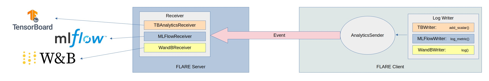

.. _experiment_tracking_log_writer:

##############################
Experiment Tracking Log Writer
##############################

.. note::

    This page covers experiment tracking using :class:`LogWriters <nvflare.app_common.tracking.log_writer.LogWriter>`,
    which are configured and used with :ref:`executor` or :ref:`model_learner` on the FLARE-side code.
    If using the Client API, please refer to :ref:`experiment_tracking_apis` and :ref:`client_api` for adding experiment tracking to your custom training code.

***********************
Overview and Approaches
***********************

In a federated computing setting, the data is distributed across multiple devices or systems, and training is run
on each device independently while preserving each client's data privacy.

Assuming a federated system consisting of one server and many clients and the server coordinating the ML training of clients,
we can interact with ML experiment tracking tools in two different ways: 

    - Client-side experiment tracking: Each client will directly send the log metrics/parameters to the ML experiment
      tracking server (like MLflow or Weights and Biases) or local file system (like tensorboard)
    - Aggregated experiment tracking: Clients will send the log metrics/parameters to FL server, and the FL server will
      send the metrics to ML experiment tracking server or local file system

This is enabled by Receivers, which can be configured on the FL server, FL client, or on both. Each approach will have its use cases and unique challenges.
Here we provide examples and describe the server-side approach:

    - Clients don't need to have access to the tracking server, avoiding the additional
      authentication for every client. In many cases, the clients may be from different organizations
      and different from the host organization of the experiment tracking server.
    - Since we reduced connections to the tracking server from N FL clients to just one FL server, the traffic to the tracking server
      can be highly reduced. In some cases, such as in MLFLow, the events can be buffered in the server and sent to the tracking
      server in batches, further reducing the traffic to the tracking server. The buffer may add additional latency, so you can
      disable the buffering if you can set the buffer flush time to 0 assuming the tracking server can take the traffic.
    - Another key benefit of using server-side experiment tracking is that we separate the metrics data collection 
      from the metrics data delivery to the tracking server. Clients are only responsible for collecting metrics, and only the server needs to 
      know about the tracking server. This allows us to have different tools for data collection and data delivery.
      For example, if the client has training code with logging in Tensorboard syntax, without changing the code, the server can
      receive the logged data and deliver the metrics to MLflow.
    - Server-side experiment tracking also can organize different clients' results into different experiment runs so they can be easily
      compared side-by-side. 

**************************************
Tools, Sender, LogWriter and Receivers
**************************************

With the "experiment_tracking" examples in the advanced examples directory, you can see how to track and visualize
experiments in real time and compare results by leveraging several experiment tracking solutions:

    - `Tensorboard <https://www.tensorflow.org/tensorboard>`_
    - `MLflow <https://mlflow.org/>`_
    - `Weights and Biases <https://wandb.ai/site>`_

.. note::

    The user needs to sign up at Weights and Biases to access the service, NVFlare can not provide access.

In the Federated Learning phase, users can choose an API syntax that they are used to from one
of above tools. NVFlare has developed components that mimic these APIs called
:class:`LogWriters <nvflare.app_common.tracking.log_writer.LogWriter>`. All clients experiment logs
are streamed over to the FL server (with :class:`ConvertToFedEvent<nvflare.app_common.widgets.convert_to_fed_event.ConvertToFedEvent>`),
where the actual experiment logs are recorded. The components that receive
these logs are called Receivers based on :class:`AnalyticsReceiver <nvflare.app_common.widgets.streaming.AnalyticsReceiver>`.
The receiver component leverages the experiment tracking tool and records the logs during the experiment run.

In a normal setting, we would have pairs of sender and receivers, with some provided implementations in :mod:`nvflare.app_opt.tracking`:

    - TBWriter  <-> TBAnalyticsReceiver
    - MLflowWriter <-> MLflowReceiver
    - WandBWriter <-> WandBReceiver

You can also mix and match any combination of LogWriter and Receiver so you can write the ML code using one API
but use any experiment tracking tool or tools (you can use multiple receivers for the same log data sent from one sender).

*************************
Experiment logs streaming
*************************

On the client side, when a :class:`LogWriters <nvflare.app_common.tracking.log_writer.LogWriter>` writes the
metrics, instead of writing to files, it actually generates an NVFLARE event (of type `analytix_log_stats` by default).
The `ConvertToFedEvent` widget will turn the local event `analytix_log_stats` into a 
fed event `fed.analytix_log_stats`, which will be delivered to the server side.

On the server side, the :class:`AnalyticsReceiver <nvflare.app_common.widgets.streaming.AnalyticsReceiver>` is configured
to process `fed.analytix_log_stats` events, which writes received log data to the appropriate tracking solution.

****************************************
Support custom experiment tracking tools
****************************************

There are many different experiment tracking tools, and you might want to write a custom writer and/or receiver for your needs.

There are three things to consider for developing a custom experiment tracking tool.

Data Type
=========

Currently, the supported data types are listed in :class:`AnalyticsDataType <nvflare.apis.analytix.AnalyticsDataType>`, and other data types can be added as needed.

Writer
======
Implement :class:`LogWriter <nvflare.app_common.tracking.log_writer.LogWriter>` interface with the API syntax. For each tool, we mimic the API syntax of the underlying tool,
so users can use what they are familiar with without learning a new API.
For example, for Tensorboard, TBWriter uses add_scalar() and add_scalars(); for MLflow, the syntax is
log_metric(), log_metrics(), log_parameter(), and log_parameters(); for W&B, the writer just has log().
The data collected with these calls will all send to the AnalyticsSender to deliver to the FL server.

Receiver
========

Implement :class:`AnalyticsReceiver <nvflare.app_common.widgets.streaming.AnalyticsReceiver>` interface and determine how to represent different sites' logs.  In all three implementations
(Tensorboard, MLflow, WandB), each site's log is represented as one run. Depending on the individual tool, the implementation 
can be different. For example, for both Tensorboard and MLflow, we create different runs for each client and map to the 
site name. In the WandB implementation, we have to leverage multiprocess and let each run in a different process.  

*****************
Examples Overview
*****************

The :github_nvflare_link:`experiment tracking examples <examples/advanced/experiment-tracking>`
illustrate how to leverage different writers and receivers. All examples are based upon the hello-pt example.

TensorBoard
===========
The example in the "tensorboard" directory shows how to use the Tensorboard Tracking Tool (for both the
sender and receiver). See :ref:`tensorboard_streaming` for details.

MLflow
======
Under the "mlflow" directory, the "hello-pt-mlflow" job shows how to use MLflow for tracking with both the MLflow sender
and receiver. The "hello-pt-tb-mlflow" job shows how to use the Tensorboard Sender, while the receiver is MLflow.
See :ref:`experiment_tracking_mlflow` for details.

Weights & Biases
================
Under the :github_nvflare_link:`wandb <examples/advanced/experiment-tracking/wandb>` directory, the
"hello-pt-wandb" job shows how to use Weights and Biases for experiment tracking with
the WandBWriter and WandBReceiver to log metrics.

MONAI Integration
=================

:github_nvflare_link:`Integration with MONAI <integration/monai>` uses the `NVFlareStatsHandler`
:class:`LogWriterForMetricsExchanger <nvflare.app_common.tracking.LogWriterForMetricsExchanger>` to connect to
:class:`MetricsRetriever <nvflare.app_common.metrics_exchange.MetricsRetriever>`. See the job
:github_nvflare_link:`spleen_ct_segmentation_local <integration/monai/examples/spleen_ct_segmentation_local/jobs/spleen_ct_segmentation_local>`
for more details on this configuration.
