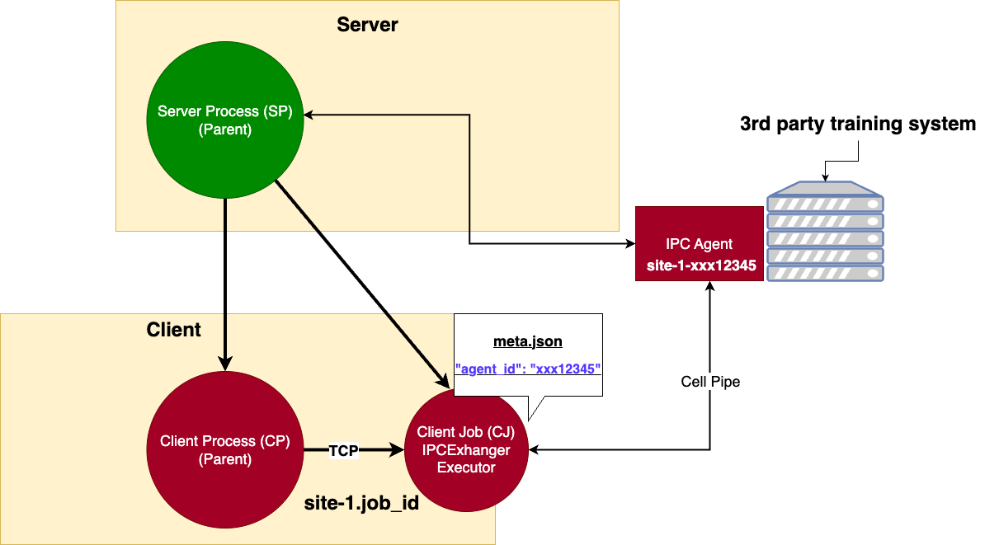

.. _3rd_party_integration:

############################
3rd-Party System Integration
############################

NVFLARE 2.4.0 supports 3rd-party external systems to integrate with FL clients.

The FL Client installs the :mod:`TaskExchanger<nvflare.app_common.executors.task_exchanger>` executor and
the 3rd-party system uses the :mod:`FlareAgent<nvflare.client.flare_agent>` to interact with the TaskExchanger to receive tasks, and submit results to the FLARE server.

This integration pattern is illustrated in the diagram below:

Requirements
============

- The key to enabling this integration is the "agent_id" that must be made known to both systems.
  The FL client gets this information from the job's client_config.json, and the 3rd-party trainer gets this from its own launch process or via the :class:`Piper<nvflare.app_common.data_exchange.piper.Piper>`.
- It is assumed that the customer already has a way to dynamically generate the "agent_id" for each job, and start its trainer process with this information.
- Each FL client must be able to open an address (host:port) to allow the trainer to connect to. Depending on where the trainer is running, the connection may or may not need to be in secure mode (TLS).
- The trainer must be a Python program that can integrate with the NVFLARE library.
- The trainer must be able to connect to the server, as well as the address that is dynamically opened by the FL client.

Prepare the Trainer
===================

You need to modify your trainer code to integrate with the FlareAgent API.
This API provides simple `get_task()` and `submit_result()` methods to interact with the FL client (FL client).
The following is an example of this usage pattern.

.. code-block:: python

    import argparse
    import logging

    from nvflare.client.defs import RC, AgentClosed, MetaKey
    from nvflare.client.flare_agent import FlareAgentWithCellPipe

    NUMPY_KEY = "numpy_key"

    def main():

        logging.basicConfig()
        logging.getLogger().setLevel(logging.INFO)

        parser = argparse.ArgumentParser()
        parser.add_argument("--workspace", "-w", type=str, help="workspace folder", required=False, default=".")
        parser.add_argument("--site_name", "-s", type=str, help="flare site name", required=True)
        parser.add_argument("--agent_id", "-a", type=str, help="agent id", required=True)

        args = parser.parse_args()

        agent = FlareAgentWithCellPipe(
            root_url="grpc://server:8002",
            flare_site_name=args.site_name,
            agent_id=args.agent_id,
            workspace_dir=args.workspace,
            secure_mode=True,
            submit_result_timeout=2.0,
            heartbeat_timeout=120.0,
        )

        agent.start()

        while True:
            print("getting task ...")
            try:
                task = agent.get_task()
            except AgentClosed:
                print("agent closed - exit")
                break

            print(f"got task: {task}")
            rc, meta, result = train(task.data) # peform train task
            submitted = agent.submit_result(TaskResult(data=result, meta=meta, return_code=rc))
            print(f"result submitted: {submitted}")

        agent.stop()

    def train(model):
        ...

    if __name__ == "__main__":
        main()

Create the Agent
----------------

The :class:`FlareAgent<nvflare.client.flare_agent.FlareAgent>` is responsible for interacting with the FL client to exchange task data takes the following parameters:

- ``pipe`` - component id of pipe for communication
- ``read_interval`` - how often to read from pipe
- ``heartbeat_interval`` - how often to send heartbeat to peer
- ``heartbeat_timeout`` - max amount of time to allow missing heartbeats before treating peer as dead
- ``resend_interval`` - how often to resend a message when failing to send
- ``max_resends`` - max number of resends. None means no limit
- ``submit_result_timeout`` - when submitting task result, how long to wait for response from the FL client
- ``metric_pipe`` - component id of pipe for metrics
- ``task_channel_name`` - the channel name for tasks (defaults to PipeChannelName.TASK)
- ``metric_channel_name`` - the channel name for metrics (defaults to PipeChannelName.METRIC)
- ``close_pipe`` - whether pipe needs to be closed (FilePipe: False, CellPipe: True)

If using FLModel, :class:`FlareAgentWithFLModel<nvflare.client.flare_agent_with_fl_model.FlareAgentWithFLModel>` subclasses FlareAgent and provides conversion from shareables to task using the FLModel data structure.

If using CellPipe, then :class:`FlareAgentWithCellPipe<nvflare.client.flare_agent.FlareAgentWithCellPipe>` subclasses FlareAgent and takes the parameters:

- ``agent_id`` - this is the ID of the agent dynamically generated by your launch system
- ``site_name`` - this is the name of the FL client provisioned for the project
- ``root_url`` - this is the URL of the server.
- ``secure_mode`` - whether the trainer/FL client communication will be in secure mode (SSL)
- ``workspace_dir`` - this is the local folder that contains the "startup" kit of the FL client site. The trainer system and the FL client must share the same "startup" content.

Start the Agent
---------------

Call ``agent.start()`` to start the agent. This call must be made before trying to get tasks.

Process Tasks
-------------

The training is a continuous process of getting a task, executing the task, and submitting the task result.

Call ``agent.get_task()`` to get a Task object from the FL client. This is a blocking call and returns only when a task is available.
If there are no more tasks available (i.e. end of the job), ``AgentClosed`` exception will be raised, and signaling to end the training.

The :class:`Task<nvflare.client.flare_agent.Task>` object contains 3 pieces of information: task_name, task_id, and data. 
he task_name tells you what the task is (e.g. train). The task_id is a UUID of the task instance.
The data contains model data to be trained on.

Once the task is completed, the result can be submitted to the FL client by calling ``agent.submit_result()``.
A return code (``rc``) must be provided to indicate whether the task was executed successfully.
If the ``rc`` is not RC.OK, then the job will be aborted.

Stop Agent
----------

At the end of the training, ``agent.stop()`` must be called to end the program gracefully.
If this call is missed, the program may not exit properly.

Notes:

- This pattern of (``start``, ``get_task``, ``submit_result``, and ``stop``) is strictly enforced.
  If the pattern is not followed (e.g. ``get_task``, then ``get_task`` again without ``submit_result``), you will get a ``CallStateError`` exception.
- The only way to know that the job is ended is the ``AgentClosed`` exception from the ``get_task`` call.
  This exception is raised when the FL client tells the agent that the job is done; or when the FL client is considered dead (missing heartbeats for the configured period of time).
- If your training algorithm runs into an unrecoverable error and wants to end the job, you should use a proper return code (e.g. ``RC.EXECUTION_EXCEPTION``). 

Project Setup
=============

The following steps show you how to properly set up your project and jobs.

Step One - Provision
--------------------

The FL client will behave like both client and server for connecting from the perspective of the trainer. 
This requires the client site to have two sets of TLS credentials.
Make sure to specify the "listening_host" for the client in the project.yml when provisioning the project:

.. code-block:: yaml

  participants:
  # change example.com to the FQDN of the server
  - name: server
    type: server
    org: nvidia
    fed_learn_port: 8002
    admin_port: 8003
  - name: site_1
    type: client
    org: nvidia
    listening_host: site_1.maglev.nvidia.com
  - name: site_2
    type: client
    org: nvidia
    listening_host: site_2.maglev.nvidia.com

Once the project is provisioned, check the "startup" kit generated for the clients. You should see the following files, among others:

client.crt, client.key, server.crt, server.key, rootCA.pem

Note that the specified listening_port of a site must be accessible to the trainer of the site.

Step Two - Setup for adhoc direct connection between FL Client and Trainer
--------------------------------------------------------------------------

FL client and the trainer can always talk to each other via the server, but it could be slow, especially if the server is located far away.
The enable adhoc direct connections between the FL client and the Trainer, configure the comm_config.json on the client site as follows:

.. code-block:: json

  {
    "allow_adhoc_conns": true,
    "use_aio_grpc": true,
    "adhoc": {
      "scheme": "tcp",
      "resources": {
        "host": "nvclient",
        "secure": true
      }
    }
  }

This file must be placed into the site's "local" folder within its workspace.

Pay attention to the following:

- For most cases, the "scheme" should be set to "tcp" to get the best performance. If "tcp" cannot be used, you can use "grpc".
- In "resources":

  - If FL client and the Trainer are within the same trusted network, you can set "secure" to false; otherwise set it to true;
  - The value of the "host" must match the "listening_host" value of the site used in provision.

Step Three - Prepare job configuration
--------------------------------------

For each job, configure the config_fed_client.json to use :mod:`TaskExchanger<nvflare.app_common.executors.task_exchanger>` as the executor.

.. code-block:: json

  {
    "format_version": 2,
    "executors": [
      {
        "tasks": [
        "train"
        ],
        "executor": {
          "path": "nvflare.app_common.executors.task_exchanger.TaskExchanger",
          "args": {
            "pipe_id": "pipe"
            "peer_read_timeout": 30,
            "heartbeat_timeout": 60
          }
        }
      }
    ],
    "task_result_filters": [],
    "task_data_filters": [],
    "components": [
    ...
    ]
  }

Make sure the parameters of the TaskExchanger are configured properly, and change the default values as needed:

- ``pipe_id`` - component id of pipe
- ``read_interval`` - how often to read from pipe
- ``heartbeat_interval`` - how often to send heartbeat to peer
- ``heartbeat_timeout`` - max amount of time to allow missing heartbeats before treating peer as dead
- ``resend_interval`` - how often to resend a message when failing to send
- ``max_resends`` - max number of resends. None means no limit
- ``peer_read_timeout`` - time to wait for peer to accept sent message
- ``task_wait_time`` - how long to wait for a task to complete. None means waiting forever
- ``result_poll_interval`` - how often to poll task result
- ``pipe_channel_name`` - the channel name for sending task requests

Step Four - Trainer Setup
-------------------------

The trainer program must have access to a local file system, and you must create a "workspace" folder. This workspace should be used for all jobs.

Copy the "startup" folder of the provisioned site, and put it in the designated workspace folder.
If needed, any additional config files required by the trainer can also be placed in the workspace folder.

Ensure to set the FlareAgent's "workspace_dir" to the workspace folder and that the correct "agent_id" value is passed to both the FL client and the training process.

Verification
============

The FL client (TaskExchanger) and your trainer process (FlareAgent) do not have to be started at exactly the same time. Whichever is started first will wait for the other for ``heartbeat_timeout`` seconds.
Once they both are started and connected, you can verify they are directly connected using the Admin's cell commands.

The following example shows two clients (red, blue) connected to their external trainers via the agent_id "ext_trainer_1":

.. code-block:: shell

  > cells
  server
  server.44c08365-e829-4bc1-a034-cda5a252fe73
  red
  red.44c08365-e829-4bc1-a034-cda5a252fe73
  blue
  blue.44c08365-e829-4bc1-a034-cda5a252fe73
  red--ndas_1
  blue--ndas_1
  Total Cells: 8
  Done [21695 usecs] 2023-10-16 19:28:37.523651

The ``cells`` command lists all cells. Notice that the job 44c08365-e829-4bc1-a034-cda5a252fe73 is running on both "blue" and "red" clients.
Also notice that there are two corresponding ext_trainer cells (red-ext_trainer_1, and blue-ext_trainer1).

.. code-block:: shell

  > peers blue--ext_trainer_1
  server
  blue.44c08365-e829-4bc1-a034-cda5a252fe73
  Total Agents: 2
  Done [14526 usecs] 2023-10-16 19:28:44.407505

The ``peers`` command shows the cells directly connected to the specified cell.
Here you see that the blue-ext_trainer_1 is directly connected to two cells: the server and the FL client (blue.44c08365-e829-4bc1-a034-cda5a252fe73).

.. code-block:: shell

  > conns blue--ext_trainer_1
  {
    "bb_ext_connector": {
      "url": "grpc://server:8002",
      "handle": "CH00001",
      "type": "connector"
    },
    "adhoc_connectors": {
      "blue.44c08365-e829-4bc1-a034-cda5a252fe73": {
        "url": "stcp://nvclient:11947",
        "handle": "CH00002",
        "type": "connector"
      }
    }
  }

The ``conns`` command shows the connectors on the specified cell. Here you see that blue--ext_trainer_1 has two connectors:
one connects the server on ``grpc://server:8002``, and another connects to ``blue.44c08365-e829-4bc1-a034-cda5a252fe73 on stcp://nvclient:11947``.
Note that this port is opened by the FL client dynamically.
