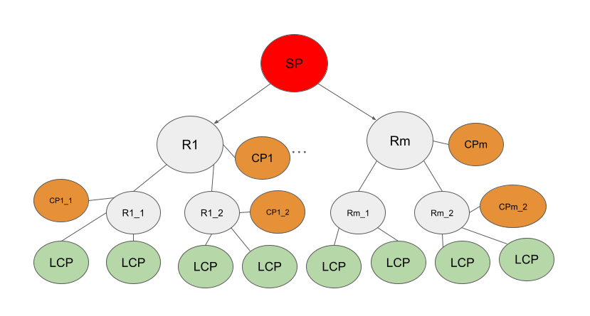
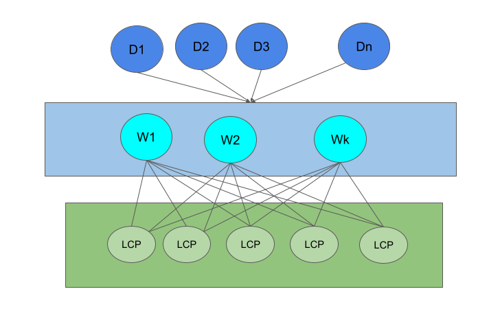
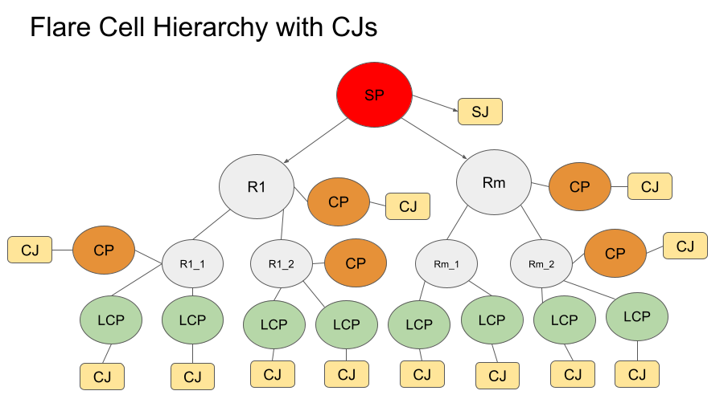
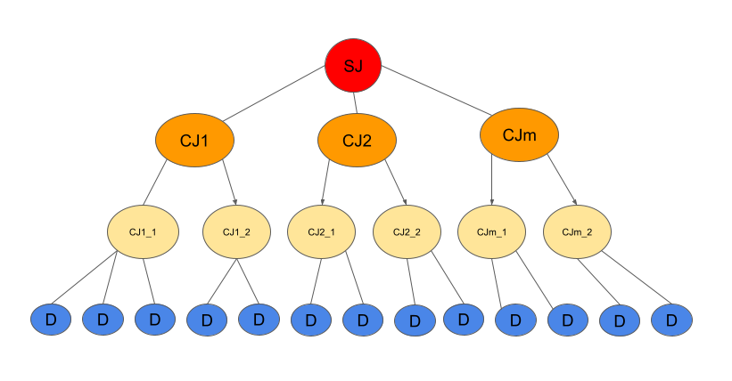
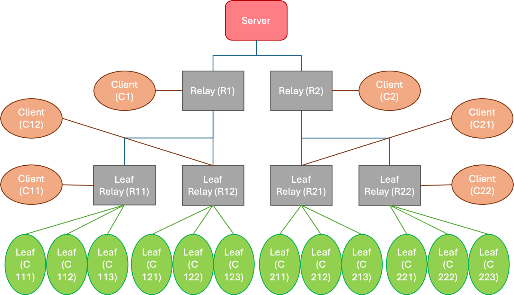

.. _flare_hierarchical_architecture:

Hierarchical FLARE
==================

As discussed in :ref:`hierarchical_communication`, FLARE can scale to support a large number of FL clients through communication hierarchy and client hierarchy. When properly configured, FLARE achieves highly efficient communication and hierarchical aggregation computation.

The following diagram shows a hierarchical FLARE system that uses two levels of relays (the R nodes) for communication. A client hierarchy (CP nodes) is also defined and connected to the relays.

Note that the client hierarchy follows the relay hierarchy closely for optimal performance. For example, CP1_1 and CP1_2 are children of CP1; the LCPs connected to R1_1 are children of CP1_1; the LCPs connected to R1_2 are children of CP1_2; and so on.

This client hierarchy is used to implement hierarchical aggregation algorithms for device training.

Leaf Client Process (LCP)
=========================

LCPs are the terminal nodes in the client hierarchy. They serve a special role in supporting edge applications.

Interface for Edge Communication
--------------------------------

LCPs serve as the entry point for messages from edge devices. However, these messages are not sent directly to LCPs. Instead, they pass through an intermediary component called a web node.

What are web nodes?
-------------------

Web nodes are routing components that receive messages from edge devices and forward them to the appropriate LCPs. They manage load distribution and ensure consistent message routing.

Multiple web nodes can be deployed in different regions based on the estimated number of edge devices and their geographical distribution. A web node can connect to all or a subset of LCPs, depending on the routing configuration.

Web nodes typically aim to:

1. Route messages from the same device to the same LCP based on its device ID
2. Distribute devices evenly across all connected LCPs

.. note::
   For privacy protection, the "device ID" only needs to be a globally unique number and does not need to be the actual device identifier. Once generated, this ID must remain constant at least for the duration of a training session.

The following diagram shows this architecture.

Routing to Client Job Processes (CJs)
-------------------------------------

LCPs route received edge messages to the appropriate client job processes (CJs), which implement application processing logic.

Note that unlike CJs, which come and go, LCPs are permanent. Multiple jobs can run simultaneously, with one CJ attached to the LCP for each running job. The LCP routes each received edge message to the appropriate CJ.

The following diagram shows the system with a job deployed.

CJ Hierarchy
============

Once a job is deployed, there is one SJ (Server Job) process and one dedicated CJ process for the job on each CP. The CJ hierarchy mirrors the hierarchy of their CPs. Device messages are received and processed by the CJs associated with LCPs.

The following diagram shows the CJ hierarchy corresponding to the example above.

Leaf CJs are associated with LCPs. They interact with edge devices indirectly following the Edge Device Interaction Protocol (EDIP). They also serve as the first-line aggregator, aggregating training results from their devices and reporting the aggregation result to their parent CJs. All intermediate CJs aggregate results from their children and report aggregation results to their parents, continuing up to the SJ, which generates the final aggregation result.

Routing Proxy (Web Node Implementation)
=======================================

In the current implementation, the web node is realized as a component called the Routing Proxy.

Routing Logic
-------------

The Routing Proxy uses a hash-based routing strategy based on each device's unique identifier:

- The device ID is passed in the request
- A consistent hash function maps the device ID to a specific LCP
- This ensures that all messages from the same device are routed to the same LCP, which is important for session consistency
- It also ensures even distribution of devices across available LCPs

Provision
=========

The communication hierarchy and client hierarchy must be properly created using the provisioning tool. This can be done with the ``listening_host``, ``connect_to``, and FQSN properties, as discussed in :ref:`hierarchical_communication`, but this approach can be tedious and error-prone, especially when the number of nodes is large.

FLARE 2.7 offers a CLI tool called ``tree_prov`` to simplify this process. With this tool, you only need to specify the shape of the communication hierarchy, and the tool handles the rest (i.e., creating a client hierarchy that follows the topology of the communication hierarchy).

.. note::
   This tool is intended for simple prototyping on a single machine: all nodes are assumed to be on localhost. Tools for production environments will be available in future versions of FLARE.

To run ``tree_prov``:

.. code-block:: bash

   python -m nvflare.lighter.tree_prov options

Available options:

- ``--root_dir, -r``: The directory for the provisioning result. Required.
- ``--project_name, -p``: Project name. Required.
- ``--depth, -d``: Depth of the relay tree (i.e., the number of relay tiers). Required.
- ``--width, -w``: Width of the tree (i.e., the number of child relay nodes for each parent relay). Note that this only applies to relay nodes. If not specified, defaults to 2.
- ``--clients, -c``: Number of clients (LCPs) for each leaf relay node. This only applies to leaf relay nodes.
- ``--max_sites, -m``: The maximum number of sites, including relays and FL clients. Note that the number of sites increases exponentially with depth; this limit prevents the tool from generating too many sites when a large depth value is entered accidentally. The default value is 100.
- ``--lcp_only, -l``: Only generate provisioning results for LCPs. This is occasionally useful when new LCPs are added after the project has already been provisioned.
- ``--analyze, -a``: If specified, only perform topology analysis without generating provisioning results. The analysis shows the number of relay and client nodes in the hierarchy.
- ``--rp``: The port number of the Routing Proxy, which implements the web nodes.

Here is an example of topology analysis:

.. code-block:: bash

   python -m nvflare.lighter.tree_prov -d 2 -w 2 -a -c 3 -r . -p x

The result is:

- Relays:  leaf=4; non-leaf=2; total=6
- Clients: leaf=12; non-leaf=6; total=18
- Total Sites: 25

There are 6 relay nodes in total: 2 non-leaf nodes and 4 leaf nodes (since each non-leaf node has 2 leaf nodes for a width value of 2).

There are 18 client nodes in total. In the client hierarchy, there are 6 non-leaf clients (one for each relay node) and 12 leaf clients (3 for each leaf relay node).

The total number of sites is the sum of the total number of relays (6), the total number of clients (18), and the server (1), which equals 25.

In addition to the provisioning results, the ``tree_prov`` tool generates additional files for deploying web nodes and convenience scripts. These files are placed in the ``scripts`` folder of the provisioned result. The following files are particularly important:

- ``lcp_map.json``: Contains port numbers that will be used by the web nodes to connect to LCPs
- ``start_rp.sh``: Shell script used to start a web node (routing proxy)
- ``rootCA.pem``: Contains the root certificate of the project, used by the web node to make secure connections to LCPs

