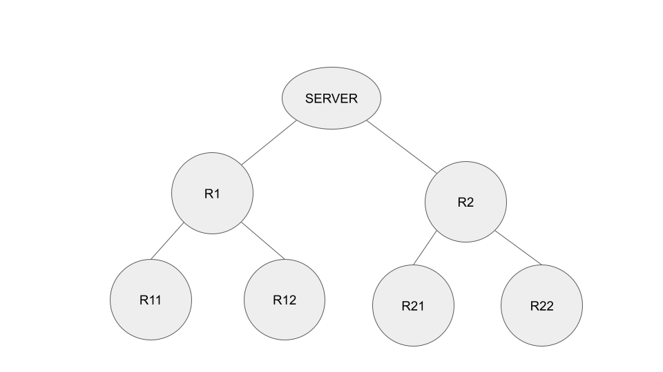

.. _hierarchical_communication:

#########################################
Hierarchical Communication and Clients
#########################################

In a basic FLARE deployment, clients connect to the server directly, with one dedicated connection between the server and each client. This architecture performs well when the number of clients is relatively small (e.g., fewer than 100). However, as the number of clients increases, the number of concurrent connections to the server increases proportionally, which can reduce communication efficiency.

CellNet, FLARE's underlying communication technology, supports hierarchical communication topologies. Cells can be organized hierarchically to enable efficient connection management at scale.

Communication Hierarchy
-----------------------

FLARE 2.7 leverages this capability to manage FL clients efficiently, particularly when the number of clients is very large (e.g., more than 1,000).

Relay
~~~~~

In a communication hierarchy, relays are intermediate nodes that connect to either the server or to parent relays, as illustrated in the following diagram:

The hierarchy can extend to any depth, and a parent node can have any number of child nodes. However, since the primary purpose of this arrangement is efficient connection management, it is recommended that each parent node have fewer than 100 child nodes.

FQCN
~~~~~

In the communication hierarchy, each node is called a cell, and each cell has a unique name called a fully qualified cell name (FQCN). The FQCN represents the path from the server to the node.

- The server's FQCN is "server".
- The FQCNs of the server's direct children are their base names. In the example above, the FQCNs of R1 and R2 are R1 and R2, respectively.
- The FQCN of R11 is R1.R11. Similarly, R12's FQCN is R1.R12.
- The FQCN of R21 is R2.R21. Similarly, R22's FQCN is R2.R22.

.. note::
   For simplicity, the root name of the hierarchy (i.e., server) is omitted from the FQCN. Otherwise, every cell's FQCN would begin with "server".

CellNet guarantees that any cell can communicate with any other cell in the hierarchy.

Connect Clients to the Hierarchy
~~~~~~~~~~~~~~~~~~~~~~~~~~~~~~~~~

Clients can connect to any node in the hierarchy. They may connect directly to the server or to intermediate or leaf relay nodes. While connecting clients only to leaf relay nodes simplifies the topology, this is not a strict requirement.

The following diagram shows a simple arrangement where 8 clients (C1 to C8) are connected to leaf nodes only.

From CellNet's perspective, clients are simply cells, each with its own FQCN. For example, C6's FQCN is R2.R21.C6.

The following diagram shows an alternative arrangement where some clients are connected to intermediate nodes or directly to the server.

.. image:: ../resources/communication_hierarchy_clients_intermediary_nodes.png
    :height: 350px

Regardless of how clients are connected, they can communicate with the server and with other clients. This communication is completely transparent to application code.

Client Hierarchy
-----------------

Although clients may connect to the server or different relays in the communication hierarchy, they are equal in that they are all independent of each other by default.

FLARE 2.7 introduces the ability to organize clients hierarchically. This means that clients do not have to be independent of each other: some clients can be designated as children of others. This hierarchical organization enables more efficient implementation of certain algorithms, such as hierarchical aggregation.

.. note::
   Client hierarchy and communication hierarchy are distinct concepts. Communication hierarchy is designed for efficient connection management, while client hierarchy is designed for hierarchical algorithm implementation.

Client hierarchy can be thought of as a logical arrangement of client relationships, independent of how clients are connected in the communication hierarchy. In fact, child clients typically do not connect directly to their parent client.

The following diagram shows a client hierarchy.

FQSN
~~~~~

Each client in the client hierarchy has a unique name called a fully qualified site name (FQSN). The FQSN specifies the path of the client from the server.

- In the above example, the FQSNs of C1 and C2 are C1 and C2, respectively. The FQSN of client C11 is C1.C11, and so on.

This client hierarchy can be implemented on any communication hierarchy.

The following diagram shows how the client hierarchy is implemented with a relay-based communication hierarchy:

Alternatively, clients can connect directly to the server:

Job Hierarchy
--------------

When a job is deployed, job processes are created for each client and the server. These processes are called CJs (client jobs) and SJ (server job). There is one CJ for each client.

The relationships between job processes (CJs and SJ) mirror the relationships between their corresponding clients. For example, since C11 is a child of C1, the CJ on client C11 is also a child of the CJ on client C1.

Job hierarchy is essential for implementing hierarchical algorithms, where results computed by child CJs are sent to the parent CJ for aggregation.

.. note::
   Although client hierarchy and communication hierarchy are independent of each other, they share the same goal of optimizing overall system performance by reducing the burden of central processing, which typically arises from communication and computation overhead.

Without client hierarchy, each client sends its results directly to the server. While the communication hierarchy can reduce the number of connections to the server, the number of messages and the amount of data the server must process remain unchanged.

Client hierarchy addresses this issue. Since only top-tier clients report to the server, client hierarchy reduces the amount of processing the server must perform.

Therefore, the optimal approach is to align the client hierarchy with the communication hierarchy, as illustrated in the first example. This minimizes both the number of communication hops and the amount of processing required.

Provision
----------

The communication hierarchy and client hierarchy are established through the provisioning process.

Relay
~~~~~~

A relay node connects to its parent (or to the server) while simultaneously accepting connections from other nodes. Therefore, a relay node must function as both a listener (acting as a communication server) and a connector (acting as a communication client). Consequently, the provisioning process creates both server credentials (certificate and private key) and client credentials (certificate and key) for the relay node, including them in the relay's startup kit.

These credentials are specified by the following properties:

listening_host
~~~~~~~~~~~~~~~

This property specifies the location where the relay will run and the port number on which it will listen for incoming connections.

This property can have up to 5 elements:

- **scheme**: The communication protocol (http, grpc, or tcp). If not specified, the overall scheme of the project is used.
- **host_names**: Additional host names or IP addresses by which this host will be known. All specified names are included in the "Subject Alternative Names" field of the server certificate. This element is optional.
- **default_host**: The default host name to be used for connecting to the host. Must be specified.
- **port**: The port number on which to listen. Must be specified.
- **connection_security**: The connection security mode for incoming connections (tls, mtls, or clear). If not specified, the project's default connection security is used. If the project's connection security is not explicitly specified, the default value is "mtls" (mutual TLS).

connect_to
~~~~~~~~~~~

This property specifies the information necessary for the relay to establish a connection.

This property can have up to 4 elements:

- **name**: The base name of the node in the hierarchy. Note that each node has a unique base name. If this is specified, the relay will connect to the specified node at that node's default_host.
- **host**: The host name or IP address to connect to. This should be accessible from the intended node (either its default_host or one of its host_names), unless :ref:`BYOConn <byoconn>` is used.
- **port**: The port number to connect to. This element is usually not needed unless :ref:`BYOConn <byoconn>` is used.
- **connection_security**: The connection security mode for outgoing connections (tls, mtls, or clear). This usually does not need to be specified explicitly unless :ref:`BYOConn <byoconn>` is used.

.. note::
   Either the **name** or **host** element must be specified, but not both.

A Note about BYOConn
~~~~~~~~~~~~~~~~~~~~~

FLARE supports :ref:`BYOConn <byoconn>` (Bring Your Own Connectivity). With BYOConn, a listening endpoint can be protected by an ingress proxy. To connect to such an endpoint, the ``connect_to`` property must point to the ingress proxy rather than the actual endpoint.

Client Hierarchy
~~~~~~~~~~~~~~~~~

Clients connect to either the server or a relay node. To connect to the server, no additional configuration is required. To connect to a relay, use the ``connect_to`` property as described above.

Another aspect of client hierarchy is the client's position within the hierarchy. This is specified using the ``parent`` property. The value of this property is the base name of the parent client.

Example
~~~~~~~~

The following ``project.yml`` demonstrates how to use these properties to specify the communication hierarchy and client hierarchy for the example discussed in the FQSN section.

.. code-block:: yaml

   api_version: 3
   name: mobile
   description: NVIDIA FLARE sample project yaml file
   connection_security: clear
   allow_error_sending: false

   participants:
    - name: server
      type: server
      org: nvidia
      fed_learn_port: 8002
      host_names: [localhost, 127.0.0.1]
      default_host: localhost
    - name: R1
      type: relay
      org: nvidia
      listening_host:
        default_host: localhost
        port: 18004
    - name: R2
      type: relay
      org: nvidia
      listening_host:
        port: 28004
        default_host: localhost
    - name: C1
      type: client
      org: nvidia
      connect_to:
        name: R1
    - name: C11
      type: client
      org: nvidia
      parent: C1
      connect_to:
        name: R1
    - name: C12
      type: client
      org: nvidia
      parent: C1
      connect_to:
        name: R1
    - name: C2
      type: client
      org: nvidia
      connect_to:
        name: R2
    - name: C21
      type: client
      org: nvidia
      parent: C2
      connect_to:
        name: R2
    - name: C22
      type: client
      org: nvidia
      parent: C2
      connect_to:
        name: R2
    - name: admin@nvidia.com
      type: admin
      org: nvidia
      role: project_admin
      connect_to: 127.0.0.1

   builders:
    - path: nvflare.lighter.impl.workspace.WorkspaceBuilder
    - path: nvflare.lighter.impl.static_file.StaticFileBuilder
      args:
        config_folder: config

        # scheme for communication driver (grpc, tcp, http).
        scheme: grpc

    - path: nvflare.lighter.impl.cert.CertBuilder
    - path: nvflare.lighter.impl.signature.SignatureBuilder

