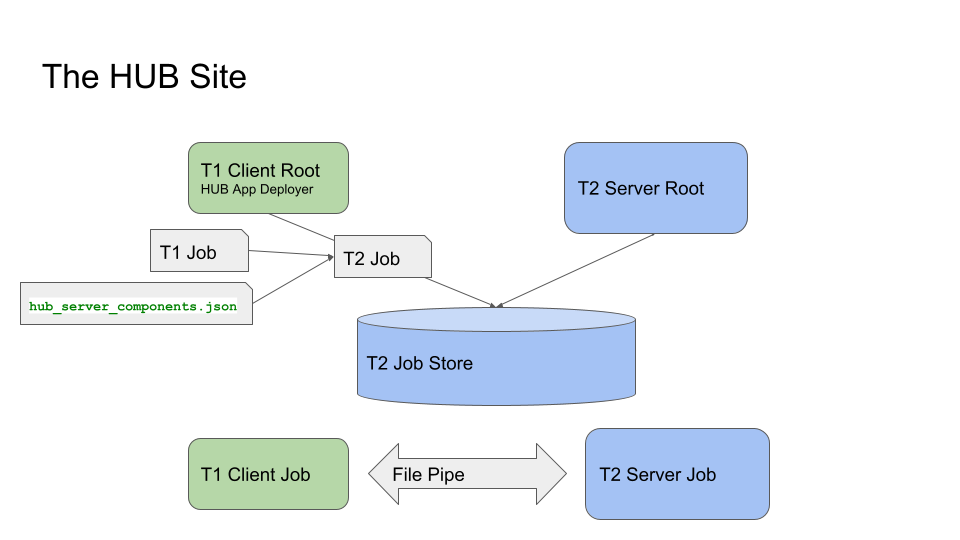
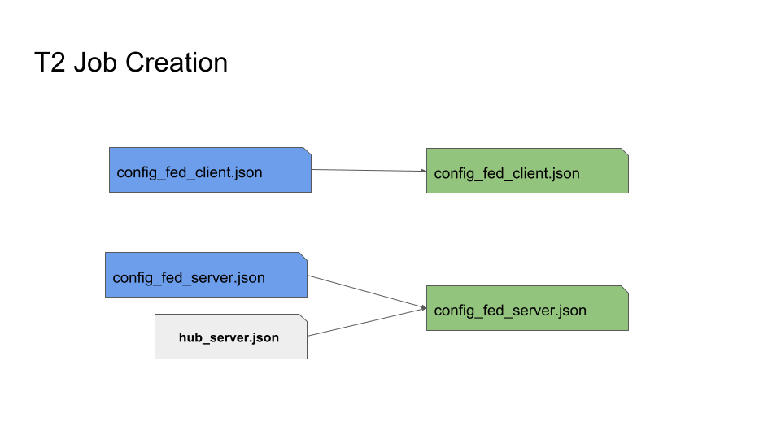
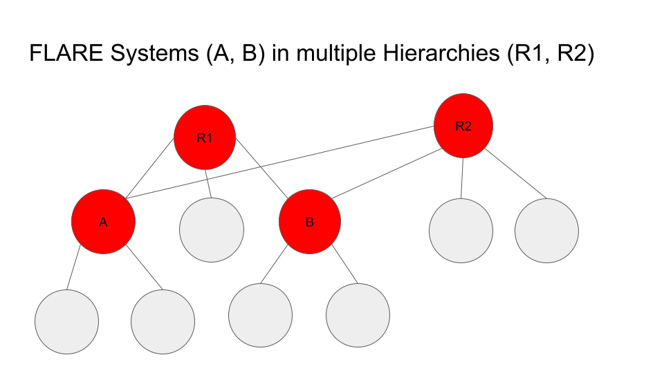

.. _hierarchy_unification_bridge:

############################
Hierarchy Unification Bridge
############################

**************************
Background and Motivations
**************************
Users have been working on the idea of making multiple FL systems work together to train a common model. Each FL system has its own server(s) and clients,
implemented with the same or different FL frameworks. All these FL systems are managed by a central server, called FL Hub, which is responsible for
coordinating the FL systems to work together in an orderly fashion.

This proposal requires all FL frameworks to follow a common interaction protocol, which is not yet defined. Hence as a first step, the scope is
reduced to make all FLARE-based FL systems work together.

FLARE is designed to support institution-based collaboration. This means that the number of clients per system is limited (< 100). Hierarchy Unification Bridge (HUB) is a
solution that can support systems that exceed this limit by making multiple FLARE systems work together in a hierarchical manner. At the top of the hierarchy is the Root System,
which is just a regular FLARE system that has an FL Server and multiple FL Clients. Each client site can be a simple site that runs regular training, or it can be an independent
FLARE system that has its own server and clients. This scheme can repeat many times to form a hierarchy as deep as needed.

******
Design
******
The key to implementing this logical hierarchy is making the lower tier system (Tier 2 or T2) a client of the upper tier system (Tier 1 or T1).

The following diagram shows how this is done:

In this diagram, green blocks represent components of the T1 system, and the blue blocks represent components of the T2 system.  Though T1 and T2
systems are independent of each other, they belong to the same organization. Though they do not have to be on the same VM, they must be able to access
shared file systems.

Here is the general process flow:

    - T1 Server tries to schedule and deploy a job to T1 Client, as usual
    - T1 Client Root receives the job and tries to deploy it
    - The Deployer creates a job for T2 system based on T1 job and the preconfigured information
    - The Deployer writes the created job to T2's job store
    - T2 Server Root schedules and deploys the T2 job as usual
    - T1 Server starts the T1 job, which causes the T1 job to be started on T1 Client Job cell
    - Similarly, T2 Server starts the T2 job and creates T2 Server Job cell
    - Now the job is running
    - T1 Client Job cell and T2 Server Job cell communicate with each other via a File Pipe to exchange task data and task result
    - T1 Client Job cell and T1 Server Job cell exchange task data/result as usual

**********
Challenges
**********

There are two main challenges to this design:

    - How to turn a job from the T1 system into a job in the T2 system?
    - What is the workflow controller of the T2 system to ensure the semantics of the T1 system's control logic?

These two questions are closely related. The job's control logic is ultimately determined by the workflow running in T1's server.
The control logic could be fairly complex. For example, the SAG controller determines the tasks to be performed for the clients,
the aggregator to be used, as well as the number of rounds to be executed. All systems must work together on a round-by-round basis,
meaning that all system clients must participate in the training for each round, and aggregation must happen at the T1 Server at the
end of each round. It is not that all systems perform their own SAG for the whole job and then aggregate their final results at the T1 server.

As we know, a FL Client has no control logic - it merely executes tasks assigned by the server and submits task results. Since the
T2 system is like a client of the T1 system, its whole goal is to execute assigned tasks properly by its own clients. Now the question
is how does the T2 server know how to assign the task to its own clients? For example, the task assigned by the T1 server is simply "train",
how does the T2 Server know whether it should broadcast the "train" task to its own clients, or it should be done in a relay fashion? In case
of broadcast, what should be done to the submitted results from its clients? Should they be aggregated locally before sending back to the
T1 system; or should they be simply collected and then sent back to the T1 system?

*************************
Operation Driven Workflow
*************************

First some terminologies:

FL Operation
============
An FL Operation describes how an FL task is to be done. FLARE supports two types of operations: *broadcast* (bcast) and *relay*.

The *broadcast* operation specifies all the attributes of the Controller's ``broadcast_and_wait`` method: min_targets, wait_time_after_min_received,
timeout, etc,. In addition, it also specifies how the aggregation is to be done (an aggregator component ID).

Similarly, the *relay* operation specifies all the attributes of the Controller's ``relay_and_wait`` method. In addition, it could also specify the
shareable generator and persistor component ID.

FL Operator
===========
An Operator is just a Python class that implements an operation. For each supported operation, there is an Operator that implements its semantics,
implemented with Controller API.

HUB Controller
--------------
The HUB Controller runs in T2's Server Job cell to control the workflow. It is a general-purpose operation-based controller that has a simple control logic:

    - Receives task data from the T1 system (HubExecutor)
    - Determines the operation to be performed based on task data headers and/or job config
    - Finds the Operator for the requested operation
    - Invokes the operator to execute the operation
    - Send the result back to the requester

HUB Executor
------------
The HUB executor runs in T1's Client Job cell. It works with the HUB Controller to get the assigned task done and return the result back to the T1 server. 

HUB Executor/Controller Interaction
-----------------------------------
The HUB Executor and the HUB Controller use a file-based mechanism (called File Pipe) to interact with each other:

    - The Executor waits to receive a task from the T1 server.
    - The Executor creates a file for the received Task Data, and waits for the Task Result file from the T2 system.
    - The Controller reads the task data file, which contains a Shareable object.
    - From the headers of the task data object and the preconfigured operation information,, the Controller determines the FL operation to perform and finds the Operator for it.
    - The Controller invokes the Operator to get the task performed by its own clients.
    - The Controller waits for the results from the Operator and creates the Task Result file.
    - The Executor reads the Task Result and sends it back to the T1 server.

Essentially, this Operation-based controller makes the T2 system an FL Operation Process Engine (FLOPE). It simply executes an operation requested by another system.
This allows the actual FL control logic to be run anywhere. For example, a researcher could run the training loop on her own machine, and only send training operations to the T2 system for execution. 

Job Modifications
-----------------
For the HUB to work, the T1's client must be running the HUB Executor (instead of the regular client trainer), and the T2's server must be running the
HUB Controller (instead of the regular workflow as configured in the T1's server). This requires modification to the T1 Job for the T1 client, and creation of the T2 job for the T2 system:

    - T1's config_fed_client.json is replaced with the template that uses HUB Executor for all tasks (hub_client.json). This template also defines the File Pipe to be used for communication with the HUB Controller on T2.
    - T2's config_fed_client.json is the same as the original T1's config_fed_client.json.
    - T2's config_fed_server.json is based on the template that defines the HUB Controller (hub_server.json). This template also defines the File Pipe to be used for communication with the HUB Executor on T1.
    - T1's config_fed_server.json may need to contain operation descriptions for all tasks. This information is added to T2's config_fed_server.json, and is used by the HUB Controller to determine and invoke operators.

The following diagram shows how the T2 Job (in green color) is created based on the T1's original job (in blue color) and augmented with hub_server.json.

The following are the examples of these templates:

hub_client.json
^^^^^^^^^^^^^^^

.. code-block:: json

    {
        "format_version": 2,
        "executors": [
            {
                "tasks": [
                    "*"
                ],
                "executor": {
                    "id": "Executor",
                    "path": "nvflare.app_common.hub.hub_executor.HubExecutor",
                    "args": {
                        "pipe_id": "pipe",
                        "task_wait_time": 600,
                        "result_poll_interval": 0.5
                    }
                }
            }
        ],
        "components": [
            {
                "id": "pipe",
                "path": "nvflare.fuel.utils.pipe.file_pipe.FilePipe",
                "args": {
                    "root_path": "/tmp/nvflare/hub/pipe/a"
                }
            }
        ]
    }

hub_server.json
^^^^^^^^^^^^^^^

.. code-block:: json

    {
        "format_version": 2,
        "workflows": [
            {
                "id": "controller",
                "path": "nvflare.app_common.hub.hub_controller.HubController",
                "args": {
                    "pipe_id": "pipe",
                    "task_wait_time": 60,
                    "task_data_poll_interval": 0.5
                }
            }
        ],
        "components": [
            {
                "id": "pipe",
                "path": "nvflare.fuel.utils.pipe.file_pipe.FilePipe",
                "args": {
                    "root_path": "/tmp/nvflare/hub/pipe/a"
                }
            }
        ]
    }

As shown in the templates, the File Pipe for both sides must be configured to use the same root path.

T1 App Deployer and T2 Job Store
^^^^^^^^^^^^^^^^^^^^^^^^^^^^^^^^
T1's app deployer must be replaced with the HubAppDeployer, which does the job modification and creation, as described in above. 

Once the App Deployer creates the T2 job, it must write the job into T2's job store. This requires the T1 client to have access to T2's job store. 

Both of these are achieved by modifications to T1's local resources:

.. code-block:: json

    {
        "format_version": 2,
        "client": {
            "retry_timeout": 30,
            "compression": "Gzip"
        },
        "components": [
            {
                "id": "resource_manager",
                "path": "nvflare.app_common.resource_managers.list_resource_manager.ListResourceManager",
                "args": {
                    "resources": {
                        "gpu": [0, 1, 2, 3]
                    }
                }
            },
            {
                "id": "resource_consumer",
                "path": "nvflare.app_common.resource_consumers.gpu_resource_consumer.GPUResourceConsumer",
                "args": {}
            },
            {
                "id": "job_manager",
                "path": "nvflare.apis.impl.job_def_manager.SimpleJobDefManager",
                "args": {
                    "uri_root": "/tmp/nvflare/hub/jobs/t2a",
                    "job_store_id": "job_store"
                }
            },
            {
                "id": "job_store",
                "path": "nvflare.app_common.storages.filesystem_storage.FilesystemStorage"
            },
            {
                "id": "app_deployer",
                "path": "nvflare.app_common.hub.hub_app_deployer.HubAppDeployer"
            }
        ]
    }

In this example, the App Deployer configuration is at the bottom, and the job store access configuration consists of the two components above that.

Job Submission
^^^^^^^^^^^^^^
The user is just submitting a regular job to the T1 system and is not concerned about how the job is executed with multiple
systems. The T2 systems are just clients of the job. Since T2 systems use operation-based controllers, they need to be able to determine operations for
received tasks. This is where the user will need to provide additional information about what operation is to be used for each task. This is achieved by
defining operators in the config_fed_server.json of the job config:

.. code-block:: json

    {
        "format_version": 2,
        "operators": {
            "train": {
                "method": "bcast",
                "aggregator": "aggregator",
                "timeout": 600,
                "min_targets": 1
            },
            "submit_model": {
                "method": "bcast",
                "aggregator": "model_collector",
                "timeout": 600,
                "min_targets": 1
            },
            "validate": {
                "method": "bcast",
                "aggregator": "val_collector",
                "timeout": 600,
                "min_targets": 1
            }
        },
        "components": [
            {
                "id": "aggregator",
                "path": "nvflare.app_common.aggregators.intime_accumulate_model_aggregator.InTimeAccumulateWeightedAggregator",
                "args": {
                    "expected_data_kind": "WEIGHTS"
                }
            },
            {
                "id": "model_collector",
                "path": "nvflare.app_common.aggregators.dxo_collector.DXOCollector",
                "args": {}
            },
            {
                "id": "val_collector",
                "path": "nvflare.app_common.aggregators.dxo_collector.DXOCollector",
                "args": {}
            }
        ]
    }

This example shows how to configure operators for the tasks of ``train``, ``submit_model``, and ``validate``. Note that they all use the ``bcast`` method, but use different aggregation techniques.

.. note::

    Jobs for all HUB systems use the same job ID created by the root system. This makes it easier to correlate the jobs across all systems.

***********************
How to Set Up HUB Sites
***********************

As shown in the above, a HUB site has two entities running: a FL Client for the T1 system and a FL Server for the T2 system. The two entities must be able to access a shared file system, though they don't have to be on the same VM.

You don't need to do anything special to T2's FL Server - it's just a normal FLARE system. All the setup effort is on the T1's FL Client.

Step 1: create a client for the T1 system 
=========================================
This is the normal provision and setup process of the T1 system. Once completed, you should have the client configuration (workspace, startup kit, local folder, etc.) created.

Step 2: Modify "<workspace>/local/resources.json"
=================================================

.. code-block:: json

    {
        "format_version": 2,
        "client": {
            "retry_timeout": 30,
            "compression": "Gzip",
            "communication_timeout": 30
        },
        "components": [
            {
                "id": "resource_manager",
                "path": "nvflare.app_common.resource_managers.gpu_resource_manager.GPUResourceManager",
                "args": {
                    "num_of_gpus": 0,
                    "mem_per_gpu_in_GiB": 0
                }
            },
            {
                "id": "resource_consumer",
                "path": "nvflare.app_common.resource_consumers.gpu_resource_consumer.GPUResourceConsumer",
                "args": {}
            },
            {
                "id": "job_manager",
                "path": "nvflare.apis.impl.job_def_manager.SimpleJobDefManager",
                "args": {
                    "uri_root": "/tmp/nvflare/jobs-storage/a",
                    "job_store_id": "job_store"
                }
            },
            {
                "id": "job_store",
                "path": "nvflare.app_common.storages.filesystem_storage.FilesystemStorage"
            },
            {
                "id": "app_deployer",
                "path": "nvflare.app_common.hub.hub_app_deployer.HubAppDeployer"
            }
        ]
    }

You need to add three components:

    - ``job_manager`` - make sure that its "uri_root" is set to the correct path that is used by the T2's Server Configuration. 
    - ``job_store`` - make sure it is configured exactly the same as in T2 system
    - ``app_deployer`` - you don't need to change anything

Step 3: Create hub_client.json in the clients "<workspace>/local" folder
========================================================================

.. code-block:: json

    {
        "format_version": 2,
        "executors": [
            {
                "tasks": [
                    "*"
                ],
                "executor": {
                    "id": "executor",
                    "path": "nvflare.app_common.hub.hub_executor.HubExecutor",
                    "args": {
                        "pipe_id": "pipe"
                    }
                }
            }
        ],
        "components": [
            {
                "id": "pipe",
                "path": "nvflare.fuel.utils.pipe.file_pipe.FilePipe",
                "args": {
                    "root_path": "/tmp/nvflare/pipe/a"
                }
            }
        ]
    }

You can and should adjust the ``root_path`` parameter in the component above:

    - ``root_path`` - this is the root path to be used for the T1 system to exchange data with the T2 system. Make sure that this path is accessible to both T1 and T2 systems, and it is set to the same value as in Step 4.

Configuring HubExecutor
-----------------------
You can further configure the HubExecutor with the following arguments:

    - ``task_wait_time`` - if specified, how long (seconds) the HubExecutor will wait for a task result from the T2 system. Make sure you allow enough time for the T2 system to complete the task; otherwise T1 may abort the job prematurely. You don't have to specify a value. By default, the HubExecutor will keep waiting until either the result is received or the peer is disconnected.
    - ``result_poll_interval`` - how often does the HubExecutor try to read task results from the pipe. It's default to 0.1 seconds. You shouldn't need to change this value.
    - ``task_read_wait_time`` - after sending a task to the peer, how long to wait for the peer to read task data. If the task is not read by the peer before this time, the job will be aborted. This is usually because the T2 system is not running, or the job couldn't be scheduled or deployed. The default value of this arg is 10 seconds. If you want to change it, make sure that you give enough time for T2 to get the job scheduled and started. This is especially important if the T2 system itself is also multi-tier.

Step 4: Create hub_server.json in the clients "<workspace>/local" folder

.. code-block:: json

    {
        "format_version": 2,
        "workflows": [
            {
                "id": "controller",
                "path": "nvflare.app_common.hub.hub_controller.HubController",
                "args": {
                    "pipe_id": "pipe"
                }
            }
        ],
        "components": [
            {
                "id": "pipe",
                "path": "nvflare.fuel.utils.pipe.file_pipe.FilePipe",
                "args": {
                    "root_path": "/tmp/nvflare/pipe/a"
                }
            }
        ]
    }

You can and should adjust the ``root_path`` parameter in the component above:

    - root_path - this is the root path to be used for the T2 system to exchange data with the T1 system. Make sure that this path is accessible to both T1 and T2 systems, and it is set to the same value as in Step 3. 

Configuring HubController

You can further configure the HubController with the following arguments:

    - ``task_wait_time`` - how long (seconds) the T2's HubController will wait for task assignment from the T1 system. If you want to specify this value, make sure you allow enough time for the T1 to get the task data; otherwise T2 may abort the job prematurely. You don't have to specify a value. By default, the HubController will keep waiting until either a task is received or the peer is disconnected.
    - ``task_data_poll_interval`` - how often to try to read task data from the pipe. It's default to 0.1 seconds. You shouldn't need to change this value.

********************
Multiple Hierarchies
********************
This design allows a FLARE system to be part of multiple hierarchies, as shown here:

In this example, System A and C are in two hierarchies: R1 and R2.

To implement this, the HUB site just needs to have one T1 configuration for each hierarchy. For instance, site A will have two T1 configurations: one for R1 and one for R2.
Both configurations must share the same setup for job_manager, job_store, and pipe path.

Potentials
==========
The key to make all systems work together is the Operation-Driven workflow (the HubController). It essentially makes the FLARE system an operation executor. Currently,
operations can only be called by the HubExecutor through File Pipe, but it is easily doable to make it callable through messaging. For example, the FLARE API could be
enhanced to invoke operations, something like this:

.. code-block:: python

    from nvflare.fuel.flare_api.flare_api import Session, new_secure_session

    sess = new_secure_session()
    task_data = ...
    for r in range(100):
        result = sess.call_operation(
            method="bcst",
            task=task_data,
            aggregator="InTimeWeightAggregator",
            timeout=300,
            min_clients=3
        )
        # process result...
        task_data = result

Limitations
===========

Deploy Map cannot be supported at lower levels
----------------------------------------------
The job is submitted at the root system level. FL clients in lower level systems are unavailable to the researcher to configure the deploy map. As a result, lower level systems will deploy tasks to all of its clients.

Operators can only be configured once unless prefixes are used
--------------------------------------------------------------
You can configure different operators for different levels, provided that different levels are provisioned with different project names!

To configure operators for a specific level, simply add its project name as a prefix to the task name in config_fed_server.json of the job:

.. code-block:: json

    "operators": {
        "train": {
            "method": "bcast",
            "aggregator": "aggregator",
            "timeout": 60,
            "min_targets": 1,
            "wait_time_after_min_received": 30
        },
        "BC.train": {
            "method": "relay"
        }
    }

In this example, the project "BC" is configured to use the "relay" method for task "train", whereas all other levels (projects) use the default "bcast" method.

Job Signature cannot be validated at lower level systems
--------------------------------------------------------
This is because the job submitted to the lower level system is modified from the original job. Hence the job signatures (which are based on the original job definition) can no longer be validated against the modified job definitions.

Job signature validation is disabled for HUB-created jobs.

Invisibility into lower levels
------------------------------
Each system is provisioned independently and has its own admin servers. The user can access these systems independently, but cannot view the details of lower
level systems through the root system. The only commands that have impact on all levels are ``submit_job`` and ``abort_job``.

The ``submit_job`` command issued at a level only affects this level and its lower level systems. Therefore, to execute a job at all levels, the command must be issued at the root level.

The ``abort_job`` command issued at a level only affects this level and its lower level systems. Therefore, to abort the job at all levels, the command must be issued at the root level. 

Timing not guaranteed
---------------------
Once a job is submitted, it is up to lower level systems to schedule it. It is not guaranteed that all systems will be able to start the job at the same time, or the job
may not be even scheduled by the lower level system. In these cases, the job may be aborted when a lower level system couldn't get the job scheduled in time.

.. note::

    T1 client (HubExecutor) waits for a response from T2. It will cancel the job if T2 fails to respond for a configurable amount of time. Similarly, once started,
    T2 controller (HubController) waits for task data from T1. It  will cancel the job if T1 fails to create the task for a configurable amount of time.
