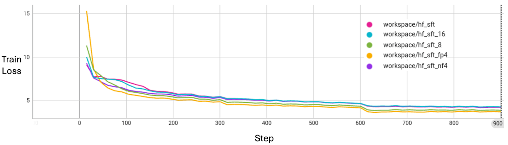

.. _message_quantization:

Message Quantization
********************

Message quantization in NVIDIA FLARE reduces communication overhead in federated learning by reducing the precision of transmitted updates. This feature is particularly beneficial for large language models (LLMs) where the default fp32 message precision can artificially inflate message size.

Background
==========

Previous NVFlare default transmission mode was float32 numpy, which could lead to unnecessarily large messages when working with reduced precision models (e.g., bf16). This was due to the conversion process (bf16->float32) and size doubling. For LLMs, federated aggregation may not be sensitive to quantization, making full precision communication unnecessary.

Two key features were added to improve NVFlare's messaging efficiency for LLMs:

1. Direct tensor communication without converting to numpy
   - Enables sending tensors directly without numpy conversion
   - Preserves special data formats like bf16 that aren't supported by numpy
   - Eliminates the need to cast to float32 before numpy conversion

2. Model quantization and dequantization filters
   - Quantizes messages before transmission
   - Dequantizes after transmission in both directions
   - Reduces transmission size while maintaining original precision for computations

Implementation
--------------

Message quantization is implemented using a filter mechanism that handles the quantization and dequantization of model updates. The process involves:

1. Quantization of model updates before transmission
2. Transmission of the quantized data
3. Dequantization of the received data
4. Training and aggregation at original precision

We utilize bitsandbytes for 8- and 4-bit quantization functionality. The quantization filter automatically recognizes message format (numpy or tensor) and processes accordingly.

For a practical implementation example, see the :github_nvflare_link:`LLM example <examples/advanced/llm_hf>` which demonstrates message quantization in a real-world scenario.

Key Features
------------

* Quantization and dequantization implemented with filter mechanism
* No code changes required from user side - same training script works with/without quantization
* Training and aggregation performed at original precision to minimize impact on training process
* Support for both numpy arrays and torch Tensors
* Direct cropping and casting for fp32 to fp16 conversion
* 8- and 4-bit quantization using bitsandbytes

Precision Options and Performance
---------------------------------

The following precision options are available, with their respective size reductions:

* 32-bit (fp32): Original precision, no quantization
* 16-bit (fp16, bf16): 50% size reduction
* 8-bit: 75% size reduction
* 4-bit (fp4, nf4): 86% size reduction

.. table:: Message Size under Different Quantization Precisions
   :widths: auto
   :align: center

   +-------------+-------------+----------------+-------------+
   | Precision   | Model Size  | Quantization   | fp32 Size   |
   |             | (MB)        | Meta Size (MB) | Percentage  |
   +=============+=============+================+=============+
   | 32-bit      | 5716.26     | 0.00           | 100.00%     |
   | (fp32)      |             |                |             |
   +-------------+-------------+----------------+-------------+
   | 16-bit      | 2858.13     | 0.00           | 50.00%      |
   | (fp16, bf16)|             |                |             |
   +-------------+-------------+----------------+-------------+
   | 8-bit       | 1429.06     | 1.54           | 25.03%      |
   +-------------+-------------+----------------+-------------+
   | 4-bit       | 714.53      | 89.33          | 14.06%      |
   | (fp4, nf4)  |             |                |             |
   +-------------+-------------+----------------+-------------+

Performance Impact
------------------

Message quantization does not sacrifice model convergence quality. As shown in the experiments with LLM Supervised Fine-Tuning (SFT), the training loss curves align well across different precision levels.

Summary
-------

Message quantization provides:

* Significant bandwidth savings
* No impact on model convergence
* Support for various precision levels
* Seamless integration with existing training scripts
* Compatibility with both numpy and PyTorch 