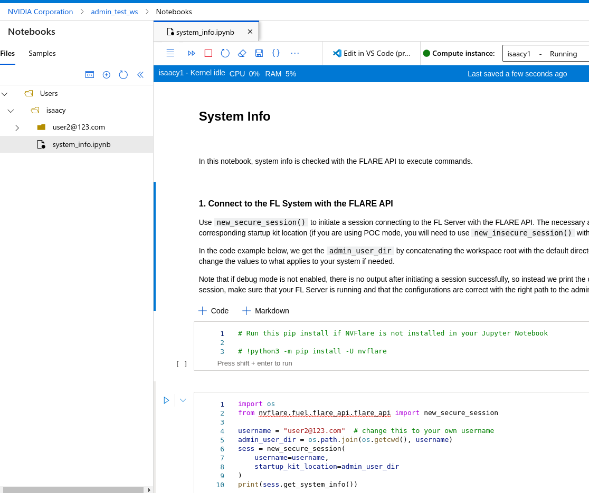

.. _cloud_deployment:

################
Cloud Deployment
################
In version 2.3.0 of NVFLARE, deploying to the cloud has become much easier than before. Previously, deploying to the cloud required someone to
create the necessary virtual machine (VM) and infrastructure before attempting to deploy. However, with this release, users can simplify the
cloud deployment process with a one-line command via the NVFLARE CLI tool. This command will create the necessary cloud infrastructure, such
as resource groups, networking, DNS, and VM instances for Azure, or EC2 instances, security groups, and networks for AWS. The one-line command
is applicable for NVFLARE Dashboard UI, FL Server, and FL clients.

There are two ways to provision and deploy NVFLARE. The first way is to use the :ref:`NVFLARE CLI tool for provisioning <provision_command>`. However,
the startup kits for different FL clients will need to be distributed manually via email, sftp, etc.

The second way is to use the :ref:`NVFLARE Dashboard Web UI <dashboard_api>`, which allows project administrators to set up the FL project once
participants are invited. Users can download the startup kit directly from the FLARE Dashboard without the need for manual distribution.

Regardless of the approach, the user will essentially have a startup kit before trying to deploy the NVFLARE application. To deploy the NVFLARE FL
system to the cloud. You just need the following commands (while substituting in the appropriate values):

.. code-block:: shell

    FL Server:    <startup dir>/start.sh     –cloud <csp>  [ –config config.json ]
    FL Client:      <startup dir>/start.sh     –cloud <csp>  [ –config config.json ]
    Dashboard:   <startup dir>/start.sh     –cloud <csp>  [ –config config.json ]

Deploy NVFLARE Dashboard in the Cloud
=====================================
If you decide to use leverage NVFLARE Dashboard to provision and distribute your startup kit, you will first need to set up NVFLARE Dashboard.
Let us assume that you are the project admin and would like to set up the NVFLARE Dashboard Web Application on the cloud, and you have all the
needed credentials to access and create the cloud infrastructure. In Azure, your role in Azure
subscription must be able to create Resource Group, Virtual Machine and configure Network Security Group and its rules.
In AWS, your role should have AmazonEC2FullAccess.

Create Dashboard on Azure
-------------------------
To run NVFlare dashboard on Azure, run:

.. code-block:: shell

    nvflare dashboard --cloud azure

.. note::

    The script also requires sshpass, dig and jq.  All can be installed on Ubuntu, with:

        .. code-block:: shell

           sudo apt install sshpass bind9-dnsutils jq

Users only need to enter an email address and press Enter. This user needs to remember this email and the temporary password that will be provided, as
this is the login credentials for the NVFLARE Dashboard once the Dashboard is up and running. 

Before you can create the infrastructure, Azure requires users to login with their credentials. This is handled by the official Azure CLI tool that you
can install by following this page: https://learn.microsoft.com/en-us/cli/azure/install-azure-cli. The az login process will show a message similar to the following:

.. code-block:: text

    To sign in, use a web browser to open the page https://microsoft.com/devicelogin and enter the code A12GCJZR2 to authenticate.

Please open the above URL and enter the random code (A12GCJZR2 in the above example). Then follow the entire login process, which will require user credentials and MFA.

The end of the Dashboard deployment process is the same as the on-premise dashboard launch. The NVFlare project admin login credential and IP
address are shown. Users now can start using the NVFlare dashboard on the cloud.

.. code-block:: shell

    Starting dashboard
    Dashboard: Project admin credential is hello@world.com and the password is E3pZkD50, running at IP address 20.20.123.123
    To stop it, run az group delete -n nvflare_dashboard_rg

If web.crt and web.key (the certificate and private key for dashboard) exist in the current working directory, the script will copy
them to the Cloud VM so the dashboard will run in HTTPS mode.  Otherwise, dashboard will run in HTTP mode.  Both will be in port 443.

It's highly recommended to run dashboard in HTTPS as the data transferred between dashboard and browsers contain sensitive information.

It's not within the scope of NVFlare to set up the proper domain name of the NVFlare dashboard.  Users need to purchase a domain name and point
the DNS to the public IP address NVFlare dashboard uses (azure may automatically give you a domain name that you can use).  Take the above
result as an example, the public IP address is 20.20.123.123.

Once the Dashboard is up and running, the project admin can follow :ref:`this documentation<nvflare_dashboard_ui>` for the step-to-step instructions
to specify the FL server and invite others to join the project and eventually download the startup kits for the FL Server or FL Clients.

.. note::

    To stop the dashboard entirely, including remove all resources, such as VM, network and IP, run:

        .. code-block:: shell

           az group delete -n nvflare_dashboard_rg

Create Dashboard on AWS
------------------------
To run NVFlare dashboard on AWS, run:

.. code-block:: shell

    nvflare dashboard --cloud aws

.. note::

    The script also requires sshpass, dig and jq.  They can be installed on Ubuntu, with:

        .. code-block:: shell

           sudo apt install sshpass bind9-dnsutils jq

AWS manages authentications via AWS access_key and access_secret, you will need to have these credentials before you can start creating AWS infrastructure.

The remainder of the user experience is the same as running the :ref:`Dashboard UI<nvflare_dashboard_ui>` elsewhere.

Deploy FL Server in the Cloud
=============================
Assuming you are the project admin, you have downloaded the FL Server startup kit from NVFLARE Dashboard or you have used the
NVFLARE CLI command to generate the startup kit. Now, you would like to set up the FL server in the cloud. 

Deploy FL Server on Azure
-------------------------
With the FL server's startup kit, run the same ``start.sh`` to start a server normally, but with one additional option ``--cloud azure`` to launch the server on Azure.

.. code-block:: shell

    ./startup/start.sh --cloud azure

You can accept all default values by pressing ENTER.

.. code-block:: none

    This script requires az (Azure CLI), sshpass dig and jq.  Now checking if they are installed.
    Checking if az exists. => found
    Checking if sshpass exists. => found
    Checking if dig exists. => found
    Checking if jq exists. => found
    Cloud VM image, press ENTER to accept default Canonical:0001-com-ubuntu-server-focal:20_04-lts-gen2:latest: 
    Cloud VM size, press ENTER to accept default Standard_B2ms: 
    location = westus2, VM image = Canonical:0001-com-ubuntu-server-focal:20_04-lts-gen2:latest, VM size = Standard_B2ms, OK? (Y/n) 
    If the client requires additional dependencies, please copy the requirements.txt to /home/iscyang/workspace/test/azure2/set1/nvflareserver1.westus2.cloudapp.azure.com/startup.
    Press ENTER when it's done or no additional dependencies. 
    A web browser has been opened at https://login.microsoftonline.com/organizations/oauth2/v2.0/authorize. Please continue the login in the web browser. If no web browser is available or if the web browser fails to open, use device code flow with `az login --use-device-code`.
    Opening in existing browser session.
    ... ...
    ... (deleted for clarity) ...
    ... ...
    Creating Resource Group nvflare_rg at Location westus2
    Creating Virtual Machine, will take a few minutes
    WARNING: Starting Build 2023 event, "az vm/vmss create" command will deploy Trusted Launch VM by default. To know more about Trusted Launch, please visit https://docs.microsoft.com/en-us/azure/virtual-machines/trusted-launch
    WARNING: It is recommended to use parameter "--public-ip-sku Standard" to create new VM with Standard public IP. Please note that the default public IP used for VM creation will be changed from Basic to Standard in the future.
    Setting up network related configuration
    Copying files to nvflare_server
    Destination folder is nvflare@20.30.123.123:/var/tmp/cloud
    Warning: Permanently added '20.30.123.123' (ECDSA) to the list of known hosts.
    Installing packages in nvflare_server, may take a few minutes.

Alternatively, users can provide a configuration file with ``--config`` option, eg. ``--config my_local_settings.conf``.  The configuration file is formatted as follows:

.. code-block:: shell

    VM_IMAGE=Canonical:0001-com-ubuntu-server-focal:20_04-lts-gen2:latest
    VM_SIZE=Standard_B2ms
    LOCATION=westus2

When the configuration file is specified, the default values are overwritten and there will be no prompt for users to change default values.

In one or two minutes after the last message, "Installing packages in nvflare_server, may take a few minutes.", is displayed, the server is up and running with the following message:

.. code-block:: shell

    System was provisioned

To stop the server and remove all resources, run:

.. code-block:: shell

    az group delete -n nvflare_rg

As only one NVIDIA FLARE server should exist, the server cloud launch script will fail when it detects the same resource group or security group exists,
which indicates a previously-launched server is not terminated by users. Users should not run again the server scripts before properly cleaning up the existing server.

Deploy FL Server on AWS
-----------------------
With the FL server's startup kit, the following script launches a NVIDIA FLARE server on AWS with a configuration file ``my_config.txt``:

.. code-block:: shell

    ./startup/start.sh --cloud aws --config my_config.txt

You can accept all default values by pressing ENTER.

.. code-block::

    This script requires aws (AWS CLI), sshpass, dig and jq.  Now checking if they are installed.
    Checking if aws exists. => found
    Checking if sshpass exists. => found
    Checking if dig exists. => found
    Checking if jq exists. => found
    If the server requires additional dependencies, please copy the requirements.txt to /home/nvflare/workspace/aws/nvflareserver/startup.
    Press ENTER when it's done or no additional dependencies. 
    Generating key pair for VM
    Creating VM at region us-west-2, may take a few minutes.
    VM created with IP address: 20.20.123.123
    Copying files to nvflare_server
    Destination folder is ubuntu@20.20.123.123:/var/tmp/cloud
    Installing packages in nvflare_server, may take a few minutes.
    System was provisioned
    To terminate the EC2 instance, run the following command.
    aws ec2 terminate-instances --instance-ids i-0bf2666d27d3dd31d
    Other resources provisioned
    security group: nvflare_server_sg
    key pair: NVFlareServerKeyPair

The configuration file provided is formatted as follows:

.. code-block:: shell

    AMI_IMAGE=ami-03c983f9003cb9cd1
    EC2_TYPE=t2.small
    REGION=us-west-2

.. note::

    For the AWS AMIs, we recommend the following images for each version of Ubuntu:
    20.04:ami-04bad3c587fe60d89, 22.04:ami-03c983f9003cb9cd1, 24.04:ami-0406d1fdd021121cd

Deploy FL Client in the Cloud
=============================
As an organization admin for an FL project, you are responsible for setting up your FL Client system. You will receive a Client startup kit either from email, sftp
or directly download from NVFLARE Dashboard.

Deploy FL Client on Azure
-------------------------
With an FL client startup kit, run the same ``start.sh`` command as you would to start it normally, but with one additional option ``--cloud azure`` to launch the client on Azure.

.. code-block:: shell

    ./startup/start.sh --cloud azure

Users can accept all default values by pressing ENTER. Alternatively, you can provide a configuration file with ``--config`` option,
eg. ``--config my_local_settings.conf``.  The configuration file is formatted as follows:

.. code-block:: shell

    VM_IMAGE=Canonical:0001-com-ubuntu-server-focal:20_04-lts-gen2:latest
    VM_SIZE=Standard_B2ms
    LOCATION=westus2

The entire process of launching clients on Azure is very similar to the server launching process.
In one or two minutes after the last message, "Installing packages in nvflare_server, may take a few minutes.", is displayed,
the server is up and running with the following message:

.. code-block:: shell

    System was provisioned

To stop the client and remove all resources, run:

.. code-block:: shell

    az group delete -n nvflare_client_rg

Deploy FL Client on AWS
-----------------------
With an FL client startup kit, run the same ``start.sh`` command as you would to start it normally, but with one additional option ``--cloud aws`` to launch the client on AWS.

.. code-block:: shell

    ./startup/start.sh --cloud aws

Users can accept all default values by pressing ENTER. Alternatively, you can provide a configuration file with ``--config`` option,
eg. ``--config my_config.txt``.  The configuration file is formatted as follows:

.. code-block:: shell

    AMI_IMAGE=ami-03c983f9003cb9cd1
    EC2_TYPE=t2.small
    REGION=us-west-2

Post Deployment
===============
After deploying dashboard/server/client to the cloud, you can ssh into the VM.  If you try to run ssh from a computer other than the one you ran the scripts,
its public IP address might not be within the source IP range of inbound rules.  Please use AWS or Azure web to update the inbound rules.

Checking FL System Status
=========================
With deployed FL server and clients, to make sure all systems are running correctly, you can check the server status.

With 2.3.0, there are two ways to check server status, using the FLARE console (aka Admin console) or FLARE API.
You can find more information on FLARE console commands on :ref:`this page <operating_nvflare>`, and the FLARE API :ref:`here <flare_api>`.

Check Status with FLARE Console
-------------------------------
You can launch the FLARE console with the ``fl_admin.sh`` script inside the startup kit of an admin user then use the ``check_status server`` command to
see the status.

Check Status with FLARE API
---------------------------
For users who are familiar with Jupyter Notebook, there is one additional file, ``system_info.ipynb``, inside the startup kit. This Jupyter Notebook can run
either in Azure ML Notebook or locally with the NVFlare package installed, and checks the status with the FLARE API.

To run ``system_info.ipynb`` on Azure ML Notebook, users have to upload their startup kit to Azure's web UI.

