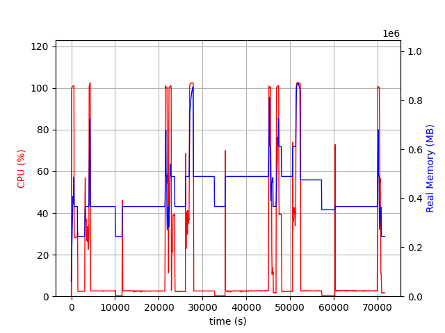
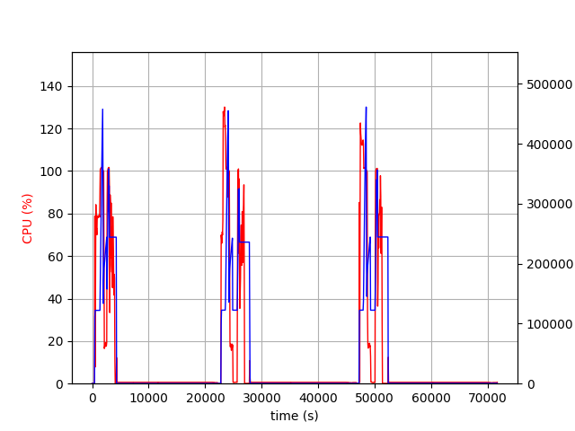
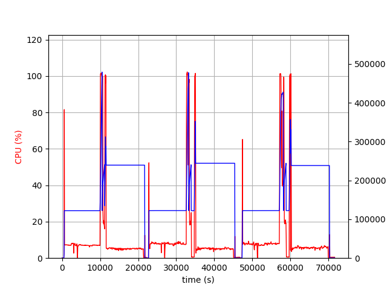

.. _notes_on_large_models:

Large Models
============
As the federated learning tasks become more and more complex, their model sizes increase.  Some model sizes may go beyond 2GB and even reach hundreds of GB.  NVIDIA FLARE supports
large models as long as the system memory of servers and clients is capable of handling it.  However, it requires special consideration on NVIDIA FLARE configuration and the system because
the network bandwidth and thus the time to transmit such large amount of data during NVIDIA FLARE job runtime varies significantly.  Here we describe 128GB model training jobs to highlight
the configuration and system that users should consider for successful large model federated learning jobs.

System Deployment
*****************
Our successful experiments of 128GB model training were running on one NVIDIA FLARE server and two clients.  The server was deployed in Azure west-us region.  One of those two clients
was deployed in AWS west-us-2 region and the other was in AWS ap-south-1 region.  The system was deployed in such cross-region and cross-cloud-service-provider manner so that we can test
NVIDIA FLARE system with various conditions on the network bandwidth.
The Azure VM size of the NVIDIA FLARE server was M32-8ms, which has 875GB memory.  The AWS EC2 instance type of NVIDIA FLARE clients was r5a.16xlarge with 512GB memory.  We also enabled
128GB swap space on all machines.

Job of 128GB Models
*******************
We slightly modified the hello-numpy example to generate a model, which was a dictionary of 64 keys.  Each key contained a 2GB NumPy array.  The local training task was to add a small number to
those numpy arrays.  The aggregator on the server side was not changed.  This job required at least two clients and ran 3 rounds to finish.

Configuration
*******************
We measured the bandwidth between the server and west-us-2 client.  It took around 2300 seconds to transfer the model from the client to the server and around 2000 seconds from the server to the client.
On the ap-south-1 client, it took about 11000 seconds from the client to the server and 11500 seconds from the server to the client.  We updated the following values to accommodate such differences.

    - streaming_read_timeout to 3000
    - streaming_ack_wait to 6000
    - communication_timeout to 6000

The `streaming_read_timeout` is used to check when a chunk of data is received but not read by the upper layer.  The `streaming_ack_wait` is how long the sender should wait for acknowledgement returned by the receiver for one chunk.

The `communication_timeout` is used on three consecutive stages for a single request and response.  When sending a large request (submit_update), the sender starts a timer with timeout = `communication_timeout`.
When this timer expires, the sender checks if any progress is made during this period.  If yes, the sender resets the timer with the same timeout value and waits again.  If not, this request and response returns with timeout.
After sending completes, the sender cancels the previous timer and starts a `remote processing` timer with timeout = `communication_timeout`.  This is to wait for the first returned byte from the receiver.  On
large models, the server requires much longer time to prepare the task when the clients send `get_task` requests.  After receiving the first returned byte, the sender cancels the `remote processing` timer and starts
a new timer.  It checks the receiving progress just like sending.

Since the experiment was based on hello-numpy, one of the arguments, `train_timeout` in the ScatterAndGather class had to be updated.  This timeout is used to check the scheduling of training tasks.  We
changed this argument to 60000 for this experiment.

Memory Usage
*******************
During the experiment, the server could use more than 512GB, ie 128GB * 2 clients * 2 (model and runtime space).  The following figure shows the CPU and memory usage of the server.

Although most of the time, the server was using less than 512GB, there were a few peaks that reached 700GB or more.

The followings are clients, west-us-2 and ap-south-1.

The west-us-2 client, with its fast bandwidth with the server, received and sent the models in about 100 minutes and entered nearly idle state with little cpu and memory usage.  Both
clients used about 256GB, ie 128GB * 2 (model and runtime space), but at the end of receiving large models and at the beginning of sending large models, these two clients required more than
378GB, ie 128GB * 3.

