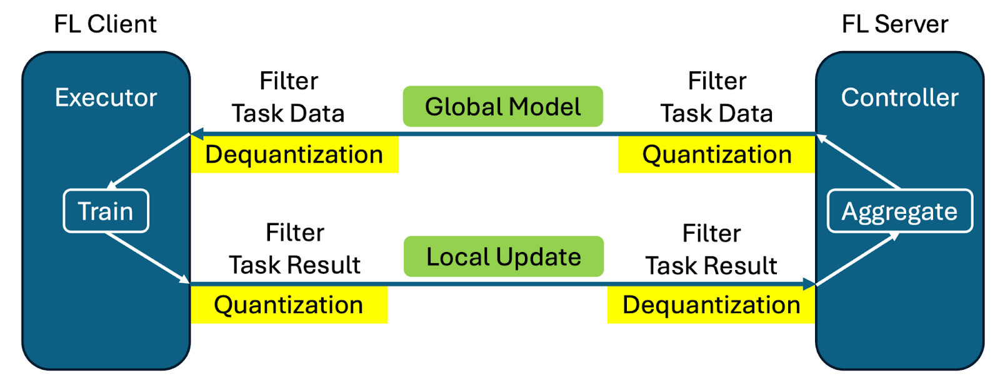

**************************
What's New in FLARE v2.6.0
**************************

Message Quantization
====================
Message quantization offers a solution to reduce communication overhead in federated learning by reducing the precision of transmitted updates. This feature is particularly beneficial for large language models (LLMs) where the default fp32 message precision can artificially inflate message size. For more details, see :ref:`Message Quantization <message_quantization>`.

Key features:
  - Quantization and dequantization implemented with filter mechanism
  - No code changes required from user side - same training script works with/without quantization
  - Training and aggregation performed at original precision to minimize impact on training process
  - Support for both numpy arrays and torch Tensors
  - Direct cropping and casting for fp32 to fp16 conversion
  - 8- and 4-bit quantization using bitsandbytes

The table below illustrates the message size in MB for a 1B parameter LLM under different precisions. You can find more details regarding training loss curve alignments in the :github_nvflare_link:`LLM example <examples/advanced/llm/README.md>`.

.. table:: Message Size under Different Quantization Precisions
   :widths: auto
   :align: center

   +-------------+-------------+----------------+-------------+
   | Precision   | Model Size  | Quantization   | fp32 Size   |
   |             | (MB)        | Meta Size (MB) | Percentage  |
   +=============+=============+================+=============+
   | 32-bit      | 5716.26     | 0.00           | 100.00%     |
   | (fp32)      |             |                |             |
   +-------------+-------------+----------------+-------------+
   | 16-bit      | 2858.13     | 0.00           | 50.00%      |
   | (fp16, bf16)|             |                |             |
   +-------------+-------------+----------------+-------------+
   | 8-bit       | 1429.06     | 1.54           | 25.03%      |
   +-------------+-------------+----------------+-------------+
   | 4-bit       | 714.53      | 89.33          | 14.06%      |
   | (fp4, nf4)  |             |                |             |
   +-------------+-------------+----------------+-------------+

By applying message quantization techniques, FL can achieve significant bandwidth savings, and for training LLM with Supervised Fine-Tuning (SFT) in our experiments. As shown in the Figure below, message quantization does not sacrifice model convergence quality with regard to the training loss.

.. image:: ../resources/quantization_loss.png
    :height: 300px

Native Tensor Transfer
======================
FLARE 2.6.0 introduces support for native tensor transfer, allowing PyTorch tensors to be sent directly without serialization overhead. This eliminates the need for Tensor to Numpy conversion, preserving the original FPnn format. The feature is currently supported for PyTorch only.

Model Streaming Enhancements
============================
Reduce Local Memory Usage
-------------------------
The new object container streaming feature processes and transmits models incrementally, rather than requiring the entire dictionary of gradients to be stored in memory at once. This significantly reduces memory overhead for large models. For more details, see :class:`ContainerStreamer<nvflare.app_common.streamers.container_streamer.ContainerStreamer>`.

For example, a 70GB model with 1GB item-max:
  - Regular transmission: 70GB + 70GB = 140GB memory needed
  - Container streaming: 70GB + 1GB = 71GB memory needed

Support Unlimited Memory Streaming
----------------------------------
File-based streaming is introduced to handle models larger than available memory. This feature reads files chunk-by-chunk, requiring only enough memory to hold one chunk of data. The memory usage is independent of model size and only depends on file I/O settings. For more details, see :class:`FileStreamer<nvflare.app_common.streamers.file_streamer.FileStreamer>`.

Memory comparison for sending a 1B model:
  - Regular transmission: 42,427 MB peak memory, 47s completion time
  - Container streaming: 23,265 MB peak memory, 50s completion time
  - File streaming: 19,176 MB peak memory, 170s completion time

Note: Streaming enhancements are not yet integrated into high-level APIs or existing FL algorithm controllers/executors. Users can build custom controllers or executors to leverage this feature.

Structured Logging
==================
The structured logging feature addresses several customer concerns:
  - JSON format logging for data observability tools
  - Separation of training logs from communication logs
  - Dynamic log level changes for production debugging
  - Package-level hierarchy for granular control

Key improvements:
  - Changed from `fileConfig <https://docs.python.org/3/library/logging.config.html>`_ to `dictConfig <https://docs.python.org/3/library/logging.config.html#logging.config.dictConfig>`_
  - The new FLARE Loggers are designed to follow the package level hierarchy using dot separated logger names in order to facilitate granular control at different levels
  - :doc:`Default Logging Configuration file <../user_guide/admin_guide/configurations/logging_configuration>` `log_config.json.default` for all NVFLARE sub-systems with pre-configured handlers for console level colors, logs, error logs, structured json logs, and fl training logs
  - :doc:`Dynamic Logging Configuration Commands <../user_guide/admin_guide/configurations/logging_configuration>` to allow dynamic change logging configuration without restarting the FL system
  - To support various needs and backward compatibility, we now have the following default log files:
    - log.txt: default log file from previous NVFLARE versions
    - log.json: JSON format log
    - log_error.txt: ERROR level logs to log_error.txt for quick error lookup
    - log_fl.txt: FL task-specific logs (removes the system and communication related logs and clearly shows logs related to FL tasks such as training)
  - Predefined logging modes for simulator:
    - Concise (default): only FL tasks logs
    - Full: previous logging configuration
    - Verbose: debug level logging

For details, please refer to `logging tutorials <https://github.com/NVIDIA/NVFlare/blob/2.6/examples/tutorials/logging.ipynb>`_ and :doc:`logging documentation <../user_guide/admin_guide/configurations/logging_configuration>`.

Federated Statistics Extension
==============================
Quantiles Support: Introduces quantile computation for federated statistics, helping summarize data distribution by providing key points that indicate how values are spread. Quantiles divide a probability distribution or dataset into intervals with equal probabilities, providing insights into data distribution patterns. For more details, see :ref:`Federated Statistics Overview <federated_statistics>`.

System Monitoring
=================
FLARE Monitoring provides system metrics tracking for federated learning jobs, focusing on job and system lifecycle metrics. It leverages StatsD Exporter to monitor FLARE job and system events, which can be scraped by Prometheus and visualized with Grafana. This differs from machine learning experiment tracking by focusing on system-level metrics rather than training metrics. For more information, see :ref:`Monitoring <monitoring>`.

.. image:: ../resources/system_monitoring.png
    :height: 450px

Flower Integration v2
=====================
NVFlare has been updated to work with the latest Flower system architecture, which separates the client app from the supernode process. All user-facing functions remain the same. One benefit of this update is that job status information can be shared between the two systems more accurately.

This integration enables applications developed with Flower to run natively on the FLARE runtime without requiring any code modifications. By unifying Flower's widely adopted, easy-to-use design tools and APIs with FLARE's industrial-grade runtime, this integration simplifies the end-to-end deployment pipeline.

For more details on this integration, see our `blog <https://developer.nvidia.com/blog/supercharging-the-federated-learning-ecosystem-by-integrating-flower-and-nvidia-flare>`_.

HTTP Driver Enhancement
=======================
The HTTP driver has been completely rewritten using aiohttp, significantly improving reliability and efficiency. The new implementation resolves previous issues with poor performance and network error recovery, matching the performance of GRPC and TCP drivers.

FLARE + BioNemo 2
=================
NVFlare examples have been upgraded to use `BioNeMo 2 <https://docs.nvidia.com/bionemo-framework/latest/>`_, enabling significant performance improvements on downstream tasks. The integrated BioNeMo ESM2 base models (650M) demonstrate notable gains in accuracy:

Subcellular Localization (SCL) Prediction:
  - BioNeMo 1: 0.773 accuracy
  - BioNeMo 2: 0.788 accuracy
  - FL: 0.776 to 0.817 accuracy improvement

New Features
------------
TensorBoard Metric Streaming Callback
"""""""""""""""""""""""""""""""""""""
Implemented a callback for PyTorch Lightning to stream training metrics to the FL server via NVFlare, allowing real-time visualization of training curves.

Downstream Task Fitting
-----------------------
Local Fine-Tuning tends to overfit, with training accuracy diverging from validation early. In contrast, Federated Averaging (FedAvg) models show continual performance improvement, highlighting the benefits of federated generalization over isolated training.

For more details, see our :github_nvflare_link:`BioNeMo examples <examples/advanced/bionemo>`_.

Tutorials and Education
=======================
Self-paced-training tutorials covering:
  - Introduction to Federated Learning
  - Federated Learning System
  - Security and Privacy
  - Advanced Topics in Federated Learning
  - Federated Learning in Different Industries

New Examples
============
1. Federated Embedding Model Training
2. Object Streaming
3. System Monitoring
4. Distributed Optimization
5. Logging Tutorial

**********************************
Migration to 2.6.0: Notes and Tips
**********************************

Dashboard Changes
=================

In NVIDIA FLARE 2.6, several changes have been made to the Dashboard:

#. All API endpoints are now prefixed with ``/nvflare-dashboard/api/v1/``. For example, the login endpoint has changed from ``/api/v1/login`` to ``/nvflare-dashboard/api/v1/login``.
   This change affects all API calls to the dashboard backend. Update your client applications accordingly.

#. The overseer and additional server for HA mode have been removed. The project configuration now only includes information about the main server.

#. The ``FLARE_DASHBOARD_NAMESPACE`` constant has been added to the codebase. All API endpoints should now use this namespace prefix.

ScriptRunner Changes in FLARE 2.6.0
===================================

Overview
--------

FLARE 2.6.0 introduces a new `server_expected_format` parameter to enhance data exchange flexibility across the entire pipeline. This parameter is now available in:
- `ScriptRunner`
- `ClientAPILauncherExecutor`
- `InProcessClientAPIExecutor`

## Previous Implementation
Previously, data format was controlled by:
- `params_exchange_format` in executors
- `framework` in `ScriptRunner`

These parameters only defined the communication format between the NVFlare client and the user script. For example, setting `params_exchange_format` to "pytorch" meant the client communicated with the script using PyTorch tensors.

However, the server-to-client communication was always restricted to NumPy arrays.

New Implementation
------------------

With FLARE 2.6.0, we now support:
1. End-to-end PyTorch tensor pipeline
2. Flexible format specification at each communication boundary
3. Native PyTorch tensor transmission

The new `server_expected_format` parameter specifically controls the format used in server-client communication. When set to "pytorch", the entire pipeline - from server to client to script - can operate using PyTorch tensors without any format conversion.

