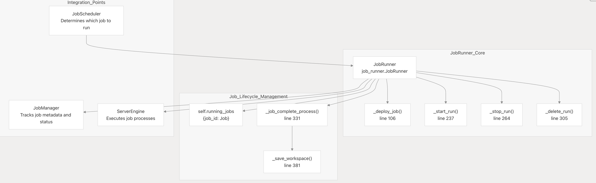

.. _flare_system_architecture:

####################
FLARE Architecture
####################

.. image:: ../resources/flare_overview.png
   :alt: Architecture Overview
   :height: 400

Purpose and Scope
=================

This document describes NVIDIA FLARE's overall system architecture, including its major subsystems, process model,
and component interactions. It provides a technical overview of how the platform orchestrates federated learning
workloads across distributed participants.

For detailed information about specific subsystems:

- Communication infrastructure: see :ref:`cellnet_architecture`
- Provisioning and deployment: see :ref:`provisioning`
- Security: see :ref:`flare_security_overview`

Architectural Overview
======================

NVIDIA FLARE is a distributed federated learning platform with a multi-process, component-based architecture.
The system is organized into distinct layers: user interaction, provisioning, runtime execution, communication,
and storage.

The FLARE architecture comprises three main layers:

- **Foundation Layer**: Communication infrastructure, messaging protocols, privacy preservation tools, and secure platform management.
- **Application Layer**: Building blocks for federated learning, including federation workflows and learning algorithms.
- **Tooling**: FL Simulator and POC CLI for experimentation and simulation, plus deployment and management tools for production workflows.

Core Design Principles
----------------------

**Component-Based Design**

The architecture uses pluggable components (``Controller``, ``Executor``, ``Filter``, ``Aggregator``) defined in
JSON configuration files to implement federated learning algorithms. This enables flexible composition of
workflows without code changes.

**Multi-Process Isolation**

Parent processes (``ProcessType.SERVER_PARENT``, ``ProcessType.CLIENT_PARENT``) manage system lifecycle and spawn
isolated job processes (``ProcessType.SERVER_JOB``, ``ProcessType.CLIENT_JOB``) for workload execution. This
provides fault tolerance and resource isolation.

**Cell-Based Communication**

All inter-process and inter-machine communication uses the ``Cell`` class from the F3 CellNet framework. Addressing
uses Fully Qualified Cell Names (FQCN), and messages are routed through predefined ``CellChannel`` values.

**Multiple Deployment Modes**

The same core classes support three deployment modes: ``SimulatorRunner`` (single process with threads), POC mode
(multiple processes on localhost), and production (distributed processes with mTLS).

Core Components
===============

Primary System Modules
----------------------

.. list-table::
   :header-rows: 1
   :widths: 20 35 45

   * - Component
     - Primary Classes/Modules
     - Purpose
   * - FL Runtime
     - ServerEngine, ClientEngine, JobRunner
     - Core federated learning orchestration and execution
   * - Job Management
     - Job definition, storage, scheduling
     - Job lifecycle and state management
   * - Communication
     - Cell, CoreCell, StreamCell, Pipe
     - Secure inter-party communication with streaming support
   * - Client Integration
     - ClientAPI (flare.receive(), flare.send()), LauncherExecutor
     - ML framework integration and external process management
   * - Administration
     - Dashboard, Admin Console
     - Programmatic and GUI-based system management
   * - Deployment
     - ProvisionerSpec, WorkspaceBuilder
     - Certificate generation, configuration, and secure deployment
   * - Workflows
     - ScatterAndGather, FedAvg, ModelController
     - Built-in federated learning algorithms and patterns

Multi-Process Architecture
==========================

NVIDIA FLARE uses a multi-process architecture where parent processes manage system lifecycle and spawn isolated
job processes for workload execution.

Process Types
-------------

.. list-table::
   :header-rows: 1
   :widths: 15 25 60

   * - Process
     - Code Symbol
     - Description
   * - SP
     - ``ProcessType.SERVER_PARENT``
     - Server parent process running FederatedServer and ServerEngine
   * - SJ
     - ``ProcessType.SERVER_JOB``
     - Server job process running ServerRunner and workflow Controllers
   * - CP
     - ``ProcessType.CLIENT_PARENT``
     - Client parent process running FederatedClient and ClientEngine
   * - CJ
     - ``ProcessType.CLIENT_JOB``
     - Client job process running ClientRunner and Executors

.. |job_arch1| image:: ../resources/job_architecture.png
   :alt: Job Architecture
   :width: 45%

.. |job_arch2| image:: ../resources/Job_architecture2.png
   :alt: Job Architecture
   :width: 45%

|job_arch1| |job_arch2|

Process Responsibilities
------------------------

**Server Parent (SP)**

- Runs ``FederatedServer`` for client registration and heartbeat monitoring
- Houses ``ServerEngine`` which orchestrates job scheduling via ``JobRunner``
- Spawns Server Job (SJ) processes or containers for each active job
- Manages authentication and token issuance for clients

**Server Job (SJ)**

- Runs ``ServerRunner`` for workflow execution
- Executes workflow Controllers (e.g., ``ScatterAndGather``, ``FedAvg``)
- Broadcasts tasks to client jobs and aggregates results
- Isolated process per job for fault tolerance

**Client Parent (CP)**

- Runs ``FederatedClient`` for registration with server
- Houses ``ClientEngine`` which coordinates job execution
- Spawns Client Job (CJ) processes or containers for assigned jobs
- Maintains connection heartbeat with server

**Client Job (CJ)**

- Runs ``ClientRunner`` for task execution
- Pulls tasks from server via Cell network
- Launches training processes using ``LauncherExecutor``
- Routes task data to/from training process via Pipe

**Training Process**

- User's ML training script
- Uses Client API: ``flare.init()``, ``flare.receive()``, ``flare.send()``
- Communicates with CJ via FilePipe (file-based) or CellPipe (network-based)

Process Lifecycle and Spawning
------------------------------

Job processes are spawned dynamically when jobs are scheduled:

1. **Job Submission**: Admin submits job via ``nvflare job submit``
2. **Scheduling**: ``JobRunner`` selects job based on policy and resource availability
3. **Server Job Spawn**: SP spawns SJ process with job configuration
4. **Client Notification**: SP notifies registered clients to start job
5. **Client Job Spawn**: Each CP spawns CJ process for the job
6. **Execution**: SJ and CJ processes execute workflow
7. **Completion**: Processes terminate and report status to parents

K8s-native Architecture: Control and Execution Planes Separation
-----------------------------------------------------------------

.. note::

   The K8s-native feature is coming soon.

Parent pods manage the system lifecycle and spawn job pods (server job pod, client job pod) for workload execution.
The server hosts the central coordination logic and is designed to be resilient, scalable, and capable of handling
high-throughput metadata traffic separately from high-volume data traffic.
The following diagram illustrates the Server Parent (SP), Server Job (SJ), and related pods within the Kubernetes environment.

.. image:: ../resources/k8s_control_execution_planes.png
   :alt: Control & Execution Planes in K8s
   :height: 300px

Communication Framework
=======================

The Communication Framework, also known as F3 (FLARE Foundation Framework) and CellNet, provides the foundational
messaging infrastructure for all communication in NVIDIA FLARE.

Key capabilities include:

- **FQCN Addressing**: Hierarchical cell names (e.g., ``server.job_123``, ``client.site-1.job_123``)
- **Channel-Based Routing**: Predefined channels for task distribution, commands, and auxiliary messages
- **Secure Messaging**: End-to-end encryption with certificate-based authentication
- **Large Data Streaming**: Automatic chunking with flow control for model weights and datasets

CellNet uses a three-layer architecture (CoreCell → StreamCell → Cell) that abstracts transport details
and supports multiple protocols (gRPC, TCP, HTTP).

For detailed information on CellNet internals, channels, streaming components, and communication patterns,
see :ref:`cellnet_architecture`.

Message Flow: Task Pull Pattern
-------------------------------

FLARE uses a pull-based task distribution pattern:

1. **Task Creation**: Controller creates task with payload
2. **Task Broadcast**: ServerRunner broadcasts task availability
3. **Task Pull**: ClientRunner pulls task via ``CellChannel.SERVER_MAIN``
4. **Task Execution**: Executor processes task, produces result
5. **Result Push**: ClientRunner sends result via ``CellChannel.SERVER_MAIN``
6. **Result Processing**: Controller aggregates results

Client API Job Process
======================

The Client API provides a simplified interface for integrating user training scripts with the FLARE job process.
With just a few lines of code changes, data scientists can convert centralized training code to federated learning.

.. image:: ../resources/client_api.png
   :alt: Client API Architecture
   :height: 300px

Key characteristics:

- **Minimal Code Changes**: Three core methods (``init()``, ``receive()``, ``send()``) handle all FL communication
- **Two Execution Modes**: In-process (single GPU, maximum performance) or sub-process (multi-GPU, process isolation)
- **Framework Support**: Works with PyTorch, PyTorch Lightning, HuggingFace, and other frameworks

For detailed Client API documentation, communication patterns, configuration options, and examples,
see :ref:`client_api`

Job Management
==============

Job Structure
-------------

A FLARE job consists of:

- **meta.json**: Job metadata (name, deploy map, resource requirements)
- **config_fed_server.json**: Server-side component configuration
- **config_fed_client.json**: Client-side component configuration
- **Custom code**: Application-specific components and scripts

Job Lifecycle States
--------------------

.. list-table::
   :header-rows: 1
   :widths: 25 75

   * - State
     - Description
   * - ``SUBMITTED``
     - Job submitted, awaiting scheduling
   * - ``DISPATCHED``
     - Job assigned to clients, processes starting
   * - ``RUNNING``
     - Job actively executing
   * - ``FINISHED_COMPLETED``
     - Job completed successfully
   * - ``FINISHED_ABORTED``
     - Job aborted by admin or error
   * - ``FINISHED_EXECUTION_EXCEPTION``
     - Job failed due to exception

JobRunner Architecture
----------------------

The ``JobRunner`` is responsible for:

- Monitoring submitted jobs in the job store
- Scheduling jobs based on policy and resource availability
- Deploying jobs to server and client processes
- Tracking job status and handling completion/failure

Deployment Modes
================

NVIDIA FLARE provides three deployment modes that share the same core runtime but differ in packaging, security,
and deployment complexity.

Deployment Modes Comparison
---------------------------

.. list-table::
   :header-rows: 1
   :widths: 15 25 15 25 20

   * - Mode
     - Use Case
     - Security
     - Processes
     - Setup Time
   * - Simulator
     - Rapid prototyping, algorithm testing
     - None
     - Single process with threads (may spawn multiple processes in some cases)
     - Seconds
   * - POC
     - Local multi-client testing, workflow validation
     - Optional
     - Multiple processes on localhost
     - Minutes
   * - Production
     - Real-world distributed deployment
     - Full PKI/mTLS
     - Distributed across machines
     - < 1 hr (with provisioning)

Simulator Mode
--------------

Simulator mode runs the entire FL system in a localhost using threads and processes

**Characteristics**:

- Single process with ``SimulatorRunner``
- Clients simulated as threads sharing memory
- Uses network communication (in-memory message passing coming soon)
- Fastest iteration for algorithm development

**Usage with Job Recipe**:

.. code-block:: python

   recipe = FedAvgRecipe(...)
   env = SimEnv(num_clients=n_clients, num_threads=n_clients)
   recipe.execute(env=env)

**Usage with CLI**:

.. code-block:: bash

   nvflare simulator -w workspace -n 2 -t 2 <job_dir>

POC Mode
--------

POC mode launches separate processes for server and clients on localhost.

**Characteristics**:

- Server parent process with separate client parent processes
- Uses actual network communication (gRPC on localhost)
- Job processes spawn using same mechanism as production
- TLS optional (for testing purposes)

**Usage with Job Recipe**:

.. code-block:: python

   recipe = FedAvgRecipe(...)
   env = POCEnv(num_clients=2)
   recipe.execute(env=env)

**Usage with CLI**:

.. code-block:: bash

   nvflare poc prepare -n 2
   nvflare poc start
   nvflare job submit -j <job_dir>

Production Mode
---------------

Production mode deploys across multiple machines with full security enforcement.

**Requirements**:

- Separate machines for server and clients
- PKI certificates generated by Provisioner
- All certificates signed by root CA
- Optional: Overseer for high availability
- Optional: Relay nodes for hierarchical connectivity

**Characteristics**:

- Server runs via ``nvflare.private.fed.app.server.server_train``
- Clients run via ``nvflare.private.fed.app.client.client_train``
- All Cell instances use mTLS (mutual TLS)
- Full authentication and authorization enforcement

Security Architecture
=====================

PKI and Certificate Management
------------------------------

NVIDIA FLARE uses PKI for mutual authentication in secure mode:

**Certificate Hierarchy**:

- **Root CA**: Self-signed certificate authority generated during provisioning
- **Server Certificate**: Signed by Root CA, identifies server
- **Client Certificates**: Signed by Root CA, unique per client
- **Admin Certificates**: Signed by Root CA, include role attributes for RBAC

**Authentication Protocol**:

1. Client sends challenge (random nonce) to server
2. Server proves identity by signing nonce with its private key
3. Client validates server, sends registration with signed response
4. Server issues authentication token for subsequent requests

**Token-Based Authentication**:

After registration, all messages include authentication headers:

- ``TOKEN``: Client authentication token
- ``TOKEN_SIGNATURE``: Server signature for verification
- ``SSID``: Service session ID

Authorization Service
---------------------

The ``AuthorizationService`` enforces role-based access control:

- Policy defined in ``authorization.json``
- Admin commands checked against user role from certificate
- Rights enforced before command execution

For more details, see :ref:`flare_security_overview`.

Configuration and Customization
===============================

Component Configuration
-----------------------

FLARE uses JSON configuration files to assemble components:

**Server Configuration** (``config_fed_server.json``):

.. code-block:: json

   {
     "format_version": 2,
     "workflows": [
       {
         "id": "scatter_and_gather",
         "path": "nvflare.app_common.workflows.scatter_and_gather.ScatterAndGather",
         "args": {"min_clients": 2, "num_rounds": 3}
       }
     ],
     "components": [
       {"id": "persistor", "path": "..."},
       {"id": "aggregator", "path": "..."}
     ]
   }

**Client Configuration** (``config_fed_client.json``):

.. code-block:: json

   {
     "format_version": 2,
     "executors": [
       {
         "tasks": ["train", "validate"],
         "executor": {"path": "...", "args": {...}}
       }
     ]
   }

Filter Pipeline
---------------

Filters implement privacy preservation and data transformation:

- **Task Data Filters**: Applied before executor receives task
- **Task Result Filters**: Applied after executor produces result
- **Direction**: ``IN`` (server→client) or ``OUT`` (client→server)

**Common Filters**:

- ``PercentilePrivacy``: Clip values to percentiles
- ``DifferentialPrivacyFilter``: Add noise for differential privacy
- ``ExcludeVars``: Exclude specific variables from sharing

Additional Resources
====================

- CellNet Architecture: :ref:`cellnet_architecture`
- Security Overview: :ref:`flare_security_overview`
- Provisioning: :ref:`provisioning`
- Job Recipe API: :ref:`job_recipe`
- FLARE CLI: :ref:`nvflare_cli`
