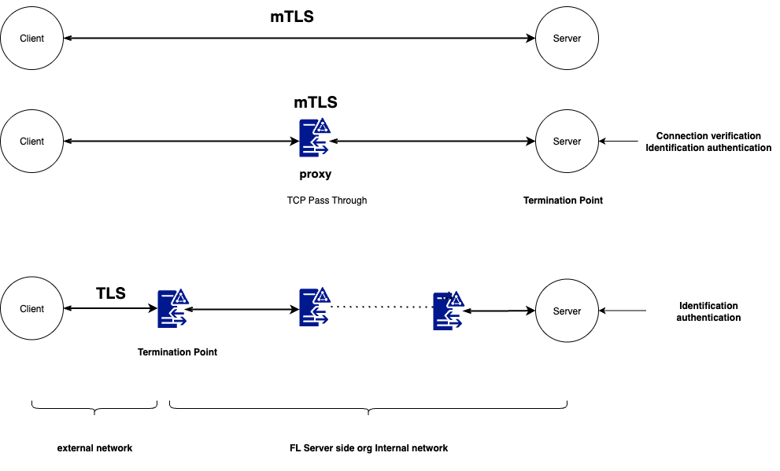

.. _server_port_consolidation:

Single-Port Server Deployment
=============================

**FLARE requires only one open port** for the FL server. A single port handles both
FL client/server communication and admin client/server communication.

.. note::

   If your network policies require separate ports for different types of traffic,
   you can optionally configure two separate ports. See `Using Separate Ports`_ below.

The diagram above illustrates the connection and authentication mechanisms enabled by
single-port, TLS, and :ref:`BYOConn <byoconn>` features.

Using Separate Ports
~~~~~~~~~~~~~~~~~~~~

For environments where different network security policies apply to admin and client traffic,
the system can still be provisioned with two separate port numbers. See the provisioning
configuration below for details.

Port Number Provision
---------------------

The FL port number is specified with the ``fed_learn_port`` property in the project's provisioning configuration file (e.g., ``project.yml``). See the example below.

.. code-block:: yaml

   participants:
    # change example.com to the FQDN of the server
    - name: server
      type: server
      org: nvidia
      use_aio: false
      fed_learn_port: 8002
      host_names: [localhost, 127.0.0.1]
      default_host: localhost

If the property is not explicitly specified, it defaults to 8002. By default, the ``fed_learn_port`` is also used as the ``admin_port``. However, you can specify a different port number using the ``admin_port`` property.

.. code-block:: yaml

   participants:
    # change example.com to the FQDN of the server
    - name: server
      type: server
      org: nvidia
      use_aio: false
      fed_learn_port: 8002
      admin_port: 8003
      host_names: [localhost, 127.0.0.1]
      default_host: localhost

Admin Client Configuration
--------------------------

Once provisioned, an admin user will receive a startup kit, which is used to connect to the FLARE server using the admin client (or FLARE API).

The ``startup`` folder in the kit contains essential configuration information that must not be modified by the user. If the file is modified, the admin client will detect it and will not connect to the server.

The ``local`` folder in the kit contains the ``resources.json.default`` file, which includes configuration parameters that the user can modify.

.. code-block:: json

   {
    "format_version": 1,
    "admin": {
      "idle_timeout": 900.0,
      "login_timeout": 10.0,
      "with_debug": false,
      "authenticate_msg_timeout": 2.0,
      "prompt": "> "
    }
   }

The user can edit this file and set the parameters to better fit their local environment.

Idle Timeout
------------

For security, the admin client automatically shuts down when idle for too long. The ``idle_timeout`` parameter specifies how long the client is allowed to be idle before automatic shutdown.

The default value is 900 seconds.

Login Timeout
-------------

When the admin client is started, it attempts to log in. However, the FL server may or may not be available at login time. The admin client will continue attempting to connect until a preset timeout is reached.

The ``login_timeout`` parameter specifies how long the client will attempt to log in before quitting. The default value is 10 seconds.

Authentication Message Timeout
------------------------------

One of the login steps is authentication. Multiple messages are exchanged between the admin client and the FL server for mutual authentication.

The ``authenticate_msg_timeout`` parameter specifies the timeout value for these messages. The default value is 2 seconds.

Consider increasing this value only if your local network is slow.

Enable Debug
------------

Normally, the admin client runs without printing debugging information. If you encounter errors, you can enable debugging to print detailed technical information.

To enable debugging, set the ``with_debug`` parameter to ``true``.

Command Prompt
--------------

When the admin client is started, it displays a prompt character for entering commands. This character is specified with the ``prompt`` parameter. You can change the prompt character to any character you prefer.

Command Timeout
---------------

Commands are sent to the FL server for execution through messages. The default timeout for each message is 5 seconds. If your network is slow, you may want to increase this to a larger value.

You can change the command timeout:

- If you are running the admin client, issue the ``timeout <value>`` command
- Call the ``sess.set_timeout(value)`` method when using the FLARE API
