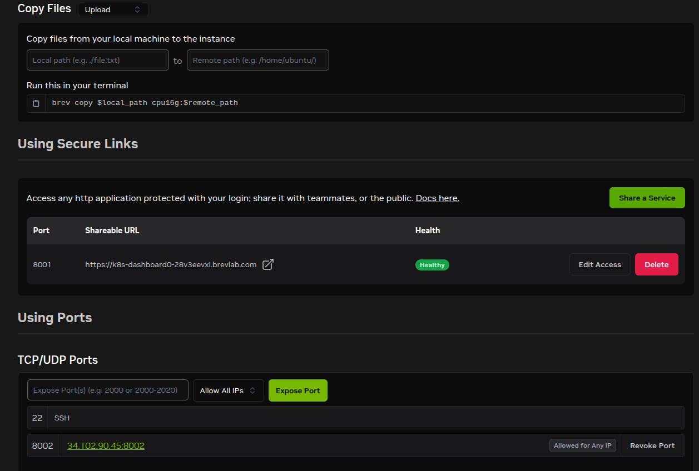
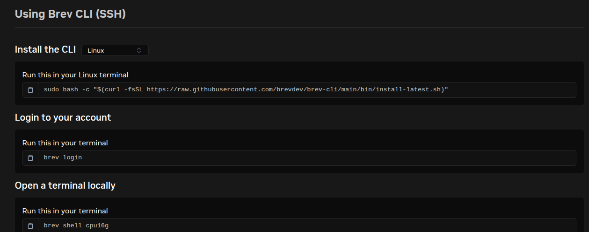

.. _brev_deployment:

###############################
Brev Kubernetes Helm Deployment
###############################

This guide walks through an end-to-end NVIDIA FLARE deployment on two Brev
single-node Kubernetes environments, treated as two Kubernetes clusters:

* one cluster for the FLARE server;
* one cluster for a single FLARE client named ``site-1``.

It covers provisioning, editing ``project.yml``, using ``nvflare deploy prepare``
to generate Helm charts for the server and client, creating the Helm workspace
PersistentVolumeClaim (PVC) and any job data PVCs, staging the prepared folders
into the workspace PVC, and deploying the generated charts.

The Kubernetes environments are created from the Brev web UI. The exact control
labels in Brev can change, but the workflow is the same: create an environment,
select compute, switch the software configuration to ``Single-node Kubernetes``,
open a Brev shell, copy the prepared kits to the environment, then deploy with
``kubectl`` and ``helm`` inside each Brev environment.

Brev System Overview
====================

Brev provides managed compute environments that can be created with CPU or GPU
hardware and an optional single-node Kubernetes software configuration. In this
guide, each Brev environment is used as a small independent Kubernetes cluster:
one environment runs the FLARE server, and each client site runs in its own
environment.

The Brev console is used to create environments, choose hardware, select
``Single-node Kubernetes``, and expose the FLARE server port. The Brev CLI is
used from the local workstation to copy files and open shells:

* ``brev copy`` uploads each prepared participant archive.
* ``brev shell`` opens a shell inside a Brev environment.
* ``brev exec`` can run non-interactive commands after the environment is ready.

Inside each Brev Kubernetes environment, ``kubectl`` and ``helm`` operate on
that environment's local cluster. Because the clusters are separate, using the
same Kubernetes namespace and PVC names in each cluster is safe.

The FLARE server environment needs an inbound TCP port for
``fed_learn_port``. Client environments usually do not need inbound FLARE
ports; they connect outbound to the server endpoint configured in
``project.yml``.

Assumptions
===========

The examples use:

* one server named ``server1``;
* one client named ``site-1``;
* one Brev Kubernetes environment named ``nvflare-server-k8s``;
* one Brev Kubernetes environment named ``nvflare-site-1-k8s``;
* namespace ``nvflare`` in both clusters;
* workspace PVC name ``nvflws`` in both clusters;
* optional job data PVC name ``nvfldata`` in both clusters;
* an externally reachable DNS name for the server, for example
  ``server1.example.com``;
* a container image in a registry that both clusters can pull, for example
  ``registry.example.com/nvflare:dev``.

Using the same namespace and PVC names in both clusters is safe because each
cluster has its own Kubernetes API and storage backend.

References:

* `NVIDIA Brev documentation <https://docs.nvidia.com/brev/>`__
* `NVIDIA Brev console documentation <https://docs.nvidia.com/brev/guides/console-reference>`__
* `Brev connectivity documentation <https://docs.nvidia.com/brev/cli/connectivity>`__
* :ref:`helm_chart`
* :ref:`deploy_prepare_command`

Scripted Three-Environment Variant
==================================

If you already have three Brev single-node Kubernetes environments named
``server``, ``site-1``, and ``site-2``, the helper scripts below automate the
same provisioning, deploy prepare, copy, PVC staging, and Helm install flow for
a server plus two clients:

* :download:`prepare_brev_startup_kits.sh <brev_scripts/prepare_brev_startup_kits.sh>`
* :download:`launch_brev_nvflare.sh <brev_scripts/launch_brev_nvflare.sh>`

Run the prepare script from a local NVFlare checkout with an external server
host name and an image that all Brev clusters can pull:

.. code-block:: shell

   export SERVER_HOST=server1.example.com
   export IMAGE=registry.example.com/nvflare:dev
   bash docs/user_guide/admin_guide/deployment/brev_scripts/prepare_brev_startup_kits.sh

If your Brev environment names differ from the participant names, set them with
environment variables or ask the script to prompt for them:

.. code-block:: shell

   SERVER_BREV=nvflare-server-k8s \
   SITE_1_BREV=nvflare-site-1-k8s \
   SITE_2_BREV=nvflare-site-2-k8s \
   bash docs/user_guide/admin_guide/deployment/brev_scripts/prepare_brev_startup_kits.sh

   bash docs/user_guide/admin_guide/deployment/brev_scripts/prepare_brev_startup_kits.sh \
     --prompt-brev-names

Then run the launch script inside each Brev environment:

.. code-block:: shell

   brev shell "${SERVER_BREV:-server}"
   IMAGE="$IMAGE" bash /home/ubuntu/launch_brev_nvflare.sh server

   brev shell "${SITE_1_BREV:-site-1}"
   IMAGE="$IMAGE" SERVER_HOST="$SERVER_HOST" bash /home/ubuntu/launch_brev_nvflare.sh site-1

   brev shell "${SITE_2_BREV:-site-2}"
   IMAGE="$IMAGE" SERVER_HOST="$SERVER_HOST" bash /home/ubuntu/launch_brev_nvflare.sh site-2

The current Brev CLI exposes ``brev port-forward`` for local forwarding, but it
does not provide a public TCP port exposure command. Use the Brev UI Access page
to expose TCP ``8002`` on the ``server`` environment before starting the two
sites.

Create Brev Kubernetes Environments
===================================

Create the server Kubernetes environment first, then repeat the same flow for
the client Kubernetes environment. In the Brev UI, a single-node Kubernetes
environment is created from the same ``GPUs`` page used for GPU and CPU
development environments.

Server Kubernetes Environment
-----------------------------

#. Sign in to the `Brev console <https://brev.nvidia.com>`__.
#. Open ``GPUs`` in the top navigation.
#. Click ``Create Environment``.

   .. figure:: ../../../resources/brev_creating.png
      :alt: Brev GPU Environments page with the Create Environment button.

      Start from the Brev ``GPUs`` page and create a new environment.

#. Select the hardware for the server environment. A CPU instance is enough for
   the FLARE server unless your server-side workflow requires GPU compute.

   .. figure:: ../../../resources/brev_instance.png
      :alt: Brev Create Environment page with CPU selected.

      Select a CPU or GPU instance type. For a basic server deployment, a CPU
      instance type is sufficient.

#. Configure storage and region:

   * ``Name``: ``nvflare-server-k8s``.
   * ``Organization`` or ``Project``: choose the Brev organization that should
     own the environment.
   * ``Provider`` or ``Cloud``: choose the cloud provider where the server
     should run.
   * ``Region``: choose a region reachable by the client cluster and by your
     admin operator.
   * ``Disk Storage``: choose enough space for the container image cache, the
     provisioned workspace PVC, server job storage, snapshots, and logs.

   .. figure:: ../../../resources/brev_config_instance.png
      :alt: Brev hardware, storage, region, and software configuration page.

      Configure disk storage and region before changing the software mode.

#. In ``Software Configuration``, click ``Edit``.
#. Select ``Single-node Kubernetes``.
#. Keep ``Install Kubernetes Dashboard`` enabled if you want browser access to
   the cluster dashboard.
#. Leave ``Run a cluster init script`` disabled unless your organization has a
   required initialization script.
#. Click ``Apply``.

   .. figure:: ../../../resources/brev_select_k8s.png
      :alt: Brev software picker with Single-node Kubernetes selected.

      Choose ``Single-node Kubernetes`` so the environment is created with
      Kubernetes, ``kubectl``, and ``helm`` ready to use.

#. Expand ``Advanced`` only if you need to set custom network or startup
   options.
#. Set ``Name Instance`` to ``nvflare-server-k8s``.
#. Click ``Deploy``.

   .. figure:: ../../../resources/brev_deploy.png
      :alt: Brev deployment page showing Name Instance and Deploy.

      Name the server environment and deploy it.

#. Wait until the environment status is ``Running`` or ``Ready``.

Client Kubernetes Environment
-----------------------------

Repeat the same web UI flow and use these values:

* ``Name``: ``nvflare-site-1-k8s``.
* ``Instance Type``: choose CPU or GPU compute based on the jobs that ``site-1``
  will run.
* ``Networking``: the client cluster needs outbound access to
  ``server1.example.com:8002``.
* ``Disk Storage``: choose enough space for the client workspace, logs, and data
  PVC.
* ``Software Configuration``: choose ``Single-node Kubernetes``.
* ``Ports``: no inbound FLARE port is required for this basic client
  deployment. The client connects outbound to the server on ``8002``.

Enable Server Port Access and SSH
---------------------------------

After both Kubernetes environments are running, open the server environment's
``Access`` page. In the ``Using Ports`` section, expose the FLARE federated
learning port, ``fed_learn_port`` ``8002``:

This guide does not set ``admin_port`` in ``project.yml``. When ``admin_port``
is omitted, NVFlare uses the same value as ``fed_learn_port``. Therefore, the
Brev server environment only needs to expose ``fed_learn_port`` ``8002``.

#. Find ``TCP/UDP Ports``.
#. In ``Expose Port(s)``, enter ``8002``.
#. Select the access scope. ``Allow All IPs`` is convenient for a quick test;
   restrict this to known client/admin source IPs for a real deployment.
#. Click ``Expose Port``.
#. Confirm that the table lists port ``8002`` and shows a public endpoint such
   as ``<server-ip>:8002``.

   In ``Using Ports``, expose the server ``fed_learn_port`` ``8002``. The same
   page also shows the ``brev copy`` command format for uploading files to an
   environment.

Copy the public ``host:port`` value for port ``8002``. Point
``server1.example.com`` to the host/IP portion of that endpoint. Do not include
the port in ``default_host``; the port is already configured as
``fed_learn_port: 8002`` in ``project.yml``.

The environment also provides SSH instructions through the ``Access`` page:

   Use the Brev CLI commands shown in the UI to install the CLI, log in, and
   open a shell on the Kubernetes environment.

Install and authenticate the Brev CLI on your local workstation if it is not
already available:

.. code-block:: shell

   sudo bash -c "$(curl -fsSL https://raw.githubusercontent.com/brevdev/brev-cli/main/bin/install-latest.sh)"
   brev login

Set environment variables on your local workstation for the rest of the guide:

.. code-block:: shell

   export SERVER_BREV=nvflare-server-k8s
   export CLIENT_BREV=nvflare-site-1-k8s
   export NAMESPACE=nvflare
   export SERVER_HOST=server1.example.com
   export IMAGE=registry.example.com/nvflare:dev

Verify that you can SSH to both Brev Kubernetes environments:

.. code-block:: shell

   brev shell "$SERVER_BREV"
   exit
   brev shell "$CLIENT_BREV"
   exit

Inside each Brev Kubernetes environment, ``kubectl`` and ``helm`` should already
be configured for the local single-node cluster. You can verify this after SSH:

.. code-block:: shell

   kubectl get nodes
   kubectl get storageclass

Build and Push the FLARE Image
==============================

Build the FLARE runtime image from an NVFlare source checkout and push it to a
registry that both Brev Kubernetes clusters can pull from:

The ``ServerK8sJobLauncher`` and ``ClientK8sJobLauncher`` use the Kubernetes
Python client from inside the running FLARE container. If you use a custom
Dockerfile, install the dependency in the image:

.. code-block:: dockerfile

   RUN pip install kubernetes

The repository ``docker/Dockerfile`` already installs the NVFlare ``K8S`` extra,
which includes this dependency. Keep that install line, or add the explicit
``pip install kubernetes`` line above before building your image.

.. code-block:: shell

   docker build -t "$IMAGE" -f docker/Dockerfile .
   docker push "$IMAGE"

If the registry is private, make sure both clusters can pull the image. Depending
on your registry and cluster configuration, this can mean configuring node-level
registry credentials or adding Kubernetes image pull secrets. The generated
chart does not add ``imagePullSecrets`` by default, so use a registry already
trusted by the nodes or customize the chart for your environment.

Edit project.yml
================

Generate a sample project file if you do not already have one:

.. code-block:: shell

   nvflare provision -g

Edit ``project.yml`` with these deployment-specific goals:

#. Define only one client, ``site-1``.
#. Set the server ``default_host`` to the stable external DNS name that the
   client cluster will use.
#. Include the same DNS name in ``host_names`` so the server certificate is
   valid for that endpoint.
#. Leave ``admin_port`` unset so it defaults to ``fed_learn_port``. The Brev
   server only needs to expose the ``fed_learn_port`` value.
#. Use ``nvflare deploy prepare`` after provisioning to generate Kubernetes
   runtime files from the server and client startup kits.
#. Use a container image that both clusters can pull in the deploy prepare
   runtime config.

Example:

.. code-block:: yaml

   api_version: 3
   name: example_project
   description: NVFlare Brev Kubernetes Helm deployment

   participants:
     - name: server1
       type: server
       org: nvidia
       default_host: server1.example.com
       host_names:
         - server1
         - server1.example.com
       fed_learn_port: 8002
     - name: site-1
       type: client
       org: nvidia
     - name: admin@nvidia.com
       type: admin
       org: nvidia
       role: project_admin

   builders:
     - path: nvflare.lighter.impl.workspace.WorkspaceBuilder
       args:
         template_file:
           - master_template.yml
     - path: nvflare.lighter.impl.static_file.StaticFileBuilder
       args:
         config_folder: config
         scheme: tcp
     - path: nvflare.lighter.impl.cert.CertBuilder
     - path: nvflare.lighter.impl.signature.SignatureBuilder

The value of ``default_host`` must be chosen before provisioning because it is
written into startup configuration and server certificates. Use a stable DNS
name that you control, such as ``server1.example.com``, in ``project.yml`` and
point that DNS name to the Brev server environment's exposed host after you
enable port access.

The generated server and client charts mount only the configured
``workspace_pvc``. In this guide, that PVC is ``nvflws`` and it is mounted at
``/var/tmp/nvflare/workspace``. Create separate data PVCs, such as
``nvfldata``, only for launched Kubernetes job pods that need study data.

Run Provisioning
================

Run the provision command:

.. code-block:: shell

   nvflare provision -p project.yml -w /tmp/nvflare/provision

Set ``PROD_DIR`` to the generated production folder:

.. code-block:: shell

   PROJECT_NAME=$(grep '^name:' project.yml | awk '{print $2}')
   PROD_DIR=$(find "/tmp/nvflare/provision/${PROJECT_NAME}" \
     -maxdepth 1 -type d -name 'prod_*' | sort | tail -n 1)
   if [ -z "$PROD_DIR" ]; then
     echo "No prod_* folder found for project '${PROJECT_NAME}'" >&2
     exit 1
   fi
   echo "$PROD_DIR"

Prepare the server and client startup kits for Kubernetes:

.. code-block:: shell

   cat >/tmp/nvflare-k8s.yaml <<'EOF'
   runtime: k8s
   namespace: nvflare
   parent:
     docker_image: registry.example.com/nvflare:dev
     service_name: nvflare-server
     parent_port: 8102
     workspace_pvc: nvflws
     workspace_mount_path: /var/tmp/nvflare/workspace
     python_path: /usr/local/bin/python3
   job_launcher:
     config_file_path:
     default_python_path: /usr/local/bin/python3
     pending_timeout: 300
   EOF

   nvflare deploy prepare "$PROD_DIR/server1" --output /tmp/nvflare-prepared/server1 --config /tmp/nvflare-k8s.yaml
   nvflare deploy prepare "$PROD_DIR/site-1" --output /tmp/nvflare-prepared/site-1 --config /tmp/nvflare-k8s.yaml

The example above only sets the keys this guide needs. ``parent.service_name``
sets the server Kubernetes Service name and is ignored when the same config is
used to prepare client kits. ``parent`` also accepts optional ``resources``
(parent pod CPU/memory requests and limits) and ``pod_security_context``, and
``job_launcher`` accepts optional ``job_pod_security_context``. See
:ref:`deploy_prepare_command` for the full runtime config schema and
:ref:`helm_chart` for how the prepared chart is installed.

The prepared folders should contain one ``helm_chart`` directory under the
server and client:

.. code-block:: shell

   ls /tmp/nvflare-prepared/server1/helm_chart
   ls /tmp/nvflare-prepared/site-1/helm_chart

Each participant folder has this structure:

.. code-block:: text

   server1/
     helm_chart/
       Chart.yaml
       values.yaml
       templates/
     local/
     startup/
     transfer/

During this step, ``nvflare deploy prepare`` updates
``local/resources.json.default`` to use the Kubernetes launcher, removes any
active ``local/resources.json`` override, updates runtime communication to use
the generated Kubernetes Service, creates a ``local/study_data.yaml`` template
when needed, removes the legacy ``startup/start.sh``, ``startup/sub_start.sh``,
and ``startup/stop_fl.sh`` scripts (the parent process is launched by the Helm
chart instead), and generates ``helm_chart/``. For server kits, it also
relocates the default ``job_manager`` and ``snapshot_persistor`` storage paths
under ``parent.workspace_mount_path``
(``/var/tmp/nvflare/workspace/jobs-storage`` and
``/var/tmp/nvflare/workspace/snapshot-storage``) so server job history and
snapshots persist on the workspace PVC. Do not edit the launcher in
``resources.json.default`` by hand after this step; change
``/tmp/nvflare-k8s.yaml`` and rerun ``nvflare deploy prepare`` instead.

If the input kit already configures a custom ``resource_manager``,
``resource_consumer``, or job launcher, ``nvflare deploy prepare`` prints a
warning and replaces those components with the runtime configuration shown
above.

Copy Prepared Kits to Brev Environments
=======================================

Package the prepared server and client folders on your local workstation:

.. code-block:: shell

   tar -czf /tmp/nvflare-server1.tgz -C /tmp/nvflare-prepared server1
   tar -czf /tmp/nvflare-site-1.tgz -C /tmp/nvflare-prepared site-1

Use the ``Copy Files`` section of the Brev environment ``Access`` page, or run
the equivalent ``brev copy`` commands:

.. code-block:: shell

   brev copy /tmp/nvflare-server1.tgz "$SERVER_BREV:/home/ubuntu/"
   brev copy /tmp/nvflare-site-1.tgz "$CLIENT_BREV:/home/ubuntu/"

The archive contains the generated ``startup/``, ``local/``, and
``helm_chart/`` folders. The Helm chart is run from the Brev environment after
the archive is extracted. Only ``startup/`` and ``local/`` need to be staged in
the workspace PVC.

Deploy the Server Environment
=============================

Open a shell on the server Brev environment:

.. code-block:: shell

   brev shell "$SERVER_BREV"

Run the rest of this section from inside the server environment. First extract
the uploaded archive and set deployment variables:

.. code-block:: shell

   export NAMESPACE=nvflare
   export IMAGE=registry.example.com/nvflare:dev

   mkdir -p ~/nvflare
   tar -xzf ~/nvflare-server1.tgz -C ~/nvflare
   kubectl get nodes
   helm version

Create the namespace and PVCs. The generated server chart requires the
``nvflws`` workspace PVC. The ``nvfldata`` PVC is used later only by launched
Kubernetes job pods that need study data:

.. code-block:: shell

   kubectl create namespace "$NAMESPACE" --dry-run=client -o yaml | kubectl apply -f -

   cat > ~/nvflare/nvflare-pvcs.yaml <<'EOF'
   apiVersion: v1
   kind: PersistentVolumeClaim
   metadata:
     name: nvflws
   spec:
     accessModes:
       - ReadWriteOnce
     resources:
       requests:
         storage: 10Gi
   ---
   apiVersion: v1
   kind: PersistentVolumeClaim
   metadata:
     name: nvfldata
   spec:
     accessModes:
       - ReadWriteOnce
     resources:
       requests:
         storage: 50Gi
   EOF

   kubectl -n "$NAMESPACE" apply -f ~/nvflare/nvflare-pvcs.yaml
   kubectl -n "$NAMESPACE" get pvc

If your Brev Kubernetes environment does not have a default storage class, add
``storageClassName: <storage-class-name>`` under each PVC ``spec``.

The server folder is already prepared for Kubernetes. Its
``local/resources.json.default`` contains ``ServerK8sJobLauncher`` with
``namespace: nvflare``, ``default_python_path: /usr/local/bin/python3``,
``pending_timeout: 300``, and ``workspace_mount_path:
/var/tmp/nvflare/workspace`` from ``/tmp/nvflare-k8s.yaml``. The same namespace
must be used for the Helm release because the launcher creates dynamic job pods
in that namespace.

Copy the prepared server ``startup/`` and ``local/`` directories into the
``nvflws`` PVC. The chart starts the server with
``-m /var/tmp/nvflare/workspace``, so the PVC root must contain ``startup/``
and ``local/`` directly.

.. code-block:: shell

   cat > ~/nvflare/copy-to-pvcs.yaml <<'EOF'
   apiVersion: v1
   kind: Pod
   metadata:
     name: nvflare-pvc-copy
   spec:
     restartPolicy: Never
     containers:
       - name: copy
         image: busybox:1.36
         command:
           - sh
           - -c
           - sleep 3600
         volumeMounts:
           - name: nvflws
             mountPath: /mnt/nvflws
     volumes:
       - name: nvflws
         persistentVolumeClaim:
           claimName: nvflws
   EOF

   kubectl -n "$NAMESPACE" delete pod nvflare-pvc-copy --ignore-not-found=true
   kubectl -n "$NAMESPACE" apply -f ~/nvflare/copy-to-pvcs.yaml
   kubectl -n "$NAMESPACE" wait \
     --for=condition=Ready pod/nvflare-pvc-copy --timeout=120s
   kubectl -n "$NAMESPACE" exec nvflare-pvc-copy -- \
     rm -rf /mnt/nvflws/startup /mnt/nvflws/local
   kubectl -n "$NAMESPACE" cp ~/nvflare/server1/startup nvflare-pvc-copy:/mnt/nvflws/startup
   kubectl -n "$NAMESPACE" cp ~/nvflare/server1/local nvflare-pvc-copy:/mnt/nvflws/local
   kubectl -n "$NAMESPACE" exec nvflare-pvc-copy -- \
     ls -la /mnt/nvflws/startup /mnt/nvflws/local
   kubectl -n "$NAMESPACE" delete pod nvflare-pvc-copy

Copy ``startup/`` and ``local/`` directly into the PVC root. If the PVC root
only contains a nested ``server1/`` directory, the server pod will not find
``/var/tmp/nvflare/workspace/startup`` and
``/var/tmp/nvflare/workspace/local``.

Install the server Helm chart. Set ``hostPortEnabled=true`` so the server pod
binds ``fed_learn_port`` ``8002`` on the Brev host. This is the port exposed in
the Brev ``Using Ports`` UI.

.. code-block:: shell

   helm upgrade --install server1 ~/nvflare/server1/helm_chart \
     --namespace "$NAMESPACE" \
     --set image.repository="${IMAGE%:*}" \
     --set image.tag="${IMAGE##*:}" \
     --set service.type=ClusterIP \
     --set hostPortEnabled=true

   kubectl -n "$NAMESPACE" rollout status deployment/server1 --timeout=300s
   kubectl -n "$NAMESPACE" get pods
   kubectl -n "$NAMESPACE" logs deploy/server1

Deploy the site-1 Environment
=============================

Open a shell on the client Brev environment:

.. code-block:: shell

   brev shell "$CLIENT_BREV"

Run the rest of this section from inside the client environment. First extract
the uploaded archive and set deployment variables:

.. code-block:: shell

   export NAMESPACE=nvflare
   export IMAGE=registry.example.com/nvflare:dev
   export SERVER_HOST=server1.example.com

   mkdir -p ~/nvflare
   tar -xzf ~/nvflare-site-1.tgz -C ~/nvflare
   kubectl get nodes
   helm version

Create the namespace and PVCs. The generated client chart requires the
``nvflws`` workspace PVC. The ``nvfldata`` PVC is used later only by launched
Kubernetes job pods that need study data:

.. code-block:: shell

   kubectl create namespace "$NAMESPACE" --dry-run=client -o yaml | kubectl apply -f -

   cat > ~/nvflare/nvflare-pvcs.yaml <<'EOF'
   apiVersion: v1
   kind: PersistentVolumeClaim
   metadata:
     name: nvflws
   spec:
     accessModes:
       - ReadWriteOnce
     resources:
       requests:
         storage: 10Gi
   ---
   apiVersion: v1
   kind: PersistentVolumeClaim
   metadata:
     name: nvfldata
   spec:
     accessModes:
       - ReadWriteOnce
     resources:
       requests:
         storage: 50Gi
   EOF

   kubectl -n "$NAMESPACE" apply -f ~/nvflare/nvflare-pvcs.yaml
   kubectl -n "$NAMESPACE" get pvc

The ``site-1`` folder is already prepared for Kubernetes. Its
``local/resources.json.default`` contains ``ClientK8sJobLauncher`` with the
same launcher settings from ``/tmp/nvflare-k8s.yaml``. Keep the Helm namespace
consistent with the ``namespace`` value used by ``nvflare deploy prepare``.

Copy the prepared ``site-1`` ``startup/`` and ``local/`` directories into the
client ``nvflws`` PVC:

.. code-block:: shell

   cat > ~/nvflare/copy-to-pvcs.yaml <<'EOF'
   apiVersion: v1
   kind: Pod
   metadata:
     name: nvflare-pvc-copy
   spec:
     restartPolicy: Never
     containers:
       - name: copy
         image: busybox:1.36
         command:
           - sh
           - -c
           - sleep 3600
         volumeMounts:
           - name: nvflws
             mountPath: /mnt/nvflws
     volumes:
       - name: nvflws
         persistentVolumeClaim:
           claimName: nvflws
   EOF

   kubectl -n "$NAMESPACE" delete pod nvflare-pvc-copy --ignore-not-found=true
   kubectl -n "$NAMESPACE" apply -f ~/nvflare/copy-to-pvcs.yaml
   kubectl -n "$NAMESPACE" wait \
     --for=condition=Ready pod/nvflare-pvc-copy --timeout=120s
   kubectl -n "$NAMESPACE" exec nvflare-pvc-copy -- \
     rm -rf /mnt/nvflws/startup /mnt/nvflws/local
   kubectl -n "$NAMESPACE" cp ~/nvflare/site-1/startup nvflare-pvc-copy:/mnt/nvflws/startup
   kubectl -n "$NAMESPACE" cp ~/nvflare/site-1/local nvflare-pvc-copy:/mnt/nvflws/local
   kubectl -n "$NAMESPACE" exec nvflare-pvc-copy -- \
     ls -la /mnt/nvflws/startup /mnt/nvflws/local
   kubectl -n "$NAMESPACE" delete pod nvflare-pvc-copy

Before installing the client chart, verify that the client environment can
resolve the server host:

.. code-block:: shell

   kubectl -n "$NAMESPACE" run dns-test --rm -it \
     --image=busybox:1.36 -- \
     nslookup "$SERVER_HOST"

Install the ``site-1`` Helm chart:

.. code-block:: shell

   helm upgrade --install site-1 ~/nvflare/site-1/helm_chart \
     --namespace "$NAMESPACE" \
     --set image.repository="${IMAGE%:*}" \
     --set image.tag="${IMAGE##*:}"

   kubectl -n "$NAMESPACE" rollout status deployment/site-1 --timeout=300s
   kubectl -n "$NAMESPACE" get pods
   kubectl -n "$NAMESPACE" logs deploy/site-1

If you reprovision later, back up or remove old PVC contents before copying the
new folders. Certificates, local config, and communication settings are tied to
the provisioned project state.

Connect an Admin Console
========================

Run the admin client from a network location that can reach
``server1.example.com:8002``:

.. code-block:: shell

   cd "$PROD_DIR/admin@nvidia.com/startup"
   ./fl_admin.sh

The generated admin kit connects to the server host configured in
``project.yml``. If you used ``server1.example.com`` as ``default_host``, that
name must resolve to the Brev server environment endpoint.

Kubernetes Job Pods and nvfldata
================================

``nvflare deploy prepare`` writes the Kubernetes launcher into
``local/resources.json.default`` before the participant folders are copied to
Brev. The generated launcher config sets ``study_data_pvc_file_path`` to:

.. code-block:: text

   /var/tmp/nvflare/workspace/local/study_data.yaml

When launched job pods need the ``nvfldata`` PVC, edit
``local/study_data.yaml`` in the prepared server and client folders before
copying those folders into ``nvflws``. This example maps the ``default`` study's
``data`` dataset to ``nvfldata``:

.. code-block:: yaml

   default:
     data:
       source: nvfldata
       mode: rw

Job pod image, Python, CPU, memory, and ephemeral storage settings should be
specified in the submitted job's ``meta.json`` under ``launcher_spec`` for the
``k8s`` launcher. GPU resource requests such as ``num_of_gpus`` should be
specified under ``resource_spec``, matching :ref:`helm_chart`.

Troubleshooting
===============

PVC stays ``Pending``
---------------------

Check that the Brev cluster has a default storage class, or add an explicit
``storageClassName`` to ``nvflare-pvcs.yaml``:

.. code-block:: shell

   kubectl get storageclass
   kubectl -n "$NAMESPACE" describe pvc nvflws

Pod has ``ImagePullBackOff``
----------------------------

Confirm the image exists and that both clusters can pull it:

.. code-block:: shell

   docker push "$IMAGE"
   kubectl -n "$NAMESPACE" describe pod -l app.kubernetes.io/name=server1
   kubectl -n "$NAMESPACE" describe pod -l app.kubernetes.io/name=site-1

Server pod cannot find ``startup`` or ``local``
-----------------------------------------------

The participant folder was copied to the wrong level in the PVC. The server
workspace root must contain:

.. code-block:: text

   /var/tmp/nvflare/workspace/startup
   /var/tmp/nvflare/workspace/local

Use the helper pod to inspect ``/mnt/nvflws`` and restage ``startup/`` and
``local/`` from the extracted prepared folder, such as
``~/nvflare/server1/startup`` and ``~/nvflare/server1/local``, if needed.

site-1 cannot connect to the server
-----------------------------------

Verify these items:

* ``default_host`` in ``project.yml`` matches the DNS name used by the client.
* The DNS name resolves from the client cluster.
* The server cluster exposes TCP port ``8002``.
* The server certificate includes the DNS name in ``host_names``.

Run a DNS check from the client cluster:

.. code-block:: shell

   kubectl -n "$NAMESPACE" run dns-test --rm -it \
     --image=busybox:1.36 -- \
     nslookup "$SERVER_HOST"

If you change ``default_host`` or ``host_names``, reprovision, restage the
updated folders, and redeploy the charts.

Cleanup
========

Remove the Helm releases:

.. code-block:: shell

   # Run inside the server Brev environment.
   helm uninstall server1 -n "$NAMESPACE"

   # Run inside the site-1 Brev environment.
   helm uninstall site-1 -n "$NAMESPACE"

Delete the namespaces and PVCs:

.. code-block:: shell

   # Run inside each Brev environment.
   kubectl delete namespace "$NAMESPACE"

Delete the Brev clusters from the web UI when you no longer need them:

#. Open the Brev console.
#. Open the Kubernetes or clusters page.
#. Select ``nvflare-server-k8s`` and delete it.
#. Select ``nvflare-site-1-k8s`` and delete it.
#. Confirm in the billing or usage page that the resources are no longer
   running.
