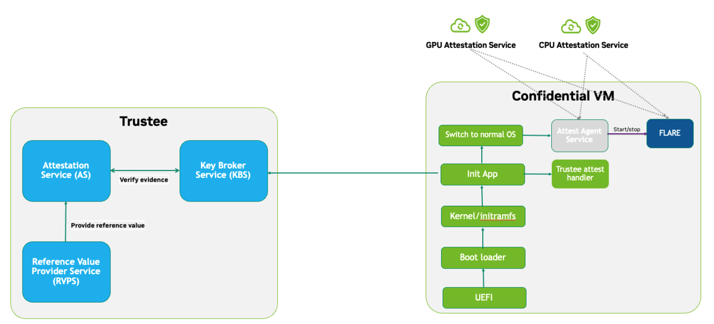
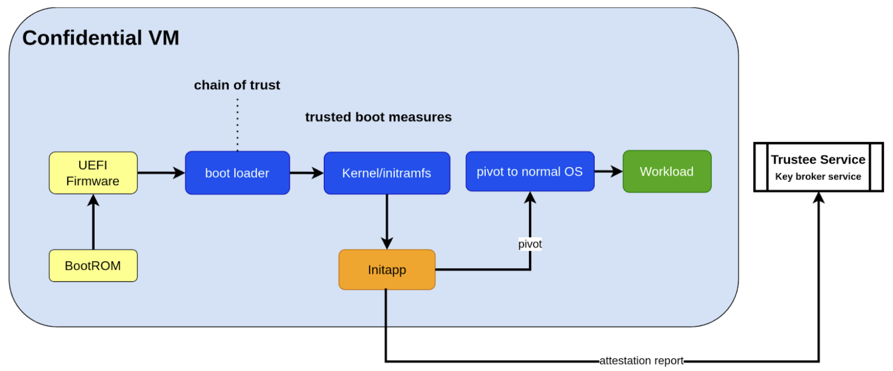
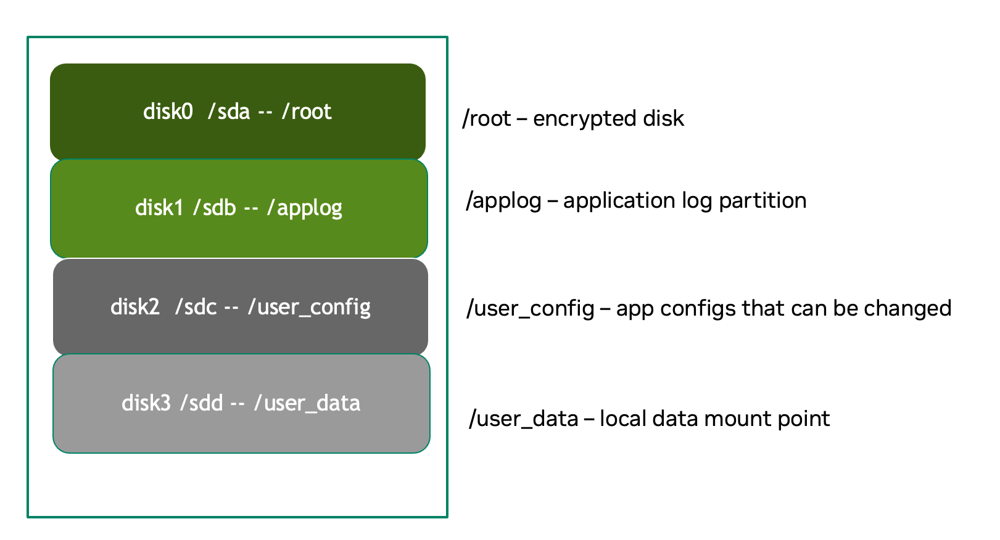
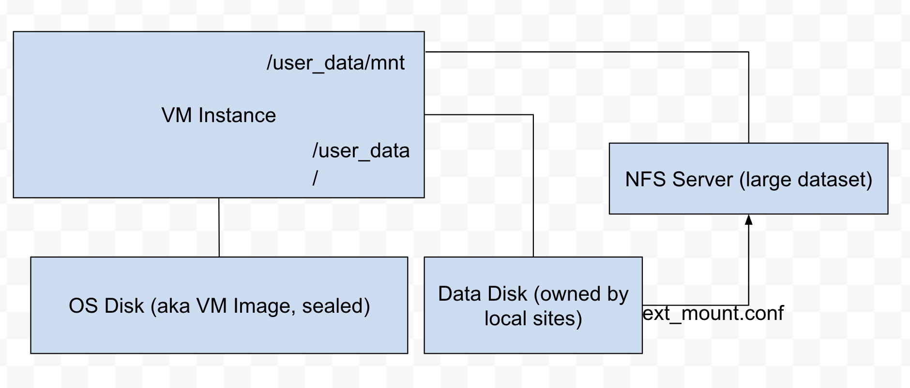

.. _cc_architecture:

##########################################################################
IP Protection Security Architecture with FLARE and Confidential Computing
##########################################################################

.. admonition:: CVM on-prem with AMD CPU + NVIDIA GPU

    The current architecture is based on Confidential VMs with AMD CPUs and NVIDIA GPUs for on-premise deployment.
    While the design principles are the same for Intel TDX CPUs with NVIDIA GPUs, the current implementation targets
    on-premise AMD/NVIDIA systems. TDX support and cloud-based deployment will be available soon.

.. contents::
   :local:
   :depth: 2

Introduction
============

In an era where artificial intelligence drives critical decisions across industries, safeguarding the intellectual property (IP) of machine learning models has become paramount, particularly during inference and federated learning. These models, often the culmination of years of research, proprietary algorithms, and significant data investments, represent highly valuable assets. Both inference, typically executed on edge or client devices, and federated learning, which involves distributing model training across decentralized nodes, expose models to untrusted environments, creating substantial risks of IP theft or reverse engineering. Without robust IP protection, organizations face not only financial losses but also threats to their competitive advantage and compliance. Therefore, ensuring model confidentiality throughout both training and inference is crucial for secure deployment, responsible innovation, and sustained trust in AI systems.

The risks to model IP stem from multiple critical phases in the deployment time and runtime lifecycle.

Deployment-Time Risks
---------------------

At deployment time, the model IP is particularly vulnerable if introduced into an untrusted or unverified environment. An untrusted host or malicious host owner can intercept the model by modifying the application code, tampering with the execution environment, or delaying the activation of security mechanisms such as attestation and encryption. Without strict controls over when and how the model is decrypted or loaded, attackers can gain early access before protections are in place. This makes the deployment phase a critical point of exposure, especially in environments where hosts are not fully controlled or are operated by third parties.

Runtime Risks
-------------

Even after deployment, model IP remains exposed to runtime threats. A host system—whether trusted or compromised—can still leak the model if sufficient safeguards are not maintained. Attackers may exploit vulnerabilities to gain remote access, copy the model from memory, intercept it over the network, or extract it from disk-based checkpoints. Insider threats or physical access to a machine can also lead to data exfiltration. While VM-based Trusted Execution Environments (TEEs) provided by Confidential Computing offer strong isolation guarantees, these mechanisms are not infallible. If the attacker can directly access the CVM TEE or modify the application inside the TEE, then the TEE protection doesn't help the IP protection: here are a few possible ways that model IP can be leaked out at runtime:

- Compromised participant machines
- Unauthorized access to the remote training machine (via direct access or network access)
- Remote access or a leak from the network
- Leak from storage (such as a model checkpoint)

Design Proposal & Solution Overview
====================================

Challenge
---------

Simply deploying applications in a Confidential VM (CVM) is insufficient to protect model IP. A comprehensive security architecture is required.

Proposed Solution
-----------------

A secure deployment architecture combining:

- Specialized CVM Image
    - Hardware-backed chain of trust from hardware to application
    - Enhanced security controls for network, storage, and access
    - Measured boot and runtime attestation
- Pre-packaged Workload Container
    - FLARE training applications or inference services
    - Model weights and proprietary code

Security Guarantee
------------------

Our Minimum Viable Product (MVP) design ensures model IP remains protected throughout the entire lifecycle, from deployment through execution, even in potentially compromised environments.

Security Architecture Components
=================================

IP Protection Architecture
--------------------------

The high-level approach for generating a Confidential VM (CVM) image involves embedding the application workload within a secure virtual machine that leverages VM-based Trusted Execution Environment (TEE) architecture. To ensure strong security guarantees, the CVM is fully locked down—no shell access, no open ports except for explicitly whitelisted ones, and all data access restricted to encrypted disk partitions.

To protect against tampering during deployment, the boot process is anchored in Confidential Computing's chain of trust, extending from hardware up to the application layer. Critical disk partitions are encrypted, and decryption keys are withheld until remote attestations are successfully completed. This attestation verifies both the base system and the application against expected measurements at a remote trustee service. Only after passing this check does the trustee's key broker service release the decryption key, allowing the CVM to proceed securely.

The attestations will be completed in two stages. Once the kernel is booted normally, the attestation service will perform second-stage attestation (both CPU and GPU attestation). If the attestation is verified, the normal workload will be started.

Assumptions
-----------

- We fully trust the individual who builds the CVM image, as well as the host machine used during the image creation process. This ensures that the CVM is constructed in a secure and controlled environment.
- We trust the remote trustee service, including its integrated key broker service, to be secure and reliable. The internal protection mechanisms of the trustee service are considered out of scope for this design.
- To verify the integrity and confidentiality of the CVM application's boot process, we assume that CPU-based attestation at boot time is sufficient. Specifically, we rely on a one-time, hardware-backed attestation during CVM startup to establish trust, without requiring ongoing or continuous runtime verification.
- Ongoing continuous attestation will be handled at the application level (with both GPU and CPU attestation, such as NVFlare).

Architecture Design
-------------------

Key Challenges in Securing Application-Level Integrity
^^^^^^^^^^^^^^^^^^^^^^^^^^^^^^^^^^^^^^^^^^^^^^^^^^^^^^^

**By Default, Chain of Trust Stops at the Kernel:**
Confidential Computing's hardware-backed chain of trust typically ends at the kernel. User-level application code is not included in the default measurement and attestation process.

**Application Integrity Risk:**
Without extending the chain of trust to cover the application, malicious modifications can occur at boot time. This risks compromising both the application's integrity and the overall confidentiality of the system, even if kernel-level attestation is successful.

**Necessity of Application Measurement:**
To ensure end-to-end trust, application-level measurements must be automatically calculated by the kernel and cryptographically signed by CC-enabled hardware. Relying on external or manual hash values creates potential attack vectors.

**Use Case Consideration – Disk Content Not Measured:**
Confidential Computing attestation is designed to measure memory-loaded components during boot. Application binaries and data stored on disk are not covered. This is not a flaw in the architecture but a challenge that must be addressed for use cases requiring full application trust.

**Security Implication for Application Deployment:**
If the application and its associated data are not part of the attested set, the CVM cannot ensure their integrity or confidentiality—posing a significant risk for secure deployment in sensitive scenarios.

Design Approach
^^^^^^^^^^^^^^^

This design addresses the above challenges with the following approaches:

- **Encrypted Storage**: The CVM encrypts critical storage partitions to protect sensitive code and data from unauthorized access.

- **Customer-Specific Key**: A unique decryption key is associated with each customer and stored securely in the remote key broker service, along with the expected attestation reference values.

- **Attestation-Bound Key Release**: The decryption key is released only upon successful CPU-based attestation, ensuring it is provided exclusively to trusted environments that match both CVM and application measurements and possess valid cryptographic signatures.

- **Two-Stage Attestation & Two-Stage Key Release**:
  
  - CPU verification → GPU verification (extending the chain of trust from CPU to GPU)
  - Two-stage key releases with partition ``dm-verity``.

Additional Security Hardening
^^^^^^^^^^^^^^^^^^^^^^^^^^^^^^

- **Disk Security**: Leverage both ``dm-crypt`` for encryption and ``dm-verity`` for integrity verification of disk partitions. Disable auto-mount.
- **Access Control**: Disable login mechanisms, including SSH and console access, to prevent unauthorized entry into the CVM.
- **Network Hardening**: Configure strict firewall rules and disable all unnecessary services and ports, allowing only explicitly whitelisted network access.

Reference Value and Key Storage
--------------------------------

There are different approaches to store the reference values, leveraging:

- Trustee service with remote key broker services
- Trusted Platform Module (TPM)
- Virtual TPM (vTPM)

For our most common deployment scenarios, we will build a CVM image on one trusted host (Host A), then distribute and deploy it to another untrusted host (Host B). In this design, we choose to use the remote trustee service.

CVM Boot-Up Process Design
---------------------------

Here, we are leveraging the initApp in a TEE context to enable application-level attestation, using the kernel as an indirect attesting environment.

Kernel as an Attesting Environment – via InitApp in TEE
^^^^^^^^^^^^^^^^^^^^^^^^^^^^^^^^^^^^^^^^^^^^^^^^^^^^^^^

Concept Overview
""""""""""""""""

In a Confidential Computing environment (e.g., AMD SEV-SNP, Intel TDX), the kernel is already measured at boot time by the hardware-backed chain of trust. Rather than modifying the kernel or injecting measurement logic earlier in the boot flow, we delegate application-level attestation to a lightweight agent called InitApp, which runs in early user space—right after the kernel, but before any application workload or sensitive data is accessed.

Key Design Principles
"""""""""""""""""""""

**Trusted Kernel Base**

The kernel serves as the base of trust. It is measured by the TEE platform during boot, forming part of the trusted launch.

**InitApp as Attesting Agent**

InitApp is responsible for:

- Performing application-level attestation
- Interacting with the trustee service and key broker

InitApp Placement and Measurement
""""""""""""""""""""""""""""""""""

For proper attestation, InitApp must be embedded within the initramfs rather than placed in external locations such as ``/oem/initapp``.

**Measurement Scope**

The attestation measurement must include:

- Kernel
- Kernel arguments (command line)
- Initramfs

With AMD SEV-SNP, this is configured using the ``kernel-hashes=on`` flag.

**Design Rationale**

Embedding InitApp within initramfs ensures:

- InitApp is loaded into kernel memory during boot
- InitApp is automatically measured as part of the initramfs by the attestation SDK
- No additional measurement mechanisms are required
- Placement outside initramfs bypasses automatic measurement and creates replay attack vulnerabilities

QEMU Launch Example
"""""""""""""""""""

.. code-block::

    sudo qemu-system-x86_64 \
      -bios OVMF.amdsev.fd \
      -initrd initrd.img \
      -kernel vmlinuz \
      -append "root=/dev/mapper/crypt_root rw console=ttyS0 pci=realloc,nocrs vm_id=__cvm_id__" \
      -nographic \
      -machine memory-encryption=sev0,vmport=off \
      -object memory-backend-memfd,id=ram1,size=${MEM}G,share=true,prealloc=false \
        -machine memory-backend=ram1 \
        -object sev-snp-guest,id=sev0,cbitpos=${CBITPOS},reduced-phys-bits=1,policy=0x30000,kernel-hashes=on \
      -vga none \
      -enable-kvm -no-reboot \
      -cpu EPYC-v4 \
      -machine q35 -smp $CORES -m ${MEM}G,slots=2,maxmem=512G \
      ...
      <rest of command>

In this setup,
    - ``initrd.img`` is loaded into kernel memory and included in the TEE measurement, securing both InitApp and its logic.
    - AMD EPYC CPU processor EPYC-v4 is used
    - we use OVMF.amdsev.fd
    - kernel-hashes=on

What Needs to Be Measured
--------------------------

When preparing a Confidential VM (CVM) image, it's crucial to ensure that key components are measured and cryptographically verified to maintain a trusted boot process.

With TEE platforms like AMD SEV-SNP or Intel TDX, the firmware measures and includes the hashes of the following in the attestation report:

- Kernel binary
- Initramfs (which includes InitApp)
- Kernel command-line parameters
- Firmware (UEFI/BIOS)
- EFI boot configuration (depending on platform and setup)

These measurements are rooted in hardware and cannot be forged by the host. Any tampering with measured components—such as modifying InitApp—will result in a different TEE measurement hash. Consequently, the Trustee will detect the mismatch and deny key release, preventing decryption of sensitive data.

.. note::

   You do not need to sign or measure the entire CVM disk image. Focusing on these critical boot-time components is sufficient to establish a robust and verifiable chain of trust.

CVM Image Measurement
^^^^^^^^^^^^^^^^^^^^^

The InitApp does a CVM image measurement using ``snpguest`` tool. This measurement is printed in the boot log always,
even in case of a boot failure.

What does it measure:

.. list-table::
   :header-rows: 1

   * - Component
     - Measured by Default
     - Measured with kernel-hashes=on
   * - OVMF
     - ✅ Yes
     - ✅ Yes
   * - Kernel (vmlinuz)
     - ❌ No
     - ✅ Yes
   * - initrd/initramfs
     - ❌ No
     - ✅ Yes
   * - Kernel args
     - ❌ No
     - ✅ Yes

The SEV-SNP measurement is a SHA-384 hash of:

- OVMF + firmware state
- Kernel
- Initrd
- Kernel command line
- Platform launch policy
- Guest-supplied report_data
- etc.

As long as:

- Provide the same inputs to both sev-snp-measure and the runtime SEV-SNP launch process (i.e., QEMU/KVM with SEV-SNP enabled),
- Don't introduce randomness between build and runtime (e.g., dynamic kernel arguments, timestamps, UUIDs),

The measurement will match exactly.

Attestation Stages
^^^^^^^^^^^^^^^^^^

1. **Boot-Time Attestation**
   - Scope: CPU only
   - Ensures the integrity of the CVM and the early boot process, including initApp.
   - Performed using the Trustee Service at startup.

2. **Runtime Attestation**
   - Scope: CPU + GPU
   - Required to protect the application workload during runtime execution.
   - Likely involves an application-level attestation agent.
   - FLARE integrates a Confidential Computing (CC) Manager that performs attestation at multiple stages, including runtime, to maintain trust across the system lifecycle.

Trustee Service Integration
============================

Overview
--------

To protect the model IP, confidential computing hardware alone is not sufficient. Additional infrastructure and services are required—most critically, the Trustee Service, which includes the following components:

- Attestation Service
- Key Broker Service

The Trustee Service must support CPU-level attestation across AMD, Intel, and ARM architectures during the boot process. For this design, we adopt the CNCF Confidential Containers (CoCo) Project Trustee Service and Guest components:
🔗 https://github.com/confidential-containers/trustee

Any other open-source or proprietary trustee service can also be used. This infrastructure is swappable.

Design Rationale
----------------

This design is chosen based on the following key factors:

- Our main focus is on protecting the integrity and confidentiality of initApp during boot up.
- The initApp is a small script that runs independently of the GPU, so GPU attestation is not required at this stage.
- We need an open-source trustee service that has both key broker service and attestation, and basic configuration support. CoCo Trustee Service is the only option we can find at the moment.

Interactions Between NVFlare and Trustee Key Broker Service (KBS)
-----------------------------------------------------------------

The following block diagram shows the interaction among the NVFlare CVM, Attestation Agent (AA), Key Broker Service (KBS), Trustee, and Attestation Service (AS).

.. image:: ../../resources/cvm_trustee_interaction.png
    :height: 500px

Trustee Policies
----------------

The "trustee policy" refers to the rules and configurations governing how secrets are released and how the trustworthiness of a confidential workload is verified before granting access to sensitive data. It involves two main types of policies: resource policies and attestation policies.

- **Resource Policies**: These policies determine which secrets are released to a specific workload, typically scoped to the container. They control what secrets are available to the workload, ensuring that only necessary information is provided.
- **Attestation Policies**: These policies define how the claims about the Trusted Computing Base (TCB) are compared to reference values to determine the trustworthiness of the workload. They specify how the attestation process verifies that the workload is running in a trusted environment.

What we do: Currently, we only need to use resource policy, we will use the default attestation policy.

One can set the policy to the needed measurement (hash values) or referring to the reference values. We choose to use the resource policy for now.

Set Policy
^^^^^^^^^^

Here is a policy example. The resource policy we set to ensure only CVM with the measurement matching the value can get the resource (the key for LUKS).

.. code-block:: text

   package policy
   default allow = false

   allow {
       input["submods"]["cpu0"]["ear.veraison.annotated-evidence"]["snp"]["measurement"] == "Cwa8qBJimP2freTTrrpvAZVbEQEyAhPY4fZGgSn9z4qtt0CAGmcS+Otz96qQZ92k"
   }

And the command to set this policy into the Trustee service.

.. code-block:: bash

   #!/usr/bin/env bash
   TRUSTEE_ADDRESS=<your organization trustee service addresss>
   PORT=8999

   ROOTCA=keys/rootCA.crt

   sudo kbs-client --url https://$TRUSTEE_ADDRESS:$PORT --cert-file $ROOTCA config --auth-private-key private.key  set-resource-policy --policy-file resource_policy.rego

Set & Get Resource
^^^^^^^^^^^^^^^^^^

Here is the command for KBS client to set and get resources:

.. code-block:: bash

   kbs-client --url https://$TRUSTEE_ADDRESS:$PORT --cert-file $ROOTCA config --auth-private-key $PRIVATE_KEY set-resource --resource-file $SECRET_FILE --path $URL_PATH
   kbs-client --url https://$TRUSTEE_ADDRESS:$PORT --cert-file $ROOTCA get-resource --path $URL_PATH

.. note::

   ``--path $URL_PATH``: This is used for identity namespace isolation for now.

CVM Implementation Details
===========================

Disk Layout and Security
------------------------

Disk Partitions
---------------

.. list-table::
   :header-rows: 1

   * - Partition
     - Mount Point or host location
     - Contents
     - Encryption
     - Notes
   * - Kernel + Initramfs
     - host
     - Kernel image, initramfs
     - ❌
     - Tampering causes measurement change and boot failure
   * - Boot Log
     - host
     - Early boot logs from initramfs and InitApp
     - ❌
     - Allows monitoring boot failures from the host
   * - Root Filesystem
     - /root
     - Full Ubuntu OS install
     - dm-crypt
     - Encrypted root filesystem
   * - App Log
     - /applog
     - Application logs
     - ❌
     - Separate image; readable after CVM shutdown
   * - User Config
     - /user_config
     - User configuration directory
     - ❌
     - Modifiable before CVM launch
   * - User Data
     - /user_data
     - User-provided data
     - ❌
     - Attached as separate image; supports NFS mount
   * - Temporary Files
     - /tmp
     - Runtime temporary files (RAM)
     - TEE
     - RAM disk protected by TEE
   * - Swap
     - N/A
     - N/A
     - N/A
     - Disabled

Disk Security Measures
----------------------

**Mount Security**

Auto-mounting is disabled to prevent unauthorized or accidental mounting of external devices.

**Encryption**

- **Root Filesystem**: Encrypted using ``dm-crypt``; decryption key released only after successful attestation
- **Temporary Storage**: ``/tmp`` is a RAM disk protected by TEE hardware encryption
- **User Data**: Unencrypted by design; users control data encryption externally if needed

Partition Details
-----------------

**Logging**

``bootlog`` - File on Host Machine

This log records the boot process and is essential during setup and debugging, especially when diagnosing boot failures. The boot log is stored on the host machine (not inside the CVM) and is writable during the boot process.

``/applog`` - Partition on CVM Disk

This log captures application-level output (e.g., FLARE logs). It is writable to aid debugging—for instance, when investigating connectivity issues between clients and servers. The log is visible to the host and implemented as a separate image file. This allows log analysis to continue even after the CVM is shut down.

**Configuration**

``/user_config`` - Partition on CVM Disk

The user_config partition is intended for user-specific configurations that could change the workload behavior. This partition is exposed to the host and can be changed outside the CVM.

For example, in FLARE applications, each site will have local configurations specific to the site, such as privacy policies or authentication configurations.

User Data Volume Configuration
-------------------------------

User data is provided via an unencrypted drive image (``user_data.qcow2``) mounted at ``/user_data``. Users can copy required data onto this drive before launching the CVM.

**NFS Mount Support**

For remote data access, NFS mounts are supported. The CVM will automatically mount an NFS volume if an ``ext_mount.conf`` file is present in ``/user_data`` with the following format:

.. code-block:: text

   $NFS_SERVER_NAME_or_IP:$EXPORT_DIR

Example:

.. code-block:: text

   172.31.53.113:/var/tmp/nfs_export

The NFS export will be mounted to ``/user_data/mnt`` using:

.. code-block:: bash

   sudo mount -t nfs -o resvport $NFS_EXPORT /user_data/mnt

.. note::

   If NAT is used in the network path, configure the NFS export as insecure:
   
   .. code-block:: bash
   
      /training_data *(rw,sync,no_subtree_check,insecure)

Access and Network Security
---------------------------

CVM Lockdown
^^^^^^^^^^^^

The CVM is designed with comprehensive access restrictions to prevent unauthorized entry and manipulation:

**Administrative Access**

- The system is configured to be admin-less by removing all users from the sudoers file
- OS-level login is disabled entirely
- SSH (sshd) is disabled
- Serial console access is disabled

**Network Restrictions**

All network connections are authenticated and encrypted using TLS for secure communication with attestation services and application endpoints.

A strict firewall policy is enforced using iptables with whitelist-based port control for both inbound and outbound traffic:

- **Default Policy**: All inbound and outbound ports are blocked
- **Inbound Whitelist**: Only explicitly allowed ports for:

  - Application communication (e.g., FLARE server accepting client connections)

- **Outbound Whitelist**: Only explicitly allowed ports for:

  - DNS resolution
  - Attestation services communication
  - Application server connections (e.g., FLARE client to server)
  - Experiment tracking services (e.g., MLflow)
  - Management or monitoring services (if configured)
  
This defense-in-depth approach ensures that even if an attacker gains host-level access, they cannot log in, connect remotely, or communicate through unauthorized network channels.

Application Level Security
===========================

In addition to the basic CVM Security, we also need additional security at application level. This might be different for different type of applications.

General Security Measure
------------------------

For all applications, we need the following additional security measures:
- **Attestation service agent**:
  - Perform the self-attestation using both CPU and GPU attestation service at start.
  - Boot level attestation is only for CPU, we need to attest GPU as well.
  - Perform periodical self-tests to make sure the system is not compromised.
- **Code Level security**:
  - No dynamic code changes.

FLARE-Specific Security
-----------------------

Federated Learning Provision Process
^^^^^^^^^^^^^^^^^^^^^^^^^^^^^^^^^^^^

Federated learning provision is a process to prepare the software packages (FLARE's startup kits) for each participating organization. Clients and the server will obtain different startup kits. The package is prepared by the system owned by the project admin and then distributed to each participant. Then, FL Server needs to start first, FL Client site will start the startup kit, connect to FL server.

There are three distinguished phases:

- **Provision processes** – prepare the software artifacts (the startup kits).
- **Distribution process** – software packages are distributed to participants.
- **Run-time processes** – At each participant's host machine, the participant deploys the package, starts the FL system, and establishes the communication between the FL server and the participant.

Terminology
^^^^^^^^^^^

To simplify discussions, we define the following roles:

- **Project Admin**: The individual responsible for initiating and managing the overall project. This includes approving participants, provisioning resources, and triggering the Confidential VM (CVM) build process.

- **Model Owner**: The entity (person or organization) that owns both the pre-trained model and the final trained model. They are primarily concerned with protecting the intellectual property of the model.

- **Data Owner**: The entity that owns the private data used in training. Data privacy and security are their primary concerns.

- **Org Admin**: An IT administrator from a participating organization. This person is responsible for setting up the local environment and launching the site-specific Federated Learning (FL) system instance (e.g., the FL client).

The Process
^^^^^^^^^^^

- **Provision Process**: The generated CVM image will be a lockdown with no access. This is done via additional hardened security measures described above.
- **Distribution process**: For CLI based provision, we will let customers decide the best way to distribute the CVM image file.
- **Deploy/start**: The participant, deployed the CVM image to a CC-enabled Host, add NFS data volume need for the training, run start scripts to start the system.

.. note:: FLARE Dashboard Support
    In current release, FLARE Dashboard provision is not supported for CVM provision.

FLARE Attestation Verification
^^^^^^^^^^^^^^^^^^^^^^^^^^^^^^^

FLARE's CC manager performs three different attestations:

- **Self-attestation**
- **Cross-verification among client and server**
- **Periodical cross-verification**

FLARE Workload Execution and Access Control Policies
^^^^^^^^^^^^^^^^^^^^^^^^^^^^^^^^^^^^^^^^^^^^^^^^^^^^

- All training and inference code must be pre-reviewed and approved before inclusion in the workload.
- The application and its dependencies are pre-installed in the workload docker.
- Job execution is triggered by submitting a predefined job configuration—no dynamic or custom or user-supplied code is allowed at runtime.

For IP Protection Use Cases
^^^^^^^^^^^^^^^^^^^^^^^^^^^

- Only the Project Admin is authorized to download results, including the global model and logs.
- Download permissions are disabled for all other users and cannot be overridden at the individual site level.

Threat Model and Mitigations
============================

This section describes the threat models that the current design helps to mitigate, and the new risks with this process.

The following attacks are outside of the scope of this document:
- Software supply chain attacks that apply to guest Unified Extensible Firmware Interface (UEFI) firmware, the bootloader and kernel, and third-party dependencies for the workload.
- Attacks on Trustee Service.

Possible Attacks
----------------

The current CVM architecture is designed to defend against the following possible attacks by an untrustworthy host workload operator:
- Modify disk contents, intercept network connections, and attempt to compromise the TEE at runtime.
- Tamper CVM image file at deployment time, before launch in the remote host:
  - Modify boot process in the image to retrieve encryption key.
  - Modify workload code to write checkpoint path, save model to unencrypted disk.
  - Modify network port rules to allow model to send over the network to unauthorized location.
  - Modify access rules to enable access at runtime.

CVM at Runtime
--------------

- Add login console to directly login to CVM.
- SSH to CVM.
- Network attack for the open port.
- Copy the model checkpoint from the disk.

Attack Surfaces
---------------

The following table describes the attack surfaces that are available to attackers.

.. list-table::
   :header-rows: 1
   :widths: 15 12 12 35

   * - Attacker
     - Target
     - Attack surface
     - Risks
   * - Host owner or workload operator
     - TEE, Workload
     - Disk reads
     - Anything read from the disk is within the attacker's control. Dynamic disk attachments mean that
       an attacker can modify disk contents dynamically and at will.
   * - Workload Operator
     - TEE, Workload
     - Disk writes
     - Anything written to disk is visible to an attacker.
   * - Host owner or workload operator
     - TEE, Workload
     - Network
     - External network connection to or Attestation can be intercepted. For FLARE FL Server, two ports
       open for FL Client communication (Inbounds). FLARE FL Server also open ports for outbound
       communication: Experimental tracking and statsd system monitoring (if allowed).
   * - Host Owner or Workload operator
     - Attestation Service communication
     - Attestation messages
     - Intercept the message to perform man-in-the-middle attack.
   * - Host owner
     - CVM image file
     - initApp
     - Tampered initApp to trick trustee service to release the decryption key.
   * - Input Data
     - TEE, Workload
     - User Input dataset
     - User input dataset could be exposed to possible poison attacks. But this is not scope of
       protection in this document.
   * - Output Data
     - TEE, Workload
     - Output result
     - User output dataset could be exposed to possible IP theft.

Threats and Mitigations
=======================

Confidential Computing is used to defend against various attack vectors on Confidential Virtual Machines (CVMs), including tampering, disk access, and network intrusion. Below is a breakdown of the threat surfaces and corresponding mitigations.

- **CVM tampering risk**: The confidential computing attestation protocol helps protect the boot sequence CVM boot as well application initApp. The workload will be encrypted to avoid modification at rest. Any tampering attempt will cause attestation failure, which will not be able to decrypt the CVM root-fs.
- **Disk risk**: A CVM Image encrypted disk with integrity protection is designed to mitigate risks from disk attacks. After initApp is read from disk, it's measured and that data is never re-read from disk again. The description is only retrieved after the verification and then the root fs is decrypted.
- **Network attack Risks**: Attacks are mitigated by having authenticated, end-to-end encrypted channels. External network access, such as SSH, Login are disabled in the image. Strict firewall input/output rules for the CVM, ports are blocked except for whitelisted ports.

The following tables describe the threats and mitigations:

Attacks on the Measured Boot Process
------------------------------------

.. list-table::
   :header-rows: 1
   :widths: 20 15 35

   * - Threat
     - Mitigation
     - Mitigation Implementation
   * - Attacker disables measured boot using old firmware
     - Trustee-based attestation detects failure
     - Confidential Computing enforces attestation check before trust is granted.
   * - Attacker disables measured boot and tampers InitApp
     - No key released without successful attestation
     - Remote Key Broker only releases keys after valid CC + InitApp attestation.
   * - Attacker tampers InitApp to steal keys after replaying measurements
     - Attestation fails due to changed InitApp & nonce check
     - Measurements include initramfs; nonces ensure freshness; replay attacks are rejected.
   * - Memory corruption in early boot (e.g., BootHole, Sequoia)
     - Early boot components are measured before processing
     - Attestation fails if grub.cfg or file system config is modified; no auto-mounts.
   * - Disk TOCTOU: tamper boot binaries after measurement but before execution
     - Read-measure-execute pattern; encrypted partitions
     - Boot disk is read-once into memory; dm-verity and dm-crypt enforce disk integrity.
   * - Modify device drivers or user services after kernel loaded
     - dm-crypt root
     - Modify of root file system will cause IO error.
   * - GPU with GPU Hypervisor is compromised: The attacker attempted to steal the decryption key once 
       released to the TEE memory after the CPU attestation succeeded.
     - Two-stage attestation (CPU then GPU); encrypted root-fs; bounced buffer isolation
     - **Threat**: Since bootup InitApp attestation only attests CPU measurement, the compromised GPU 
       hypervisor is within the TEE trust boundary once the GPU driver is loaded. The GPU hypervisor 
       will try a DMA attack on the TEE memory to steal the decryption key. Unless there is joint 
       CPU + GPU attestation, this is an identified theoretical security hole.
       
       **Mitigations**: Currently, with careful design of the CVM and attestation flow, the risk is 
       mitigated:
       
       1) GPU driver is trustworthy: The GPU driver is part of the root-fs system, which is encrypted. 
       A tampered GPU driver (without encryption key) will cause GPU failure to load. If the GPU is 
       successfully loaded, it is trustworthy.
       
       2) CPU driver, hypervisor, and kernel are trustworthy: Otherwise, we would not be able to pass 
       the attestation at bootup time.
       
       3) 2nd phase GPU attestation starts before any workload: If GPU attestation fails, the system 
       will shut down. The compromised GPU can only steal the decryption key via the bounced buffer 
       (PCI passthrough) (H100 GPU). Since there is no secret placed in the bounced buffer, there is 
       nothing to steal. For TDISP enabled GPUs, the logic still applies.
       
       CVM design mostly mitigates the risk.

Attacks on Trustee Attestation
------------------------------

This table describes potential threats and mitigation strategies to Trustee Attestation.

.. list-table::
   :header-rows: 1
   :widths: 25 20 35

   * - Threat
     - Mitigation
     - Mitigation Implementation
   * - An attacker intercepts the network connection between the CVM attestation client and Trustee 
       to steal the secret token.
     - Use of authenticated, encrypted TLS connection prevents passive eavesdropping.
     - Attacker cannot impersonate the service (lacks TLS key). Attacker cannot impersonate the 
       client (identity verified by attestation protocol).

Attacks on Workloads
--------------------

This table describes potential threats and mitigation strategies related to workloads.

.. list-table::
   :header-rows: 1
   :widths: 28 15 42 15

   * - Threat
     - Mitigation
     - Mitigation Implementation
     - Location
   * - An attacker tries to SSH or log in and connect to the running instance.
     - SSH is disabled, and the login password is randomized.
     - No SSHD running; randomized login password ensures no external access.
     - Confidential VM image
   * - An Attacker tries to copy the model check-point from the disk accessible from Host where CVM 
       is running
     - The disk partition where model is saved is encrypted
     - Encrypted disk partition prevents unauthorized access to model checkpoints.
     - Confidential VM image
   * - An attacker downloads the final training model from the admin console or API.
     - FLARE permissions restrict access.
     - Fine-grained permissions enforced within FLARE prevent unauthorized model access.
     - Workload application
   * - An attacker steals the model from a host with a GPU that does not support Confidential 
       Computing (CC) or where CC is disabled.
     - Runtime attestation verifies both CPU and GPU at multiple stages.
     - InitApp attests CPU integrity only during boot. Application attestation service performs: 
       (1) Start stage: self-verification for CPU & GPU, (2) Periodic cross-verification.
     - Workload attestation
   * - An attacker passes a malformed and encrypted dataset to the workload.
     - Out of scope in current design
     - Defensive parsing code in the workload. Input data is strictly validated and parsed securely.
     - Workload
   * - An attacker passes a skewed or poisoned dataset to the workload to learn from others' data.
     - Out of scope in current design; differential privacy can mitigate.
     - Google Confidential Space mentions using differential privacy for this threat.
     - Workload

References
==========

- RATS architecture: https://www.rfc-editor.org/rfc/rfc9334.html
- Google Confidential Space Security Overview: https://cloud.google.com/docs/security/confidential-space
- Confidential containers trustee attestation service solution overview and use cases https://www.redhat.com/en/blog/introducing-confidential-containers-trustee-attestation-services-solution-overview-and-use-cases
- Confidential Container Trustee: https://github.com/confidential-containers/trustee
- Azure confidential computing: harden the linux image to remove sudo users: https://learn.microsoft.com/en-us/azure/confidential-computing/harden-the-linux-image-to-remove-sudo-users
- Microsoft Secure the Windows boot process. https://learn.microsoft.com/en-us/windows/security/operating-system-security/system-security/secure-the-windows-10-boot-process
- Microsoft Secure Boot. Note these links to the above article.
  - https://learn.microsoft.com/en-us/windows-hardware/design/device-experiences/oem-secure-boot
- SEV-SNP measurement tool: https://github.com/virtee/sev-snp-measure

