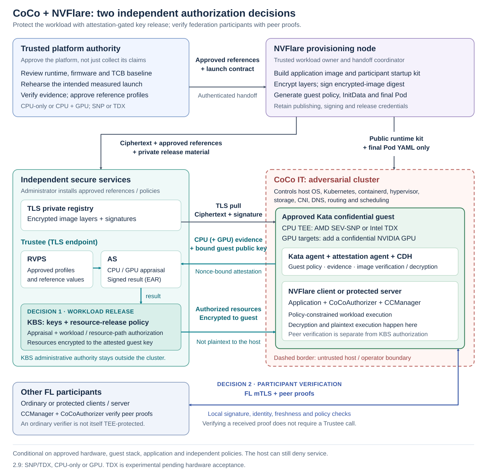
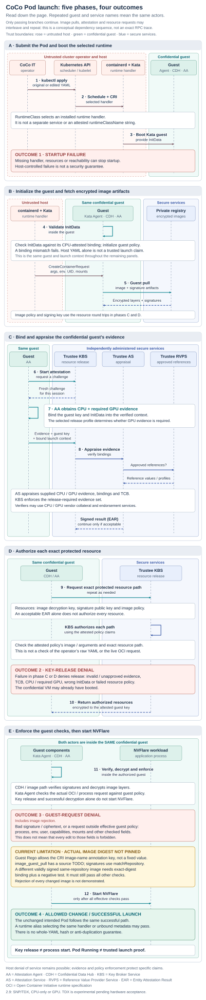

.. _coco_security_architecture:

#####################################
CoCo + NVFlare Security Architecture
#####################################

This is the authoritative security model for the Confidential Containers
(CoCo) integration in ``examples/devops/coco`` and its NVFlare provisioning and
attestation components. It is for workload owners, data owners, federation
administrators, infrastructure operators, and security reviewers. Read it
before deciding which participants or infrastructure providers to trust.

It describes the security model of the pinned Kata 3.29.0 profile and Trustee
policies, with the implementation scope below. It is not a security proof,
certification, or assurance that every supported hardware configuration has
passed end-to-end testing. Reassess these assumptions when changing versions,
policies, applications, or deployment topology. The separate
:ref:`CVM Builder architecture <cc_architecture>` uses a different guest and
storage design; its guarantees must not be imported into this CoCo deployment.

.. important::

   **Release scope:** the ``2.9`` baseline reviewed here is
   `60359c4d7 <https://github.com/NVIDIA/NVFlare/commit/60359c4d7>`_, whose CoCo
   workflow and peer authorizer require **SNP plus NVIDIA GPU**. The CPU-only,
   TDX, target-aware release-policy, and extended measurement-constraint
   descriptions document the companion
   `PR #5344 <https://github.com/NVIDIA/NVFlare/pull/5344>`_ at reviewed revision
   `7f9f63b967fd57f399bbea9deaefba2d756eff67 <https://github.com/NVIDIA/NVFlare/commit/7f9f63b967fd57f399bbea9deaefba2d756eff67>`_.
   They are not enabled by this documentation-only change. Use the matching
   implementation and runbooks before deploying an extended target; do not
   interpret the four-profile diagrams as a claim that the baseline supports
   all four. Companion-only source links below are pinned to that revision.

.. contents:: Find a security answer
   :local:
   :depth: 2

.. _coco_security_guarantees:

Security promise and deployment choices
=======================================

The intended guarantee is that an adversarial cluster operator can schedule an
approved encrypted workload without obtaining its plaintext image or changing
security-relevant launch inputs while retaining access to its protected keys.
That guarantee depends on the approved hardware, guest software, application,
independent secure services, and correctly enforced policies described below.
It is not a claim that every YAML field is immutable or that the current
implementation has complete field-level coverage. In particular, the launch
sequence below identifies an unresolved exact-image-digest authorization
limitation. The operator can always refuse to run the workload or stop it.

There are **two separate authorization decisions**:

* **Workload authorization:** Trustee's Key Broker Service (KBS) releases
  resources only when attestation and release-specific policy permit it. The
  guest verifies the image and enforces its agent policy before running it.
* **Federation participation:** NVFlare's CCManager and CoCoAuthorizer verify
  proofs from the configured protected participants. This does not replace KBS
  authorization, image protection, application review, or normal FL identity
  authentication.

Encryption protects image layers; it does not hide all image metadata.
Attestation verifies specified claims about a trusted execution environment
(TEE); it does not prove that an application is harmless, that training is
correct, or that released results cannot leak data. An approved application
can disclose any secret it is allowed to access.

Target profiles and implementation scope
----------------------------------------

.. list-table:: Select and approve each target explicitly
   :header-rows: 1
   :widths: 17 27 22 17 17

   * - Target
     - Kata RuntimeClass
     - Participant CC configuration
     - Required resource-release appraisal
     - Implementation scope
   * - SNP, CPU-only
     - ``kata-qemu-snp``
     - ``cc_cpu_mechanism: amd_sev_snp``; ``cc_gpu: none``
     - CPU only
     - Companion PR #5344
   * - SNP with NVIDIA GPU
     - ``kata-qemu-nvidia-gpu-snp``
     - ``cc_cpu_mechanism: amd_sev_snp``; ``cc_gpu: nvidia``
     - CPU and GPU
     - Reviewed ``2.9`` baseline
   * - TDX, CPU-only
     - ``kata-qemu-tdx``
     - ``cc_cpu_mechanism: intel_tdx``; ``cc_gpu: none``
     - CPU only
     - Companion PR #5344
   * - TDX with NVIDIA GPU
     - ``kata-qemu-nvidia-gpu-tdx``
     - ``cc_cpu_mechanism: intel_tdx``; ``cc_gpu: nvidia``
     - CPU and GPU
     - Companion PR #5344

In the companion implementation, CPU-only is an intentional deployment mode,
not a fallback after GPU attestation fails. CPU-only profiles need no NVIDIA GPU
or GPU Operator.
Current launch contracts support one application container, no host namespaces
or volumes, omitted CPU/memory resource requests and limits, and zero or one
``nvidia.com/pgpu``. Arbitrary VM sizing, sidecars, persistent volumes, and
multiple GPUs require additional implementation and security review.

Protected clients and protected servers are supported. An ordinary server can
verify CoCo client proofs without running in CoCo; that **does not protect the
server's own memory, aggregation, credentials, or data from its administrator**.
Protecting the server requires its own CC configuration, encrypted release,
approved TEE launch, and inclusion in the required attested participant set.
Ordinary participants outside that set have no CC attestation requirement.

.. _coco_security_trust_boundaries:

Parties, assets, and trust boundaries
=====================================

The four deployment roles
-------------------------

.. list-table:: Role separation is part of the security model
   :header-rows: 1
   :widths: 24 38 38

   * - Party
     - Responsibilities and authority
     - Trust requirement
   * - Workload owner / NVFlare provisioning node
     - Reviews application code, builds images and signed startup kits,
       encrypts/signs releases, prepares guest policies and handoffs.
     - Trusted with plaintext code, identity credentials, signing keys, and
       release keys. Compromise here can produce an authorized malicious image.
   * - Trusted platform authority / trusted system
     - Reviews the platform baseline and launch artifacts; collects and
       verifies fresh hardware evidence; approves reference profiles.
     - Trusted to choose acceptable software and TCB, not merely copy values
       supplied by the future cluster operator.
   * - Secure-services administrator
     - Operates registry write authorization, Trustee/KBS, Attestation Service
       (AS), Reference Value Provider Service (RVPS), and their policies/keys.
     - Trusted to protect keys, validate handoffs, enforce release rules, and
       maintain reference provenance independently of the adversarial cluster.
   * - CoCo IT / cluster operator
     - Installs public runtime inputs and schedules delivered Pod manifests.
     - Untrusted. Controls the host OS, Kubernetes, containerd, hypervisor
       arguments, disks, CNI, DNS, routing, scheduling, and cluster APIs.

Roles may share a machine or organization only when that does not collapse a
required trust boundary. In particular, giving the adversarial cluster owner
control of AS/RVPS/KBS policy or its administrative credentials defeats the
independent key-release decision. A checksum calculated by that owner is not
independent approval of a reference or workload.

The data owner and workload publisher also have distinct interests. Protecting
the publisher's code from the data owner does not prove the publisher's code
will preserve the data owner's privacy. Both parties must approve what code
may consume sensitive inputs and what outputs it may emit.

Architecture
------------

y guest proofs over authenticated connections.
   :width: 100%
   :align: center

   Four deployment roles and two separate security decisions: workload resource
   release by secure services, and participant verification by NVFlare peers.

Registry storage and network transport are not where image plaintext should
appear on the hostile side. Decryption occurs inside the confidential guest.
Public registry certificates, ciphertext, signatures, and workload policy may
be copied without granting decryption authority.

Trusted computing base
----------------------

The trusted computing base includes the CPU security implementation and
firmware; vendor endorsement roots and verifier implementations; the approved
guest boot chain, kernel and services; Kata agent policy enforcement; the
attestation agent (AA), confidential data hub (CDH), image verification and
decryption code; NVFlare and the admitted application/dependencies; trusted
build/provisioning systems; and the independently administered secure services.
GPU targets add the confidential GPU implementation and its approved guest
stack and verification path.

The host OS, Kubernetes admission policies, CNI, host-side seccomp, RuntimeClass
name, installer, and launch script are **not** trusted enforcement mechanisms
against the owner of that host. Their checks prevent mistakes by cooperative
operators. Remote acceptance must rely on evidence and independent policies,
not on the fact that the installer reported success.

Assets and visibility
---------------------

.. list-table:: Secrets are not interchangeable
   :header-rows: 1
   :widths: 25 40 35

   * - Asset
     - Authorized holders / use
     - Cluster operator visibility
   * - Plaintext image and participant startup kit
     - Trusted provisioning storage and the authorized guest. Kits contain
       participant identity material; packaging retains private recovery files.
     - Not delivered. Local image encryption does not erase the builder's
       plaintext, caches, or backups.
   * - Per-release image key
     - Workload owner, authorized secure-services storage, authorized guest.
     - Never put in Pod YAML, Kubernetes Secrets, public images, or logs.
   * - Image-signing private key
     - Workload owner; signs the immutable encrypted-image manifest digest.
     - Public verification key/signature may be visible; private key is not.
   * - AS token-signing private key
     - Secure services; signs attestation results.
     - Only the independently authenticated public key goes to peer verifiers.
   * - KBS administrative credential
     - Secure-services administrators; can change protected policy/resources.
     - Never delivered to CoCo IT or workload users merely submitting releases.
   * - TLS private keys and registry publisher credential
     - Endpoint owners; publisher credential goes only to the trusted publisher.
     - Public CA/certificates may be distributed. TLS trust is not the AS
       token-signing public key.
   * - Guest attested private key
     - AA and authorized guest code; used for resource decryption and the
       CoCoAuthorizer possession proof.
     - The raw AA token response must never be exported. This is not a claim
       that application-accessible key material is hardware-nonexportable.
   * - Pod, InitData, policy, digests, manifests, encrypted blobs, reference values
     - Public or nonsecret coordination material; integrity/provenance matter.
     - Image/configuration metadata, sizes, timing and resource usage remain
       observable. Do not put secrets in command lines or environment metadata.

.. _coco_security_attack_surface:

Attack-surface inventory
========================

The **attack surface** is the set of interfaces and data-processing paths
through which an actor can influence trusted execution or reach sensitive
assets. It includes more than listening network ports: boot inputs, agent
requests, image and evidence parsers, administrative handoffs, local APIs,
application inputs, and output/storage channels all cross relevant boundaries.

This inventory maps each surface to its possible caller, protected assets,
enforcement point, and remaining risk. It is an architecture-level inventory,
not a complete list of kernel interfaces, device operations, parser bugs, or
currently open listeners. Verify the actual deployment's reachability and
versions. A stated deployment obligation is not a claim that the scripts have
implemented or tested every necessary control. The release-scope qualification
above also applies here.

Authentication, attestation, and default-deny authorization do not eliminate
the code that parses a request before deciding whether to accept it. Malformed
input and resource exhaustion remain concerns even when no secret is released.
For individual attacks and their outcomes, see
:ref:`Threats, enforcement, and residual risks <coco_security_threats>`.

Host-controlled and guest-local interfaces
------------------------------------------

.. list-table:: Interfaces reaching the confidential guest
   :header-rows: 1
   :widths: 30 35 35

   * - Surface and possible caller
     - Assets and enforcement boundary
     - Residual risk / deployment obligation
   * - **Pod, runtime, and launch configuration.** CoCo IT controls Kubernetes,
       CRI requests, runtime selection, boot inputs, InitData delivery, and
       effective container configuration.
     - **Assets:** approved guest and workload execution, release keys.
       Approved measurements, independent expected InitData, and effective
       guest-policy checks constrain selected inputs; host validation is not
       the adversarial boundary.
     - Not every YAML field is bound. Equivalent or unconstrained changes may
       pass, and the host can prevent execution. Use the field-change tables
       and demonstrate integrity coverage for external guest rootfs inputs.
   * - **Host-to-guest agent requests and virtual I/O.** The host/VMM supplies
       agent requests, virtual-device responses, and shared-I/O inputs to the
       guest, regardless of Kubernetes admission controls.
     - **Assets:** guest kernel/services and private CPU/GPU state. The approved
       guest stack and TEE enforce the boundary; agent rules constrain
       effective requests and deny interactive exec/stream and policy-replacement
       paths. Permitted lifecycle operations still exist.
     - Agent parsers, guest drivers, and allowed request handling remain trusted
       attack surface. Attesting their identity does not prove absence of
       vulnerabilities. Review enabled devices/interfaces and shared data;
       do not claim guest seccomp, universal side-channel protection, or host
       denial-of-service resistance.
   * - **Registry responses and image artifacts.** The guest processes
       manifests, configuration, signatures, and encrypted layers supplied
       through the registry; publishers and compromised infrastructure can
       affect available content, while the host controls transport.
     - **Assets:** image confidentiality and guest execution integrity.
       Configured TLS trust, guest signature/integrity/decryption checks, and
       independent KBS authorization are the enforcement points. Anonymous
       ciphertext pulls do not grant publishing or decryption authority.
     - Image parsers/unpackers remain trusted code. Another accepted-key,
       same-repository signed image is subject to the documented unresolved
       exact-digest authorization limitation. Review image content and parser
       dependencies; encryption alone neither hides all metadata nor prevents
       substitution attempts or exhaustion.
   * - **Guest-local AA/CDH interfaces.** Admitted guest processes deliberately
       use token/resource services. The reviewed REST configuration enables
       guest-component APIs, including AA's ``/aa/token``; CDH also has a
       guest-local socket interface.
     - **Assets:** raw AA response and its guest private key, EARs, and released
       resources. CoCoAuthorizer restricts its AA call to guest loopback,
       disables proxies/redirects, and bounds the response. KBS separately
       authorizes protected resource requests.
     - These caller checks are not isolation from a compromised application
       inside the guest. Review all enabled REST/socket endpoints and their
       reachability, not only the URL used by CoCoAuthorizer. Do not export
       them through a Service, host port, proxy, or diagnostic output; do not
       assume a host-controlled network policy protects them.

Secure services and trusted-side interfaces
-------------------------------------------

.. list-table:: Interfaces capable of changing trust or releasing resources
   :header-rows: 1
   :widths: 30 35 35

   * - Surface and possible caller
     - Assets and enforcement boundary
     - Residual risk / deployment obligation
   * - **Build/provisioning inputs and handoff import.** Workload owners and
       platform authorities supply source, dependencies, project configuration,
       startup kits, evidence, references, and release files; supply-chain
       producers influence those inputs.
     - **Assets:** plaintext images, FL credentials, signing/publishing keys,
       image keys, and approval provenance. Trusted-side review and
       independently authenticated handoffs establish authority. The release
       importer checks the handoff and reconstructs policy from a service-owned
       template instead of accepting arbitrary supplied Rego.
     - Trusted code execution and build caches remain sensitive. An attacker
       controlling a trusted build or approval authority can authorize malicious
       content. Review dependencies and imported files, authenticate expected
       handoff hashes out of band, and protect retained plaintext/recovery data.
   * - **KBS attestation and resource HTTPS requests.** Any client that can
       reach the endpoint can attempt protocol requests; it need not already
       be an approved confidential workload.
     - **Assets:** per-release keys and verification policy/material. AS
       appraisal, session/guest-key binding, and KBS's exact resource-path and
       workload authorization gate release. Authorized responses are encrypted
       to the attested guest key, not to an identity asserted by the host.
     - TLS endpoint authentication is not resource authorization. HTTP,
       evidence, and policy processing still require security review and
       operational capacity limits. A successful appraisal grants no store-wide
       access; a permissive resource policy can defeat release isolation.
   * - **AS/RVPS service calls and reference ingestion.** KBS forwards evidence
       for appraisal; trusted administrators install references and policies.
       Hostile evidence therefore reaches verifier code even when backends are
       not directly reachable from the cluster.
     - **Assets:** appraisal integrity, AS signing authority, reference values,
       and TCB floors. Evidence verification, approved reference provenance,
       service-owned appraisal policy, and controlled administration form the
       trusted boundary.
     - Keep backend interfaces restricted and verify actual listeners/routes;
       do not infer isolation from component names. Verifier flaws, compromised
       reference ingestion, or administrator mistakes can approve an
       unacceptable guest. Verify persisted references and policy after changes.
   * - **Administrative APIs, publishing, and host management.** Secure-services
       administrators and authorized registry publishers hold distinct
       credentials; remote clients may still reach administrative request
       parsers on the public HTTPS front end.
     - **Assets:** KBS resources/policies, AS/TLS keys, registry content, and
       backups. KBS administrative authentication and the configured ``KBS``
       audience checks protect administrative calls; registry publishing uses
       separate authorization. OS/container administrators remain trusted.
     - The TLS proxy forwards KBS routes; administrative routes are not
       guaranteed a separate private listener. Protect credentials and
       management access independently of CoCo IT. A valid privileged identity
       can change trust decisions; attestation cannot veto that administrator.
   * - **Vendor evidence, endorsement, and collateral inputs.** Verifiers use
       hardware evidence, vendor-issued certificates/reference material,
       appraisal responses, and possibly locally cached copies.
     - **Assets:** platform identity, freshness, and accepted security baseline.
       Vendor trust roots and verifier checks establish authenticity;
       independently approved AS/RVPS policy decides acceptability. The
       CPU/GPU-specific approval sections describe the supported paths.
     - Vendor services, verifier dependencies, cache contents, freshness, and
       availability remain part of the trust/operations review. Valid signatures
       alone do not approve a TCB. Do not relax checks or accept stale material
       solely to restore connectivity.

Federation, application, and output interfaces
----------------------------------------------

.. list-table:: Interfaces still relevant after successful attestation
   :header-rows: 1
   :widths: 30 35 35

   * - Surface and possible caller
     - Assets and enforcement boundary
     - Residual risk / deployment obligation
   * - **FL transport and peer-proof verification.** Network actors can disrupt
       or redirect connections; authenticated peers supply EARs and signed
       proofs that the receiving participant must parse and verify.
     - **Assets:** participant identity and federation admission. End-to-end FL
       mTLS, pinned AS trust, guest-key proof verification, expected
       site/audience, and time/replay checks enforce separate transport and
       attestation boundaries. Use site-aware verification, not merely
       compatibility ``verify(token)``.
     - Authentication does not make a peer's inputs harmless. Cached EARs,
       process-local replay state, clocks, verifier restarts, and replicas limit
       freshness/revocation guarantees. Host CNI, source IP, and a successful
       local installer are not independent identity authorities.
   * - **Application/job inputs and FL administration.** Admitted participants,
       data sources, and authorized FL administrators supply application
       requests, datasets, model updates, and permitted job configuration.
     - **Assets:** training data, model/code confidentiality, computation, and
       guest-accessible credentials. Application authorization, reviewed code
       and dependencies, and CCManager's job-code restrictions complement
       attestation. Administrator connections are not attested as worker
       participants by this CCManager path.
     - Allowed component classes are trusted code, not a sandbox. A vulnerable
       or malicious admitted application can expose its keys/data, offer an
       interactive endpoint, or misuse valid proofs. Review actual listeners,
       input handling, administrator privileges, and permitted outputs; TEE
       identity does not establish application benevolence or training privacy.
   * - **Logs, results, writable storage, and checkpoints.** Approved code emits
       outputs; recipients and any host-backed sink may observe them. CoCo IT
       controls host storage, traffic metadata, scheduling, and restart/replay
       of public launch inputs.
     - **Assets:** guest files, secrets, derived data, and persistent state.
       Guest-private state, denied agent streams, silent generated startup,
       and authenticated application channels protect specific paths.
       Persistent storage needs its own confidentiality/integrity and key
       management design.
     - Console redirection does not stop alternate output channels or disable
       Kubernetes logs. Image encryption does not encrypt arbitrary writable
       volumes or prevent rollback, duplicate execution, or inference from
       released results. Explicitly approve each output/storage destination.

Using the inventory during deployment review
--------------------------------------------

For each row, record the actual endpoint or local interface, listener/bind
scope, reachable callers, required credentials, owning trusted authority,
software/policy revision, and positive and negative test evidence. Include
indirect reachability: a private AS can still parse evidence forwarded by KBS,
and a guest-local API can become exposed by an application proxy. Record the
result of each check rather than treating this table as a completed audit.

Remove unnecessary listeners, debug services, and API forwarding. Review any
new device, mount, sidecar, application service, dependency, or administrative
route as a change to the attack surface. Where a measured launch input or
workload authorization changes, obtain new approved references/releases as
required. These are review obligations, not additional protections introduced
by this documentation.

.. _coco_security_platform_approval:

Platform evidence is verified, then approved
============================================

A **measurement** is a digest of defined launch inputs or measured events, not
a generic hash of everything on a machine. **Evidence** is the hardware-backed
report/quote and supporting data used to verify those claims. A **reference**
is an independently approved expected value. A valid signature establishes
origin/integrity under a trust root; it does not decide whether a measured
program or firmware version is acceptable.

The trusted system uses the same intended runtime and effective launch profile
as the application. A short-lived Kata collector obtains evidence inside a
confidential VM. The trusted host verifies a fresh challenge, evidence,
security baseline, and captured actual launch inputs. A second rehearsal uses
a different challenge and must reproduce the approved stable profile. The
platform authority reviews the candidate; finalization re-verifies the retained
evidence and artifact bindings. A successful collector does not self-approve.

The provisioning node coordinates two distinct authenticated handoffs:

* ``platform-reference-values.json`` goes to secure services for reviewed RVPS
  installation under service-owned AS policies.
* ``approved-workload-launch-profile.json`` goes to the workload owner. The
  baseline uses a v3 contract for its SNP-plus-GPU launch; companion PR #5344
  extends it to v4 with explicit CPU/GPU target selection. The contract
  constrains trusted-side generation and records runtime provenance, launch
  shape, application security context, and guest token-API capability. It is
  not itself an attestation claim.

CoCo IT receives public runtime installation inputs and final Pod YAML, not
authority to approve references. No signed runtime bundle is required by this
workflow. Authenticated trusted-side handoffs remain required.

SNP approval
------------

For the usual VCEK-based SNP path, AMD firmware produces the signed guest
report. The verifier validates the endorsement chain and report binding; AMD's
Key Distribution Service provides chip/TCB-specific endorsement certificates.
An Intel-style host QGS is not needed for this path. Certificate retrieval may
be online or use a separately managed cache; successful retrieval is not TCB
approval.

The service policy checks membership in ``snp_launch_measurement`` and four
independently approved minimum reported-TCB values: bootloader, TEE, SNP
firmware, and microcode. Missing/nonnumeric floor data cannot pass. Debug and
migration-agent permission must be disabled. Multiple approved measurements
share these four floors; the current SNP format does not associate different
TCB minima with each measurement. Never choose permissive floors solely from
the platform under test.

TDX approval
------------

The collection/export and RVPS/AS policy implementation in this section is
part of companion PR #5344, not the baseline SNP-plus-GPU role kit.

A TDX guest obtains a TD report; a Quote Generation Service on the same physical
platform uses Intel's quoting infrastructure to produce a remotely verifiable
quote. PCK certification and verification collateral support this trust chain.
Platform provisioning/certificate caching and quote generation are separate
from application approval. The NVFlare participant does not need a PCS API key
to call the guest AA API. The host's chosen provisioning workflow may need one.

The trusted collector and service verifier/policy require a valid quote and
collateral, challenge/InitData binding, non-debug mode, acceptable ``UpToDate``
TCB, and replay of the measured-boot log. The current-TCB result, when supplied,
must also be acceptable; expired collateral is rejected. An open QGS socket,
booted TDX VM, decoded quote, or valid signature alone is insufficient.

RVPS stores approved profiles under ``coco_tdx_profiles_v2``. Each profile is
one complete tuple:

.. code-block:: text

   mr_td, rtmr_0, rtmr_1, rtmr_2, rtmr_3, xfam,
   tdvfkernel, tdvfkernelparams

MRTD covers the initial TD measurement. RTMRs accumulate measurements through
extend operations; the event log explains the events whose replay must agree
with the quoted registers. Their contents depend on the approved boot and
runtime measurement sequence. All four RTMRs must match the same approved
profile, together with XFAM and the kernel/kernel-parameter event digests.
Combining individually approved fields from different profiles is forbidden.

Collection, repeat rehearsal, and workload appraisal need a stable approved
attestation phase. Runtime extensions to RTMR3 cannot be handled by ignoring
it, assuming it is always zero, or accepting arbitrary values. Review profiles
for intended states or redesign the measurement sequence. Older incomplete
six-field profiles require recollection and reapproval.

GPU appraisal and downgrade prevention
--------------------------------------

GPU profiles require a supported GPU in production confidential-computing mode
and NVIDIA appraisal through the deployed Trustee verification path. GPU
allocation, a successful CUDA command, or a host-reported CC flag is not remote
attestation. NVIDIA Remote Attestation Service (NRAS) appraises GPU evidence
using Reference Integrity Manifest (RIM) and certificate-status services.
Vendor evidence appraisal checks the GPU's reported state against
the applicable signed reference material; it does not make arbitrary driver
versions or future releases automatically acceptable to an organization.

The baseline release and peer-verification rules require CPU plus GPU.
In the companion implementation, CPU-only release rules require exactly
``cpu0``. GPU release rules require exactly ``cpu0`` and ``gpu0`` and
successful appraisals of both. A failed or
missing GPU cannot silently downgrade a GPU-required release. Conversely,
installing a GPU verifier does not make GPU evidence mandatory for every
workload or establish a per-site GPU requirement in NVFlare's peer authorizer.

Measurement coverage must be demonstrated
-----------------------------------------

Identical CPU model, runtime name, container image, or Pod YAML does not by
itself guarantee identical launch measurements. The effective firmware,
kernel, boot arguments, VM configuration, and measured event sequence matter.
Changes require review and usually a new rehearsal rather than weakening
reference matching.

A trusted-host file hash proves which file was reviewed there; it does not
remotely prove what an adversarial host supplied later. In particular, do not
claim that an external block-device root filesystem is protected merely
because rehearsal recorded its hash. The approved boot path must demonstrate
that security-critical guest content is covered by hardware measurements or
cryptographic integrity verification rooted in measured code. Measured
firmware/kernel/initrd and externally supplied disk content are not
interchangeable. Treat missing proof of that binding as an unresolved
deployment acceptance requirement, not an assumed guarantee.

.. _coco_security_workload_release:

From provisioning to authorized execution
=========================================

Preparing an immutable release
------------------------------

The trusted workload owner runs ``nvflare provision -p project.yaml`` with
explicit CC settings for each protected participant. The CoCo builder generates
CCManager/CoCoAuthorizer configuration and prepares the startup kit before
signature generation. The packager incorporates that signed kit into a reviewed
container build and creates a separate protected release for each participant.

The publication pipeline encrypts every workload image layer, resolves the
immutable encrypted-image manifest digest, signs that digest, and generates
the image signature policy and strict Kata agent policy. InitData carries the
guest trust/configuration and agent policy. The owner approves the resulting
workload authorization and sends the confidential six-file release handoff to
secure services. It contains the image key, public image-signing key, image
policy, release authorization, resource-policy fragment, and checksum manifest.

The secure-services administrator authenticates that handoff and reconstructs
and checks the release policy using the service-owned trusted template, rather
than trusting arbitrary workload-supplied Rego. The administrator installs the
resources and reviewed rule into a default-deny global resource policy. Only
then does CoCo IT receive the Pod YAML and an independently authenticated
expected checksum.

Plaintext startup kits, build contexts, Docker caches, signing material, and
recovery outputs on the provisioning node remain sensitive. Packaging is not
secure erasure or a transactional publication protocol. A failed build/push
can leave private local artifacts or partially published ciphertext; investigate
before retrying and follow the recovery runbook.

What InitData binds
-------------------

The Pod's ``io.katacontainers.config.hypervisor.cc_init_data`` annotation carries
encoded/compressed InitData. Its confidentiality is not required. The security
property is that the exact InitData digest is bound into CPU evidence and
compared against independent release authorization:

* SNP uses a 32-byte SHA-256 digest bound through ``HOST_DATA``.
* TDX uses that SHA-256 digest followed by 16 zero bytes in the 48-byte
  ``MRCONFIGID``. Nonzero padding or arbitrary truncation is not accepted.

This is **attestation-bound InitData**, not a separately signed InitData file.
It commits to the guest agent policy and guest configuration, including KBS
endpoint/trust and image-policy location. Image digest and process arguments
are present in the approved policy. The CPU does not directly hash the later
decrypted application image and magically certify its behavior; trusted guest
verification and enforcement connect that application to the approved policy.

Changing the decoded embedded policy or trust configuration changes the
expected binding. Editing YAML is possible: changes outside the permitted
effective guest configuration are intended to fail at the relevant boundary.
The field-change tables below distinguish implemented checks, allowed changes
and unresolved coverage. Unmeasured metadata changes do not necessarily change
CPU measurements, and re-encoding identical InitData bytes need not change its
digest.

The key-release decision
------------------------

During a workload launch:

1. In the intended launch, the guest fetches the encrypted image by immutable
   digest and establishes the KBS attestation exchange using its configured
   TLS trust. The actual-image authorization limitation is detailed below.
2. CPU evidence, and GPU evidence when required, binds the attestation session
   and guest public key. AS verifies evidence and evaluates its appraisal
   policy against approved RVPS references; it signs the attestation result.
3. For **each** resource request, KBS evaluates the actual plugin/resource path,
   exact required submodules/vectors, approved CPU type, expected InitData,
   image identity and process arguments extracted from the attested policy.
   KBS does not inspect the host's live image-pull or process-creation request.
4. Only an authorized request receives the resource encrypted to the attested
   guest key. The approved guest image-verification/decryption path and agent
   policy must then permit execution. KBS acceptance alone is not proof that
   the application started successfully.

The three allowed resource paths are release-specific:

.. code-block:: text

   default/image-key/<release>
   default/sig-public-key/<release>
   default/security-policy/<release>

Knowing or guessing another path does not authorize it. A successful platform
appraisal is not permission to read the whole KBS store. Although signing
public keys and image policy are not secrets, controlling their integrity is
necessary; the service applies the release authorization to all three resources.

The exact accepted EAR trust vectors for this policy are:

.. list-table:: Policy contract, not a universal confidence scale
   :header-rows: 1
   :widths: 24 18 18 18 22

   * - Appraisal
     - ``executables``
     - ``hardware``
     - ``configuration``
     - Other five fields
   * - SNP CPU
     - 3
     - 2
     - 3
     - All 0
   * - TDX CPU (companion PR #5344)
     - 3
     - 2
     - 2
     - All 0
   * - NVIDIA GPU
     - 3
     - 2
     - 3
     - All 0

The other fields are ``file-system``, ``instance-identity``, ``runtime-opaque``,
``storage-opaque``, and ``sourced-data``. Zero values are not evidence that all
possible storage/runtime properties were appraised. The checks require exact
vectors, not "at least" a numeric score. In Rego, ``configuration := 3 if { ... }``
assigns that claim when its conditions hold; it neither counts conditions nor
authorizes a resource by itself.

.. _coco_security_pod_launch:

Pod launch sequence and four outcomes
-------------------------------------

The following diagram starts at ``kubectl apply -f pod.yaml``. Platform
references, the confidential release resources, and service-owned policies
must already be installed. RuntimeClass selects a container-runtime handler;
it is not a separate service and its name is not a hardware-attested identity.
The host-side API, admission, launch-script and checksum checks are bypassable
by CoCo IT and are not the security boundary against that operator.

est headings refer to the same confidential VM.
   :width: 100%
   :align: center

   Read the stacked phases from top to bottom; repeated participant headings
   refer to the same actors, not new VMs or services. These are conceptual
   launch dependencies and enforcement checkpoints, not a literal packet
   trace. Guest policy checks and image handling can interleave, and resource
   requests can repeat. A failure path terminates that launch attempt; later
   steps describe the continuing successful path.

Open the :download:`full-size vector diagram <../../resources/coco-pod-launch-sequence.svg>`
to zoom into its labels. The :download:`editable Mermaid source <../../resources/coco-pod-launch-sequence.mmd>`
retains the full logical trace of the same actors, checkpoints, outcomes and
coverage limitation; the SVG groups it into narrower phases for readability.

.. list-table:: Four outcomes, not one universal attestation failure
   :header-rows: 1
   :widths: 23 42 35

   * - Outcome
     - Meaning
     - Security interpretation
   * - 1. Startup failure
     - No usable handler, unschedulable Pod, failed VM boot, unavailable registry/service, or another operational failure.
     - No successful workload launch. A host-reported failure is not evidence that a security policy enforced the boundary.
   * - 2. Key-release denial
     - Evidence verification/appraisal or KBS authorization fails: wrong platform, required GPU, InitData, resource path or attested policy claims.
     - The protected resource is not released. The confidential VM may already have booted.
   * - 3. Guest-request denial
     - Guest image signature/integrity/decryption checks or agent checks of the effective container/process request fail.
     - The prohibited request cannot complete. KBS might already have released resources inside the authorized guest; this does not expose them to IT.
   * - 4. Allowed change / successful launch
     - The effective launch satisfies the implemented checks despite a changed, unconstrained or equivalent YAML value. The unchanged approved launch follows this path too.
     - The workload can run. This does not certify every YAML field, prove exactly-once execution, or close the image-digest coverage limitation below.

These are expected outcomes from source inspection, not a completed live
mutation-test suite. Test the enforcing guest/service boundary, not only the
cooperative launch script. ``Running`` status on the hostile cluster is not
trusted proof that the intended workload is executing.

RuntimeClass and guest-boot changes
-----------------------------------

.. list-table:: Runtime selection is not runtime-name attestation
   :header-rows: 1
   :widths: 31 40 29

   * - YAML/runtime change
     - Checkpoint
     - Expected outcome
   * - Nonexistent RuntimeClass or unavailable handler
     - Kubernetes/container runtime cannot create the sandbox using that configuration.
     - 1: startup failure before attestation, under normal cluster behavior.
   * - Ordinary, nonconfidential runtime
     - It cannot supply the required confidential CPU evidence for the protected release.
     - 2: no protected image key. An unrelated unencrypted container can still run.
   * - Switch an SNP-authorized release to TDX, or vice versa
     - KBS requires the release's CPU evidence type and exact approved trust vectors.
     - 2: denial, even if the other platform passes its own appraisal.
   * - Switch a GPU-required workload to CPU-only
     - KBS requires the exact CPU/GPU submodule set and GPU appraisal; guest device constraints also apply.
     - 2: missing required GPU evidence denies the key; an earlier guest/runtime failure is also possible.
   * - Different class name/handler producing the same approved guest
     - KBS checks evidence, InitData and workload authorization, not ``runtimeClassName``.
     - 4: can pass after IT bypasses exact-name preflight. A different name alone is not a violation of the attested guest boundary.
   * - Kernel, firmware or other guest-boot overrides
     - AS compares covered measured inputs with approved references; the guest boot path must authenticate other security-critical content.
     - 2 for unapproved measured inputs, or 1 for boot failure. Ignored/unmeasured changes have no automatic remote denial; establish external disk/rootfs integrity separately.

Image changes and the current authorization limitation
-------------------------------------------------------

The intended image controls combine signatures, digest/integrity checks,
encrypted layers, release-scoped keys and guest policy. They must not be
described as a universal comparison of the requested image with the approved
digest in the current implementation:

* KBS compares the image in the attested InitData policy, not the host's actual
  pull request. AS's validated image identifier is derived from that policy.
* The pinned guest Rego allows ``io.kubernetes.cri.*`` annotation keys without
  a generic equality check on their values. Its ``image_guest_pull`` storage
  rule checks the rootfs destination but leaves ``source`` and
  ``driver_options`` validation incomplete.
* The generated image signature policy uses ``sigstoreSigned`` with
  ``signedIdentity: matchRepository``. That is not an independent allowlist of
  exactly one approved manifest digest.

.. warning::

   Exact-image-digest authorization is an unresolved coverage limitation.
   Another image signed by the accepted key in the permitted repository is
   not shown to be rejected solely because its digest differs. It must still
   satisfy decryption and all other guest checks. This is a source-review
   finding, not a demonstrated successful substitution or key-extraction
   attack. Add an explicit effective-image binding and a negative test before
   claiming that every image-field substitution is blocked.

.. list-table:: Image substitutions have different failure paths
   :header-rows: 1
   :widths: 34 38 28

   * - Image change
     - Checkpoint
     - Expected outcome
   * - Unsigned image or unauthorized signing key
     - Guest image signature policy.
     - 3: verification should reject the image.
   * - Corrupted signed manifest or encrypted layer
     - Guest signature, digest and authenticated-decryption checks.
     - 3: verification/decryption should fail; missing blobs can instead cause 1.
   * - Image requiring an unauthorized key path
     - KBS checks the actual requested release-specific resource path.
     - 2: resource denied.
   * - Another image signed by the accepted key in the permitted repository
     - Current signature policy is repository-scoped; KBS's image claim is policy-derived, not a direct observation of that pull.
     - Unresolved: do not promise 3. It could reach 4 if the other checks pass; exact-digest authorization and a negative test are required.

Other Pod fields and effective guest checks
-------------------------------------------

The provisioning validators allow a much narrower manifest shape than the
complete Kubernetes Pod API. They reject unsupported additions before handoff,
but IT can modify the final file or bypass the launcher. The table therefore
describes what the independent guest/service checks cover, not just what
``validate_workload_pod`` accepts. Checks operate on effective guest requests,
which are not identical to literal YAML fields.

.. list-table:: Field changes after host-side preflight is bypassed
   :header-rows: 1
   :widths: 27 45 28

   * - Field or change
     - Actual checkpoint / limitation
     - Possible outcome
   * - ``cc_init_data`` policy, endpoint, CA or image-policy location
     - Guest validates the InitData hardware binding; KBS expects the independently approved digest of the decoded data.
     - 2 if decoded data changes; guest validation can also stop startup. Re-encoding identical bytes can reach 4.
   * - ``command`` / effective arguments
     - Guest agent compares argument count and values against the approved rules, including permitted substitutions.
     - 3 for an unapproved process; 4 if the same or explicitly permitted effective process results.
   * - ``env``
     - Each supplied value must match guest rules. The pin does not require every approved variable to remain present; ordering and some substitutions are permitted.
     - 3 for disallowed supplied values; removals/reordering or allowed substitutions can reach 4.
   * - ``runAsUser`` / ``runAsGroup``
     - Guest checks effective UID/GID. Supplementary groups may be a subset of approved groups, not arbitrary additions.
     - 3 for an unauthorized identity; 4 for equivalent/permitted identity settings.
   * - Capabilities, ``allowPrivilegeEscalation``, ``readOnlyRootFilesystem``
     - Guest checks normalized capability sets, ``NoNewPrivileges`` and rootfs readonly mode.
     - 3 when those effective constraints are violated.
   * - ``runAsNonRoot`` / ``privileged`` flags themselves
     - No independent attested comparison of the literal flags; effective UID, capabilities, mounts and other guest properties enforce the boundary.
     - 3 if the resulting request violates guest rules; 4 is possible if checked properties do not change.
   * - ``seccompProfile``
     - Trusted validation requires ``RuntimeDefault``, but the pin requires null OCI Seccomp in the guest. This is not guest seccomp-filter enforcement.
     - A different YAML value resulting in the same null guest field can reach 4. Do not depict this as a universal seccomp denial.
   * - Volumes / mounts
     - The trusted manifest schema forbids them. Guest rules check effective mounts/storage but allow specified patterns, exceptions and some omissions.
     - 3 for requests outside those rules; permitted effective requests can reach 4. Arbitrary host-backed storage is not confidential by default.
   * - Additional sidecar, init or debug containers
     - Each guest create request must match an approved policy entry. The pin does not globally consume each entry once or enforce exactly-once execution.
     - 3 for an unapproved request; do not promise every duplicate request matching an approved entry is denied.
   * - ``tty`` / ``stdin``
     - Effective terminal mode is checked. Exec and read/write streams are separately denied; ``stdin`` is not independently attested as a YAML flag.
     - 3 for prohibited guest requests; a flag change with no disallowed effect can reach 4.
   * - Names, namespace, labels and other annotations
     - Selected guest annotations have equality/pattern checks; there is no blanket YAML metadata check or proof of host-side metadata truth.
     - 3 for a checked mismatch; unconstrained/equivalent values can reach 4.
   * - CPU/memory limits, overhead, node selection and scheduling
     - Source-profile checks reject unsupported shapes. Remote checks do not universally compare these YAML values; some changes affect measured VM inputs or guest requests.
     - 1 for unschedulable/failed launches; 2 or 3 for a covered mismatch; 4 for changes outside those constraints.
   * - ``restartPolicy``
     - Host can restart or recreate the same authorized workload. KBS has no restart-policy or general anti-duplication claim.
     - 4 is possible; no exactly-once guarantee. Host can also deny service.
   * - DNS, networking and ports
     - Host controls routing. End-to-end TLS/mTLS authenticates services/peers; attestation does not certify the whole network configuration.
     - 1 for connectivity failures, 3 for a checked guest mismatch, or 4 if the workload remains usable. Traffic metadata remains exposed.
   * - Service account, token automount and automatic service links
     - Injected mounts/environment may violate guest rules. The raw Kubernetes settings are not KBS authorization identities.
     - 3 for prohibited injected requests; otherwise 4 can be possible. Do not treat Kubernetes service-account identity as the workload's attested identity.
   * - ``imagePullPolicy``
     - Alters fetch/cache behavior, not cryptographic authorization of an image. The guest image checks still apply, with the exact-digest limitation above.
     - 1 if the image is unavailable, 3 if image checks fail, or 4 when usable permitted image content is obtained.
   * - ``apiVersion``, ``kind``, invalid types or newly added fields
     - Normal Kubernetes parsing/schema checks can reject malformed/unsupported input; trusted provisioning has its own allowlist. Neither is hostile-host enforcement.
     - 1 under normal API rejection. Otherwise classify the resulting boot inputs and guest requests; there is no universal remote check for every Kubernetes field.

The diagram's allowed-change branch is deliberate. Successful execution after
a permitted metadata or equivalent-runtime change is not itself a plaintext
disclosure. Conversely, a claim that all security-relevant substitutions fail
requires closure of the stated coverage limitation and live negative tests.

Guest enforcement, network, and storage
---------------------------------------

The approved agent policy restricts container creation, process arguments,
environment, mounts, identity, capabilities, and other reviewed OCI properties.
Exec/stream requests and policy replacement are denied; global and
per-container exec allowlists remain empty. Validation checks the pinned rule
implementation as well as generated data, not just a few default-deny lines.
It is not a verifier for arbitrary user-written Rego.

For NVFlare, the reviewed profile uses non-root UID/GID 65532, dropped Linux
capabilities, no privilege escalation, and a **writable guest-local** root
filesystem for logs/job state. No hostPath or PVC is implied. The approved
``RuntimeDefault`` seccomp YAML field is not proof of guest seccomp filtering:
the pinned Kata policy requires null guest OCI seccomp. Do not advertise host
Kubernetes security settings as equivalent guest-enforced controls.

The runtime enables ``agent.guest_components_rest_api=all`` so the application
can access the guest-local AA token API. It is part of the reviewed measured
launch profile. Do not expose this API through a Kubernetes Service, host port,
proxy, or diagnostic dump: the token response includes a private key. Guest
application access is deliberate and extends the trusted computing base.

Networking remains hostile. CNI, DNS, network policies, service selectors and
source IPs are not independent trust anchors. Use owner-controlled FL mTLS,
certificate/peer authentication, and application authorization end to end.
Forward protected-server connections without terminating TLS outside the
approved guest. Policy validation of CNI-supplied values does not make the
cluster's routing, peer identity, or connectivity trustworthy.

Generated NVFlare startup redirects inherited stdout/stderr to ``/dev/null``
before launching the participant. Guest file logs may exist in ephemeral
storage. This does not disable Kubernetes' log API or stop admitted code from
opening another output channel. No sensitive data may be intentionally emitted
to host-visible logs, command metadata, debug interfaces, or untrusted peers.
Persistent data/checkpoints need a separate authenticated encryption, key
management, and rollback design; encrypted image layers do not provide it.

.. _coco_security_peer_attestation:

NVFlare peer attestation and its limits
=======================================

Generation and verification protocol
------------------------------------

Inside a protected client or server, CoCoAuthorizer calls the guest-local AA
token API. For a new attestation token, AA interacts with Trustee; it may also
return a cached token. The authorizer disables environment proxies and
redirects for this sensitive local request and bounds its response size.

The response contains an AS-signed Entity Attestation Result (EAR) and a guest
private key. The authorizer verifies the EAR with its independently pinned
P-256 AS public key, checks the expected profile, timestamps and exact trust
vectors, and confirms the private key matches the public key authenticated in
the EAR. It produces an outer signed proof containing:

.. code-block:: text

   ear   AS-signed appraisal
   sub   configured logical FL site name
   aud   project-specific audience
   iat   issuance time
   exp   expiration time
   jti   random proof identifier

Only this proof is transmitted. The raw AA response and private key must not
be logged, persisted, or sent to another participant. The configured site name
is signed by the guest; it is not independently assigned by CPU hardware or AS.

The recipient validates the inner EAR with the pinned AS key, extracts the
attested public key, and validates the outer proof with that key. It checks the
project audience and, through ``verify_for_site()``, the signed subject against
the **independently authenticated FL peer**. Incoming JWT key URLs/certificates
are not accepted as new trust roots. Proof possession prevents merely forwarding
an EAR without its associated key from satisfying these checks.

Verification is local: it does not contact Trustee, query RVPS, need a GPU,
or require a Kata guest. The ordinary server can therefore verify a CoCo
client. ``verify(token)`` alone validates a proof but does not bind it to an
expected transport peer; use the site-aware operation at that boundary and
keep normal FL authentication enabled.

Required participants and server identity
-----------------------------------------

Provisioning fixes ``cc_enabled_sites`` and each site's exact required
attestation namespaces through ``required_site_verifier_ids``. Peer-provided
discovery lists cannot silently reduce those requirements. Missing, duplicate,
extra, or invalid required proofs fail closed. Ordinary participants outside
the required set are not thereby confidential; administrator connections are
not attested as worker participants by this CCManager path.

The protected server's logical attestation subject is ``server``, not its
certificate DNS name. TLS still authenticates the endpoint. Adding the server's
CC configuration includes that identity in generated requirements and gives
ordinary clients verifier-only components where needed. Without that server
configuration, client-only deployment does not attest the server.

All CoCo participants in the project must share the required AS trust,
effective verifier policy, and attestation timing. Site-specific workload pins
are represented in the shared constraint map. Changes to membership or policy
require trusted reprovisioning; an unreachable required participant is not
automatically removed from the trust requirement.

What the default authorizer accepts
-----------------------------------

The baseline authorizer requires exactly ``cpu0`` and ``gpu0`` with the
SNP-plus-GPU vector. In companion PR #5344, the authorizer accepts exactly
``cpu0`` or exactly ``cpu0`` and ``gpu0``. It
selects SNP/TDX from AS-signed evidence and verifies every present appraisal
against its exact vector. Unknown CPU types, unknown submodules, malformed
claims, and failed GPU appraisal are rejected. Stripping GPU claims from an
EAR breaks the AS signature.

In that extended authorizer, default peer verification **does not require GPU evidence for a
particular site**, nor directly compare its image digest or command. It trusts
the configured AS signer and its accepted claims. Workload-specific key
authorization remains KBS's job. A deployment requiring GPU attestation at the
FL participant boundary needs an additional independently reviewed requirement;
token-driven CPU/GPU selection alone does not establish it.

Baseline ``workload_constraints`` can pin each protected site's InitData digest
and SNP measurement. The companion implementation adds CPU TEE and TDX
MRTD/RTMR values. With constraints enabled,
unlisted sites or missing/mismatched required claims fail. The legacy
``measurement`` key means SNP, never TDX. The canonical InitData constraint is
SHA-256, with strict TDX padding normalization. These restrictions narrow
accepted peers but do not replace AS appraisal or KBS resource authorization.

The outer audience is project-specific (generated as ``nvflare-coco:<project>``).
It is different from the optional inner ``ear_audience`` constraint. By default
there is no independent expected EAR audience or AS policy identifier. A
successful proof is not by itself proof that one particular application is
authorized for that project; protect FL credentials, service policy and, when
required, site-specific workload constraints accordingly.

Freshness, clocks, and replay
-----------------------------

.. list-table:: Current authorizer defaults
   :header-rows: 1
   :widths: 32 25 43

   * - Check
     - Default
     - Meaning
   * - Maximum EAR age
     - 300 seconds; configurable 1--300
     - Measured from EAR ``iat``; clock tolerance does not extend this age cap.
   * - EAR timestamp leeway
     - 180 seconds; configurable 0--180
     - Applied to ``iat``, ``nbf``, and ``exp`` checks; does not repair clocks.
   * - Outer proof lifetime / maximum age
     - 300 seconds
     - Declared lifetime and observed age are bounded independently of the EAR.
   * - Outer future-``iat`` leeway
     - 180 seconds; configurable 0--180
     - Allows bounded clock skew. Outer ``exp`` and optional ``nbf`` stay strict.
   * - Replay tracking
     - Process-local, up to 10,000 entries
     - Rejects a seen subject/identifier until strict proof expiration; resets
       on restart and is not shared with other verifiers.

A newly signed outer proof can contain a cached EAR. Neither a new proof nor
a periodic verification proves that fresh hardware attestation happened at
that instant. A proof may be accepted once by each independent verifier, and
replay state does not survive restart. There is no verifier-issued challenge
protocol or durable federation-wide replay ledger here.

Keep clocks synchronized on guests and secure services. Bounded leeway mitigates
some skew, including a guest clock lagging the AS, but must not be described as
accepting arbitrary time errors or expired proofs. Large skew, stale EARs and
expired outer proofs still fail.

The direct constructor exposes these timing options. The supplied provisioning
CC YAML exposes ``token_expiration`` (mapped to maximum EAR age), retry settings,
``proof_iat_leeway_seconds``, and ``workload_constraints``; it does not expose
every constructor option, including ``ear_audience``, ``ear_leeway_seconds``,
or ``proof_lifetime_seconds``. Use the configuration runbook rather than inserting
unsupported arguments into a project file.

Validation schedule, retries, and failure behavior
--------------------------------------------------

CCManager validates protected-client registration and, when required, the
server's registration proof. A scheduling-related check runs if cross-site
validation has not yet run; it is **not an unconditional fresh check before
every job**. Periodic cross-validation continues afterward. Generated CoCo
configuration defaults to a 120-second interval; the generic CCManager
constructor's default is 600 seconds. The first periodic round waits the
configured interval plus up to 20 percent jitter to accommodate startup.

Token generation retries are bounded by attempt count, elapsed-time budgets
and cancellation. Defaults are 10 attempts, initial delay 1 second, maximum
delay 15 seconds, multiplier 2, and jitter ratio 0.5. Only transient connection
or timeout failures and guest-API HTTP 429/502/503/504 are retryable by this
authorizer. Invalid evidence, failed appraisal, malformed responses and generic
authorization failures do not become successful through a retry bypass.
``generate()`` itself remains single-attempt; CCManager uses the bounded wrapper.

An invalid protected-client registration is rejected. Failure to authenticate
a required protected server stops that client. Cross-validation failures,
including unavailable required participants, follow the fail-closed shutdown
path: the server initiates federation-wide shutdown; a client exits. This is
not automatic quarantine of just one failing peer. Retries improve resilience
to some transient outages without changing that policy or making availability
a guarantee.

.. _coco_security_threats:

Threats, enforcement, and residual risks
========================================

The following matrix assumes the independent services and approved guest and
application are not compromised. "Denied" means the specified enforcement
must reject the request; the acceptance checklist below requires testing the
real boundary, not merely trusting an installer's preflight.

.. list-table:: Review the remaining risk, not just the mitigation
   :header-rows: 1
   :widths: 24 39 37

   * - Attack or concern
     - Enforcement
     - Remaining risk / requirement
   * - Read plaintext image from registry, node cache, or host disk
     - All workload layers are encrypted; release keys go only to an authorized guest.
     - Manifests/configuration, sizes and timing are not generally secret. Protect builder caches separately.
   * - Replace image, manifest, signature, or ciphertext layer
     - Digest/signature/integrity checks protect fetched content; KBS binds the attested policy's image claim, not the actual pull request.
     - Registry writes do not forge signatures or keys. Another accepted-key/same-repository signed image requires explicit exact-digest authorization and a negative test; do not promise universal substitution rejection.
   * - Change command, environment, user, capabilities, mounts, or guest policy
     - Reviewed guest rules constrain effective OCI requests; KBS checks exact InitData and its image/command claims.
     - Host checks are bypassable. Some guest rules allow patterns, subsets or omissions. Confirm effective enforcement and do not infer unimplemented seccomp protection.
   * - Replace KBS endpoint, CA, image policy, or InitData
     - Independent expected InitData binding, authenticated service endpoint and exact resource authorization.
     - Compromise of trusted policy or trust-root distribution is outside the hostile-host guarantee.
   * - Replace guest/runtime launch inputs
     - Approved measurements, verified boot events and integrity checks in the approved boot path.
     - Host binary pins are not remote proof. Demonstrate integrity coverage of external rootfs/disk inputs.
   * - Forge evidence, enable debug, or downgrade platform TCB
     - Report/quote signatures, challenge binding, verifier checks, approved references and security baseline.
     - Vendor/firmware/verifier vulnerabilities remain assumptions. A valid certificate alone is insufficient.
   * - Mix fields from several approved TDX profiles
     - AS requires one complete approved tuple, including all four RTMRs.
     - Each accepted state still needs independent approval; event-log consistency alone is not approval.
   * - Omit GPU or submit failed GPU evidence
     - GPU release policy requires exactly CPU+GPU and both exact vectors; present failed GPU proofs are rejected.
     - Baseline peers require CPU+GPU. The companion authorizer also accepts valid CPU-only proofs; per-site GPU requirements then need additional controls.
   * - Request another workload's decryption key
     - KBS checks the actual exact path plus that release's platform/workload constraints on every request.
     - Knowing a path or passing CPU appraisal grants no store-wide access. A permissive global policy defeats isolation.
   * - Use exec, attach, copy, ephemeral debug, or SSH
     - Guest agent request policy denies interactive paths; application review must exclude SSH/debug services and credentials.
     - Custom images are not automatically scanned for daemons. A vulnerable or intentionally interactive approved application can provide another entry point.
   * - Inspect or modify private guest CPU/GPU memory
     - Approved CPU TEE and, when selected, confidential GPU protections.
     - Not a universal physical/side-channel guarantee; shared I/O and intentionally disclosed outputs remain outside private memory.
   * - Spoof DNS, CNI, peer address, or server routing
     - End-to-end TLS/mTLS, provisioned trust, authenticated FL identity and site-bound proofs.
     - Host retains traffic metadata, routing and availability control. Network policy alone is not a trust boundary.
   * - Forward another site's token or tamper with its claims
     - AS signature, guest-key possession proof, expected subject/audience and FL peer authentication.
     - Approved guest code can access its key. Compatibility verification without expected-site binding is insufficient.
   * - Replay evidence/proofs or use stale approval
     - Attestation-session freshness, token time checks and local proof replay rejection.
     - Cached EARs, verifier restarts/replicas and issued-key lifetime matter; this is not immediate revocation or exactly-once execution.
   * - Clone workload, repeat a job, or roll back persistent data
     - No general prevention in the supplied design.
     - Add an independently trusted state/lease protocol and authenticated persistent-storage design if required.
   * - Extract secrets from logs, environment metadata, or outputs
     - Silent generated startup, denied agent streams, reviewed application output and authenticated channels.
     - Admitted code can emit secrets. Kubernetes log availability and traffic-analysis resistance are not disabled by attestation.
   * - Compromise the approved application or an admitted dependency
     - Build review, restricted job-code admission and application security controls reduce exposure.
     - Attestation preserves identity, not benevolence. Application compromise can leak keys/data and sign proofs.
   * - Infer training data, poison updates, or falsify aggregation
     - Requires separate application review, privacy controls and protocol/algorithm defenses.
     - CoCo does not by itself provide differential privacy, Byzantine robustness, verifiable computation, or cryptographic secure aggregation.
   * - Compromise provisioning, AS signing, KBS administration, or reference approval
     - Trusted-side access control, credential separation, review, rotation and audit.
     - These are trusted authorities. The deployment cannot defend against their authorized malicious decisions by attestation alone.
   * - Kill, pause, starve, partition, or never schedule a participant
     - Fail-closed authorization and federation checks avoid treating failure as success.
     - Host denial of service remains possible; strict participant requirements can stop the federation.

.. _coco_security_operations:

Operational security and lifecycle
==================================

Before deploying
----------------

* Complete the :ref:`attack-surface inventory <coco_security_attack_surface>`
  for the actual deployment, including local APIs, internal backends, and
  administrative routes as well as public endpoints.
* Establish who trusts each authority and who can change its configuration.
  Separate mutually distrustful administrative domains; the example is not a
  multi-tenant administrative isolation proof.
* Authenticate AS public-key and TLS-root distribution independently of CoCo IT
  and received tokens. Use different credentials for TLS, token signing,
  image signing, registry publishing, and KBS administration.
* Review build sources, base images, dependencies, class allowlists, startup
  behavior and permitted outputs. CCManager blocks BYOC job submission in this
  flow; explicitly allowed component class paths are still trusted code, not
  a security sandbox or proof of safe computation.
* Keep the trusted-system evidence and private build/recovery material private.
  Handoffs contain only the material authorized for their recipient. Do not
  distribute publisher credentials, plaintext kits or release keys to CoCo IT.
* Record actual code/runtime/policy revisions, security approval, time sources,
  and independent positive/negative acceptance evidence for each target.

Changes, revocation, and credential compromise
----------------------------------------------

Changing guest launch inputs, token-API configuration or the security baseline
requires reviewed references and a fresh rehearsal as appropriate. Changing
image, command, security context, policy or guest trust configuration requires
a new approved release. Editing host configuration does not update an already
running confidential guest.

Reference updates replace the approved set; include every profile that should
remain accepted. SNP's multi-key updates are not transactional. Coordinate
writers and launches, maintain deny-on-failure behavior, verify RVPS readback
and persistence, and do not lower floors to recover from an error. Install
compatible reviewed AS policies before relying on new reference formats.

Removing an RVPS reference or KBS release rule affects future service decisions.
It **does not recall an image key already delivered**, erase plaintext already
loaded into a guest, or immediately invalidate every existing peer proof.
Local verifiers do not query policy on each verification, and a fresh outer
proof may carry a still-acceptable cached EAR. Stronger revocation requires a
separately designed short-lived application authorization/key protocol and
control of the relevant trusted endpoints; do not assume hostile IT will stop
an old guest on request.

AS signing-key rotation requires independently distributing the new verification
trust to participants; do not learn it from incoming JWT headers. Retire
compromised FL identities and protect issuance of replacement kits. Rotation
of TLS certificates is not rotation of AS signing or KBS administrative keys.
Keep historical logs and backups access-controlled; deleting a local file
does not revoke credentials copied elsewhere.

Do not rerun secure-services deployment stage 05 as a routine reference update
or narrow credential rotation: it resets resource authorization to default-deny.
Follow the dedicated reference and credential runbooks and verify the resulting
live policy. A default-deny reset can stop new launches without retracting keys
from existing guests.

Outages and diagnostics
-----------------------

New launches or fresh attestations depend on the relevant services and usable
vendor verification material. Caches may avoid some external calls; do not
assume every request reaches AMD KDS or NVIDIA NRAS. Caching requires lifecycle
management, especially after firmware changes or collateral expiry. Retries
must not accept stale/unverified evidence or relax authorization.

Use trusted secure-service diagnostics and authenticated application-level
evidence. Do not enable guest exec, dump AA responses, loosen policy, disable
TLS verification, or print private keys to make troubleshooting convenient.
The service administrator can see sensitive administrative material and some
attestation metadata; apply access control and retention rules there too.

.. _coco_security_acceptance:

Deployment acceptance and evidence limits
=========================================

Static checks and unit tests establish implementation behavior for tested
inputs. They do not establish hardware isolation or a successful real
deployment. Host diagnostics establish readiness observations; ``Running``
Pod status is controlled by the adversarial cluster. Trusted rehearsal verifies
platform evidence, not an encrypted application's complete lifecycle.

For **each selected CPU/GPU target**, retain at least the following private
acceptance record, with relevant software, policy and approval revisions:

.. list-table:: Test the enforcing boundary
   :header-rows: 1
   :widths: 24 43 33

   * - Boundary
     - Positive and negative checks
     - Evidence to retain
   * - Platform collection
     - Fresh verified rehearsal and repeat; reject wrong challenge, tampered report/quote or event log, debug mode and unacceptable TCB.
     - Verifier results and bound launch/artifact records, not decoded claims alone.
   * - Reference policy
     - Accept each approved profile; reject unapproved or mixed TDX tuples, omitted RTMRs, wrong CPU type and insufficient SNP TCB.
     - Reviewed AS policy, RVPS readback including after restart, and live denial/acceptance results.
   * - Workload resource release
     - Release all three exact resources for the authorized launch; reject wrong paths, InitData or attested policy image/command claims, and missing/failed required GPU.
     - Trusted service and guest/application evidence correlated to the tested release.
   * - Effective image authorization
     - Reject unsigned/corrupt images; close the exact-digest binding limitation and test another accepted-key/same-repository signed image with unchanged InitData.
     - Evidence from the guest image-verification path. A test changing only attested policy claims does not establish rejection of the actual substituted image.
   * - Guest enforcement
     - Start the approved process; reject prohibited exec/attach/debug and effective OCI requests outside guest rules. Also test permitted substitutions/omissions and equivalent-field changes.
     - Guest-policy behavior and the four launch outcomes; hostile-host launcher validation alone is insufficient.
   * - Federation identity
     - Register protected clients and, if selected, protected server; reject missing tokens, wrong site/audience, incomplete required sets and altered signatures.
     - Authenticated registration, periodic-round and real job results, including verification outside CoCo.
   * - Freshness and failure
     - Reject expired/replayed proofs within the stated cache scope; exercise bounded transient retry, terminal failures and required-participant loss.
     - Actual fail-closed behavior, timing and shutdown consequences; do not infer these from token generation alone.
   * - Lifecycle and output
     - Review guest disk integrity coverage, sensitive output, rebuild/reapproval, credential rotation and new-release denial after revocation.
     - Explicit limitations for issued keys, persistent state, external boot storage and host-visible metadata.

Service log lines are diagnostic observations, not necessarily cryptographic
correlation of all events to one attestation session. An empty log is not proof
that secret output is impossible. A standalone CoCoAuthorizer success is not
proof of encrypted image release, full registration, protected-server behavior,
or completion of a federated job. Record each result separately; absent tests
remain unverified. Never describe all four runtime variants as hardware-proven
merely because shared code or offline tests support them.

.. _coco_security_faq:

Security questions and direct answers
=====================================

Can CoCo IT SSH into a protected workload or use kubectl exec?
--------------------------------------------------------------

The intended image contains no SSH daemon/credentials, and the approved guest
agent policy denies interactive exec/stream access. Host root does not grant
authorized guest-agent access. This does not rule out a vulnerability or an
interactive service deliberately included in the approved application.

Can IT modify the Pod YAML or runtime?
--------------------------------------

**IT can edit the files, but that does not authorize a modified protected
workload to run.** Creating a Kubernetes Pod object or booting its confidential
VM is different from successfully starting the protected container. The entire
YAML is not authenticated byte-for-byte. The boundaries check the measured
guest, InitData, image signatures/integrity and effective guest requests, with
the coverage limits in :ref:`coco_security_pod_launch`.

.. list-table:: What happens after IT edits the launch inputs?
   :header-rows: 1
   :widths: 40 60

   * - IT's change
     - Expected enforcement under the documented configuration
   * - Change metadata outside the approved guest policy, such as an unrelated label
     - The workload may still start. Not every YAML field is security-bound;
       do not assume every name, namespace or annotation is unconstrained.
   * - Change the command or another effective setting outside the permitted guest rules, keeping the original InitData
     - The guest agent rejects the unauthorized request. Platform attestation
       and KBS authorization can still pass for the original policy. Some
       substitutions, subsets or equivalent settings remain permitted.
   * - Change the image, keeping the original InitData
     - Guest signature/integrity checks still apply, but exact-digest
       authorization has an unresolved coverage limitation. Another signed
       image in the accepted repository is not universally shown to be rejected.
   * - Change the embedded policy or guest trust configuration to allow that modification
     - The InitData digest changes. KBS expects the independently approved
       digest and refuses to release the image decryption key.
   * - Replace measured guest components with an unapproved version
     - Attestation appraisal fails and KBS withholds the key. This relies on
       demonstrated measurement/integrity coverage of the approved boot path;
       a host runtime binary is not itself remotely authenticated.

For example, replacing the approved command with ``/bin/sh`` does not grant a
shell. With the original InitData, the guest agent rejects that command. If IT
also edits the embedded policy to allow the shell, KBS rejects the changed
InitData digest. KBS checks the attested policy claims, not the host's live
container-creation request; the guest agent applies the permitted
effective-process rules to the actual request. Not every malicious YAML edit
must therefore fail at the attestation stage itself.

**The file-confidentiality requirement is that CoCo IT's cluster or host
privileges must not reveal the plaintext contents of files kept exclusively
inside the protected guest.** This includes decrypted application files,
startup credentials, and guest-local logs/job state. Image decryption and key
use stay inside the authorized confidential guest; reviewed agent policy
denies interactive exec and attach/stream access, including ``kubectl cp``
readback through those paths. The approved application must not provide an
SSH/debug service that bypasses that boundary.

This is not an unconditional promise that any file mounted into any Pod is
secret. File data must remain in private guest memory or storage with verified
confidentiality/integrity protection. Plaintext hostPath/PVC storage,
host-visible logs, and files deliberately served by the application are outside
that boundary. Image-layer encryption alone does not protect arbitrary writable
disks, persistent volumes or checkpoints. Application vulnerabilities or
admitted code can also leak data; approved storage, code and output channels
must be reviewed. The hardware, guest stack and independent secure services
remain trust assumptions.

IT can still launch unrelated Pods, falsify Kubernetes status or deny service.
None of those actions proves successful execution of the protected workload.
See :ref:`coco_security_workload_release` for the enforcement and storage limits.

Can another client request my image key if its attestation passes?
------------------------------------------------------------------

Platform appraisal alone is insufficient. Your release rule checks the exact
requested path and authorized workload/platform binding. A permissive shared
resource rule or compromised service administrator defeats that boundary.

Is the image digest the CPU measurement?
----------------------------------------

No. CPU launch/boot measurements identify approved guest inputs. InitData binds
policy claims about the image and command, which KBS checks. Guest code checks
the actual image's signature/integrity and effective process request; the
exact-image-digest limitation above remains to be closed. Neither measurement
nor image authorization establishes application benevolence.

Who approves measurements, and can IT simply supply them?
---------------------------------------------------------

The independent platform authority approves verified references; secure
services authenticates and accepts them under its policy. A value obtained
only from hostile IT is not an approved baseline. CPU model or a matching
RuntimeClass name is not enough to establish measurement equality.

Can a signed CPU+GPU token be changed into CPU-only?
----------------------------------------------------

Not without invalidating the AS signature. The baseline authorizer requires
both CPU and GPU appraisals. The companion authorizer also accepts a
legitimately issued CPU-only proof by default. For that extension, GPU-required
KBS authorization is a separate constraint; an FL-wide or site-specific GPU
requirement needs an independently enforced participant policy.

Does the verifier need Trustee access or its own confidential VM?
-----------------------------------------------------------------

No. Peer verification uses local pinned AS trust and proof checks. Generation
requires the protected guest's AA API. Local verification therefore cannot
discover every service-policy change immediately.

Does a protected client mean the server and training data are safe?
-------------------------------------------------------------------

No. An ordinary server is still trusted with what it receives. A protected
server isolates approved computation from its host, but does not automatically
provide differential privacy, prevent model inversion or membership inference,
detect poisoned updates, or prove aggregation correctness. Review recipients,
algorithms, data access and outputs separately.

Are logs, checkpoints, and container changes confidential forever?
------------------------------------------------------------------

No. Generated startup suppresses inherited console output, but admitted code
can emit information. Guest-local writable state is ephemeral; persistent
storage protection and rollback prevention are not supplied by image encryption.
Nor can reference revocation erase a key or plaintext already released.

Can the cluster owner still disrupt the federation?
---------------------------------------------------

Yes. The operator controls availability. Strict required-participant validation
can stop the federation after an outage or invalid proof; that is fail-closed
behavior, not a confidentiality mechanism that guarantees progress.

.. _coco_security_glossary:

Glossary and implementation references
======================================

.. glossary::

   CoCo
      Confidential Containers: the guest/runtime and attestation components
      used to protect container workloads in confidential VMs.

   TEE
      Trusted execution environment, here AMD SEV-SNP or Intel TDX, with
      NVIDIA confidential GPU protection for GPU profiles.

   TCB
      Trusted computing base. Also used in vendor evidence for the security
      version/status of platform components; acceptable versions need policy.

   AA / CDH
      Guest attestation agent / confidential data hub. They mediate
      attestation, resource retrieval, and guest data/image operations.

   AS / RVPS / KBS
      Attestation Service appraises evidence; Reference Value Provider Service
      supplies approved values; Key Broker Service authorizes resource release.

   OPA / Rego
      Open Policy Agent and its policy language. The workflow uses Rego rules
      for appraisal/resource authorization and guest policy; these are distinct
      policies at distinct enforcement points, not one universal allow decision.

   EAR
      Entity Attestation Result: the AS-signed appraisal embedded in the
      NVFlare guest-key possession proof.

   InitData
      Guest configuration and policy whose digest is bound into CPU evidence.
      It is distinct from a CPU launch measurement and is not inherently secret.

   QGS / PCK / collateral
      TDX quote-generation service / platform certification key certification /
      signed certificate-status and identity/TCB material used by verification.

   KDS / VCEK
      AMD Key Distribution Service / Versioned Chip Endorsement Key. The
      VCEK-based SNP verification path uses a chip- and TCB-specific certificate.

   NRAS / RIM
      NVIDIA Remote Attestation Service / Reference Integrity Manifest. These
      support appraisal of GPU evidence; they do not authorize KBS resource paths.

Use the following runbooks for commands. They complement this security model;
installation success does not replace its acceptance requirements.

* `Extended runtime selection and role workflow (companion revision) <https://github.com/NVIDIA/NVFlare/blob/7f9f63b967fd57f399bbea9deaefba2d756eff67/examples/devops/coco/RUNTIME-VARIANTS.md>`_
* :github_nvflare_link:`Configuration and transfer boundaries <examples/devops/coco/CONFIGURATION.md>`
* :github_nvflare_link:`Trusted SNP rehearsal <examples/devops/coco/trusted_system/SEC-SYS-LAUNCH-PROFILE.md>`
  and `trusted TDX rehearsal (companion revision) <https://github.com/NVIDIA/NVFlare/blob/7f9f63b967fd57f399bbea9deaefba2d756eff67/examples/devops/coco/trusted_system/TDX-LAUNCH-PROFILE.md>`_
* :github_nvflare_link:`Approved workload launch contract and security-context limitations <examples/devops/coco/admin/APPROVED-LAUNCH-PROFILE.md>`
* :github_nvflare_link:`Secure-services installation <examples/devops/coco/service/SERVICE-INSTALLATION.md>`,
  `TDX reference updates (companion revision) <https://github.com/NVIDIA/NVFlare/blob/7f9f63b967fd57f399bbea9deaefba2d756eff67/examples/devops/coco/service/TDX-REFERENCE-VALUES.md>`_, and
  :github_nvflare_link:`release installation <examples/devops/coco/service/TRUSTED-HANDOFF-RUNBOOK.md>`
* :github_nvflare_link:`KBS administrator credential protection and rotation <examples/devops/coco/service/TRUSTEE-ADMIN-CREDENTIAL-SECURITY.md>`
* :github_nvflare_link:`NVFlare provisioning and recovery <examples/devops/coco/provision/README.md>`
  and :github_nvflare_link:`CoCoAuthorizer/CCManager configuration and protocol <examples/devops/coco/provision/CCMANAGER.md>`
* :github_nvflare_link:`Authenticated federation verification <examples/devops/coco/provision/VERIFY-RUNNING-FEDERATION.md>`
  and :github_nvflare_link:`CoCo IT runbook <examples/devops/coco/coco/COCO-IT-RUNBOOK.md>`

Baseline implementation sources for reviewers, except where a companion
revision is explicitly identified:

* :github_nvflare_link:`CoCoAuthorizer <nvflare/app_opt/confidential_computing/coco_authorizer.py>` and
  :github_nvflare_link:`CCManager <nvflare/app_opt/confidential_computing/cc_manager.py>`
* :github_nvflare_link:`CoCo provisioning <nvflare/lighter/cc_provision/impl/coco.py>` and
  :github_nvflare_link:`packaging <nvflare/lighter/cc_provision/impl/coco_packager.py>`
* :github_nvflare_link:`Guest-policy validation <nvflare/lighter/cc_provision/workload_security.py>` and
  `target-aware release authorization (companion revision) <https://github.com/NVIDIA/NVFlare/blob/7f9f63b967fd57f399bbea9deaefba2d756eff67/nvflare/lighter/cc_provision/workload_release.py>`_
* :github_nvflare_link:`Policy and Pod generation <examples/devops/coco/admin/30-generate-pod-and-policies.sh>` and
  :github_nvflare_link:`pinned hardened guest rules <tests/unit_test/lighter/cc_provision/impl/fixtures/kata-3.29-hardened-rules.rego>`
* :github_nvflare_link:`AS CPU policy <examples/devops/coco/service/policies/default_cpu.rego>` and
  :github_nvflare_link:`KBS resource-policy template <examples/devops/coco/service/policies/workload-resource-policy.rego.template>`
* `Trusted TDX verifier contract (companion revision) <https://github.com/NVIDIA/NVFlare/blob/7f9f63b967fd57f399bbea9deaefba2d756eff67/examples/devops/coco/trusted_system/tdx-verifier/README.md>`_
* Extended `peer authorizer <https://github.com/NVIDIA/NVFlare/blob/7f9f63b967fd57f399bbea9deaefba2d756eff67/nvflare/app_opt/confidential_computing/coco_authorizer.py>`_,
  `CPU appraisal policy <https://github.com/NVIDIA/NVFlare/blob/7f9f63b967fd57f399bbea9deaefba2d756eff67/examples/devops/coco/service/policies/default_cpu.rego>`_, and
  `target-aware KBS policy <https://github.com/NVIDIA/NVFlare/blob/7f9f63b967fd57f399bbea9deaefba2d756eff67/examples/devops/coco/service/policies/workload-resource-policy.rego.template>`_
  at the reviewed companion revision.

For upstream concepts, consult:

* `AMD VCEK and KDS specification <https://docs.amd.com/v/u/en-US/57230>`_
* `Intel TDX host setup <https://cc-enabling.trustedservices.intel.com/intel-tdx-enabling-guide/05/host_os_setup/>`_
  and `attestation infrastructure <https://cc-enabling.trustedservices.intel.com/intel-tdx-enabling-guide/02/infrastructure_setup/>`_
* `CoCo InitData <https://confidentialcontainers.org/docs/features/initdata/>`_
  and `upstream trust model <https://confidentialcontainers.org/docs/architecture/trust-model/trust-model/>`_
* `NVIDIA Remote Attestation Service <https://docs.nvidia.com/attestation/cloud-services/latest/nras/nras_introduction.html>`_

Also review the upstream revisions pinned by the runtime/verifier runbooks.
Upstream capabilities and example policies do not, by themselves, establish
which controls this particular deployment has enabled and validated; do not
replace the reviewed release rules with a permissive upstream example.
