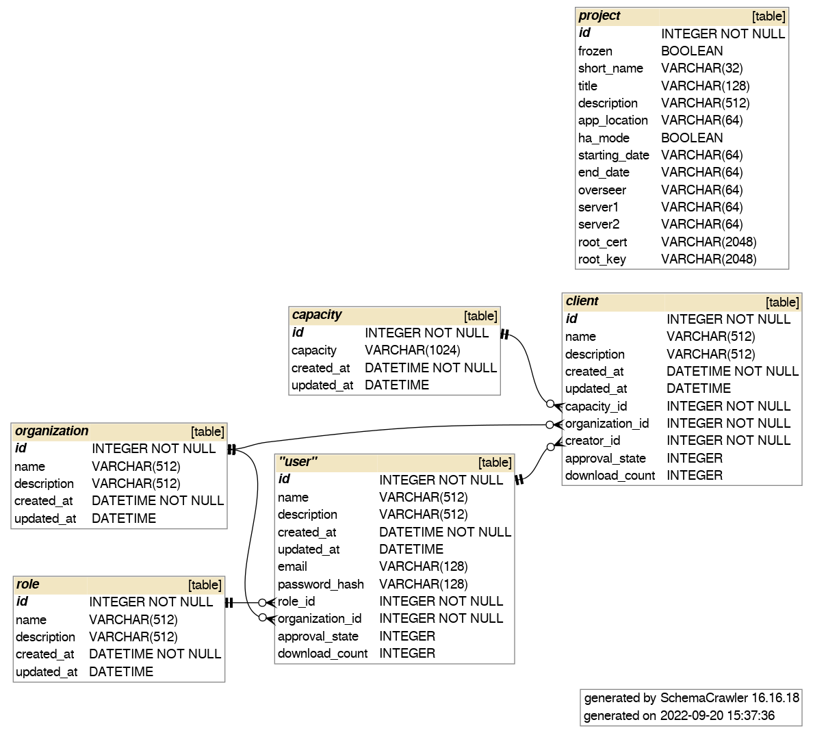

.. _dashboard_api:

#########################
Dashboard in NVIDIA FLARE
#########################
As mentioned in :ref:`provisioning`, the NVIDIA FLARE system requires a set of startup kits
which include the private keys and certificates (signed by the root CA) in order to communicate with one another.
The new :ref:`nvflare_dashboard_ui` in NVIDIA FLARE provides a simple way to collect information about clients and users from different organizations,
as well as to generate those startup kits for users to download.

Most of the details about provisioning can be found in :ref:`provisioning`.  In this section, we focus on the user interaction with Dashboard and its backend APIs.

.. include:: nvflare_cli/dashboard_command.rst

**********************************
NVIDIA FLARE Dashboard backend APIs
**********************************

Architecture
============

The Dashboard backend APIs follows the RESTful concept. It defines four resources: Project, Organizations, Client, and User.  There is one and only one Project.
The Project includes information about server(s) and overseer (if in HA mode).  Clients are defined for NVIDIA FLARE clients and Users for NVIDIA FLARE admin console.
Organizations is a GET-only operation that returns a list of currently registered organizations.

Details
=======

APIs
---
The following is the complete definition of the backend APIs, written in OpenAPI 3.0 syntax.  Developers can implement the same APIs in different programming language or
develop different UI while calling the same APIs for branding purpose.

.. literalinclude:: ../../nvflare/dashboard/dashboard.yaml
  :language: yaml

Authentication and Authorization
--------------------------------
Most of the backend APIs requires users to login to obtain JWT for authorization purpose.  The JWT includes claims about the user's organization and their role.  The JWT itself always
includes the user's email address (the user ID for login).

As shown in the previous section, only ``GET /project``, ``GET /users``, and ``GET /organizations`` can be called without login credentials.

The project_admin role can operate on any resource.

Freezing project
----------------
Because the project itself contains information required by clients and users, changing project information after clients and users are created will
cause incorrect dependencies.  It is required for the project_admin to freeze the project after all project related information is set and finalized so
that the Dashboard web can allow users to sign up.  Once the project is frozen, there is no way, from the Dashboard web, to unfreeze the project.

Database schema
---------------
The following is the schema of the underlying database used by the backend APIs.

