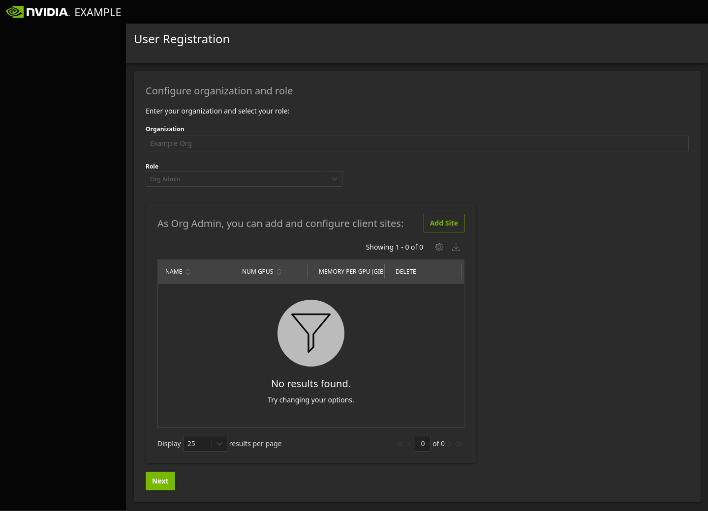

.. _nvflare_dashboard_ui:

######################################################
NVFLARE Dashboard UI
######################################################

The NVFlare Dashboard is an optional addition to NVIDIA FLARE that helps the project administrator
to deploy a website to gather information about the sites and distribute startup kits.

This simplifies the process of data collection and provisioning with users registering to join the project and provide
their own information then downloading their own startup kits once the project admin has approved the registration.
All the project information can be managed online with provisioning done on the fly.

Users with :ref:`role <nvflare_roles>` ``Member`` or ``Lead`` can register a user account and then
download the startup kit for the FLARE console once the account is approved.

Users of the :ref:`role <nvflare_roles>` ``Org Admin`` have the additional ability to specify the name and resource specifications
for client sites and then download startup kits for each client site after it is approved.

Finally, the ``Project Admin`` or project administrator is responsible for overall site management from setting up the project
to approving the users and client sites after inviting users to sign up (for details on how the project administrator can set up
the site, see :ref:`dashboard_api`). The ``Project Admin`` can also download startup kits
for the server(s) and overseer (if :ref:`HA mode <high_availability>` is enabled).

Member and Lead User Experience
===============================
The website should already be set up when ``Member`` or ``Lead`` users are invited to sign up by the project admin.

.. _dashboard_homepage:

Home Page with Login and Sign Up
--------------------------------

    Home Page with Login and Sign Up on the right.

On the Home Page for the NVFlare Dashboard website, there should be a button for ``Sign Up`` under New User on the right. The Home Page will
have the project title with a description set by the Project Admin as well as other project information including clients registered, organizations
joined, and planned start and end date. Once client sites are approved, they will appear on the Home Page below
the project description. 

.. _dashboard_new_user_reg:

New User Registration
----------------------

After clicking ``Sign Up`` on the Home Page, the User Registration page has fields for filling out the user's email, name, and password.

    User Registration first page for email, name, and password.

Proceeding to the next page, fill out the field for organization and select a role. If these values need to be updated later, you will need to contact the Project
Admin to help you update them.

    User Registration second page for organization and role.

After this step, your registration is complete, and you will be linked to the User Dashboard with the information from the registration.

.. _dashboard_user_dashboard_members:

User Dashboard
----------------

On the User Dashboard, you can click ``Edit My Profile`` to update your password, but for other changes you will need to contact your Project Admin for help.

Note that immediately after registering, you will not be able to download your startup kit until you have been approved by the Project Admin.

    User Info after registration.

.. _dashboard_user_download:

FLARE Console Download
-----------------------

After being approved by the Project Admin, the ``Download FLARE Console`` button will become available on the Downloads page. Clicking on this
will download the FLARE Console for the logged in user. The package will be zipped and password protected with a PIN provided in a modal window
that will appear upon clicking Download. The name of the package will be the email that the user registered with. Note that the FLARE Console
was previously called the Admin Client before NVIDIA FLARE 2.2.

    Download page with FLARE Console.

    PIN for unzipping the download.

Org Admin User Experience
===============================
Users of the role ``Org Admin`` have a similar experience as ``Member`` or ``Lead`` users but with the additional capability to specify client sites
and their resource specifications and then to download startup kits for each client site after approval by the Project Admin.

.. _dashboard_org_admin_user_reg:

Org Admin Registration - Configure Client Sites
-----------------------------------------------
:ref:`Home Page with Login and Sign Up <dashboard_homepage>` and the first part of creating an account and then specifying an organization and role for
:ref:`New User Registration <dashboard_new_user_reg>` are the same as for ``Member`` and ``Lead`` users. After choosing a role of ``Org Admin``, users
should see an interface to specify client sites.

    User Registration for Org Admin configuring client sites after selecting role.

The table will initially have nothing because there are no client sites at first. To add a client site, click on ``Add Site`` to the upper right of
the table, then type the client site name in the input box in the table for the new client site. Values will be updated automatically after clicking
outside of the input. Click on the value again to edit it. The fields for NUM GPU (number of GPUs) and MEMORY PER GPU (memory per GPU in GiBs) can
also be edited here. When done configuring client sites, click ``Next`` below to complete registration, and you will be linked to the User Dashboard.

Org Admin User Dashboard
------------------------
The User Dashboard for ``Org Admin`` users is the same as for ``Member`` and ``Lead`` users on the top, but below the user information is an
interface to add and edit client sites.

    User Dashboard for Org Admin with interface to add and edit client sites.

The client sites that were configured during registration should appear in the table, and the inline editing of the values in the table is the same too.
Just click on a field to edit, then click outside of the input to automatically save the updated value. Note that once the Project Admin has approved a
client site, you will no longer be able to edit the name of that client site or delete it.

.. _dashboard_org_admin_downloads:

Org Admin Downloads
-------------------

After being approved by the Project Admin, the ``Download FLARE Console`` button will become available on the Downloads page similar to ``Member`` and
``Lead`` users. In addition to the download of the FLARE Console, Org Admins can see the application docker image location specified by the Project
Admin and download startup kits for the client sites that have been approved. The name of each client site startup kit will be the site name followed
by the extension ".zip".

.. note::

   Each site needs to be approved by the Project Admin, so it is possible to have some sites approved while others are not, in which case the
   ``Download Startup Kit`` button for client sites that have not been approved will not be active.

    Download page for Org Admin.

Each package will be zipped and password protected with a separate PIN provided in a modal window that will appear upon clicking to download.

Project Admin Guide
===============================
The ``Project Admin`` is the administrator for the site and is responsible for inputting the values to set up the project in the beginning and
then approving the users and client sites while making edits if necessary.

After deploying the FLARE Dashboard website package, the Project Admin should log in from the Home Page with the bootstrapped credentials
provided in the deployment process. At this point, the Project Home Page only has a placeholder title since none of the project values have
been set yet.

.. note::

   After logging in, the Project Admin will have the additional option to ``Freeze Project``. This should only be done after all project values
   are finalized because after freezing the project, they will no longer be editable.

.. _dashboard_project_configuration:

Project Configuration
---------------------
Upon the first login, the first page that the Project Admin should be directed to is the Project Configuration page (after the project has been
frozen, the Project Admin will be directed to the Users Dashboard).

    Project Configuration page.

On the Project Configuration page, the Project Admin can set:

  - Short Name: a short name with a maximum of 16 characters that is shown at the top left of the website and also used in certificates
  - Title: the title of the project displayed on the Project Home Page
  - Description: the description for the project displayed on the Project Home Page
  - Start date: the start date for the project
  - End date: the end date for the project

.. tip::

   Click ``Save`` after entering the values to save the changes.

.. _dashboard_application_configuration:

Application Configuration
-------------------------

.. figure:: ../resources/dashboard_app_config.png
    :height: 500px

    Application Configuration page.

On the Application Configuration page, the Project Admin can set the docker image download link. This is displayed on the Downloads page for users
that are of the role ``Org Admin``.

.. _dashboard_server_configuration:

Server Configuration
----------------------

    Server Configuration page.

On the Server Configuration page, the Project Admin can set the information for FL Server(s) and the Overseer as well as toggle whether or not
:ref:`HA mode <high_availability>` is enabled. The information for the Overseer and backup FL Server are only used if HA is enabled.

.. _dashboard_users_dashboard:

Users Dashboard
----------------

On the Users Dashboard, the Project Admin can see all of the users that have registered with the system and their name, email, organization,
role, created time, approval status, and download count for their FLARE Console.

    Project Admin: Users Dashboard.

By clicking the organization or role, the Project Admin can update and change the values with inline editing. Note that users cannot change
their organization or role after setting it initially and only the Project Admin has the ability to change these values. The name and email
cannot be changed for any users, so if it is necessary to change that, the Project Admin may need to delete the user and have the user sign up again.

    Project Admin: Approve, deny, or delete on Users Dashboard.

The actions of Approve, Deny, and Delete are available to the Project Admin to apply to a single user or a selection of users by clicking the
checkbox at the left of the user records, selecting the desired action from the dropdown menu at the top left of the Users table, then clicking ``Apply``.

Users will not be able to download their FLARE Console or any startup kits until approved by the Project Admin.

.. _dashboard_client_sites:

Client Sites Dashboard
----------------------

On the Client Sites Dashboard, the Project Admin can see the name and capacity sepecification for each client site in the system as well as the
organization of the user that created the site, time of creation, approval status, and download count of that site's startup kit.

.. figure:: ../resources/dashboard_sites_dashboard.png
    :height: 500px

    Project Admin: Client Sites Dashboard.

By clicking on the name of a client site, the Project Admin can change the client site name with inline editing. Note that client sites that
have been approved cannot have the name changed anymore.

    Project Admin: Approve, deny, or delete client sites on the Client Sites Dashboard.

The actions of Approve, Deny, and Delete are available to the Project Admin to apply to a single client site or a selection of sites by clicking the
checkbox at the left of the row, selecting the desired action from the dropdown menu at the top left of the table, then clicking ``Apply``.

Org Admin Users will not be able to download a startup kits for a client site until that site is approved by the Project Admin.

.. _dashboard_proj_admin_downloads:

Project Admin Downloads
-----------------------

The Project Admin has the same ``Download FLARE Console`` button as the other users at the top of the page. The application docker image location visible
to Org Admins will be on the Project Admin Downloads page as well. In addition to this, the Project Admin has the ability to download the startup kit
for the FL Server, and if HA mode is enabled, the Overseer and the secondary server.

Downloads will be available after the project has been frozen. The name of the FL Server and Overseer startup kits will be the DNS name that was configured
on the :ref:`Server Configuration <dashboard_server_configuration>` page followed by the extension ".zip".

    Download page for Project Admin.

Each package will be zipped and password protected with a separate PIN provided in a modal window that will appear upon clicking to download.
