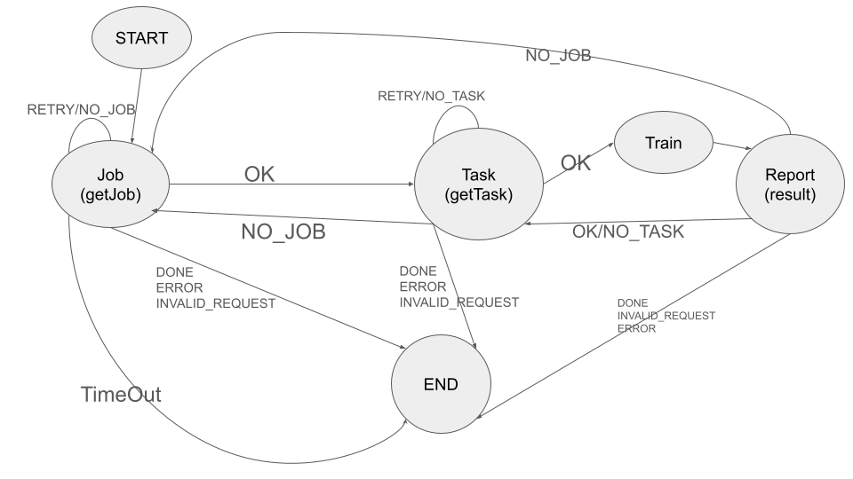
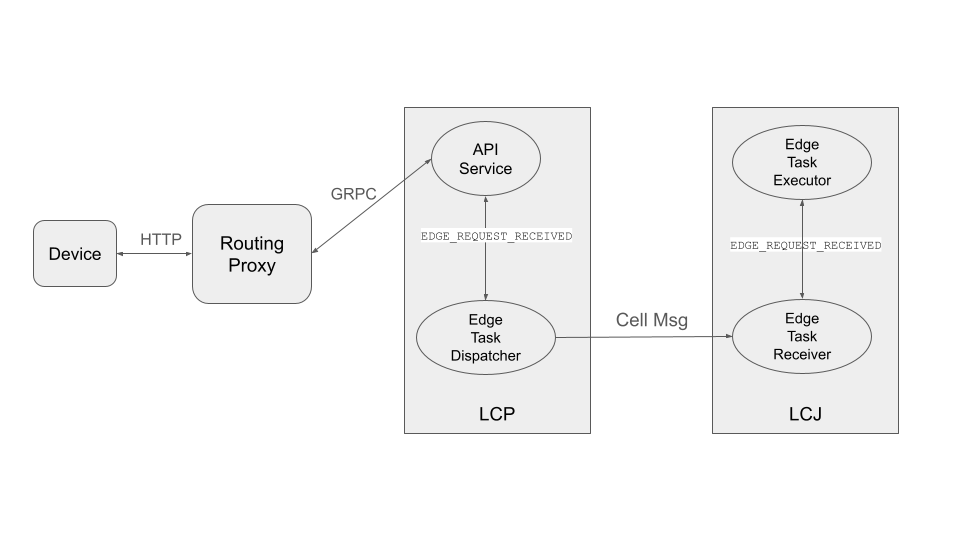
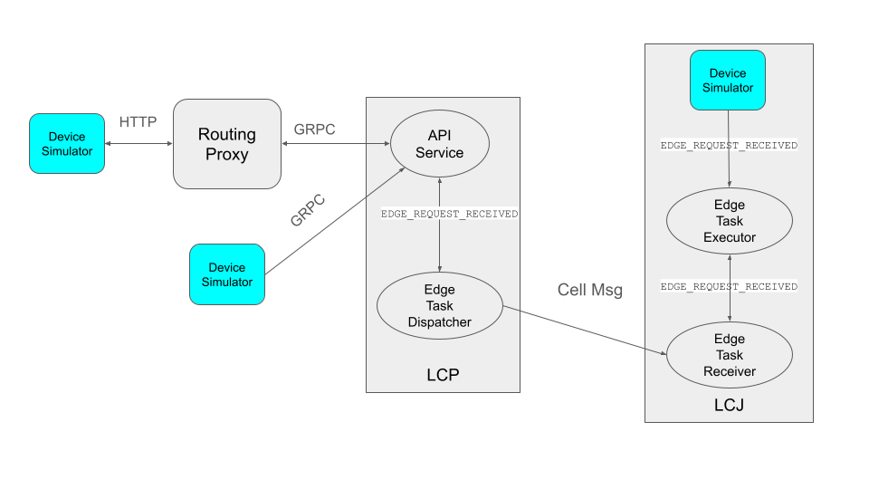

.. _flare_edge:

####################################
Develop Edge Applications with FLARE
####################################

FLARE 2.7 extends federated learning capabilities to edge devices. Edge device applications present some new challenges.

- **Scalability**: Unlike cross-silo applications where the number of FL clients is relatively small, the number of devices could be in the millions. It's infeasible to treat the devices as simple FL clients and connect them directly to the FL server.

- **Stability**: Unlike cross-silo applications where the FL clients are stable, edge devices come and go at any time. This requires the training strategy to accommodate this behavior.

- **Compute capability**: Compared to cross-silo applications, edge devices don't have as much computing power.

- **Platform dependency**: There are multiple edge device platforms (e.g. iOS, Android, etc.), and each has a different application development environment.

Deployment Architecture
=======================

Edge devices could be in the millions and scattered in many places. These devices need to be able to connect to the FLARE host system from anywhere, using standard web technologies.

.. image:: ../../resources/deployment_architecture.png
    :height: 400px

In the diagram, devices (D1 to Dn) connect to FLARE via web nodes (W1 to Wk), via HTTP protocol. The web nodes connect to FLARE via gRPC.

Hierarchical FLARE
==================

Check more details in :ref:`flare_hierarchical_architecture` for the hierarchical deployment architecture.

Edge Training Algorithm
=======================

Flexible Orchestration Patterns from Synchronous to Asynchronous Aggregation
----------------------------------------------------------------------------

In cross-silo applications, the number of clients is small, and clients are stable. In a typical FedAvg algorithm, all clients participate in each round of training, and the server waits for training results from all clients. After aggregating results from clients, the server generates a new version of the model and starts the next round of training. This is called synchronous aggregation.

The synchronous aggregation algorithm may not be feasible for edge device-based training. This is because the number of devices is usually very large, and connections to device clients are not as stable (the devices can come and go at any moment). It is also very hard to coordinate a large number of clients in a round-by-round fashion as devices can often join and leave at any time.

FLARE uses a more flexible orchestration mechanism to support a wide range of advanced algorithms, from synchronous to asynchronous, for device-based training. The general idea is as follows:

1. **Device Availability**: The server (SJ) waits for enough devices to become available before starting training. Once device clients are started, they are reported to the server through the FL client hierarchy.

2. **Model Preparation and Device Selection**: The SJ prepares the initial version of the model and selects a set of devices (based on configured selection pool size) for training. The model and selection list are sent to the leaf CJs through the FL client hierarchy. Note that even though the number of available devices could be in the millions, the selection pool is usually small, typically in the thousands.

3. **Training and Aggregation**: Selected devices start training and report their training results to the leaf CJs. Each tier of the CJs periodically (e.g., every 2 seconds) aggregates results received in the period and sends the aggregated results to their parent CJs in the client hierarchy, all the way to the server.

4. **Model Update and Device Replacement**: Each time a set of aggregated results is received from a CJ, the SJ updates the current version of the model. Devices that sent training results are moved out of the selection pool, and some other devices are selected to replace them in the pool. As soon as enough updates (a configuration parameter) are received, the SJ creates a new version of the model and sends the new model and selection list to the leaf CJs through the client hierarchy. Any model requests from selected devices will get this new model version.

5. **Handling Device Variability**: Since devices are not equal, some devices train more quickly than others. You can imagine that some slow devices may still be training the old model version while others are training a new model version. There could be multiple versions of the model being trained by different devices at the same time. The number of concurrent models allowed is a configuration parameter. When a device's result is received, it is only aggregated into the version it is trained on. If the received version is too old (outside of the allowed concurrent versions), it is abandoned. When generating the next version of the model, the SJ considers all concurrent model versions. The SJ periodically evaluates the performance of the model against an evaluation dataset.

There is no explicit concept of round. The whole process just keeps going until the SJ decides it's time to stop, either because it has produced a good model, or the performance is so bad that it makes no sense to continue.

Such configurable orchestration gives us sufficient flexibility in determining the overall federated learning process, given two extreme cases if we have a number of N devices joining the learning:

- **Synchronous FL**: We can set: 1) the replacement (selection of new devices and dispatching the global model to them) of the selection pool to only when it becomes empty; 2) a new version of the global model to only when it received all devices' updates.

- **Asynchronous FL**: We can also set 1) the replacement of the selection pool whenever at least one device reports back and gets removed from the pool; 2) a new version of the global model to be updated with at least 1 device's updates.

- **Custom Orchestration**: Further, we can set the parameters to anywhere between these two extremes to allow for other orchestration patterns like buffered asynchronous aggregation. Users can also define their own aggregation methods.

Edge Device Interaction Protocol (EDIP)
=======================================

EDIP defines the rules that edge devices must follow to interact with the host, as outlined in the following steps.

Step 1 - Get a Job
------------------

1. **Initiate Job Request**: The first step after starting is to get a job from the host. The device client keeps sending the getJob requests until either a job is received or the configured max amount of time to try is exceeded. If a job is not received, the client should exit.

2. **Include Job Name**: The request to the host must include a predefined job name. The LCP uses the job name to find the matching job. If multiple jobs have the same job name, one of them is randomly chosen.

3. **Provide Headers**: The request to the host also must include common headers such as device info and user info, both of them represented as a map (key/value pairs). Device Info includes information about the device platform, capabilities, and most importantly a unique device ID. User Info includes information about the user of the device. Currently, it is not being used.

4. **Receive Job Response**: The job response includes the job ID, which will be used for the training session.

5. **Process Job Config Data**: The response also includes Job Config Data, which contains configuration information about the job such as the training components (trainer, loss function, optimizer, etc.) and their parameters (e.g., learning rate, number of epochs, etc.). The device client must process the job config data and create training components accordingly.

6. **Handle Cookies**: The response could include a cookie, which is a piece of information to be sent back to the host in subsequent requests.

Step 2 - Get a Task
-------------------

Once the job is received and job configuration is processed, the device will try to get a task to execute from the host by sending the getTask request to the host.

In the getTask request, the client must include the job ID and the cookie (if available). Common headers like device info and user info are also included.

The device then must proceed based on the return code from the host:

- **OK**: a task is assigned and the response includes task information. The device must proceed to execute the task.
- **RETRY** or **NO_TASK**: the device must resend the getTask again at a later time.
- **NO_JOB**: the requested job is no longer available. The device should go back to Step 1 to get the next job.
- **DONE** or any error condition - the device should exit.

If a task is assigned, the response from the host includes the task name and task data (e.g. model weights). The response could also include a cookie.

.. note::
   This protocol is generic. The device client must choose the right component to execute the task based on the task name and the configured components in the job config data.

Step 3 - Execute Task and Report Result
---------------------------------------

If a task is received, the device should execute the task with the properly selected component. Once completed, the device sends the result back to the host by sending a reportResult request. The request includes the job ID, result, task name and ID, and the cookie. Common headers like device info and user info are also included.

The device client then must proceed according to the return code from the host:

- **OK**: the report has been successfully processed. The device client should go to Step 2 to get the next task.
- **NO_TASK**: the task is no longer available. The device client should go to Step 2 to get the next task.
- **NO_JOB**: the job is no longer available. The device client should go to Step 1 to get the next job.
- **END** or other error conditions - the device client should exit.

These steps can be best illustrated as a finite state machine as follows:

Device Simulation
=================

Device-based model development requires a large number of devices. However, during algorithm development, it is impractical to expect a large number of real devices to be always available. FLARE provides a device simulator that can simulate a very large number of devices efficiently.

The device simulator follows the EDIP discussed above, with an additional getSelection request. This request retrieves the currently selected device IDs from the host.

A real device keeps sending getTask requests to get a task to execute. As discussed above, when there are millions of devices, a very small number of them actually get tasks. If we simulated this behavior, then it would take many wasteful messages and a long time to get a task to execute. Instead of going through all simulated devices to get a task, the simulator sends one getSelection request to get selected devices immediately, and then only sends the getTask request for the selected devices.

Simulation Logic
----------------

The following outlines the simulator's logic.

Step 1 - Get a Job
------------------

1. **Send Job Request**: The simulator sends the getJob request with a dummy device ID. It keeps doing so until a job is received or timed out.

Step 2 - Get Selections
-----------------------

1. **Send Selection Request**: The simulator sends the getSelection request to the host until a selection list is received. This request serves another purpose as well: it tells the host the number of devices it simulates.

2. **Device ID Pattern**: All simulated devices on this simulator share this pattern:

   ``<uuid_prefix>#<index_number>``

   Where uuid_prefix is a unique UUID, index_number is the index number of the simulated device, ranging from 1 to the number of simulated devices on this simulator (a configuration parameter).

3. **Process Selection List**: When the leaf CJ processes the getSelection request, it reports the simulated device IDs to the SJ through the client hierarchy. When the selection list is available, the leaf CJ includes it in the response to the simulator.

4. **Identify Devices**: Note that the selection list contains all devices selected, some of them are real devices, some are simulated devices on other simulators (yes, there could be multiple simulators running at the same time), and some are devices for this simulator. The simulator then finds the devices that belong to it.

5. **Continue if Necessary**: If the selection list does not contain any devices of this simulator, the simulator will continue to send getSelection.

Step 3 - Get and Execute Task
-----------------------------

1. **Send Task Request**: The simulator sends the getTask request to the host sequentially for each selected device that belongs to it.

2. **Execute Task**: If a task is received (it is possible that the task is done already by the time the getTask request is sent to the host, even for the selected device), then the simulator submits the task to a thread pool for execution.

3. **Report Result**: Once the task is executed, the simulator reports it to the host by a reportResult request.

4. **Repeat Process**: Once all devices are processed, the simulator goes to Step 2 for the next set of selections.

Simulation Completion
---------------------

The simulator keeps going until one of the following conditions occurs:

- **No_JOB** return code is received. In this case, the job is finished.
- Any error code.

Simulator Configuration
=======================

The behavior of the simulator can be configured with the following parameters:

- **Job Name (job_name)**: the name of the job
- **Number of devices (num_devices)**: the number of devices to be simulated. The default is 10000.
- **Number of workers (num_workers)**: the max number of worker threads to be used for executing training tasks. The default value is 10.
- **GetJob timeout (get_job_timeout)**: the max amount of time to get a matching job from the host.

The simulated device must be able to execute the assigned task. When a task is received for a device, the simulator calls the device's do_task() method. As part of the simulator configuration, a DeviceFactory object must be provided, which is called to create new devices by the simulator. The created devices must implement the do_task() method.

In most cases, you do not need to write DeviceFactory. Instead, you only need to create a TaskProcessor. A special TaskProcessingDevice has been implemented that takes DeviceTaskProcessor and does the rest for you.

How to run simulation
=====================

The end-to-end communication path between devices and the host is illustrated with the following diagram.

The device sends a request to the web node (Routing Proxy) via HTTP.

The web node chooses the LCP based on the device ID of the request, and forwards the request to the LCP via gRPC.

Within the LCP, there are two components: the API Service and the Edge Task Dispatcher. The API Service receives the request from the web node, and fires the EDGE_REQUEST_RECEIVED event with the request data. The Edge Task Dispatcher listens to the event and finds the LCJ corresponding to the job ID. It then forwards the request to the LCJ.

There are two components in the LCJ: the Edge Task Receiver and the Edge Task Executor. The Edge Task Receiver receives the request from the LCP and fires the EDGE_REQUEST_RECEIVED event. The Edge Task Executor listens to this event and processes the request to produce a result, which is sent back to the device along the path of request.

With this end-to-end communication path, simulator can be installed in different places:

- Embedded in the leaf CJs (LCJs)
- Connect to LCPs directly
- Connect to web nodes

These options are shown in this diagram:

Obviously the most efficient way to run the simulator is to install it in LCJs, since it avoids message hops to the web node and LCP. It is also the easiest to use - you don't even need to run the web node if you don't have any real devices. This method is ideal for algorithm development.

Connecting the simulator to the routing proxy or to LCPs is useful for stress testing the system's communication capabilities.

If you provision the project with the tree_prov tool described above, it generates convenience scripts in the "scripts" folder of the provision result:

- `simulate_rp.sh`: Start the simulator and connect to the Routing Proxy
- `simulate_lcp.sh`: Start the simulator and connect to LCPs

There is also the file simulation_config.json in the "scripts" folder. This file contains the simulation configuration parameters, as discussed above. You may want to edit these parameters to meet your requirements.

The following is a sample simulation_config.json.

.. code-block:: json

   {
       "endpoint": "http://<end-point-host>:4321",
       "num_devices": 10000,
       "num_workers": 30,
       "processor": {
           "path": "nvflare.edge.simulation.devices.num.NumProcessor",
           "args": {
               "min_train_time": 0.2,
               "max_train_time": 1.0
           }
       }
   }

Both simulate_rp.sh and simulate_lcp.sh require the simulation_config.json.

If you want to install the simulator in LCPs, you need to configure them in config_fed_client.json, as highlighted in the following example:

.. code-block:: json

   {
      "format_version": 2,
      "executors": [
          {
              "tasks": [
                  "train"
              ],
              "executor": {
                  "path": "nvflare.edge.executors.edge_model_executor.EdgeModelExecutor",
                  "args": {
                      "aggr_factory_id": "aggr_factory",
                      "max_model_versions": 3,
                      "update_timeout": 5.0
                  }
              }
          }
      ],
      "components": [
          {
              "id": "task_processor",
              "path": "nvflare.edge.simulation.devices.pt_cifar10.PTCifar10Processor",
              "args": {
                  "data_root": "/tmp/nvflare/datasets/cifar10",
                  "subset_size": 100,
                  "communication_delay": {
                      "mean": 5.0,
                      "std": 1.0
                  },
                  "device_speed": {
                      "mean": [
                          10.0,
                          20.0,
                          40.0
                      ],
                      "std": [
                          1.0,
                          2.0,
                          4.0
                      ]
                  }
              }
          },
          {
              "id": "tpo_runner",
              "path": "nvflare.edge.widgets.tpo_runner.TPORunner",
              "args": {
                  "task_processor_id": "task_processor",
                  "job_timeout": 20.0,
                  "num_devices": 100,
                  "num_workers": 5
              }
          },
          {
              "id": "edge_task_receiver",
              "path": "nvflare.edge.widgets.etr.EdgeTaskReceiver",
              "args": {}
          },
          {
              "id": "aggr_factory",
              "path": "nvflare.edge.aggregators.model_update_dxo_factory.ModelUpdateDXOAggrFactory",
              "args": {}
          }
      ],
      "task_data_filters": [],
      "task_result_filters": []
   }

.. note::
   You do not need to manually create this file. Instead, you should use either EdgeJob API or EdgeRecipe to create the job configuration.

Model Development
=================

Ultimately, you want to develop a performant model with federated device training. FLARE provides ways for you to develop PyTorch models without needing to do any device programming.

Step 1 - Design Model Architecture
----------------------------------

1. **Model Design**: In this step, you can design your model using PyTorch, just as you would for single-machine training. However, keep in mind that edge devices typically have limited computational resources, so the model architecture should be kept simple and lightweight to accommodate those constraints.

2. **Mobile Device Training**: For mobile devices, training is currently implemented using ExecuTorch. Please refer to the `ExecuTorch GitHub repository <https://github.com/pytorch/executorch>`_ for a list of supported layers, as they may differ from those in PyTorch.

Step 2 - Create DeviceModel
---------------------------

1. **Applicability**: This step is applicable only when developing models for mobile devices.

2. **ExecuTorch Requirements**: ExecuTorch requires the model to return both the loss and the predictions during training. To meet this requirement, you need to wrap the model defined in Step 1 into a custom DeviceModel class that includes both the loss function and the prediction logic.

3. **Example**: Below is an example of how to create a DeviceModel for a classification task using CrossEntropyLoss:

.. code-block:: python

   class DeviceModel(nn.Module):
       """Model wrapper for classification with CrossEntropyLoss."""

       def __init__(self, net: nn.Module):
           super().__init__()
           self.net = net
           self.loss = nn.CrossEntropyLoss()

       def forward(self, input, label):
           pred = self.net(input)
           return self.loss(pred, label), pred.detach().argmax(dim=1)

As you can see here, by default, it uses the CrossEntropyLoss loss function, which will be used by ExecuTorch in device training.

Your device model must extend from DeviceModel. You can choose to use a different loss function.

Here is an example of how to create these models.

.. code-block:: python

   import torch
   import torch.nn as nn
   from torch.nn import functional as F

   from nvflare.edge.models.model import DeviceModel

   class Cifar10ConvNet(nn.Module):
       def __init__(self):
           super().__init__()
           self.conv1 = nn.Conv2d(in_channels=3, out_channels=6, kernel_size=5, stride=2)
           # self.pool = nn.MaxPool2d(2, 2)
           self.conv2 = nn.Conv2d(in_channels=6, out_channels=16, kernel_size=5, stride=2)
           self.fc1 = nn.Linear(in_features=16 * 5 * 5, out_features=120)
           self.fc2 = nn.Linear(in_features=120, out_features=84)
           self.fc3 = nn.Linear(in_features=84, out_features=10)

       def forward(self, x):
           x = F.relu(self.conv1(x))
           x = F.relu(self.conv2(x))
           x = torch.flatten(x, 1)  # flatten all dimensions except batch
           x = F.relu(self.fc1(x))
           x = F.relu(self.fc2(x))
           x = self.fc3(x)
           return x

   class TrainingNet(DeviceModel):
       def __init__(self):
           DeviceModel.__init__(self, Cifar10ConvNet())

The Cifar10ConvNet is a normal PyTorch model that you would create in Step 1.
The TrainingNet is the device model you would create in Step 2.

Step 3 - Create Flare Job
-------------------------

In this step, you use a recipe to create and/or run a Flare job.

If you are developing models with mobile devices, you need to use the ETFedBuffRecipe; otherwise, you need to use the EdgeFedBuffRecipe.

FedBuff is the algorithm that manages device selection and model updates.

EdgeFedBuffRecipe
------------------

This recipe helps you create jobs for training with regular PyTorch on other edge devices (e.g. NVIDIA Jetson devices). An example can be found in the :ref:`edge examples <edge_examples>`.

.. code-block:: python

   recipe = EdgeRecipe(
           job_name=f"pt_job_{fl_mode}{suffix}",
           model=Cifar10ConvNet(),
           model_manager_config=model_manager_config,
           device_manager_config=device_manager_config,
           evaluator_config=EvaluatorConfig(
               torchvision_dataset={"name": "CIFAR10", "path": dataset_root},
               eval_frequency=eval_frequency
           ),
           simulation_config=SimulationConfig(
               task_processor=task_processor,
               job_timeout=20.0,
               num_workers=4,
               # simulation config is for each leaf node
               num_devices=devices_per_leaf,
           ),
           custom_source_root=None,
       )

Specifically, there are mainly 4 components to define: among them, the "evaluator_config" and "simulation_config" are easy to understand:

- **Evaluator** is a standalone widget, evaluating the global model with a dataset whenever the server generates a number of eval_frequency global model versions
- **Simulation** is for simulating devices on LCJs as described earlier, so "num_devices" is per leaf client - the total number of devices involved in FL will be num_leaf * num_devices (12*num_devices if using the example tree we generated earlier)

"Model_manager_config" and "device_manager_config" contain more parameters, they provide control over the server behavior - essentially 1) when to generate new global model, and 2) when and who should the global model be sent to:

.. code-block:: python

   model_manager_config = ModelManagerConfig(
               global_lr= ,
               num_updates_for_model= ,
               max_model_version= ,
               max_model_history= ,
          )

- **global_lr** is used to define how the device model updates will contribute to the global model
- **num_updates_for_model** defines how many device updates the server needs to receive before generating a new global model
- **max_model_version** defines how many global models the server needs to generate before stopping the FL job
- **max_model_history** defines how many models we keep record of, the ones older than this will be considered too old, and the updates will be discarded without being aggregated to the global model

.. code-block:: python

   device_manager_config = DeviceManagerConfig(
   device_selection_size= ,
   min_hole_to_fill= ,
   device_reuse= ,
   )

- **device_selection_size** defines the total number of devices that will be constantly maintained for concurrent active model training
- **min_hole_to_fill** defines when should the current global model be dispatched to device: whenever a device reports back, it will be removed from the device selection list, creating a "hole" in the list, this hole will then be filled by sampling from the available devices and whoever gets selected to fill the holes will be given the current global model for training. This parameter defines the minimum number of holes before we sample and dispatch the current global model
- **device_reuse** is a bool defining whether we allow devices that have participated in the training to be selected again

To give a realistic example, if we want to set the parameters such that we have a regular synchronous FL pipeline running M rounds, assuming we have a total number of devices N ("12*num_devices" as mentioned above), we can set the parameters as:

On model_manager_config side:

- **global_lr=1.0**
- **num_updates_for_model=N**
- **max_model_version=M**
- **max_model_history=1**

Such that local updates gets aggregated with scale factor of 1.0, we need all devices' updates to generate a global model, in total we will have M global model versions ("M rounds"), and since everyone needs to report back before generating a new model version before starting new training, we do not need to keep track of more than 1 global model versions.

On device_manager_config side:

- **device_selection_size=N**
- **min_hole_to_fill=N**
- **device_reuse=True**

Such that we maintain the selection of all N devices, we need to wait for all N devices to report back (become "hole") before new device sampling and model dispatching, and we need to toggle device_reuse on because we always use these N devices

Similarly we can simulate async pipeline by setting them differently, see more details in the example.

ETFedBuffRecipe
---------------

This recipe helps you create jobs for training with ExecuTorch (ET) on mobile devices. Examples can be found in the :ref:`edge examples <edge_examples>`.

.. code-block:: python

   recipe = ETFedBuffRecipe(
       job_name=job_name,
       device_model=device_model,
       input_shape=input_shape,
       output_shape=output_shape,
       model_manager_config=ModelManagerConfig(
           max_model_version=3,
           update_timeout=1000.0,
           num_updates_for_model=total_num_of_devices,
       ),
       device_manager_config=DeviceManagerConfig(
           device_selection_size=total_num_of_devices,
           min_hole_to_fill=total_num_of_devices,
       ),
       evaluator_config=evaluator_config,
       simulation_config=(
           SimulationConfig(
               task_processor=task_processor,
               num_devices=num_of_simulated_devices_on_each_leaf,
           )
           if num_of_simulated_devices_on_each_leaf > 0
           else None
       ),
       device_training_params={"epoch": 3, "lr": 0.0001, "batch_size": batch_size},
   )

The highlighted sections mean the following:

- **Device_model**: This is the DeviceModel wrapper you created in Step 2, which encapsulates your base model along with the loss function and prediction logic required for ExecuTorch training on mobile devices.
- **Input_shape, output_shape**: These specify the shapes of the input and output tensors expected by your device_model. They are crucial for the ExecuTorch model export process, helping to define tensor dimensions for compilation and deployment on edge devices.
- **Device_training_params**: A dictionary containing additional training hyperparameters (e.g., number of epochs, learning rate, batch size). These parameters are passed down to each device during distributed training to control the local training loop.

