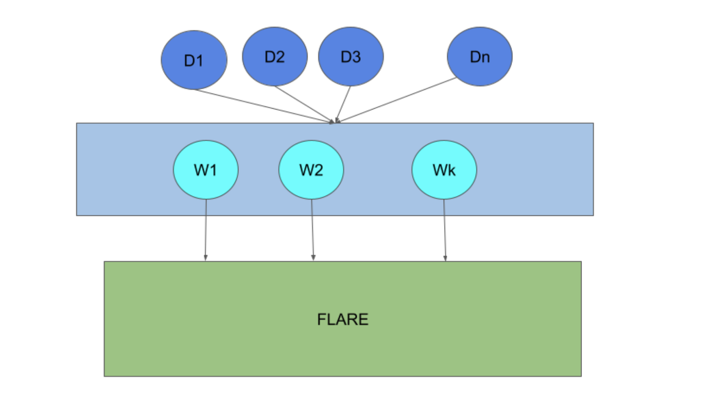

.. _flare_edge:

####################################
Develop Edge Applications with FLARE
####################################

FLARE extends federated learning capabilities to edge devices. Edge device applications present several unique challenges:

- **Scalability**: Unlike cross-silo applications where the number of FL clients is relatively small, the number of devices can reach millions. It is infeasible to treat devices as simple FL clients and connect them directly to the FL server.

- **Stability**: Unlike cross-silo applications where FL clients are stable, edge devices can connect and disconnect at any time. This requires the training strategy to accommodate dynamic participation.

- **Compute capability**: Compared to cross-silo applications, edge devices have limited computing power.

- **Platform dependency**: Multiple edge device platforms exist (e.g., iOS, Android), each with a different application development environment.

Deployment Architecture
=======================

Edge devices can number in the millions and be distributed across many locations. These devices must be able to connect to the FLARE host system from anywhere using standard web technologies.

In the diagram, devices (D1 to Dn) connect to FLARE via web nodes (W1 to Wk) using HTTP protocol. The web nodes connect to FLARE via gRPC.

Hierarchical FLARE
==================

For more details on the hierarchical deployment architecture, see :ref:`flare_hierarchical_architecture`.

Edge Training Algorithm
=======================

Flexible Orchestration Patterns from Synchronous to Asynchronous Aggregation
----------------------------------------------------------------------------

In cross-silo applications, the number of clients is small and clients are stable. In a typical FedAvg algorithm, all clients participate in each round of training, and the server waits for training results from all clients. After aggregating results from clients, the server generates a new version of the model and starts the next round of training. This is called synchronous aggregation.

The synchronous aggregation algorithm may not be feasible for edge device-based training because the number of devices is usually very large, and connections to device clients are less stable (devices can connect and disconnect at any moment). It is also challenging to coordinate a large number of clients in a round-by-round fashion when devices frequently join and leave.

FLARE uses a flexible orchestration mechanism to support a wide range of advanced algorithms, from synchronous to asynchronous, for device-based training. The general approach is as follows:

1. **Device Availability**: The server (SJ) waits for enough devices to become available before starting training. Once device clients are started, they are reported to the server through the FL client hierarchy.

2. **Model Preparation and Device Selection**: The SJ prepares the initial version of the model and selects a set of devices (based on configured selection pool size) for training. The model and selection list are sent to the leaf CJs through the FL client hierarchy. Note that even though the number of available devices could be in the millions, the selection pool is usually small, typically in the thousands.

3. **Training and Aggregation**: Selected devices start training and report their training results to the leaf CJs. Each tier of the CJs periodically (e.g., every 2 seconds) aggregates results received in the period and sends the aggregated results to their parent CJs in the client hierarchy, all the way to the server.

4. **Model Update and Device Replacement**: Each time a set of aggregated results is received from a CJ, the SJ updates the current version of the model. Devices that sent training results are moved out of the selection pool, and some other devices are selected to replace them in the pool. As soon as enough updates (a configuration parameter) are received, the SJ creates a new version of the model and sends the new model and selection list to the leaf CJs through the client hierarchy. Any model requests from selected devices will get this new model version.

5. **Handling Device Variability**: Since devices have varying capabilities, some devices train more quickly than others. Consequently, some slow devices may still be training an old model version while others are training a new model version. Multiple versions of the model can be trained by different devices simultaneously. The number of concurrent models allowed is a configuration parameter. When a device's result is received, it is only aggregated into the version it was trained on. If the received version is too old (outside the allowed concurrent versions), it is discarded. When generating the next version of the model, the SJ considers all concurrent model versions. The SJ periodically evaluates model performance against an evaluation dataset.

There is no explicit concept of rounds. The process continues until the SJ determines it is time to stop, either because it has produced a satisfactory model or because the performance indicates that continuing is not worthwhile.

This configurable orchestration provides sufficient flexibility for determining the overall federated learning process. Given N devices participating in learning, we can configure two extreme cases:

- **Synchronous FL**: Configure: 1) replacement (selection of new devices and dispatching the global model to them) of the selection pool only when it becomes empty; 2) a new version of the global model only when all devices' updates have been received.

- **Asynchronous FL**: Configure: 1) replacement of the selection pool whenever at least one device reports back and is removed from the pool; 2) a new version of the global model to be updated with at least one device's updates.

- **Custom Orchestration**: Configure parameters anywhere between these two extremes to enable other orchestration patterns, such as buffered asynchronous aggregation. Users can also define their own aggregation methods.

Edge Device Interaction Protocol (EDIP)
=======================================

EDIP defines the rules that edge devices must follow to interact with the host, as outlined in the following steps.

Step 1 - Get a Job
------------------

1. **Initiate Job Request**: The first step after starting is to obtain a job from the host. The device client continues sending ``getJob`` requests until either a job is received or the configured maximum time is exceeded. If a job is not received, the client should exit.

2. **Include Job Name**: The request to the host must include a predefined job name. The LCP uses the job name to find the matching job. If multiple jobs have the same job name, one is randomly chosen.

3. **Provide Headers**: The request to the host must also include common headers such as device info and user info, both represented as maps (key/value pairs). Device info includes information about the device platform, capabilities, and most importantly, a unique device ID. User info includes information about the device user and is currently not being used.

4. **Receive Job Response**: The job response includes the job ID, which is used for the training session.

5. **Process Job Config Data**: The response also includes job configuration data, which contains configuration information about the job, such as the training components (trainer, loss function, optimizer, etc.) and their parameters (e.g., learning rate, number of epochs). The device client must process the job configuration data and create training components accordingly.

6. **Handle Cookies**: The response may include a cookie, which is information to be sent back to the host in subsequent requests.

Step 2 - Get a Task
-------------------

Once the job is received and job configuration is processed, the device attempts to obtain a task to execute from the host by sending a ``getTask`` request.

In the ``getTask`` request, the client must include the job ID and the cookie (if available). Common headers such as device info and user info are also included.

The device must then proceed based on the return code from the host:

- **OK**: A task is assigned and the response includes task information. The device must proceed to execute the task.
- **RETRY** or **NO_TASK**: The device must resend the ``getTask`` request at a later time.
- **NO_JOB**: The requested job is no longer available. The device should return to Step 1 to get the next job.
- **DONE** or any error condition: The device should exit.

If a task is assigned, the response from the host includes the task name and task data (e.g., model weights). The response may also include a cookie.

.. note::
   This protocol is generic. The device client must choose the right component to execute the task based on the task name and the configured components in the job config data.

Step 3 - Execute Task and Report Result
---------------------------------------

If a task is received, the device should execute the task with the properly selected component. Once completed, the device sends the result back to the host by sending a ``reportResult`` request. The request includes the job ID, result, task name and ID, and the cookie. Common headers such as device info and user info are also included.

The device client must then proceed according to the return code from the host:

- **OK**: The report has been successfully processed. The device client should return to Step 2 to get the next task.
- **NO_TASK**: The task is no longer available. The device client should return to Step 2 to get the next task.
- **NO_JOB**: The job is no longer available. The device client should return to Step 1 to get the next job.
- **END** or other error conditions: The device client should exit.

These steps can be best illustrated as a finite state machine as follows:

Device Simulation
=================

Device-based model development requires a large number of devices. However, during algorithm development, it is impractical to expect a large number of real devices to be always available. FLARE provides a device simulator that can efficiently simulate a very large number of devices.

The device simulator follows the EDIP discussed above, with an additional ``getSelection`` request. This request retrieves the currently selected device IDs from the host.

A real device continuously sends ``getTask`` requests to obtain a task to execute. As discussed above, when there are millions of devices, only a very small number actually receive tasks. If we simulated this behavior, it would require many wasteful messages and a long time to obtain a task to execute. Instead of iterating through all simulated devices to get a task, the simulator sends one ``getSelection`` request to get selected devices immediately, and then only sends the ``getTask`` request for the selected devices.

Simulation Logic
----------------

The following outlines the simulator's logic.

Step 1 - Get a Job
------------------

1. **Send Job Request**: The simulator sends the ``getJob`` request with a dummy device ID. It continues doing so until a job is received or the request times out.

Step 2 - Get Selections
-----------------------

1. **Send Selection Request**: The simulator sends the ``getSelection`` request to the host until a selection list is received. This request also serves to inform the host of the number of devices it simulates.

2. **Device ID Pattern**: All simulated devices on this simulator share the following pattern:

   ``<uuid_prefix>#<index_number>``

   Where ``uuid_prefix`` is a unique UUID and ``index_number`` is the index number of the simulated device, ranging from 1 to the number of simulated devices on this simulator (a configuration parameter).

3. **Process Selection List**: When the leaf CJ processes the ``getSelection`` request, it reports the simulated device IDs to the SJ through the client hierarchy. When the selection list is available, the leaf CJ includes it in the response to the simulator.

4. **Identify Devices**: Note that the selection list contains all selected devices: some are real devices, some are simulated devices on other simulators (multiple simulators can run simultaneously), and some are devices for this simulator. The simulator then identifies the devices that belong to it.

5. **Continue if Necessary**: If the selection list does not contain any devices from this simulator, the simulator continues to send ``getSelection`` requests.

Step 3 - Get and Execute Task
-----------------------------

1. **Send Task Request**: The simulator sends the ``getTask`` request to the host sequentially for each selected device that belongs to it.

2. **Execute Task**: If a task is received (it is possible that the task is already complete by the time the ``getTask`` request is sent to the host, even for the selected device), the simulator submits the task to a thread pool for execution.

3. **Report Result**: Once the task is executed, the simulator reports it to the host via a ``reportResult`` request.

4. **Repeat Process**: Once all devices are processed, the simulator returns to Step 2 for the next set of selections.

Simulation Completion
---------------------

The simulator continues until one of the following conditions occurs:

- **NO_JOB** return code is received, indicating the job is finished.
- Any error code is received.

Simulator Configuration
=======================

The behavior of the simulator can be configured with the following parameters:

- **Job Name (job_name)**: The name of the job.
- **Number of devices (num_devices)**: The number of devices to be simulated. The default is 10,000.
- **Number of workers (num_workers)**: The maximum number of worker threads to be used for executing training tasks. The default value is 10.
- **GetJob timeout (get_job_timeout)**: The maximum amount of time to obtain a matching job from the host.

The simulated device must be able to execute the assigned task. When a task is received for a device, the simulator calls the device's ``do_task()`` method. As part of the simulator configuration, a ``DeviceFactory`` object must be provided, which is called to create new devices by the simulator. The created devices must implement the ``do_task()`` method.

In most cases, you do not need to write a ``DeviceFactory``. Instead, you only need to create a ``TaskProcessor``. A special ``TaskProcessingDevice`` has been implemented that takes a ``DeviceTaskProcessor`` and handles the rest for you.

How to run simulation
=====================

The end-to-end communication path between devices and the host is illustrated in the following diagram:

The device sends a request to the web node (routing proxy) via HTTP.

The web node selects the LCP based on the device ID in the request and forwards the request to the LCP via gRPC.

Within the LCP, there are two components: the API Service and the Edge Task Dispatcher. The API Service receives the request from the web node and fires the ``EDGE_REQUEST_RECEIVED`` event with the request data. The Edge Task Dispatcher listens to the event, finds the LCJ corresponding to the job ID, and forwards the request to the LCJ.

The LCJ contains two components: the Edge Task Receiver and the Edge Task Executor. The Edge Task Receiver receives the request from the LCP and fires the ``EDGE_REQUEST_RECEIVED`` event. The Edge Task Executor listens to this event and processes the request to produce a result, which is sent back to the device along the request path.

With this end-to-end communication path, the simulator can be installed in different locations:

- Embedded in the leaf CJs (LCJs)
- Connected to LCPs directly
- Connected to web nodes

These options are shown in the following diagram:

.. image:: ../../resources/edge_simulator_installation_options.png
    :height: 450px

The most efficient way to run the simulator is to install it in LCJs, as it avoids message hops to the web node and LCP. It is also the easiest to use—you do not even need to run the web node if you do not have any real devices. This method is ideal for algorithm development.

Connecting the simulator to the routing proxy or to LCPs is useful for stress testing the system's communication capabilities.

If you provision the project with the ``tree_prov`` tool described above, it generates convenience scripts in the ``scripts`` folder of the provision result:

- ``simulate_rp.sh``: Starts the simulator and connects to the routing proxy
- ``simulate_lcp.sh``: Starts the simulator and connects to LCPs

The ``scripts`` folder also contains the ``simulation_config.json`` file. This file contains the simulation configuration parameters discussed above. You may want to edit these parameters to meet your requirements.

The following is a sample ``simulation_config.json``:

.. code-block:: json

   {
       "endpoint": "http://<end-point-host>:4321",
       "num_devices": 10000,
       "num_workers": 30,
       "processor": {
           "path": "nvflare.edge.simulation.devices.num.NumProcessor",
           "args": {
               "min_train_time": 0.2,
               "max_train_time": 1.0
           }
       }
   }

Both ``simulate_rp.sh`` and ``simulate_lcp.sh`` require the ``simulation_config.json`` file.

If you want to install the simulator in LCPs, you need to configure them in ``config_fed_client.json``, as shown in the following example:

.. code-block:: json

   {
      "format_version": 2,
      "executors": [
          {
              "tasks": [
                  "train"
              ],
              "executor": {
                  "path": "nvflare.edge.executors.edge_model_executor.EdgeModelExecutor",
                  "args": {
                      "aggr_factory_id": "aggr_factory",
                      "max_model_versions": 3,
                      "update_timeout": 5.0
                  }
              }
          }
      ],
      "components": [
          {
              "id": "task_processor",
              "path": "nvflare.edge.simulation.devices.pt_cifar10.PTCifar10Processor",
              "args": {
                  "data_root": "/tmp/nvflare/datasets/cifar10",
                  "subset_size": 100,
                  "communication_delay": {
                      "mean": 5.0,
                      "std": 1.0
                  },
                  "device_speed": {
                      "mean": [
                          10.0,
                          20.0,
                          40.0
                      ],
                      "std": [
                          1.0,
                          2.0,
                          4.0
                      ]
                  }
              }
          },
          {
              "id": "tpo_runner",
              "path": "nvflare.edge.widgets.tpo_runner.TPORunner",
              "args": {
                  "task_processor_id": "task_processor",
                  "job_timeout": 20.0,
                  "num_devices": 100,
                  "num_workers": 5
              }
          },
          {
              "id": "edge_task_receiver",
              "path": "nvflare.edge.widgets.etr.EdgeTaskReceiver",
              "args": {}
          },
          {
              "id": "aggr_factory",
              "path": "nvflare.edge.aggregators.model_update_dxo_factory.ModelUpdateDXOAggrFactory",
              "args": {}
          }
      ],
      "task_data_filters": [],
      "task_result_filters": []
   }

.. note::
   You do not need to manually create this file. Instead, you should use either the EdgeJob API or EdgeRecipe to create the job configuration.

Model Development
=================

Ultimately, you want to develop a performant model with federated device training. FLARE provides methods for developing PyTorch models without requiring device-specific programming.

Step 1 - Design Model Architecture
----------------------------------

1. **Model Design**: In this step, you can design your model using PyTorch, just as you would for single-machine training. However, keep in mind that edge devices typically have limited computational resources, so the model architecture should be kept simple and lightweight to accommodate these constraints.

2. **Mobile Device Training**: For mobile devices, training is currently implemented using ExecuTorch. Refer to the `ExecuTorch GitHub repository <https://github.com/pytorch/executorch>`_ for a list of supported layers, as they may differ from those in PyTorch.

Step 2 - Create DeviceModel
---------------------------

1. **Applicability**: This step applies only when developing models for mobile devices.

2. **ExecuTorch Requirements**: ExecuTorch requires the model to return both the loss and the predictions during training. To meet this requirement, you need to wrap the model defined in Step 1 into a custom ``DeviceModel`` class that includes both the loss function and the prediction logic.

3. **Example**: Below is an example of how to create a ``DeviceModel`` for a classification task using ``CrossEntropyLoss``:

.. code-block:: python

   class DeviceModel(nn.Module):
       """Model wrapper for classification with CrossEntropyLoss."""

       def __init__(self, net: nn.Module):
           super().__init__()
           self.net = net
           self.loss = nn.CrossEntropyLoss()

       def forward(self, input, label):
           pred = self.net(input)
           return self.loss(pred, label), pred.detach().argmax(dim=1)

As shown above, by default, it uses the ``CrossEntropyLoss`` loss function, which is used by ExecuTorch in device training.

Your device model must extend from ``DeviceModel``. You can choose to use a different loss function.

Here is an example of how to create these models:

.. code-block:: python

   import torch
   import torch.nn as nn
   from torch.nn import functional as F

   from nvflare.edge.models.model import DeviceModel

   class Cifar10ConvNet(nn.Module):
       def __init__(self):
           super().__init__()
           self.conv1 = nn.Conv2d(in_channels=3, out_channels=6, kernel_size=5, stride=2)
           # self.pool = nn.MaxPool2d(2, 2)
           self.conv2 = nn.Conv2d(in_channels=6, out_channels=16, kernel_size=5, stride=2)
           self.fc1 = nn.Linear(in_features=16 * 5 * 5, out_features=120)
           self.fc2 = nn.Linear(in_features=120, out_features=84)
           self.fc3 = nn.Linear(in_features=84, out_features=10)

       def forward(self, x):
           x = F.relu(self.conv1(x))
           x = F.relu(self.conv2(x))
           x = torch.flatten(x, 1)  # flatten all dimensions except batch
           x = F.relu(self.fc1(x))
           x = F.relu(self.fc2(x))
           x = self.fc3(x)
           return x

   class TrainingNet(DeviceModel):
       def __init__(self):
           DeviceModel.__init__(self, Cifar10ConvNet())

The ``Cifar10ConvNet`` is a standard PyTorch model that you would create in Step 1.
The ``TrainingNet`` is the device model you would create in Step 2.

Step 3 - Create FLARE Job
--------------------------

In this step, you use a recipe to create and/or run a FLARE job.

If you are developing models for mobile devices, you need to use the ``ETFedBuffRecipe``; otherwise, you need to use the ``EdgeFedBuffRecipe``.

FedBuff [1]_ is the algorithm that manages device selection and model updates.

EdgeFedBuffRecipe
------------------

This recipe helps you create jobs for training with standard PyTorch on other edge devices (e.g., NVIDIA Jetson devices).
An example can be found in the `edge examples <https://github.com/NVIDIA/NVFlare/tree/main/examples/advanced/edge>`_.

.. code-block:: python

   recipe = EdgeRecipe(
           job_name=f"pt_job_{fl_mode}{suffix}",
           model=Cifar10ConvNet(),
           model_manager_config=model_manager_config,
           device_manager_config=device_manager_config,
           evaluator_config=EvaluatorConfig(
               torchvision_dataset={"name": "CIFAR10", "path": dataset_root},
               eval_frequency=eval_frequency
           ),
           simulation_config=SimulationConfig(
               task_processor=task_processor,
               job_timeout=20.0,
               num_workers=4,
               # simulation config is for each leaf node
               num_devices=devices_per_leaf,
           ),
           custom_source_root=None,
       )

Specifically, there are four main components to define. Among them, ``evaluator_config`` and ``simulation_config`` are straightforward:

- **Evaluator**: A standalone widget that evaluates the global model with a dataset whenever the server generates a number of ``eval_frequency`` global model versions.
- **Simulation**: Used for simulating devices on LCJs as described earlier. ``num_devices`` is per leaf client—the total number of devices involved in FL will be ``num_leaf * num_devices`` (``12 * num_devices`` if using the example tree we generated earlier).

``model_manager_config`` and ``device_manager_config`` contain more parameters that provide control over server behavior—essentially: 1) when to generate a new global model, and 2) when and to whom the global model should be sent:

.. code-block:: python

   model_manager_config = ModelManagerConfig(
               global_lr= ,
               num_updates_for_model= ,
               max_model_version= ,
               max_model_history= ,
          )

- **global_lr**: Defines how device model updates contribute to the global model.
- **num_updates_for_model**: Defines how many device updates the server needs to receive before generating a new global model.
- **max_model_version**: Defines how many global models the server needs to generate before stopping the FL job.
- **max_model_history**: Defines how many models to keep on record. Models older than this are considered too old, and their updates are discarded without being aggregated to the global model.

.. code-block:: python

   device_manager_config = DeviceManagerConfig(
   device_selection_size= ,
   min_hole_to_fill= ,
   device_reuse= ,
   )

- **device_selection_size**: Defines the total number of devices that will be constantly maintained for concurrent active model training.
- **min_hole_to_fill**: Defines when the current global model should be dispatched to devices. Whenever a device reports back, it is removed from the device selection list, creating a "hole" in the list. This hole is then filled by sampling from the available devices, and whoever is selected to fill the holes receives the current global model for training. This parameter defines the minimum number of holes before sampling and dispatching the current global model.
- **device_reuse**: A boolean defining whether devices that have already participated in training can be selected again.

To give a realistic example, if we want to configure a standard synchronous FL pipeline running M rounds with a total of N devices (``12 * num_devices`` as mentioned above), we can set the parameters as follows:

For ``model_manager_config``:

- **global_lr=1.0**
- **num_updates_for_model=N**
- **max_model_version=M**
- **max_model_history=1**

This configuration ensures that local updates are aggregated with a scale factor of 1.0, all devices' updates are required to generate a global model, there will be M global model versions (M rounds), and since all devices must report back before generating a new model version, we only need to track one global model version.

For ``device_manager_config``:

- **device_selection_size=N**
- **min_hole_to_fill=N**
- **device_reuse=True**

This configuration maintains the selection of all N devices, waits for all N devices to report back (become "holes") before new device sampling and model dispatching, and enables ``device_reuse`` because we always use these N devices.

Similarly, we can simulate an asynchronous pipeline by setting these parameters differently. See more details in the example.

Federated Training on Mobile Devices
====================================

FLARE 2.7 introduces comprehensive mobile development support for both Android and iOS platforms,
enabling federated learning directly on edge devices. Please refer to FLARE mobile development guide :ref:`flare_mobile` for detailed on mobile SDK integration, API usage, and
best practices for developing FL applications on mobile platforms. Here we will quickly illustrate the
recipe for ExecuTorch(ET) Recipe for FedBuff-based [1]_ Async FL algorithm.

ETFedBuffRecipe
---------------

This recipe helps you create jobs for training with ExecuTorch (ET) on mobile devices. Examples can be found in the `edge examples <https://github.com/NVIDIA/NVFlare/tree/main/examples/advanced/edge>`_.

.. code-block:: python

   recipe = ETFedBuffRecipe(
       job_name=job_name,
       device_model=device_model,
       input_shape=input_shape,
       output_shape=output_shape,
       model_manager_config=ModelManagerConfig(
           max_model_version=3,
           update_timeout=1000.0,
           num_updates_for_model=total_num_of_devices,
       ),
       device_manager_config=DeviceManagerConfig(
           device_selection_size=total_num_of_devices,
           min_hole_to_fill=total_num_of_devices,
       ),
       evaluator_config=evaluator_config,
       simulation_config=(
           SimulationConfig(
               task_processor=task_processor,
               num_devices=num_of_simulated_devices_on_each_leaf,
           )
           if num_of_simulated_devices_on_each_leaf > 0
           else None
       ),
       device_training_params={"epoch": 3, "lr": 0.0001, "batch_size": batch_size},
   )

The key parameters are as follows:

- **device_model**: This is the ``DeviceModel`` wrapper you created in Step 2, which encapsulates your base model along with the loss function and prediction logic required for ExecuTorch training on mobile devices.
- **input_shape, output_shape**: These specify the shapes of the input and output tensors expected by your ``device_model``. They are crucial for the ExecuTorch model export process, helping to define tensor dimensions for compilation and deployment on edge devices.
- **device_training_params**: A dictionary containing additional training hyperparameters (e.g., number of epochs, learning rate, batch size). These parameters are passed to each device during distributed training to control the local training loop.

**Reference**

.. [1] Nguyen, J., Malik, K., Zhan, H., Yousefpour, A., Rabbat, M., Malek, M., & Huba, D. (2023). 
   Asynchronous Federated Learning with Bidirectional Quantized Communications and Buffered Aggregation. 
   arXiv preprint arXiv:2308.00263. https://arxiv.org/pdf/2308.00263