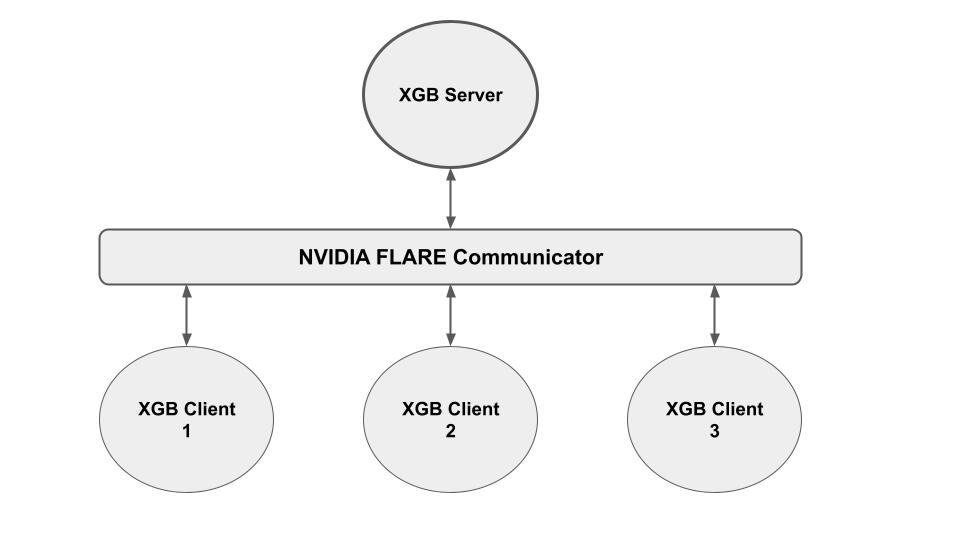
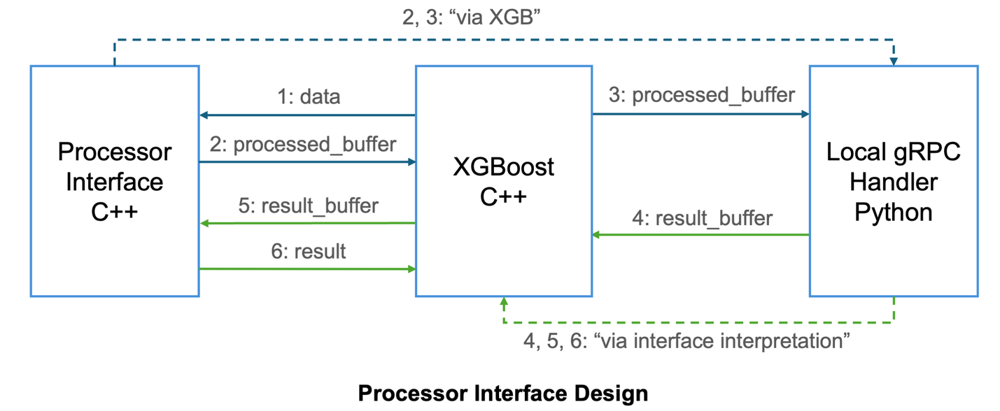
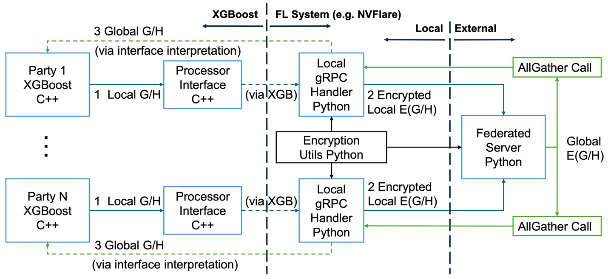

###############################
Secure Federated XGBoost Design
###############################

Collaboration Modes and Secure Patterns
=======================================

Horizontal Secure
-----------------

For horizontal XGBoost, each party holds "equal status" - whole feature and label for partial population, while the federated server performs aggregation, without owning any data.
Hence in this case, the federated server is the "minor contributor" from model training perspective, and clients have a concern of leaking any information to the server.
Under this setting, the protection is mainly against the federated server over local histograms.

To protect the local histograms for horizontal collaboration, the local histograms will be encrypted before sending to the federated server for aggregation.
The aggregation will then be performed over ciphertexts and the encrypted global histograms will be returned to clients, where they will be decrypted and used for tree building.

Vertical Secure
---------------

For vertical XGBoost, the active party holds the label, which cannot be accessed by passive parties and can be considered the most valuable asset for the whole process.
Therefore, the active party in this case is the "major contributor" from model training perspective, and it will have a concern of leaking this information to passive clients.
In this case, the security protection is mainly against passive clients over the label information.

To protect label information for vertical collaboration, at every round of XGBoost after the active party computes the gradients for each sample at the active party, the gradients will be encrypted before sending to passive parties.
Upon receiving the encrypted gradients (ciphertext), they will be accumulated according to the specific feature distribution at each passive party.
The resulting cumulative histograms will be returned to the active party, decrypted, and further be used for tree building at the active party.

Decoupled Encryption with Processor Interface
=============================================

In our current design, XGBoost communication is routed through the NVIDIA FLARE Communicator layer via local gRPC handlers.
From communication's perspective, the previous direct messages within XGBoost are now handled by FL communicator - they become "external communications" to and from XGBoost via FL system.
This gives us flexibilities in performing message operations both within XGBoost (before entering FL communicator) and within FL system (by FL communicator)

With NVFlare, the XGBoost plugin will be implemented in C++, while the FL system communicator will be implemented in Python. A processor interface is designed and developed to properly connect the two by taking plugins implemented towards a specific HE method and collaboration mode:

Processor Interface Design

  1. Upon receiving specific MPI calls from XGBoost, each corresponding party calls interface for data processing (serialization, etc.), providing necessary information: g/h pairs, or local G/H histograms
  2. Processor interface performs necessary processing (and encryption), and send the results back as a processed buffer
  3. Each party then forward the message to local gRPC handler on FL system side
  4. After FL communication involving message routing and computation, each party receives the result buffer upon MPI calls.
  5. Each FL party then sends the received buffer to processor interface for interpretation
  6. Interface performs necessary processing (deserialization, etc.), recovers proper information, and sends the result back to XGBoost for further computation

Note that encryption/decryption can be performed either by processor interface (C++), or at local gRPC handler (Python) depending on the particular HE library and scheme being considered.

System Design
=============
With the secure solutions, communication patterns, and processor interface, below we provide example designs for secure federated XGBoost - both vertical and horizontal.

For vertical pipeline:

  1. active party first compute g/h with the label information it owns
  2. g/h data will be sent to processor interface, encrypted with C++ based encryption util library, and sent to passive party via FL communication
  3. passive party provides indexing information for histogram computation according to local feature distributions, and the processor interface will perform aggregation with E(g/h) received.
  4. The resulting E(G/H) will be sent to active party via FL message routing
  5. Decrypted by processor interface on active party side, tree building can be performed with global histogram information

.. figure:: ../../resources/secure_vertical_xgb.png
    :height: 500px

Secure Vertical Federated XGBoost with XGBoost-side Encryption
In this case, the "heavy-lifting" jobs - encryption, secure aggregation, etc. -  are done by processor interface.

For horizontal pipeline:

  1. All parties sends their local G/H histograms to FL side via processor interface, in this design processor interface only performs buffer preparation without any complicated processing steps
  2. Before sending to federated server, the G/H histograms will be encrypted at local gRPC handler with Python-based encryption util library
  3. Federated server will perform secure aggregation over received partial E(G/H), and distribute the global E(G/H) to each clients, where the global histograms will be decrypted, and used for further tree-building

Secure Horizontal Federated XGBoost with FL-side Encryption
In this case, the encryption is done on the FL system side.

