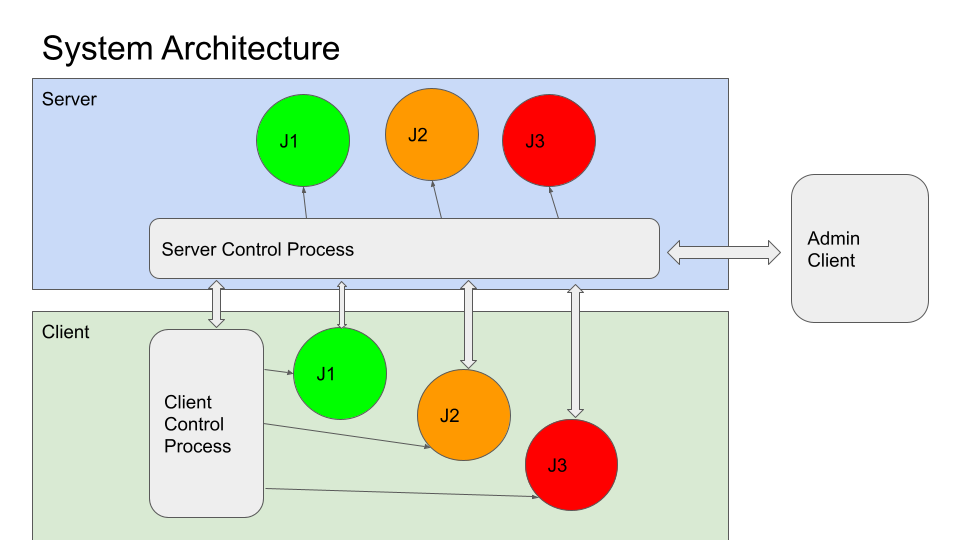

****************************
FLARE Multi-Job Architecture
****************************

To maximize the utilization of compute resources, FLARE supports multiple jobs running at the
same time, where each job is an independent FL experiment.

As shown in the diagram above, there is the Server Control Process (SCP) on the Server host, and there is a
Client Control Process (CCP) on each client host. The SCP communicates with CCPs to manage jobs (schedule,
deploy, monitor, and abort jobs). When a job is scheduled by the SCP, the job is sent to the CCPs of all sites,
which creates separate processes for the job. These processes form a “Job Network” for the job. This network
goes away when the job is finished.

The diagram shows 3 jobs (J1, J2, J3) in different colors on server and client(s). For example, all J1 processes
form the “job network” for Job 1.

By default, processes of the same job network are not connected directly. Instead, they only connect to the SCP,
and all messages between job processes are relayed through the SCP. However, if network policy permits, direct
P2P connections could be established automatically between the job processes to obtain maximum communication
speed. The underlying communication path is transparent to applications and only requires config changes to
enable direct communication.
