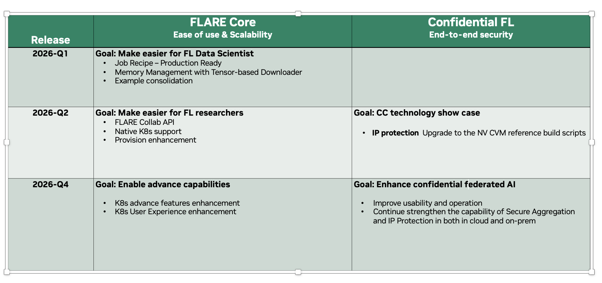

.. _welcome:

############################
Welcome to NVIDIA FLARE
############################

What is Federated Learning?
===========================

Federated Learning is a distributed learning paradigm where training occurs across multiple clients, each with their own local datasets.
This enables the creation of common robust models without sharing sensitive local data, helping solve issues of data privacy and security.

The FL server orchestrates the collaboration by sending an initial model to clients. Clients train on their local data and send
model updates back for aggregation into a global model. After multiple rounds, a robust global model is developed -- all without
any raw data leaving its source.

.. image:: resources/fl_diagram.png
    :height: 450px

**Types of Federated Learning:**

- **Horizontal FL** -- Clients hold different data samples over the same features
- **Vertical FL** -- Clients hold different features over overlapping data samples
- **Swarm Learning** -- Decentralized FL where clients perform aggregation without a central server

What is NVIDIA FLARE?
=====================

**NVIDIA FLARE** (NVIDIA Federated Learning Application Runtime Environment) is a domain-agnostic, open-source,
extensible Python SDK that makes it easy to bring federated learning to your existing ML/DL workflows.

**Get started in minutes** -- FLARE is designed so that data scientists can convert their existing training code
to federated with minimal effort:

- Use the **Client API** to add just a few lines to your existing training script
- Use the **Job Recipe API** to pick a pre-built FL algorithm and run it immediately
- Use the **FL Simulator** to test everything locally before deploying

Here is a complete federated averaging job in just a few lines:

.. code-block:: python

    from nvflare.app_opt.pt.recipes import FedAvgRecipe
    from nvflare.recipe import SimEnv

    recipe = FedAvgRecipe(
        name="my-first-fl-job",
        min_clients=2,
        num_rounds=5,
        model=MyModel(),
        train_script="train.py",
    )
    run = recipe.execute(SimEnv(num_clients=2))

FLARE supports **PyTorch, TensorFlow, XGBoost, scikit-learn**, and any framework that can run in Python.
It scales from a single laptop (Simulator) to thousands of distributed sites (Production) to millions of edge
devices -- all using the same job definition.

Key Features
============

**Built for Productivity**

- **Client API** -- Convert existing training code to federated with minimal changes
- **Job Recipe API** -- Pre-built recipes for FedAvg, FedProx, SCAFFOLD, XGBoost, Cyclic, and more
- **FL Simulator** -- Rapid prototyping on a single machine
- **POC Mode** -- Multi-process simulation of a federated network on one host
- **FLARE API** -- Run and monitor jobs from Python code or notebooks
- **Dashboard** -- Web UI for project setup and deployment artifact distribution
- **Experiment Tracking** -- MLflow, Weights & Biases, and TensorBoard

**Built for Security & Privacy**

- **Secure Provisioning** -- TLS certificate-based authentication
- **Authorization Policies** -- Fine-grained, site-controlled authorization
- **Privacy Preservation** -- Differential privacy, homomorphic encryption, private set intersection
- **Confidential Computing** -- Hardware-backed TEEs with AMD SEV-SNP and NVIDIA GPU support
- **Audit Logging** -- Complete audit trail for accountability

**Built for Scale**

- **Framework Agnostic** -- PyTorch, TensorFlow, XGBoost, scikit-learn, and more
- **Cross-Silo to Edge** -- From a handful of hospital sites to millions of mobile devices
- **Hierarchical Architecture** -- Multi-region, tiered FL for large-scale deployments
- **Multi-Job Execution** -- Concurrent job execution with resource management
- **3rd-Party Integration** -- FlareAgent for seamless integration with external systems

**Built for Customization**

- **Layered Architecture** -- Every layer is pluggable and customizable
- **Specification-Based APIs** -- Build alternative implementations following well-defined specs
- **Rich Examples** -- Extensive library of FL algorithms, workflows, and application examples

Product Lines
=============

FLARE consists of three product categories:

**FLARE Core**
    The full federated learning platform: communication infrastructure, workflows, controllers,
    Client API, Recipe API, FL Simulator, provisioning, deployment, and management tools.

**FLARE Confidential AI**
    Confidential Federated AI with hardware-backed security. Leverages Trusted Execution Environments
    (AMD SEV-SNP, Intel TDX) and NVIDIA GPU confidential computing for end-to-end IP protection.
    Supports both on-premises and Azure cloud deployments.

**FLARE Edge**
    Federated learning at the edge, supporting millions of devices with hierarchical architecture,
    asynchronous aggregation (FedBuff), device simulation, and mobile SDKs for Android and iOS
    (via ExecuTorch).

What is New in 2.7.2
====================

NVIDIA FLARE 2.7.2 brings the Job Recipe API to general availability, introduces the Tensor-based Downloader for
efficient large model handling, and adds comprehensive timeout and memory management documentation.

**Highlights:**

- **Job Recipe API -- Generally Available**: Unified recipe architecture covering FedAvg, FedOpt, SCAFFOLD, Cyclic, XGBoost, and more across all major frameworks
- **Tensor-based Downloader**: Memory-efficient pull-based model transfer using safetensors format for large model training
- **Server-Side Memory Cleanup**: Automatic garbage collection and heap trimming to prevent RSS growth in long-running jobs
- **Edge Development**: New hierarchical architecture with EDIP protocol, mobile SDKs, and device simulation for FL at scale
- **Confidential Computing**: End-to-end IP protection with AMD SEV-SNP + NVIDIA GPU TEEs

See :doc:`release_notes/flare_272` for full release notes.
See :doc:`release_notes/previous` for previous releases.

Roadmap
=======

**FLARE Core -- Ease of Use & Scalability**

- **2026-Q1**: Make easier for FL data scientists -- Job Recipe production ready, memory management with Tensor-based Downloader, example consolidation
- **2026-Q2**: Make easier for FL researchers -- FLARE Collab API, native K8s support, provision enhancement
- **2026-Q4**: Enable advanced capabilities -- K8s advanced features enhancement, K8s user experience enhancement

**Confidential FL -- End-to-End Security**

- **2026-Q2**: CC technology showcase -- IP protection, upgrade to NV CVM reference build scripts
- **2026-Q4**: Enhance confidential federated AI -- Improve usability and operation, strengthen Secure Aggregation and IP Protection in both cloud and on-prem

For the latest updates, visit the `NVIDIA FLARE GitHub <https://github.com/NVIDIA/NVFlare>`_.

Real-World Use Cases & FLARE Day
================================

See how organizations use NVIDIA FLARE in production across healthcare, autonomous driving, finance, and more:

- `FLARE Day 2025 <https://developer.nvidia.com/flare-day-2025>`_ -- Real-world FL applications in healthcare, finance, autonomous driving, and more
- `FLARE Day 2024 <https://nvidia.github.io/NVFlare/flareDay>`_ -- Talks and demos featuring real-world FL deployments at NVIDIA, healthcare institutions, and industry partners
- `Real-World FL Research <https://nvidia.github.io/NVFlare/research>`_ -- Published research and industry applications built with FLARE

Learn More
==========

- `Tutorial Website <https://nvidia.github.io/NVFlare/>`_ -- Video tutorials, code walkthroughs, and the example catalog
- `Example Catalog <https://nvidia.github.io/NVFlare/catalog/>`_ -- Browse examples by framework, algorithm, and use case
- :ref:`Self-Paced Training <self_paced_training>` -- 100+ notebooks and 80 videos for comprehensive self-paced learning

.. toctree::
   :hidden:

   fl_introduction
   flare_overview
   whats_new
   real_world_fl
