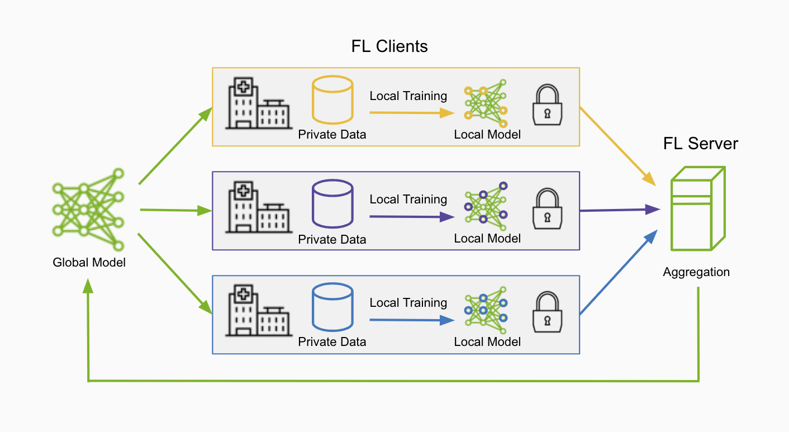

.. _welcome:

############################
Welcome to NVIDIA FLARE
############################

What is Federated Learning?
===========================

Federated Learning is a distributed learning paradigm where training occurs across multiple clients, each with their own local datasets.
This enables the creation of common robust models without sharing sensitive local data, helping solve issues of data privacy and security.

The federated learning (FL) server orchestrates the collaboration of multiple clients by first sending an initial model to the FL clients.
The clients perform training on their local datasets, then send the model updates back to the FL server for aggregation to form a global model.
This process forms a single round of federated learning and after a number of rounds, a robust global model can be developed.

What is NVIDIA FLARE?
=====================

**NVIDIA FLARE** (NVIDIA Federated Learning Application Runtime Environment) is a domain-agnostic, open-source,
extensible Python SDK that allows researchers, data scientists and data engineers to adapt existing ML/DL and compute workflows to a federated paradigm.
With the FLARE platform, developers can create a secure and privacy-preserving solution for decentralized data computing,
facilitating distributed multi-party collaboration.

NVIDIA FLARE is built on a componentized architecture that gives you the flexibility to take federated learning workloads
from research and simulation to real-world production deployment.

Key Features at a Glance
========================

- **Client API** -- Convert your existing ML/DL training code to federated with just a few lines of code changes
- **Job Recipe API** -- Pre-built recipes for common FL algorithms (FedAvg, FedProx, SCAFFOLD, XGBoost, etc.)
- **FL Simulator** -- Rapid development and prototyping on a single machine
- **Privacy Preservation** -- Differential privacy, homomorphic encryption, private set intersection
- **Production Ready** -- Secure provisioning, deployment tools, monitoring, and management
- **Framework Agnostic** -- Works with PyTorch, TensorFlow, XGBoost, scikit-learn, and more
- **Experiment Tracking** -- Built-in support for MLflow, Weights & Biases, and TensorBoard
- **Scalable** -- From cross-silo to millions of edge devices with hierarchical architecture

Product Lines
=============

FLARE consists of three product categories:

- **FLARE Core**: All major FLARE components and infrastructure for federated learning
- **FLARE Confidential AI**: Confidential Federated AI with hardware-backed security (TEEs, AMD SEV-SNP, NVIDIA GPUs)
- **FLARE Edge**: Federated learning on edge and mobile devices at scale

.. image:: resources/flare_overview.png
    :height: 400px

What is New
===========

See :doc:`release_notes/flare_272` for the latest release highlights.

See :doc:`release_notes/previous` for previous releases.

Roadmap
=======

NVIDIA FLARE continues to evolve with a focus on:

- **Simplified APIs** -- Making federated learning more accessible with higher-level abstractions
- **LLM & Generative AI** -- Enhanced support for federated fine-tuning of large language models
- **Edge & Mobile** -- Expanding edge device support with new platform integrations
- **Confidential Computing** -- Broader hardware TEE support and cloud provider integrations
- **Performance** -- Continued optimization for large-scale deployments and large models
- **Ecosystem Integration** -- Deeper integration with ML frameworks and MLOps platforms

For the latest updates, visit the `NVIDIA FLARE GitHub <https://github.com/NVIDIA/NVFlare>`_.

.. toctree::
   :hidden:

   fl_introduction
   flare_overview
   whats_new
   real_world_fl
