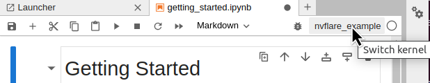

# NVIDIA FLARE Examples

[NVIDIA FLARE](https://nvflare.readthedocs.io/en/main/index.html) provides several examples to help you get started using federated learning for your own applications.

The provided examples cover different aspects of [NVIDIA FLARE](https://nvflare.readthedocs.io/en/main/index.html),
such as using the provided [Controllers](https://nvflare.readthedocs.io/en/main/programming_guide/workflows_and_controllers.html)
for "scatter and gather" or "cyclic weight transfer" workflows
and different [Executors](https://nvflare.readthedocs.io/en/main/apidocs/nvflare.apis.executor.html)
to implement your own training and validation pipelines.
Some examples use the provided "task data" and "task result" [Filters](https://nvflare.readthedocs.io/en/main/apidocs/nvflare.apis.html?#module-nvflare.apis.filter) for homomorphic encryption and decryption or differential privacy.
Furthermore, we show how to use different components for FL algorithms such as [FedAvg](https://arxiv.org/abs/1602.05629), [FedProx](https://arxiv.org/abs/1812.06127), and [FedOpt](https://arxiv.org/abs/2003.00295).
We also provide domain-specific examples for deep learning and medical image analysis.

## Getting started
To get started with NVIDIA FLARE, please follow the [Getting Started Guide](https://nvflare.readthedocs.io/en/main/getting_started.html) in the documentation.
This walks you through installation, creating a POC workspace, and deploying your first NVIDIA FLARE Application.
The following examples will detail any additional requirements in their `requirements.txt`.

## Set up a virtual environment
We recommend setting up a virtual environment before installing the dependencies of the examples.
**You need to set up the virtual environment and install nvflare and set additional `PYTHONPATH` before launch the jupyter lab.**

Install dependencies for a virtual environment with:

```shell
python3 -m pip install --user --upgrade pip
python3 -m pip install --user virtualenv
```

(If needed) make all shell scripts executable using:
```shell
find . -name ".sh" -exec chmod +x {} \;
```

Create and activate your virtual environment with the `set_env.sh` script:
```shell
source ./set_env.sh
```

Install nvflare
```shell
(nvflare_example)$ pip install nvflare
```

In each example folder, install required packages for training:
```shell
(nvflare_example)$ pip install --upgrade pip
(nvflare_example)$ pip install -r requirements.txt
```

(optional) some examples contains script for plotting the TensorBoard event files, if needed, please also install:
```shell
(nvflare_example)$ pip install -r plot-requirements.txt
```

## Set up JupyterLab for notebooks
To run examples including notebooks, we recommend using [JupyterLab](https://jupyterlab.readthedocs.io).
**You need to set up the virtual environment and install nvflare and set additional `PYTHONPATH` before launch the jupyter lab.**

After activating your virtual environment, install JupyterLab:
```shell
(nvflare_example)$ pip install jupyterlab
```
You can register the virtual environment you created, so it is usable in JupyterLab:
```shell
(nvflare_example)$ python3 -m ipykernel install --user --name="nvflare_example"
```
Start a Jupyter Lab:
```shell
(nvflare_example)$ jupyter lab .
```
When you open a notebook, select the kernel `nvflare_example` using the dropdown menu at the top right.


## 1. Hello World Examples
| Example                                                                                                                                | Framework    | Summary                                                                                                                                                         |
|----------------------------------------------------------------------------------------------------------------------------------------|--------------|-----------------------------------------------------------------------------------------------------------------------------------------------------------------|
| [Notebook for Hello Examples](./hello-world/hello_world.ipynb)                                                                         | -            | Notebook for examples below.                                                                                                                                    |
| [Hello FedAvg NumPy](./hello-world/hello-fedavg-numpy/README.md)                                                                    | Numpy        | Example using [FedAvg](https://nvflare.readthedocs.io/en/main/apidocs/nvflare.app_common.workflows.fedavg.html) controller workflow.      |
| [Hello Cross-Site Validation](./hello-world/hello-cross-val/README.md)                                                           | Numpy        | Example using [CrossSiteEval](https://nvflare.readthedocs.io/en/main/apidocs/nvflare.app_common.workflows.cross_site_eval.html) controller workflow, and example using previous results without training workflow. |
| [Hello Cyclic Weight Transfer](./hello-world/hello-cyclic/README.md)                                                                   | PyTorch      | Example using [CyclicController](https://nvflare.readthedocs.io/en/main/apidocs/nvflare.app_common.workflows.cyclic_ctl.html) controller workflow to implement [Cyclic Weight Transfer](https://pubmed.ncbi.nlm.nih.gov/29617797/). |
| [Hello PyTorch](./hello-world/hello-pt/README.md)                                                                                      | PyTorch      | Example using an image classifier using [FedAvg](https://arxiv.org/abs/1602.05629) and [PyTorch](https://pytorch.org/) as the deep learning training framework. |
| [Hello TensorFlow](./hello-world/hello-tf/README.md)                                                                                  | TensorFlow  | Example of using an image classifier using [FedAvg](https://arxiv.org/abs/1602.05629) and [TensorFlow](https://tensorflow.org/) as the deep learning training framework. |

## 2. Step-by-Step Examples
| Example | Dataset | Controller-Type | Execution API Type | Framework | Summary |
|---------|---------|-----------------|-----------------|-----------|---------|
| [image_stats](./hello-world/step-by-step/cifar10/stats/image_stats.ipynb)                                                        | CIFAR10 | server | Executor | Pandas | Example for federated stats image histogram calculation. |
| [sag](./hello-world/step-by-step/cifar10/sag/sag.ipynb)                                                                                   | CIFAR10 | server | Client API| PyTorch | Example for FedAvg with [ScatterAndGather](https://nvflare.readthedocs.io/en/main/apidocs/nvflare.app_common.workflows.scatter_and_gather.html) controller workflow using the Client API. |
| [sag_deploy_map](./hello-world/step-by-step/cifar10/sag_deploy_map/sag_deploy_map.ipynb)                                                        |   CIFAR10   | server | Client API | PyTorch | Example showcasing site-specific configurations and deploy_map. |
| [sag_model_learner](./hello-world/step-by-step/cifar10/sag_model_learner/sag_model_learner.ipynb)                                                        |   CIFAR10   | server | ModelLearner |  PyTorch | Example with [ScatterAndGather](https://nvflare.readthedocs.io/en/main/apidocs/nvflare.app_common.workflows.scatter_and_gather.html) using a ModelLearner. |
| [sag_executor](./hello-world/step-by-step/cifar10/sag_executor/sag_executor.ipynb)                                                        | CIFAR10 | server | Executor | PyTorch | Example with [ScatterAndGather](https://nvflare.readthedocs.io/en/main/apidocs/nvflare.app_common.workflows.scatter_and_gather.html) using an Executor. |
| [sag_mlflow](./hello-world/step-by-step/cifar10/sag_mlflow/sag_mlflow.ipynb)                                                        | CIFAR10 | server | Client API | PyTorch | MLflow experiment tracking logs with [ScatterAndGather](https://nvflare.readthedocs.io/en/main/apidocs/nvflare.app_common.workflows.scatter_and_gather.html) using the Client API. |
| [sag_he](./hello-world/step-by-step/cifar10/sag_he/sag_he.ipynb)                                                        | CIFAR10 | server | Client API | PyTorch | Example with homomorphic encyption using Client API and POC -he mode. |
| [cse](./hello-world/step-by-step/cifar10/cse/cse.ipynb)                                                        | CIFAR10 | server | Client API| PyTorch | Example using [CrossSiteModelEval](https://nvflare.readthedocs.io/en/main/apidocs/nvflare.app_common.workflows.cross_site_model_eval.html) controller workflow. |
| [cyclic](./hello-world/step-by-step/cifar10/cyclic/cyclic.ipynb)                                                        | CIFAR10 | server | Client API | PyTorch | Example for cyclic weight transfer using [CyclicController](https://nvflare.readthedocs.io/en/main/apidocs/nvflare.app_common.workflows.cyclic_ctl.html) controller workflow. |
| [cyclic_ccwf](./hello-world/step-by-step/cifar10/cyclic_ccwf/cyclic_ccwf.ipynb)                                                        | CIFAR10 | client| Client API | PyTorch | Example for client-controlled cyclic weight transfer using [CyclicClientController](https://nvflare.readthedocs.io/en/main/apidocs/nvflare.app_common.ccwf.cyclic_client_ctl.html) controller workflow. |
| [swarm](./hello-world/step-by-step/cifar10/swarm/swarm.ipynb)                                                        | CIFAR10 |  client | Client API | PyTorch | Example for swarm learning and client-controlled cross-site evaluation using [SwarmClientController](https://nvflare.readthedocs.io/en/main/apidocs/nvflare.app_common.ccwf.swarm_client_ctl.html) and [CrossSiteEvalClientController](https://nvflare.readthedocs.io/en/main/apidocs/nvflare.app_common.ccwf.cse_client_ctl.html) controller workflows. |
| [tabular_stats](./hello-world/step-by-step/higgs/stats/tabular_stats.ipynb)                                                        | HIGGS | server | Executor |Pandas | Example for federated stats tabular histogram calculation. |
| [sklearn_linear](./hello-world/step-by-step/higgs/sklearn-linear/sklearn_linear.ipynb)                                           | HIGGS | server | Client API |sklearn | Example for federated linear model (logistic regression on binary classification) learning on tabular data. |
| [sklearn_svm](./hello-world/step-by-step/higgs/sklearn-svm/sklearn_svm.ipynb)                                                     | HIGGS | server | Client API | sklearn | Example for federated SVM model learning on tabular data. |
| [sklearn_kmeans](./hello-world/step-by-step/higgs/sklearn-kmeans/sklearn_kmeans.ipynb)                                           | HIGGS | server | Client API |sklearn | Example for federated k-Means clustering on tabular data. |
| [xgboost](./hello-world/step-by-step/higgs/xgboost/xgboost_horizontal.ipynb)                                                        | HIGGS | server | Client API |XGBoost | Example for federated horizontal xgboost learning on tabular data with bagging collaboration. |

## 3. Tutorial notebooks
| Example                                                                                                                                | Summary                                                                                                                                                         |
|----------------------------------------------------------------------------------------------------------------------------------------|-----------------------------------------------------------------------------------------------------------------------------------------------------------------|
| [Intro to the FL Simulator](./tutorials/flare_simulator.ipynb)                                                                         | Shows how to use the FLARE Simulator to run a local simulation.                                                                                                 |
| [Hello FLARE API](./tutorials/flare_api.ipynb)                                                                                         | Goes through the different commands of the FLARE API.                                                                                                           |
| [NVFLARE in POC Mode](./tutorials/setup_poc.ipynb)                                                                                     | Shows how to use POC mode.                                                                                                                                |
| [Job CLI](./tutorials/job_cli.ipynb)                                                                                                   | Walks through the different commands of the Job CLI.                                                                                                   |

## 4. FL algorithms
| Example                                                                                        | Summary                                                                                                                                                                                                                                                                        |
|------------------------------------------------------------------------------------------------|--------------------------------------------------------------------------------------------------------------------------------------------------------------------------------------------------------------------------------------------------------------------------------|
| [Simulated Federated Learning with CIFAR-10](./advanced/cifar10/cifar10-sim/README.md)         | This example includes instructions on running [FedAvg](https://arxiv.org/abs/1602.05629), [FedProx](https://arxiv.org/abs/1812.06127), [FedOpt](https://arxiv.org/abs/2003.00295), and [SCAFFOLD](https://arxiv.org/abs/1910.06378) algorithms using NVFlare's FL simulator.   |
| [Real-world Federated Learning with CIFAR-10](./advanced/cifar10/cifar10-real-world/README.md) | Includes instructions on running [FedAvg](https://arxiv.org/abs/1602.05629) with streaming of TensorBoard metrics to the server during training and [homomorphic encryption](https://developer.nvidia.com/blog/federated-learning-with-homomorphic-encryption/).               |

## 5. Traditional ML examples
| Example                                                                                                                                | Framework         | Notebooks                                                                                                             | Summary                                                                                                                                                         |
|----------------------------------------------------------------------------------------------------------------------------------------|-------------------|-----------------------------------------------------------------------------------------------------------------------|-----------------------------------------------------------------------------------------------------------------------------------------------------------------|
| [Federated Linear Model with Scikit-learn](./advanced/sklearn-linear/README.md)                                                        | scikit-learn      | [FL Model with Scikit-learn on HIGGS Dataset](./advanced/sklearn-linear/sklearn_linear_higgs.ipynb)                   | Shows how to use the NVIDIA FLARE with [scikit-learn](https://scikit-learn.org/), a widely used open-source machine learning library.                           |
| [Federated K-Means Clustering with Scikit-learn](./advanced/sklearn-kmeans/README.md)                                                  | scikit-learn      | [Federated K-Means Clustering with Scikit-learn on Iris Dataset](./advanced/sklearn-kmeans/sklearn_kmeans_iris.ipynb) | NVIDIA FLARE with [scikit-learn](https://scikit-learn.org/) and k-Means.                                                                                        |
| [Federated SVM with Scikit-learn](./advanced/sklearn-svm/README.md)                                                                    | scikit-learn      | [Federated SVM with Scikit-learn on Breast Cancer Dataset](./advanced/sklearn-svm/sklearn_svm_cancer.ipynb)           | NVIDIA FLARE with [scikit-learn](https://scikit-learn.org/) and [SVM](https://scikit-learn.org/stable/modules/generated/sklearn.svm.SVC.html).                  |
| [Histogram-based FL for XGBoost](./advanced/xgboost/histogram-based/README.md)                                                         | XGBoost           | [Histogram-based FL for XGBoost on HIGGS Dataset](./advanced/xgboost/histogram-based/xgboost_histogram_higgs.ipynb)   | Histogram-based algorithm for XGBoost                                                                                                                           |
| [Tree-based Federated Learning for XGBoost](./advanced/xgboost/tree-based/README.md)                                                   | XGBoost           | [Tree-based FL for XGBoost on HIGGS Dataset](./advanced/xgboost/tree-based/README.md)                                 | Tree-based algorithms includes [bagging](./advanced/xgboost/tree-based/jobs/bagging_base) and [cyclic](./advanced/xgboost/tree-based/jobs/cyclic_base) approaches.   |
| [Federated Learning for Random Forest based on XGBoost](./advanced/random_forest/README.md)                                            | XGBoost           | [Federated Random Forest on HIGGS Dataset](./advanced/random_forest/random_forest.ipynb)                              | Example of using NVIDIA FLARE with [scikit-learn](https://scikit-learn.org/) and Random Forest.                                                                 |
| [Federated Vertical XGBoost](./advanced/vertical_xgboost)                                            | XGBoost           | [Federated Vertical XGBoost](./advanced/vertical_xgboost/README.md)                              | Example using Private Set Intersection and XGBoost on vertically split HIGGS data.                                                                 |

## 6. Medical Image Analysis
| Example                                                                                                                                | Framework    | Summary                                                                                                                                                         |
|----------------------------------------------------------------------------------------------------------------------------------------|--------------|-----------------------------------------------------------------------------------------------------------------------------------------------------------------|
| [NVFlare + MONAI integration](../integration/monai/README.md)                                                                          | MONAI        | For an example of using NVIDIA FLARE to train a 3D medical image analysis model using federated averaging (FedAvg) and MONAI Bundle, see [here](../integration/monai/examples/README.md). |
| [Federated Learning with Differential Privacy for BraTS18 segmentation](./advanced/brats18/README.md)                                  | MONAI        | Illustrates the use of differential privacy for training brain tumor segmentation models using federated learning.                                              |
| [Federated Learning for Prostate Segmentation from Multi-source Data](./advanced/prostate/README.md)                                   | MONAI        | Example of training a multi-institutional prostate segmentation model using [FedAvg](https://arxiv.org/abs/1602.05629), [FedProx](https://arxiv.org/abs/1812.06127), and [Ditto](https://arxiv.org/abs/2012.04221). |

## 7. Federated Statistics
[Federated Statistics Overview](./advanced/federated-statistics/README.md) discusses the overall federated statistics features.

| Example                                                                                                                                |  Notebooks                                                                                                                                                             | Summary                                                                                                                                                         |
|----------------------------------------------------------------------------------------------------------------------------------------|------------------------------------------------------------------------------------------------------------------------------------------------------------------------|-----------------------------------------------------------------------------------------------------------------------------------------------------------------|
| [Federated Statistics for Images](./advanced/federated-statistics/image_stats/README.md)                                               | [Image Histograms](./advanced/federated-statistics/image_stats.ipynb)                                                                                                  | Example of gathering local image histogram to compute the global dataset histograms.                                                                            |
| [Federated Statistics for DataFrame](./advanced/federated-statistics/df_stats/README.md)                                               | [Data Frame Federated Statistics](./advanced/federated-statistics/df_stats.ipynb), [Visualization](./advanced/federated-statistics/df_stats/demo/visualization.ipynb)  | Example of gathering local statistics summary from Pandas DataFrame to compute the global dataset statistics.                                                   |
| [Federated Hierarchical Statistics for DataFrame](./advanced/federated-statistics/hierarchical_stats/README.md)                                               | [Federated Hierarchical Statistics](./advanced/federated-statistics/hierarchical_stats/hierarchical_stats.ipynb), [Visualization](./advanced/federated-statistics/hierarchical_stats/demo/visualization.ipynb)  | Example of generating federated hierarchical statistics for data that can be represented as Pandas DataFrame.                                                   |

## 8. Federated Policies
| Example                                                                                                                                | Summary                                                                                                                                                         |
|----------------------------------------------------------------------------------------------------------------------------------------|-----------------------------------------------------------------------------------------------------------------------------------------------------------------|
| [Federated Policies](./advanced/federated-policies/README.rst)                                                                         | Discuss the federated site policies for authorization, resource and data privacy management.
| [Custom Authentication](./advanced/custom_authentication/README.rst)                                                                         | Demonstrate the custom authentication policy and secure mode.
| [Job-Level Authorization](./advanced/job-level-authorization/README.md)                                                                         | Demonstrate the job-level authorization policy and secure mode.
| [KeyCloak Site Authentication Integration](./advanced/keycloak-site-authentication/README.md)                                                     | Demonstrate KeyCloak integration for supporting site-specific authentication.

## 9. Experiment tracking
| Example                                                                                                                                | Framework    | Summary                                                                                                                                                         |
|----------------------------------------------------------------------------------------------------------------------------------------|--------------|-----------------------------------------------------------------------------------------------------------------------------------------------------------------|
| [Hello PyTorch with TensorBoard Streaming](./advanced/experiment-tracking/tensorboard/README.md)                             | PyTorch      | Example building upon [Hello PyTorch](./hello-world/hello-pt/README.md) showcasing the [TensorBoard](https://tensorflow.org/tensorboard) streaming capability from the clients to the server.  |
| [FL Experiment Tracking with MLflow](./advanced/experiment-tracking/mlflow/README.md)                             | PyTorch      | Example integrating [Hello PyTorch](./hello-world/hello-pt/README.md) with MLflow streaming capability from clients to the server.  |
| [FL Experiment Tracking with Weights and Biases](./advanced/experiment-tracking/wandb/README.md)                             | PyTorch      | Example integrating [Hello PyTorch](./hello-world/hello-pt/README.md) with Weights and Biases streaming capability from clients to the server.  |
| [MONAI FLARE Integration Experiment Tracking](../integration/monai/examples/spleen_ct_segmentation_local/README.md#51-experiment-tracking-with-mlflow)   | MONAI      | Example using FLARE and MONAI integration with experiment tracking streaming from clients to server.  |

## 10. NLP
| Example                                                                               | Summary                                                                                                                                                         |
|---------------------------------------------------------------------------------------|-----------------------------------------------------------------------------------------------------------------------------------------------------------------|
| [NLP-NER](./advanced/nlp-ner/README.md)                                               | Illustrates both [BERT](https://github.com/google-research/bert) and [GPT-2](https://github.com/openai/gpt-2) models from [Hugging Face](https://huggingface.co/) ([BERT-base-uncased](https://huggingface.co/bert-base-uncased), [GPT-2](https://huggingface.co/gpt2)) on a Named Entity Recognition (NER) task using the [NCBI disease dataset](https://pubmed.ncbi.nlm.nih.gov/24393765/).  |

## 11. Federated Learning Hub

| Example                               | Framework      | Summary                                                                                                                  |
|---------------------------------------|----------------|--------------------------------------------------------------------------------------------------------------------------|
| [FL Hub](./advanced/fl_hub/README.md) | PyTorch/MONAI  | Allow hierarchical interaction between several levels of nvflare FL systems, e.g. Tier-1 (hub) and Tier-2 (sub-systems). |

## 12. Federated Large Language Model (LLM)

| Example                               | Framework      | Summary                                                                                                                  |
|---------------------------------------|----------------|--------------------------------------------------------------------------------------------------------------------------|
| [Parameter Efficient Fine Turning](../integration/nemo/examples/peft) | NeMo  | Example utilizing NeMo's PEFT methods to adapt a LLM to a downstream task. |
| [Prompt-Tuning Example](../integration/nemo/examples/prompt_learning) | NeMo  | Example for using FLARE with NeMo for prompt learning.|
| [Supervised Fine Tuning (SFT)](../integration/nemo/examples/supervised_fine_tuning) | NeMo  | Example to fine-tune all parameters of a LLM on supervised data. |
| [LLM Tuning via HuggingFace SFT Trainer](./advanced/llm_hf) | NeMo  | Example for using FLARE with a HuggingFace trainer for LLM tuning tasks. |

## 13. Graph Neural Network (GNN)

| Example                               | Framework      | Summary                                                                                                                  |
|---------------------------------------|----------------|--------------------------------------------------------------------------------------------------------------------------|
| [Protein Classification](./advanced/gnn#federated-gnn-on-graph-dataset-using-inductive-learning) | PyTorch Geometric  | Example using GNNs for Protein Classification using [PPI](http://snap.stanford.edu/graphsage/#code) dataset using GraphSAGE. |
| [Financial Transaction Classification](./advanced/gnn#federated-gnn-on-graph-dataset-using-inductive-learning) | PyTorch Geometric  | Example using GNNs for Financial Transaction Classification with [Elliptic++](https://github.com/git-disl/EllipticPlusPlus) dataset using GraphSAGE. |

## 14. Financial Applications

| Example                               | Framework      | Summary                                                                                                                  |
|---------------------------------------|----------------|--------------------------------------------------------------------------------------------------------------------------|
| [Financial Application with Federated XGBoost Methods](./advanced/finance) | XGBoost  | Example using XGBoost in various ways to train a federated model to perform fraud detection with a finance dataset. |
